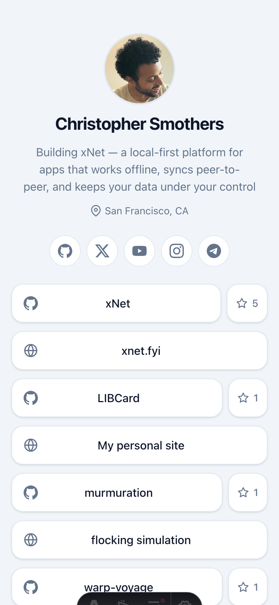
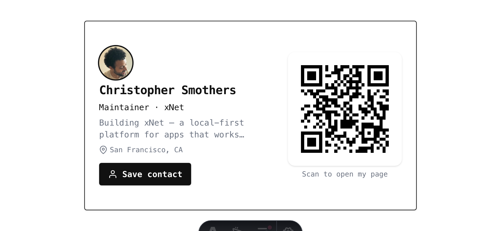

# LibCard

**Link in Bio Card** — a free, fast way to set up your own link-in-bio page and virtual business card.

LibCard is a tiny [Astro](https://astro.build) static site you host on **GitHub Pages for free**. Think Linktree, but it's *yours*: a single page that collects all your links and doubles as a virtual business card you can share with people at conferences, in your social bios, or anywhere a QR code or short link fits.

<table align="center">
  <tr>
    <td align="center" width="40%"><strong>Portrait — your whole page</strong></td>
    <td align="center" width="60%"><strong>Landscape — rotate to flash a card</strong></td>
  </tr>
  <tr>
    <td align="center" valign="middle"></td>
    <td align="center" valign="middle"></td>
  </tr>
</table>

## Why LibCard?

- **Free hosting** — runs entirely on GitHub Pages, no server or subscription.
- **Fast to set up** — edit one config file, push. Your page is live.
- **Tap to save contact** — a "Save contact" button downloads a vCard, so anyone can add you to their phone's address book in one tap.
- **QR business card** — built-in QR codes for conferences: one points to your page, another saves your contact offline.
- **Rotate to flash a card** — turn your phone sideways and the page flips into a pretty, physical-looking business card beside a QR code; rotate back for the full page. Pure CSS, no JavaScript.
- **Themes you can cycle** — a gallery of built-in themes plus an optional live switcher, so visitors can try your card in each look. Add your own with a pull request.
- **Yours to own** — no third-party platform between you and your audience; you control the content and the domain.
- **Fast & private** — zero client-side JavaScript by default; nothing to track you.

## Quick start

1. **Use this template.** Click **“Use this template” → Create a new repository**. Name it `your-links` (a project site) or `your-username.github.io` (a user site).
2. **Make it yours.** Edit [`libcard.config.yaml`](./libcard.config.yaml) — your name, tagline, links, socials, contact details, and theme. That's the only file you need to touch.
   - Prefer prompts? Clone the repo and run `pnpm install && pnpm run setup` for an interactive wizard that fills the config in for you (including the tricky `site.url` / `site.base`).
3. **Turn on Pages.** In your repo, go to **Settings → Pages → Build and deployment** and set **Source: GitHub Actions**.
4. **Push.** Every push to `main` rebuilds and deploys automatically (via [`.github/workflows/deploy.yml`](./.github/workflows/deploy.yml)). Your card goes live at `https://<username>.github.io/<repo>/`.

> [!IMPORTANT]
> Set **`site.base`** correctly in `libcard.config.yaml`: use `"/<repo-name>"` for a project site (e.g. `/your-links`) or `"/"` for a `username.github.io` user site or a custom domain. A wrong `base` is the #1 cause of broken styling/links.

## Configure it

Everything lives in `libcard.config.yaml`. The `# yaml-language-server: $schema=./libcard.schema.json` line at the top gives you **autocomplete and inline validation** in editors like VS Code. A bad value (malformed email, unknown theme, typo'd field) **fails the build** with a readable error instead of shipping a broken card.

```yaml
profile:
  name: Ada Lovelace
  tagline: Mathematician · first programmer
  avatar: /avatar.svg
links:
  - label: My website
    url: https://example.com
    icon: globe
socials:
  - platform: github
    url: https://github.com/ada
contact:
  email: ada@example.com
theme: midnight   # default | midnight | sunset | mono | paper | terminal
```

### Links & contact buttons

A `links` entry is just a label + URL, so you're not limited to web links — any
URL scheme works, which gives you tap-to-call, tap-to-text, and chat buttons for
free (and they open the right native app, not a new tab):

```yaml
links:
  - { label: Call me,    url: "tel:+15551234567",                 icon: phone }
  - { label: Text me,    url: "sms:+15551234567?&body=Hi%20Chris", icon: message }
  - { label: WhatsApp,   url: "https://wa.me/15551234567?text=Hi", icon: whatsapp }  # digits only, no +
  - { label: Telegram,   url: "https://t.me/yourhandle",          icon: telegram }
  - { label: Email me,   url: "mailto:you@example.com?subject=Hi", icon: mail }
  - { label: Book a call, url: "https://cal.com/you/30min",        icon: calendar }
  - { label: Tip jar,    url: "https://paypal.me/you/5",          icon: heart }
```

#### Pass it on — a "Make your own" link

Because a link is just a label + URL, the easiest way to help visitors spin up
their *own* card is a plain link back to this template — no special feature
required:

```yaml
links:
  - { label: Make your own LibCard, url: "https://github.com/crs48/LIBCard", icon: github }
```

…or, if you'd rather phrase it inline, a one-line content block does the same job:

```yaml
blocks:
  - { type: text, markdown: "Like this page? **[Make your own LibCard](https://github.com/crs48/LIBCard)** — it's free." }
```

The footer's **"Powered by LibCard"** credit already links home, so this is
optional — but it makes the invitation explicit, and it's the same loop that lets
LibCard spread from card to card.

### Content blocks

For anything richer than a button, add a `blocks:` list — an ordered set of typed
content blocks rendered between your links and the social row. Blocks are
**validated data, never raw HTML**, so a config stays safe to share, and they
keep LibCard's promise: **zero of our JavaScript and no server.** They come in
four tiers:

| Tier | Blocks | How it stays zero-JS / zero-server |
|---|---|---|
| **Static** | `heading`, `text` (Markdown), `divider`, `faq`, `gallery`, `contact-buttons` | pure HTML/CSS |
| **Forms** | `signup` (newsletter), `form` (contact) | a plain `<form method="post">` to a third party |
| **Live embeds** | `video`, `embed`, `booking`, `map` | a sandboxed `<iframe>` — **we** ship no JS |
| **Build-time** | `tweet`, `rss`, `github` | fetched during the build, baked to static HTML |

```yaml
blocks:
  - { type: heading, text: "Featured" }
  - { type: text, markdown: "I build **LibCard**. [Say hi](mailto:you@x.com)." }
  - type: contact-buttons          # tap-to-call/text/chat in one row
    call: true                     # true → reuse contact.phone; or a number string
    whatsapp: "+1-555-123-4567"
    email: true                    # true → reuse contact.email
  - { type: booking, provider: calcom, url: "https://cal.com/you/30min", title: "Book a call" }
  - { type: video, provider: youtube, id: "dQw4w9WgXcQ", title: "My talk" }
  - { type: embed, provider: figma, url: "https://www.figma.com/design/KEY/Title" }
  - { type: embed, provider: spotify, url: "https://open.spotify.com/track/ID" }
  - { type: map, provider: gmaps, src: "https://www.google.com/maps/embed?pb=..." }
  - type: faq
    items:
      - { q: "Is it free?", a: "Yes — hosted free on GitHub Pages." }
  - { type: signup, provider: buttondown, username: "you", title: "Newsletter" }
  - { type: tweet, url: "https://x.com/you/status/1750000000000000000" }
  - { type: rss, url: "https://yourblog.com/feed.xml", title: "Latest posts" }
```

A few things worth knowing:

- **Privacy.** Live embeds load third-party content inside their iframe. `video`
  defaults to a **click-to-load facade** — nothing loads (no cookies, no
  trackers) until a visitor clicks play. YouTube uses `youtube-nocookie`, every
  iframe is `loading="lazy"` with `referrerpolicy="no-referrer"`, and the footer
  notes when a page carries live embeds. (Set `facade: false` on a `video` for an
  eager player.)
- **Forms.** `signup`/`form` post straight to your provider (Buttondown, Kit,
  Mailchimp, Formspree, Web3Forms…). With no JavaScript there's no inline
  "thanks!" — the browser navigates to the provider's confirmation page, or to
  your own page if you set `redirect:` (Formspree's `_next`, etc.). Spam is
  caught by a hidden honeypot field rather than a JS captcha.
- **Build-time blocks** (`tweet`, `rss`, `github`) are fetched while the site
  builds, so the live page ships static HTML and contacts no one. They refresh on
  the next build — a daily GitHub Actions `cron` is wired up so they stay current
  without a push. If a fetch fails, the block degrades to a plain link.

The full field list for every block type lives in
[`libcard.schema.json`](./libcard.schema.json) (so your editor autocompletes
them), and there's a worked example in
[`docs/explorations/0006_*_RICH_CONTENT_BLOCKS_AND_ZERO_JS_EMBEDS.md`](./docs/explorations/).

### Themes

Pick one of the built-in themes (`default`, `midnight`, `sunset`, `mono`, `paper`, `terminal`):

```yaml
theme: midnight
```

…or turn on the **live theme switcher** and/or **random mode** so visitors can see the themes right on your card (these are the only features that ship a tiny bit of JavaScript — when they're off, your page stays zero-JS):

```yaml
theme:
  name: midnight       # the default everyone sees first (crawlers/no-JS too)
  switcher: true       # show the "Try a theme" button (cycles through all themes)
  random: true         # pick a random theme on every page load (fun demo)
  animate: true        # animate the change with a circular reveal
  # allow: [midnight, sunset, terminal]   # optional subset; omit = all themes
```

`random` also takes an **array** to curate the pool — only those themes can be
landed on at random, while the switcher button still cycles through everything:

```yaml
theme:
  name: default
  switcher: true
  random: [default, paper, mono]   # only these show on a random reload
```

Browse them all on the `/themes` gallery page. The footer credits the active theme's author — **"Powered by LibCard · Theme by &lt;author&gt;"**.

**Themes are data, not code.** Each theme is a single validated `themes/*.yaml` token file — no CSS, no JavaScript — so it's safe to accept from anyone. Add your own with `pnpm run new-theme` and open a pull request; see [`themes/README.md`](./themes/README.md) for the contribution guide. Community themes default to **CC-BY-4.0** (your credit stays), while LibCard itself is **MIT**.

### Card mode (rotate your phone)

On a phone, turning the page **sideways into landscape** flips it into **card
mode**: a physical-looking business card — your name, role, and tagline beside a
QR code — that you can flash at someone, then rotate back upright for the full
link-in-bio page. It inherits your active theme (font, colors, radius), so a
`terminal` card looks like green-on-black and a `paper` card looks like warm
letterpress. The whole reveal is a CSS media query — **zero JavaScript**.

```yaml
cardMode:
  enabled: true     # the landscape card overlay (on by default)
  qr: page          # what the QR encodes: page | contact | both
  hint: true        # a subtle "⟲ Rotate to show your card" nudge in portrait
  wakeLock: false   # opt-in: keep the screen lit while the card shows
```

Some phones have auto-rotate locked, so rotating does nothing — for that case the
portrait hint links to the always-available `/card` page (the same business card,
stacked). **Wake lock is the only JavaScript card mode can ship, and it's opt-in:**
set `wakeLock: true` to keep the screen from dimming mid-scan (and tap the card to
go fullscreen). Left off, card mode stays **zero-JS** — exactly like the theme
switcher, which is the only other feature that ships any script.

### Star-on-GitHub button

When a link points at a GitHub repo, you can add a **"★ Star" sub-button** next to it. It opens the repo in a new tab — a logged-in visitor lands right on GitHub's own Star button. (A true one-click star isn't possible from another site; starring is an authenticated action only GitHub can perform.)

```yaml
links:
  - label: GitHub repo
    url: https://github.com/ada/widget
    icon: github
    star: true        # show the "★ Star" pill (opens the repo)
    stars: build      # off | build | badge — how to show the star count
```

The `stars` modes trade freshness against LibCard's *"nothing to track you"* promise:

| `stars` | What it does | JavaScript | Third-party request |
|---------|--------------|------------|---------------------|
| `off` *(default)* | Pill only, no number | none | none |
| `build` | Count is **baked in at build time** and refreshed on each deploy (a weekly job keeps it current) | none | none at runtime |
| `badge` | Count via a [shields.io](https://shields.io) `` — fresher, but pings a third party on every visit | none | yes, per visit |

`star`/`stars` are ignored for non-repo URLs (a profile like `github.com/ada`, or a deep path), so they're safe to leave on. The count always **fails soft** — if the GitHub API is unreachable or rate-limited at build time, the pill simply shows no number and the build still succeeds.

> **Want a live, always-fresh count?** Drop in the official [github-buttons](https://buttons.github.io/) widget — but note it ships third-party JavaScript and an iframe (a script from `buttons.github.io` and a request to `ghbtns.com` on every visit), which opts your page out of LibCard's zero-JS, no-tracker default. It isn't built in for that reason; add it yourself only if you're comfortable with the tradeoff:
>
> ```html
> <a class="github-button" href="https://github.com/ada/widget"
>    data-icon="octicon-star" data-show-count="true">Star</a>
> <script async defer src="https://buttons.github.io/buttons.js"></script>
> ```

### Analytics (optional)

By default LibCard ships **zero analytics** — nothing counts you, exactly like the rest of the page. If you'd like basic, honest numbers (how many people visit, where they came from, which links they click) you can opt in to a **cookieless, no-consent-banner** provider. Add an `analytics:` block and LibCard injects that provider's official snippet; omit it and nothing changes.

```yaml
analytics:
  provider: goatcounter   # goatcounter | umami | plausible | cloudflare
  code: yourname          # -> yourname.goatcounter.com
  mode: pixel             # pixel (zero-JS) | script
```

Like the `stars` modes, the choice trades insight against LibCard's *"nothing to track you"* promise:

| Provider | JavaScript | Outbound link clicks | Notes |
|----------|------------|----------------------|-------|
| `goatcounter` · `mode: pixel` | **none** (a 1×1 ``) | no | the zero-JS way to count visits + referrers |
| `goatcounter` · `mode: script` | ~3 KB | no | richer dashboard, still cookieless |
| `umami` | ~2 KB | **yes** (`outboundClicks: true`) | generous free cloud tier; MIT, self-hostable |
| `plausible` | <1 KB | **yes** (built in) | polished; paid cloud or self-host |
| `cloudflare` | ~1.5 KB | no | free + unlimited; needs a Web Analytics `token` |

All of these are **cookieless** and store only aggregate data, so no consent banner is required for the default setup ([ePrivacy rules vary by country](https://plausible.io/data-policy) — the strictest EU states are the exception; you stay responsible for your own compliance). The provider id/domain/token are public, so they live right in `libcard.config.yaml` — no GitHub secrets, no CI changes. When analytics is on, the footer shows a short, honest "counts anonymous visits — no cookies" note. Full background and the provider comparison: [`docs/explorations/0009_*_COOKIELESS_ANALYTICS.md`](./docs/explorations/).

### Custom domain (optional)

GitHub Pages supports custom domains for free. Add a `public/CNAME` file containing your domain, point your DNS at GitHub Pages, and set `site.base: "/"` (and `site.url` to your domain) in the config.

## Set it up with an AI agent

LibCard is designed to be configured by an AI coding agent (e.g. Claude Code). The whole contract is one file plus its JSON Schema:

> Fill in `libcard.config.yaml` for me. The allowed fields, types, and the theme
> enum are defined in `libcard.schema.json` — validate against it. Use my GitHub
> repo to set `site.url`/`site.base`, then run `pnpm build` to confirm it's valid.

Because [`libcard.schema.json`](./libcard.schema.json) is committed and generated from the same Zod schema the build uses, the agent knows exactly what's allowed and the build will reject anything invalid.

## Local development

```bash
pnpm install         # install dependencies (uses pnpm)
pnpm dev             # local preview at http://localhost:4321
pnpm build           # production build into dist/ (regenerates schemas + theme CSS)
pnpm run setup       # interactive config wizard
pnpm run new-theme   # scaffold a new theme into themes/
pnpm run gen:themes  # regenerate theme CSS + registry from themes/*.yaml
pnpm run check-contrast  # WCAG AA check for all themes
pnpm run update      # pull the latest LibCard engine from upstream (keeps your content)
pnpm run update-themes   # pull just the latest community themes from upstream
pnpm test            # run the vCard unit tests
pnpm typecheck       # astro check
```

## How it works

- **Astro** static output → fast, CDN-friendly HTML with no runtime JS.
- **Tailwind CSS v4** for styling; themes are `themes/*.yaml` token files compiled to CSS-variable `@theme` tokens at build time.
- One **Zod** schema is the single source of truth: it validates the config at build time *and* generates `libcard.schema.json` for editors/agents.
- The **vCard** (`/contact.vcf`) and **QR codes** (page-URL QR + offline vCard-QR) are generated at build time — zero client JavaScript.

## Updating your card

Your card keeps working forever with zero upkeep — **updating is optional**, just
a way to pick up new themes, features, and fixes from upstream. The only files
that are *yours* are `libcard.config.yaml`, anything in `public/` (your avatar,
`CNAME`, OG image), and any themes you wrote; everything else is the LibCard
**engine** and is safe to replace.

**If you used "Use this template":**

```bash
pnpm run update              # pulls the latest engine, keeps your content
pnpm install && pnpm build   # reinstalls deps + regenerates derived files;
                             # fails loudly if anything's off, so nothing broken deploys
git add -A && git commit -m "chore: update LibCard" && git push
```

**If you forked:** click **Sync fork** on your repo's page, or from the CLI:

```bash
git remote add upstream https://github.com/crs48/LIBCard.git   # one time
git fetch upstream && git merge upstream/main                  # keep your config if it conflicts
pnpm install && pnpm build && git push
```

**Just want the new themes?** `pnpm run update-themes && pnpm run gen:themes`

See [docs/UPGRADING.md](./docs/UPGRADING.md) for the file-by-file breakdown,
resolving a config conflict, rolling back, and what changed in each release
([CHANGELOG.md](./CHANGELOG.md)).

## License

[MIT](./LICENSE) — free to use, fork, modify, and redistribute, including
commercially. Just keep the copyright notice.

**Forking to make your own card? That's the whole point — you can keep the
"LibCard" name.** Just leave the "Powered by LibCard" footer link in place and
don't pass your fork off as the *official* LibCard or as your own creation. The
MIT License covers the code; the name is covered by [TRADEMARK.md](./TRADEMARK.md).
