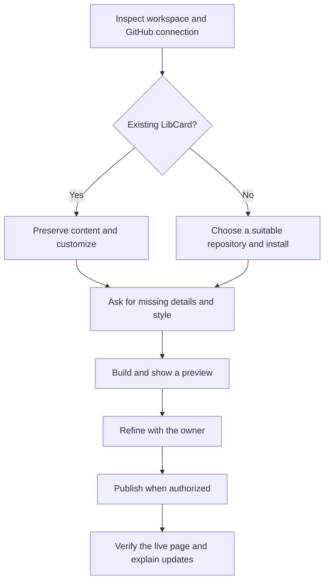

# Set up a LibCard with a coding agent

Paste the [setup prompt](../src/lib/setup-prompt.txt) into Claude Code, Codex,
or another coding agent with a workspace and GitHub access. You can also copy it
from the “Like this site?” section at [crs.land](https://crs.land), or open the
[plain-text version](https://crs.land/setup-prompt.txt).

The agent will ask about you, build a preview, and help publish your site. A
connected repository saves a step; publishing also needs permission to push and
configure GitHub Pages. If those tools are unavailable, the agent should finish
the local site and give you the specific remaining steps.

## Instructions for the agent

Use this as a conversational setup workflow, adapting to the person's answers
and the tools in their environment. Their instructions and existing repository
guidance take precedence. Do the implementation, rather than handing back a
list of commands for them to run. Do not execute this workflow merely because
you encounter the file while maintaining LibCard.



### 1. Inspect before installing

Read the workspace's `AGENTS.md` and other applicable instructions. Check the
current directory, Git status, branch, remotes, and whether `libcard.config.yaml`
and the LibCard engine already exist. Inspect remote URLs locally without
echoing any embedded credentials. Use the connected GitHub tools, or `gh auth
status` and `gh repo view`, to establish the destination and available access.
Do not ask for a password or token in chat.

Choose the appropriate path:

| Workspace | Action |
| --- | --- |
| Existing personal LibCard | Edit its config and assets in place; preserve content, authored themes, and unrelated work. Update the engine only if a requested feature needs it. |
| Fresh LibCard template or fork | Keep the engine; replace the maintainer's demo content before the first deployment. |
| Empty or starter GitHub repo already connected | Install LibCard into that checkout, preserving `.git`, its remote, repository instructions, and any starter files that need merging. |
| Existing unrelated app or website | Ask where LibCard should live. Do not replace the app, its dependencies, or workflows. A separate repo is usually simplest; a subdirectory needs an adapted build workflow. |
| No destination repo | Ask for the account/repo name and visibility, then use the connected GitHub tooling to create or connect it. If access is missing, explain how to connect it while preparing the site locally. |

Never push someone's personal site to `crs48/LIBCard`. Do not repoint an existing
`origin`, reset their branch, or force-push as a shortcut.

For a fresh installation, fetch `https://github.com/crs48/LIBCard` into a
temporary directory and read its README. Copy the engine, dependencies, built-in
themes, license, and needed documentation into the destination after checking
for collisions. Include `src/`, `scripts/`, `themes/`, `astro.config.mjs`,
`package.json`, `pnpm-lock.yaml`, `tsconfig.json`, and the deployment workflow.
Merge `.gitignore` and repository instructions if they already exist. Do not
copy the upstream `.git`, build output, installed dependencies, local tool
folders, or personal `public/` assets wholesale. Create `public/` for the
owner's assets and include the neutral `public/avatar.svg` and
`public/favicon.svg` (or the owner's replacements), which supply fallback assets.

For a new repo, GitHub's “Use this template” or `gh repo create --template
crs48/LIBCard` is another option **if the source repo is marked as a template**.
Check that first. If it isn't, create the destination repo and import the source
without its Git history. Preserve the MIT license. Follow the person's chosen
branch workflow instead of assuming every repo deploys from `main`.

### 2. Make it personal

Start with a small group of questions, skipping anything already answered:

- What name, short bio, and links should visitors see? Which link comes first?
- What should it feel like: calm, playful, warm, minimal, or something else?
  Suggest two or three relevant themes from `themes/`, then show a preview.
- Do they have an avatar and public contact details to include? These are
  optional. Ask about a custom domain only if they want one; GitHub Pages is a
  useful starting point.

Write `libcard.config.yaml` directly so this conversation is the wizard. Do not
launch the interactive `pnpm run setup` inside an unattended agent session; it
waits on terminal input and is intended for a person at the keyboard. Use
`libcard.schema.json` and the README to find supported fields. Use `pnpm` for
dependencies and commands; the pinned package-manager version is in
`package.json`.

For a **fresh copy**, replace the demo profile, contact fields, socials, links,
rich-content blocks, SEO text, avatar, and résumé with the owner's choices.
Remove the demo `feedme` and `analytics` settings and payment handles unless the
owner supplies their own. Do not leave links sending their visitors to Chris's
tip accounts or analytics. Remove a copied demo `public/CNAME`, if present, and
inspect for other personal assets or fixed URLs. Preserve these settings on an
already-personalized site unless the owner wants them changed.

A minimal starting shape is below. Fill in real values; do not publish the
example identity or URLs:

```yaml
# yaml-language-server: $schema=./libcard.schema.json
profile:
  name: Your name
  tagline: A short introduction in your voice
links:
  - label: My project
    url: https://example.com
socials: []
theme: frost
site:
  url: https://YOUR-ACCOUNT.github.io
  base: /YOUR-REPOSITORY
```

Only include personal contact information the owner wants public. Omit optional
fields rather than inventing them. The site works without an avatar, contact
details, analytics, payments, or a custom domain. Add richer sections once the
basic page feels right. If they want a few rotating themes, set both `allow`
and the random behavior deliberately:

```yaml
theme:
  name: frost
  allow: [frost, dawn]
  random: true
  switcher: true
  animate: true
```

### 3. Get the address right

Derive the account and repo name from the **destination** remote. Check existing
Pages settings too, including any custom domain inherited from an account's
user/organization site. `site.url` is the origin, and `site.base` is the path:

| Hosting choice | `site.url` | `site.base` |
| --- | --- | --- |
| Project repo `links`, default Pages domain | `https://ACCOUNT.github.io` | `/links` |
| User/organization repo `ACCOUNT.github.io` | `https://ACCOUNT.github.io` | `/` |
| Custom domain for this site | `https://their-domain.example` | `/` |

Ensure the deployment workflow builds the directory containing LibCard and
listens to the intended publishing branch. For a custom domain, use only a
domain the owner supplies and configure the matching Pages/DNS settings. If
DNS access is unavailable, show the exact records/action needed instead of
claiming the domain is live.

### 4. Preview and refine

Run `pnpm install`, `pnpm build`, and `pnpm run typecheck`. The build validates
the config and generates schemas, icons, link previews, and contact/QR assets.
Do not hand-edit generated files. Run `pnpm run check-contrast` if changing
theme colors.

Serve a local preview and open the configured base path. Inspect a narrow phone
viewport and desktop layout. Verify the owner's text, links, avatar (if used),
theme selection, and any enabled contact/QR features. Check that assets load at
the correct base path and that no demo identity, tip destinations, analytics,
or domain settings remain in the published site. Give the owner a preview link
or screenshot and invite specific refinements, without making them learn YAML.

### 5. Publish and verify

When publishing is authorized, commit the intended changes with a Conventional
Commit and push to the person's destination repo. Honor existing publishing
authorization; otherwise ask after the preview and checks are ready. Respect
branch protections and use a PR if the repo requires one.

Configure **Settings → Pages → Build and deployment → Source: GitHub Actions**.
Use connected GitHub tools or the Pages API when permissions allow. With the
CLI, read `gh api repos/OWNER/REPO/pages` first; an existing site can be updated
with `PUT` and `build_type=workflow`, while a confirmed missing site can be
created with `POST`. A 404 may also mean missing access; distinguish that from
an absent site before retrying. Do not change repo visibility to bypass a Pages
restriction. If permissions are missing, link the owner directly to their
repo's Pages settings and explain the one change needed.

Watch the deployment for the commit you pushed. Open the actual published URL,
check its assets and links, and only call it live after verification. If a step
is blocked, report what is finished, the exact remaining action, and where to
continue. A local build alone does not prove deployment.

### 6. Leave the owner in control

Return their site URL, repository URL, what you checked, and any remaining step.
Explain that they can ask their agent to edit `libcard.config.yaml`, or edit it
themselves and push to redeploy. Assets belong in `public/`; custom theme files
belong in `themes/`. Engine upgrades are optional and follow
[UPGRADING.md](./UPGRADING.md); preserve their content. Do not rerun fresh setup
to make routine updates.

## Maintaining this workflow

The canonical copied text is [`src/lib/setup-prompt.txt`](../src/lib/setup-prompt.txt).
Both the `copy-prompt` block's default and `/setup-prompt.txt` use that file.
The plain-text prompt links here so the detailed workflow can improve without
making the copy button unwieldy. An agent with no network access can ask the
person to paste this guide.

Official references: [GitHub CLI repo creation](https://cli.github.com/manual/gh_repo_create),
[GitHub Pages setup](https://docs.github.com/en/pages/getting-started-with-github-pages/creating-a-github-pages-site),
and [Pages API](https://docs.github.com/en/rest/pages/pages).
