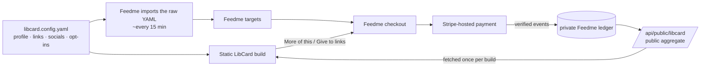

# Tips with Feedme

How to let visitors tip you from your card — and say *where* they'd like you to
spend your energy — with [Feedme](https://github.com/crs48/feedme), a
self-hosted tip jar. This is an **optional** LibCard feature: off by default for
everyone, and switched on entirely from `libcard.config.yaml`.

> **The one idea:** every gift is an unconditional tip to you. A supporter's
> pick ("more of *this* link") is a **suggestion** about where you spend your
> time — not a purchase, a restricted donation, or a promise to deliver a
> project. The card says so right under the button: *"They get all of it. Where
> you placed it is a suggestion."*

---

## What it looks like

With the integration on, three things appear on your card — and nothing else
changes:

| Affordance | Where | Opens |
|---|---|---|
| **Give to \<your name\>** | under your profile header | your Feedme checkout, nothing pre-selected — the visitor chooses there |
| **More of this** (♥ pill) | beside each link you opted in | checkout with that link pre-selected, and Feedme's current default amount suggested |
| **More of this:** \[icon + name\] chips | a labeled row under your social icons | checkout with that social pre-selected |

Beside an opted-in link you may also see a one-line caption: your optional
*blurb*, plus — when Feedme answered at build time — the target's public signal,
e.g. **"75% of public picks · 1 public tip"**. Those numbers are a **build-time
snapshot** (see [§6](#6-what-the-public-numbers-mean)), not a live counter.

Every link, social, icon, status chip, GitHub pill, block and theme you already
have keeps working exactly as before. Links without their own `feedme:` opt-in
are never tippable — opt-in is explicit, never inferred from a platform, URL,
label, or GitHub repo.



**Who owns what.** LibCard owns titles, destinations, icons, GitHub metadata,
blurbs and source aspirations — Feedme imports those straight from your raw
`libcard.config.yaml` (it never scrapes the rendered card or copies your theme).
Feedme owns target availability, local hiding and aspiration overrides, payment
state and the public signal math. LibCard consumes exactly one public endpoint.
No Stripe keys, database, webhook or authenticated Feedme API ever touches
LibCard.

## 1. Upgrade LibCard first

The nested `feedme:` fields are rejected by older LibCard schemas (every link
and social object is strict). Pull the engine before you add them:

```bash
pnpm run update && pnpm install && pnpm build
```

See [UPGRADING.md](./UPGRADING.md). Your existing config builds unchanged — the
new fields are all optional.

## 2. Deploy your own Feedme (server-backed)

Follow Feedme's own setup for a **server-backed** deployment: a Bluesky
administrator identity, Stripe, Habitat, HTTPS and persistent storage. A static
Feedme Pages export (like the public demo) **cannot process payments** and
has no live public endpoint — it is not something a card can point at.

> `feedme.fund` hosts Feedme's public marketing site, directory and an isolated
> demo. It is **not** a personal payment origin. Point your card at **your**
> Feedme deployment, e.g. `https://tips.yourdomain.com`.

## 3. Tell Feedme where your card lives

In your Feedme deployment's environment:

```sh
LIBCARD_REPO=owner/repository   # the GitHub repo holding libcard.config.yaml
LIBCARD_REF=main                # optional; the branch/ref to read (default main)
```

Feedme fetches the raw YAML from GitHub (no auth, no clone), checks for changes
about every 15 minutes, keeps its last good import if a fetch fails, and shows
the import status under **Dashboard → Projects → From LibCard** in Studio.

## 4. Opt in from `libcard.config.yaml`

Add the global block and an explicit `feedme:` object on each link or social you
want to be tippable. Everything you don't opt in stays an ordinary link.

```yaml
feedme:
  enabled: true
  origin: https://tips.yourdomain.com     # YOUR deployed Feedme — bare https origin

links:
  - label: 75m of Presence aka Coaching
    url: https://crs.coach/
    icon: heart
    feedme:
      id: presence                         # permanent payment reference — keep it stable
      blurb: More hours in the room with people.
      aspiration: 3000                     # optional, whole US dollars

  - label: A project with source code
    url: https://example.com/project
    github: https://github.com/example/project
    stars: build
    feedme:
      id: open-source
      blurb: More time maintaining this project.

  - label: Résumé
    url: https://example.com/resume.pdf
    # no feedme: object → an ordinary link, no tip action

socials:
  - platform: x
    label: My writing on X
    url: https://x.com/example
    feedme:
      id: x
      blurb: More of this voice.

  - platform: github
    url: https://github.com/example
    # remains an ordinary social link
```

### The rules (the schema enforces all of them)

| Field | Rule |
|---|---|
| `feedme.enabled` | default `false`. Absent or `false` → **no fetch, no markup, no script**. |
| `feedme.origin` | required when enabled. A bare `https://host[:port]` — a trailing slash is fine and dropped. No `http://`, no credentials, no path, no query, no fragment, and never `localhost` / `127.0.0.1` / `[::1]` — the public card must point at a deployed Feedme, not a local preview. |
| `id` | `^[a-z0-9][a-z0-9-]{0,63}$`. **Unique across links and socials.** Never `creator` or `amount` (reserved). An invalid id is an error, never silently rewritten. |
| `blurb` | optional plain text, trimmed, ≤ 240 characters. Omitted = empty. Rendered as escaped text, never HTML. |
| `aspiration` | optional **integer, whole US dollars**, 0–1,000,000. `0` or omitted = none. Negative, fractional or quoted values are rejected. |
| opt-in count | at most **99** opted-in links + socials. Ordinary items don't count. Feedme adds the `creator` target itself — never list it. |
| unknown fields | rejected inside `feedme:` objects, so a typo like `blurbs:` fails the build instead of vanishing. |

### Ids are forever

An `id` is the **persistent payment reference** Feedme keys gifts by. Keep it
when you rename a link or change its URL. Changing an id archives the old
target in Feedme and creates a new one — existing recurring gifts keep their
original picks until canceled. If an id collides with one of your native Feedme
project ids, Feedme's import fails and says so in Studio's **From LibCard**
diagnostics; LibCard can't see your private projects, so pick a different id
there.

## 5. Commit, let Feedme import, build

1. Commit and push the YAML changes.
2. In Feedme Studio, **Dashboard → Projects → From LibCard → Refresh LibCard**,
   or wait for the next scheduled import.
3. Check the public endpoint lists your ids:

   ```bash
   curl -s https://tips.yourdomain.com/api/public/libcard | jq '.targets[] | {id, kind}'
   ```

4. Build and deploy LibCard (`pnpm build`, or just push — GitHub Pages
   rebuilds). The generated checkout links look like:

   | Action | URL |
   |---|---|
   | Give to \<name\> (unselected) | `https://tips.yourdomain.com/checkout` |
   | More of *presence* | `https://tips.yourdomain.com/checkout?amount=22.00&presence=1` |
   | More of *x* (endpoint was down at build time) | `https://tips.yourdomain.com/checkout?x=1` |

   The `amount` is Feedme's configured default suggestion in **dollars**
   (2200 cents → `22.00`), read from the endpoint — LibCard never hardcodes
   $22. When the endpoint is unavailable the parameter is simply omitted and
   Feedme applies its own current default. Links are built with the URL API
   from your validated origin, never from a link's destination, and never
   prefixed with your site's `base` path.

## 6. What the public numbers mean

During `pnpm build`, LibCard fetches `GET <origin>/api/public/libcard` **once**,
with a 5-second timeout and a 256 KiB body limit, no cookies, no auth headers,
and no environment secrets (your `GITHUB_TOKEN` is never sent). Redirects off
your origin are refused. The response is validated into a small local type
and joined to your opted-in items by **stable id and matching kind**, never by
label or URL — so an API-only target can never appear as a new link on your card.

| Field | Meaning |
|---|---|
| `publicCount` | distinct eligible **payments** that selected the target. Labeled "public tip(s)" — it is **not** picks and **not** unique people (a recurring gift adds a payment each cycle). |
| `publicShareMillis` | the target's share of accumulated raw picks among live targets, in thousandths: 750 = 75%, 250 = 25%, 1 = 0.1%. All targets total exactly 1000, or all 0 when there's no signal. LibCard shows it with at most one decimal and never recomputes it from counts. |

"Eligible" means verified, paid, **public, identified** gifts with positive net
value and stored picks. Private or anonymous gifts, pending payments, disputes,
full refunds and old payments without picks are excluded; a partial refund keeps
its signal while net value stays positive. The response carries no amounts,
identities, notes, provider ids or source documents — LibCard never asks for or
infers them.

What the card shows in each situation:

| Situation | Tip actions | Public numbers |
|---|---|---|
| block absent / `enabled: false` | none | none; nothing fetched |
| endpoint answered; your id is live | "More of this" with Feedme's default amount | real values — including a genuine **"No public picks yet"** |
| endpoint answered; your id is missing (hidden/archived in Feedme) | that item's action is hidden; its ordinary destination is untouched | none for that item |
| endpoint unavailable (down, 404/503, timeout, malformed, oversized, redirected elsewhere) | configured tip links stay, without `amount` | **omitted entirely** — failure is never shown as zero |

"Give to \<name\>" is shown whenever the integration is enabled; Feedme validates
every selection again at checkout, so a link that went stale after the build is
handled there.

**Snapshot, not live.** The numbers are baked into the HTML. The deploy workflow
already rebuilds daily (the same schedule that refreshes GitHub star counts and
build-time embeds), so they're at most a day old — no browser fetch, no polling
script, no third-party badge, no second scheduler. One line in the build log
tells you when the endpoint was unavailable.

## 7. Aspirations and goal progress

`aspiration` is accepted and imported today: Feedme shows it, and you can
override it per target under **Dashboard → Projects → From LibCard** (blank
inherits the source value, `0` hides it, a positive whole-dollar value replaces
it).

**LibCard does not draw a funding bar.** The public endpoint exposes neither the
effective aspiration nor any monetary total, and `publicShareMillis` is a share
of *picks*, not dollars — using it as "progress" would be misleading. Truthful
goal bars on the card need a separately reviewed, privacy-preserving extension
of Feedme's public API that defines an effective aspiration and an explicit
public funding total. Until then, LibCard keeps the metadata for Feedme and
ships the tip links and pick statistics without it. Feedme's local preview and
demo show randomized sample goals; those are demonstration data and never
belong on a real card.

## 8. Troubleshooting

- **"Feedme public stats unavailable from …"** in the build log — the card still
  built. Check that the origin is right and the endpoint returns 200 (`404` =
  Feedme has LibCard disabled; `503` = no successful import yet).
- **A link lost its ♥ but still works** — its id isn't in the public list: hidden
  in Studio, archived after an id change, or not imported yet.
- **Build fails on `feedme.origin`** — read the message; it names the exact
  problem (scheme, path, credentials, loopback host).
- **Build fails on a duplicate id** — the error names both paths, e.g.
  `socials.0.feedme.id … already used at links.2.feedme.id`.

## Verifying locally

Fixtures live in `src/lib/fixtures/feedme/`. Unit tests mock the endpoint
(`pnpm test`). To build a card from a fixture **without touching your own
config**:

```bash
LIBCARD_CONFIG=src/lib/fixtures/feedme/enabled.config.yaml pnpm build
```

(The placeholder origin in that fixture is unreachable, so this exercises the
fail-soft path: tip links without `amount`, no numbers, build still green.)
