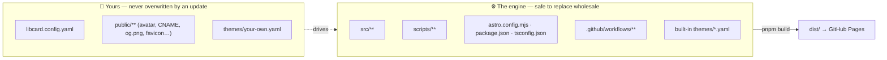

# Upgrading LibCard

How to pull upstream improvements (new themes, features, fixes) into the LibCard
you adopted, without disturbing your content or breaking your live card.

If you just want the short version, the README's
[**Updating your card**](../README.md#updating-your-card) section has the two or
three commands. This page is the full story.

---

## 1. Do I even need to update?

**Usually not.** A LibCard is a static site — once it's deployed it keeps working
forever with no maintenance, no dependencies to patch, no security treadmill.
Updating is **opt-in**: you do it only when you want something upstream added —
a new theme, a feature, an accessibility or rendering fix.

**To know when there's something worth pulling:** open the
[upstream repo](https://github.com/crs48/LIBCard), click **Watch → Custom →
Releases**, and skim [`CHANGELOG.md`](../CHANGELOG.md) when a release lands.
Entries marked **⚠ Action needed** are the only ones that require anything from
you; the rest are picked up by a single update + rebuild.

## 2. What's yours vs. the engine

This is the one idea the whole page rests on. Your repo is a thin layer of
**your content** sitting on top of an interchangeable **engine**. Updating means
*replace the engine, keep your content*.



| Bucket | Files | Update treatment |
|---|---|---|
| **Yours** | `libcard.config.yaml` | **never touched** |
| **Yours** | `public/**` — avatar, `CNAME` (custom domain), `og.png`, a custom favicon | **never touched** |
| **Yours** | a theme *you* wrote, e.g. `themes/my-theme.yaml` | **preserved** |
| **Engine** | `src/**`, `scripts/**`, `astro.config.mjs`, `package.json`, `pnpm-lock.yaml`, `tsconfig.json`, `.github/workflows/**` | **replaced** |
| **Engine** | the built-in `themes/*.yaml` (`default`, `midnight`, `ocean`, …) | **replaced** |
| **Generated** | `libcard.schema.json`, `src/data/themes.json`, `src/styles/themes.gen.css`, `themes/theme.schema.json` | **rebuilt** by `pnpm build` — never edit by hand |

Pick the path that matches how you adopted LibCard:

- **Used "Use this template"** → [Path A](#3-path-a--i-used-the-template).
- **Forked** → [Path B](#4-path-b--i-forked).
- **Only want the latest themes** → [§5](#5-just-the-themes).

> **Why two paths?** A repo made with "Use this template" shares **no git
> history** with upstream, so GitHub's "Sync fork" button and a plain
> `git merge upstream/main` don't apply to it. A fork *does* share history, so it
> gets the easy git-native route. The `pnpm run update` script works for either.

## 3. Path A — I used the template

### The easy way: `pnpm run update`

```bash
pnpm run update              # pulls the latest engine; your content is left alone
pnpm install && pnpm build   # reinstall deps + regenerate derived files
git add -A && git commit -m "chore: update LibCard" && git push
```

`pnpm run update` fetches the engine files from the latest upstream **release**
(falling back to `main` if none is published yet) and writes only engine files —
it never touches `libcard.config.yaml`, `public/`, or a theme you authored. Handy
flags:

```bash
pnpm run update --dry-run    # show what would change, write nothing
pnpm run update --ref=v0.3.0 # pin to a specific release tag or branch
pnpm run update owner/repo   # pull from a different upstream
```

Then `pnpm install && pnpm build` reinstalls dependencies and regenerates every
derived file. If the build passes, your update is safe to `git push` — every
push redeploys via GitHub Actions. If it fails, see [§7](#7-verifying-your-safety-net).

### The advanced way: a real git merge

If you've **modified engine files yourself** and want git to do a true 3-way
merge instead of taking upstream wholesale, you can merge upstream in despite the
unrelated history:

```bash
git remote add upstream https://github.com/crs48/LIBCard.git   # one time
git fetch upstream
git merge upstream/main --allow-unrelated-histories --squash
```

Heads-up: because the histories are unrelated, git merges against an *empty*
base, so it will flag conflicts on engine files even where you didn't change them
— it has no common ancestor to compare against. For files you never touched, just
take upstream's copy:

```bash
git checkout upstream/main -- src scripts astro.config.mjs package.json pnpm-lock.yaml tsconfig.json
```

Keep *your* version of `libcard.config.yaml` and `public/`, then
`pnpm install && pnpm build` and commit. For most people the `pnpm run update`
route above is simpler — reach for this only if you deliberately customized the
engine.

## 4. Path B — I forked

A fork shares history with upstream, so you get the git-native route.

**In the browser:** open your repo's page and click **Sync fork → Update
branch**. GitHub fast-forwards or merges upstream's commits in. If it reports a
conflict it can't resolve automatically, drop to the CLI below.

**From the CLI:**

```bash
git remote add upstream https://github.com/crs48/LIBCard.git   # one time
git fetch upstream
git merge upstream/main        # brings in the new engine
pnpm install && pnpm build     # reinstall + regenerate, confirm it builds
git push
```

The only file likely to conflict is `libcard.config.yaml` (you edited it; upstream
rarely does) — resolve it by [keeping yours](#6-resolving-a-config-conflict).

## 5. Just the themes

If all you want is the newest community themes — not engine changes —
`pnpm run update-themes` fetches the latest `themes/*.yaml` from upstream and
nothing else:

```bash
pnpm run update-themes       # add/update built-in themes; never touches your config
pnpm run gen:themes          # regenerate the theme CSS + registry
pnpm dev                     # preview, then commit & push
```

It accepts the same `owner/repo`, `--ref=`, and `--dry-run` options as
`pnpm run update`.

## 6. Resolving a config conflict

`libcard.config.yaml` is *yours*, so the rule of thumb on a merge conflict is
**keep your version**:

```bash
git checkout --ours libcard.config.yaml
git add libcard.config.yaml
```

The one time to look closer is when a release's **⚠ Action needed** note says a
config field was added, renamed, or removed. In that case, open the conflict,
keep all of your values, and apply just that field change. You don't have to
guess whether you got it right — the next step proves it.

## 7. Verifying: your safety net

```bash
pnpm install && pnpm build
```

The build is the safety net. One Zod schema validates `libcard.config.yaml` *and*
generates the editor schema, so an out-of-date or invalid config **fails the
build locally with a readable message** — long before anything reaches your live
site. Nothing deploys until you `git push`, and you only push after a green
build. If the build fails:

- Read the error — it names the offending field.
- Fix `libcard.config.yaml` (check [`libcard.schema.json`](../libcard.schema.json)
  or the [CHANGELOG](../CHANGELOG.md) for what changed), or
- [Roll back](#8-rolling-back) and try again later.

## 8. Rolling back

Updates are just commits, so undoing one is ordinary git. If a pushed update
misbehaves:

```bash
git revert HEAD            # undo the update commit; redeploys your previous card
git push
```

Or, before you've pushed, throw the update away entirely:

```bash
git reset --hard HEAD~1    # discard the local update commit
```

Your live card keeps serving the last successfully deployed version until a new
push succeeds, so a bad update never takes your card offline.

## 9. What changed in each release

[`CHANGELOG.md`](../CHANGELOG.md) lists every release newest-first, with **⚠
Action needed** flags on the rare entries that want a config tweak. Skim it
before updating to know whether there's anything worth pulling — and whether
you'll need to touch your config.
