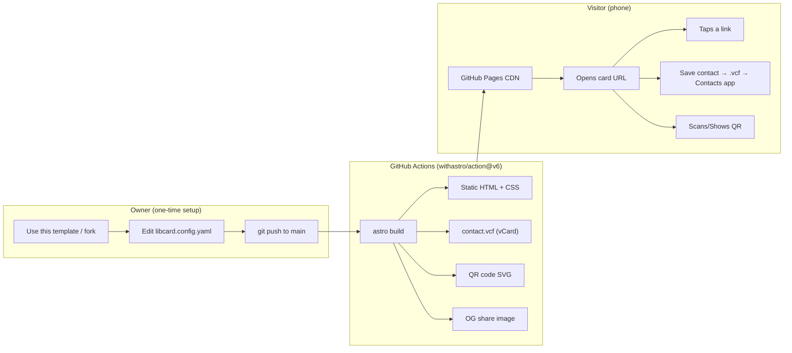
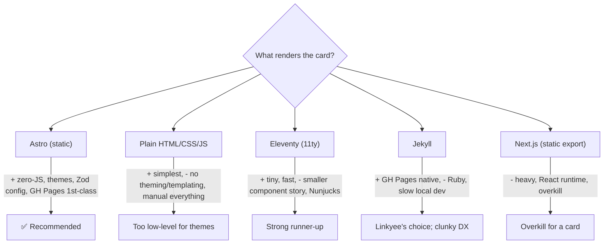
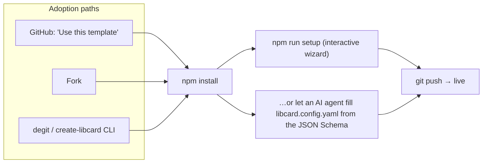
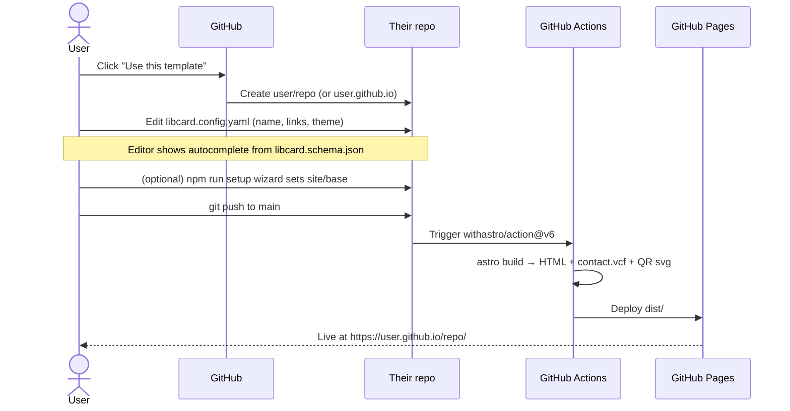
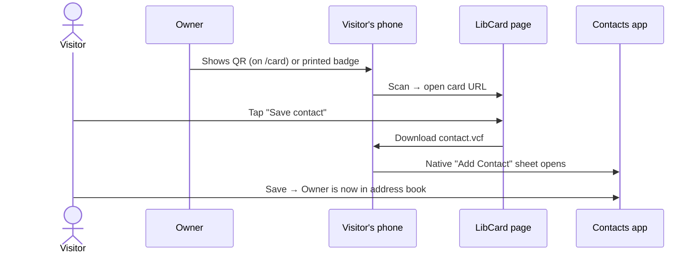

# LibCard — Architecture, Tooling & New-User Workflow (Kickoff Exploration)

> **Status:** Kickoff / greenfield. This is exploration #1 — the foundational
> design doc for the project. Nothing is built yet; the repo currently holds
> only `README.md`, `.gitignore`, and `.claude/`.

## Problem Statement

**LibCard** (stylized `LIBCard`, short for **Link in Bio Card**) is a free,
open-source, self-hostable alternative to Linktree. The pitch:

- A **link-in-bio page** — one URL that collects all your links (socials, site,
  projects, booking link) for use in social media bios.
- A **virtual business card** — the same page doubles as a shareable digital
  business card. Tap a button → save the owner's contact straight to your
  phone's address book (a `.vcf` / vCard).
- **Free hosting** on GitHub Pages — no server, no subscription, no vendor
  lock-in.
- **Trivial to set up** — fork / "Use this template", edit *one* config file,
  push. The page is live in minutes.
- **AI- and human-friendly customization** — the config must be editable both
  by a non-technical human and by an AI coding agent (Claude Code) with minimal
  surface area and good guardrails (schema validation, comments, sensible
  defaults).
- **Conference-ready sharing** — a QR code the owner can show on their phone or
  print on a badge, so a new contact can scan → land on the card → save the
  contact, all in a couple of taps.

The goal of this document is to decide **what to build, with which tools, and
how**, and to lay out the new-user onboarding workflow end to end so subsequent
explorations / implementation work have a clear target.

## Executive Summary

**Recommended stack:** **Astro** (static output) + a single root
**`libcard.config.yaml`** (validated by a **Zod** schema, with a committed
**JSON Schema** for editor/AI autocomplete) + **GitHub Pages** via the official
**`withastro/action@v6`** workflow.

**Recommended core features for the MVP:**

1. A single, fast, accessible **link-in-bio page** rendered from config
   (profile header, avatar, tagline, link buttons, social icon row, footer).
2. A **"Save contact" button** that downloads a build-time-generated
   `contact.vcf` (vCard 3.0) — opens the native "Add to Contacts" sheet on
   iOS/Android.
3. A build-time **QR code** (SVG, no runtime JS) on a dedicated `/card` view,
   encoding the page URL — for conference sharing. Optionally also a
   downloadable vCard-QR that encodes contact data directly (works offline).
4. **Theming via config tokens** (CSS custom properties) with a few starter
   themes selectable by one line.
5. Distribution as a **GitHub template repo** with an interactive
   `npm run setup` wizard *and* a clean config + JSON Schema so an AI agent can
   fill it in.

**Why Astro over the alternatives:** zero-JS-by-default static output (perfect
for a fast card that must load instantly on conference Wi-Fi), first-class
GitHub Pages support, content/data collections with Zod validation built in,
component-based theming, and an ecosystem that's friendly to both hand-editing
and agent-editing. Plain HTML is simpler but doesn't scale to themes/templating;
Jekyll (the other "free GitHub Pages" default) has a clunkier local dev story
and Ruby toolchain; Next.js is overkill for a static card.



## Current State In The Repository

This is a greenfield repo. Relevant existing files:

- [`README.md`](../../README.md) — already frames the product (Link in Bio Card,
  free GitHub Pages hosting, Linktree-style virtual business card, quick-start
  outline, custom-domain note). The quick-start there should stay in sync with
  whatever onboarding flow this exploration lands on.
- [`.gitignore`](../../.gitignore) — already covers OS junk, editors,
  `node_modules/`, **Vite/`dist/` build output**, **Jekyll `_site/`**, and
  `.claude/settings.local.json`. Note: it currently ignores both Vite and Jekyll
  artifacts — once we commit to Astro we can trim the Jekyll lines (Astro builds
  to `dist/`, already covered).
- `.claude/skills/{explore,implement}/` — project-local Claude Code skills. The
  `implement` skill is the natural follow-up to this doc (it implements an
  exploration on a branch and opens a PR).

There is **no source code, `package.json`, or build config yet** — so every
recommendation below is a clean-slate decision with no migration cost.

## External Research

### Prior art — open-source Linktree alternatives

| Project | Stack | Config / customization | Hosting | Notes |
|---|---|---|---|---|
| **Linkyee** | Jekyll + Liquid (Ruby) | Single `config.yml`, 8 themes via one line, live-data "plugins" | GitHub Pages template, rebuilds daily via cron | **Closest prior art.** "Use this template" → edit one YAML → push. No vCard/QR business-card angle. |
| **LinkFree** (MichaelBarney) | Static | Fork + config | GitHub Pages | Early, simple. |
| **LinkStack** | PHP, self-hosted | Web admin UI + DB | Own server / Docker | Full app, not a static template — heavier. |
| **littlelink-server** | Node, Docker | Env vars | Self-host container | Lightweight but needs a server. |
| **lynk** | Next.js + MDX | MDX content | Vercel-style | Interactive, but SSR-oriented. |

**Takeaway:** The static-template-on-GitHub-Pages niche is proven (Linkyee), but
none of the popular ones lead with the **virtual business card / vCard / QR**
experience or with **AI-agent-friendly config**. That's LibCard's wedge:
*Linktree alternative that's also a tap-to-save digital business card, set up by
editing one well-documented file (by hand or by an agent).*

### Astro → GitHub Pages (deployment)

- Astro maintains the official **`withastro/action@v6`** GitHub Action; it
  auto-detects the package manager from the lockfile and defaults to **Node 24**.
- You add `.github/workflows/deploy.yml`, set repo **Pages source = GitHub
  Actions**, and pushes to `main` build + deploy automatically.
- `astro.config.mjs` must set **`site`** (and **`base`** when hosted at
  `user.github.io/repo` rather than a user/org root or custom domain). This is
  the single most common GitHub Pages footgun (assets 404 because `base` is
  wrong).
- Astro build cache can be enabled to speed up rebuilds.

### Config approach in Astro

- **Content/data collections** live in `src/content.config.ts` with a **Zod**
  schema; the built-in **`file()`** loader can load a single local **YAML / TOML
  / JSON** data file and validate it at build time. This is exactly the shape we
  want: *one human-editable data file, validated, with type-safe access in
  templates.*
- `astro.config.mjs` (via `defineConfig`) is project-wide build config — **not**
  where end users should be putting their name and links.

### vCard / QR for the "save to contacts" + conference flow

- A **vCard** (`.vcf`, "Virtual Contact File") is the standard electronic
  business-card format; saving one works on **iOS, Android, Outlook, Google
  Contacts**. Tapping a `.vcf` on a phone opens the native add-contact sheet.
- **vCard QR codes** come in two flavors:
  - **Static** — the contact data is encoded *inside* the QR. Works offline, no
    tracking, but can't be changed after it's printed and can get visually dense
    if you cram in lots of fields.
  - **URL QR** — the QR encodes the page URL; the *page* hosts the save-contact
    button. You can change the destination/content later by editing the repo.
    Slightly simpler QR, needs a network to resolve.
- **QR generation library:** **`qrcode` (node-qrcode)** — pure JS, no native
  deps, ~1M+ weekly downloads, can emit **SVG strings** at build time. Ideal for
  generating the QR during `astro build` with zero client-side JS.

## Key Findings

1. **The static-template pattern is validated** (Linkyee), so "fork → edit one
   file → push → live on GitHub Pages" is a known-good UX. We should match its
   low friction and beat it on the business-card features and config ergonomics.
2. **Astro fits the constraints best**: static, zero-JS-by-default (fast cards),
   native GitHub Pages support, Zod-validated single-file config via the `file()`
   loader, and component theming.
3. **vCard + QR can be 100% build-time** — `contact.vcf` and the QR SVG are
   generated during `astro build`, so the live page ships **no runtime JS** for
   these features (download is a plain `<a download>`; QR is inline SVG). This
   keeps the page fast and CDN-cacheable.
4. **Config must serve two editors — human and agent.** The winning move is a
   single **YAML** file with (a) inline comments, (b) a committed **JSON Schema**
   wired via the `# yaml-language-server: $schema=` directive for in-editor
   autocomplete/validation, and (c) a Zod schema at build time that fails the
   build with a friendly message on bad input. An AI agent can read the JSON
   Schema to know exactly what fields exist.
5. **The `base` path is the #1 deployment trap.** We should detect/derive it (or
   document it loudly) and provide a setup wizard that sets `site`/`base`
   correctly for the user's repo name.

## Options And Tradeoffs

### A. Static-site framework



| Option | Pros | Cons | Verdict |
|---|---|---|---|
| **Astro (static)** | Zero-JS by default → instant loads; islands if we ever need interactivity; Zod-validated `file()` config; component theming; official GH Pages action; great human+agent DX | Node toolchain (npm install) needed for local dev | **Recommended** |
| Plain HTML/CSS/JS | Zero build, dead simple | No templating/themes; every change is manual; hard to keep config separate from markup | Good for a "no-build" fallback theme, not the core |
| Eleventy (11ty) | Very fast, minimal, flexible | Weaker component/theming ergonomics; templating-language sprawl | Strong runner-up if we want to avoid a framework |
| Jekyll | Native on GH Pages (no Action needed) | Ruby toolchain; slow local rebuilds; Liquid | What Linkyee uses; we can do better on DX |
| Next.js static export | Familiar React | React runtime, heavier, overkill | No |

### B. Where the user's data lives (config format)

| Option | Human-friendly | AI-agent-friendly | Validation | Comments? | Verdict |
|---|---|---|---|---|---|
| **`libcard.config.yaml`** + JSON Schema + Zod | ★★★ | ★★★ (reads schema) | Zod at build, schema in editor | ✅ | **Recommended** |
| `libcard.config.json` | ★★ | ★★★ | Zod/schema | ❌ (no comments) | Good AI target, worse for humans |
| `libcard.config.jsonc`/`json5` | ★★ | ★★ | Zod | ✅ | Comments + JSON, but less ubiquitous |
| `libcard.config.ts` (typed object) | ★ | ★★ | TS types | ✅ | Best types, intimidates non-devs |
| TOML | ★★ | ★★ | Zod | ✅ | Fine, less familiar than YAML |
| Markdown frontmatter | ★★ | ★★ | Zod | ✅ | Awkward for nested link arrays |

**Recommendation: YAML as the single source of truth**, at the repo **root**
(maximally discoverable — it's the *only* file most users will ever touch),
with:

```yaml
# yaml-language-server: $schema=./libcard.schema.json
```

at the top so VS Code gives autocomplete + inline errors, a committed
`libcard.schema.json`, and a Zod schema that mirrors it for the build. (Generate
the JSON Schema *from* the Zod schema with `zod-to-json-schema` so they can't
drift.)

### C. QR strategy

| Strategy | Encodes | Pros | Cons |
|---|---|---|---|
| **URL QR** (recommended primary) | The card's URL | Editable later (change page, QR stays valid); simpler/sparser QR; can add light analytics on the landing | Needs network to resolve |
| **vCard QR** (recommended secondary, downloadable) | Contact data inline | Works fully offline; scan → save contact directly | Static once printed; denser QR; no link clicks |

Offer **both**: an always-visible **URL QR** on the `/card` view for "point your
phone here", plus a **downloadable high-res vCard-QR** (PNG/SVG) the owner can
print on a physical badge for pure offline save-to-contacts.

### D. Distribution model (how others adopt it)



- **Template repo** ("Use this template") is the headline path — one click, no
  fork relationship, clean history.
- A `npm run setup` **wizard** (prompts for name, tagline, links, theme; writes
  `libcard.config.yaml`; sets `site`/`base` in `astro.config.mjs` from the
  detected repo) removes the deployment footguns.
- The **JSON Schema** makes the agent path first-class: "Claude, set up my
  LibCard" → agent reads schema, writes config, commits.

## Recommendation

Build the **MVP on Astro (static output)** with this shape:

1. **Single root config** `libcard.config.yaml` (Zod-validated, JSON-Schema-
   backed) as the *only* file a typical user edits.
2. **One primary page** (`/`) — the link-in-bio card — plus a **`/card`** view
   (or modal) that surfaces the QR + Save-Contact for the business-card moment.
3. **Build-time `contact.vcf`** via an Astro endpoint
   (`src/pages/contact.vcf.ts`, `prerender = true`) generated from the same
   config.
4. **Build-time QR SVG** via `qrcode` inside an Astro component (runs at build,
   inlines SVG, zero client JS).
5. **Build-time OG image** (so shared links look good) via
   `astro-og-canvas`/`satori` — nice-to-have, can slip past MVP.
6. **Theming** through CSS custom properties driven by a `theme:` key in config,
   with 3–4 starter themes.
7. **Deployment** via `withastro/action@v6` + a `setup` wizard that fixes
   `site`/`base`.
8. **Distribution** as a GitHub **template repo**, README quick-start kept in
   sync, JSON Schema published for agent-driven setup.

### Proposed repository structure

```
LIBCard/
├── libcard.config.yaml        # 👈 the one file users edit
├── libcard.schema.json        # generated from Zod; powers editor + AI autocomplete
├── astro.config.mjs           # site/base; set by setup wizard
├── package.json
├── scripts/
│   └── setup.mjs              # `npm run setup` interactive wizard
├── src/
│   ├── content.config.ts      # file() loader + Zod schema for libcard.config.yaml
│   ├── lib/
│   │   ├── config.ts          # load + validate config, typed accessor
│   │   └── vcard.ts           # build a vCard 3.0 string from config
│   ├── components/
│   │   ├── Profile.astro
│   │   ├── LinkButton.astro
│   │   ├── SocialRow.astro
│   │   ├── QRCode.astro       # build-time SVG via `qrcode`
│   │   └── SaveContact.astro  # <a download href="/contact.vcf">
│   ├── themes/                # CSS custom-property theme files
│   ├── pages/
│   │   ├── index.astro        # the card
│   │   ├── card.astro         # QR + save-contact "business card" view
│   │   └── contact.vcf.ts     # prerendered vCard endpoint
│   └── styles/
├── .github/workflows/deploy.yml
└── docs/explorations/0001_[_]_LIBCARD_ARCHITECTURE_AND_MVP.md
```

### End-to-end user workflows

**New owner onboarding (the happy path):**



**Visitor saving the contact (conference moment):**



## Example Code

> Illustrative, not final — to make the recommendation concrete.

**`libcard.config.yaml`** (the one file users edit):

```yaml
# yaml-language-server: $schema=./libcard.schema.json
profile:
  name: Chris Smothers
  tagline: Founder · building LibCard
  avatar: /avatar.jpg            # file in /public, or a URL
  location: San Francisco, CA

# Powers the "Save contact" vCard + the QR business card
contact:
  email: chris@example.com
  phone: "+1-555-123-4567"
  organization: LibCard
  title: Maintainer
  website: https://chrissmothers.example

links:
  - label: My website
    url: https://chrissmothers.example
    icon: globe
  - label: Book a call
    url: https://cal.com/chris
    icon: calendar

socials:
  - platform: github
    url: https://github.com/chris
  - platform: x
    url: https://x.com/chris

theme: midnight                  # one of the built-in themes
site:
  # The wizard sets these; shown here for clarity
  url: https://chris.github.io
  base: /LIBCard
```

**`src/content.config.ts`** — validate the single config file at build time:

```ts
import { defineCollection } from "astro:content";
import { file } from "astro/loaders";
import { z } from "astro:content";

const linkSchema = z.object({
  label: z.string(),
  url: z.string().url(),
  icon: z.string().optional(),
});

export const collections = {
  libcard: defineCollection({
    loader: file("libcard.config.yaml"),
    schema: z.object({
      profile: z.object({
        name: z.string(),
        tagline: z.string().optional(),
        avatar: z.string().optional(),
        location: z.string().optional(),
      }),
      contact: z.object({
        email: z.string().email().optional(),
        phone: z.string().optional(),
        organization: z.string().optional(),
        title: z.string().optional(),
        website: z.string().url().optional(),
      }),
      links: z.array(linkSchema).default([]),
      socials: z.array(z.object({ platform: z.string(), url: z.string().url() })).default([]),
      theme: z.string().default("default"),
    }),
  }),
};
```

**`src/lib/vcard.ts`** — build a vCard 3.0 string:

```ts
import type { Contact, Profile } from "./types";

export function buildVCard(profile: Profile, contact: Contact): string {
  const [first = "", ...rest] = profile.name.split(" ");
  const last = rest.join(" ");
  return [
    "BEGIN:VCARD",
    "VERSION:3.0",
    `N:${last};${first};;;`,
    `FN:${profile.name}`,
    contact.organization && `ORG:${contact.organization}`,
    contact.title && `TITLE:${contact.title}`,
    contact.phone && `TEL;TYPE=CELL:${contact.phone}`,
    contact.email && `EMAIL;TYPE=INTERNET:${contact.email}`,
    contact.website && `URL:${contact.website}`,
    "END:VCARD",
  ].filter(Boolean).join("\r\n");
}
```

**`src/pages/contact.vcf.ts`** — prerendered vCard endpoint:

```ts
export const prerender = true;
import { getEntry } from "astro:content";
import { buildVCard } from "../lib/vcard";

export async function GET() {
  const cfg = (await getEntry("libcard", "libcard")).data;
  const body = buildVCard(cfg.profile, cfg.contact);
  return new Response(body, {
    headers: {
      "Content-Type": "text/vcard; charset=utf-8",
      "Content-Disposition": 'attachment; filename="contact.vcf"',
    },
  });
}
```

**`src/components/QRCode.astro`** — build-time SVG, zero client JS:

```astro
---
import QRCode from "qrcode";
const { value, size = 220 } = Astro.props;
const svg = await QRCode.toString(value, { type: "svg", margin: 1, width: size });
---
<div class="qr" set:html={svg} aria-label="QR code" role="img" />
```

**`.github/workflows/deploy.yml`** — official Astro action:

```yaml
name: Deploy LibCard to GitHub Pages
on:
  push: { branches: [main] }
  workflow_dispatch:
permissions: { contents: read, pages: write, id-token: write }
concurrency: { group: pages, cancel-in-progress: true }
jobs:
  build:
    runs-on: ubuntu-latest
    steps:
      - uses: actions/checkout@v4
      - uses: withastro/action@v6      # auto-detects pm; Node 24
  deploy:
    needs: build
    runs-on: ubuntu-latest
    environment: { name: github-pages, url: "${{ steps.deployment.outputs.page_url }}" }
    steps:
      - id: deployment
        uses: actions/deploy-pages@v4
```

## Risks And Open Questions

- **`base` path footgun.** `user.github.io/LIBCard/` needs `base: '/LIBCard'`;
  a custom domain or `user.github.io` root needs `base: '/'`. Wrong value →
  broken CSS/links/QR target. **Mitigation:** the `setup` wizard derives it; the
  vCard/QR must use the *absolute* `site + base` URL, not a relative one.
- **vCard QR vs URL QR for printed badges.** If someone prints a *URL* QR and
  later deletes the repo, the QR dies. A *vCard* QR survives offline forever but
  can't be updated. We should make the tradeoff explicit in docs and offer both.
- **vCard escaping/encoding.** Commas, semicolons, and newlines in fields must be
  escaped per RFC 6350/2426; phone formatting and non-ASCII names need care.
  Consider a small tested helper rather than hand-rolling everywhere.
- **vCard version compatibility.** 3.0 is the most broadly compatible; 4.0 is
  newer but some Android/Outlook paths are finicky. Default to 3.0.
- **Config power vs. simplicity.** How far do we go — custom sections, embeds,
  live data (à la Linkyee plugins)? MVP should resist scope creep: profile,
  links, socials, contact, theme. Everything else is a later exploration.
- **Two sources of truth for the schema.** Zod (build) and JSON Schema (editor)
  must not drift — generate the JSON Schema from Zod in a prebuild step.
- **Avatar handling.** Local file in `/public` vs. remote URL vs. build-time
  optimization (Astro `<Image>`). MVP: accept a `/public` path or URL; optimize
  later.
- **Analytics & privacy.** Static hosting has no backend; if we add analytics it
  should be optional and privacy-friendly (GoatCounter/Plausible), never default-on.
- **Multi-profile / teams.** Out of scope for MVP, but the config shape
  shouldn't make it impossible later.
- **Naming.** Package/CLI name (`create-libcard`?), default theme names, and the
  `/card` vs `/` split for the QR view are still open.

## Implementation Checklist

**Scaffold & config**
- [ ] `npm create astro@latest` with the minimal/empty template; commit
      `package.json`, `astro.config.mjs`, `tsconfig.json`.
- [ ] Set `output: 'static'`, and `site`/`base` in `astro.config.mjs`.
- [ ] Trim now-unused Jekyll lines from `.gitignore` (keep `dist/`).
- [ ] Define the **Zod schema** + `file()` loader in `src/content.config.ts`.
- [ ] Add `src/lib/config.ts` typed accessor over the collection entry.
- [ ] Generate `libcard.schema.json` from Zod (`zod-to-json-schema`) in a
      prebuild script; wire the `# yaml-language-server` directive.
- [ ] Author a fully-commented starter `libcard.config.yaml`.

**Core page & components**
- [ ] `Profile.astro`, `LinkButton.astro`, `SocialRow.astro` components.
- [ ] `pages/index.astro` assembling the card from config.
- [ ] Theme system: CSS custom properties + 3–4 starter themes in `src/themes/`,
      selected by `theme:` in config.
- [ ] Responsive down to 320px; accessible (focus states, contrast, ARIA).

**Business-card features**
- [ ] `src/lib/vcard.ts` with RFC-correct escaping + unit tests.
- [ ] `pages/contact.vcf.ts` prerendered endpoint.
- [ ] `SaveContact.astro` (`<a download href={base + 'contact.vcf'}>`).
- [ ] `QRCode.astro` build-time SVG via `qrcode`.
- [ ] `pages/card.astro` (or modal) showing QR + Save-Contact, using absolute
      `site+base` URL for the QR.
- [ ] (Stretch) downloadable high-res **vCard-QR** PNG/SVG for printed badges.
- [ ] (Stretch) build-time **OG image** via `astro-og-canvas`.

**Distribution & deploy**
- [ ] `.github/workflows/deploy.yml` using `withastro/action@v6`.
- [ ] `scripts/setup.mjs` interactive wizard (writes config, sets `site`/`base`).
- [ ] Mark the repo as a **template** ("Use this template").
- [ ] Update `README.md` quick-start to match the real flow; document the
      URL-QR vs vCard-QR tradeoff and the `base` requirement.
- [ ] Document the **AI-agent setup path** (point the agent at
      `libcard.schema.json`).

## Validation Checklist

- [ ] `npm run build` produces `dist/` with `index.html`, `contact.vcf`, and the
      `/card` page; no runtime JS shipped for QR/vCard.
- [ ] Editing `libcard.config.yaml` and rebuilding changes the page with **no
      code edits**.
- [ ] Invalid config (e.g. bad email/URL) **fails the build** with a readable
      Zod error message.
- [ ] Editor shows autocomplete/validation from `libcard.schema.json`.
- [ ] Lighthouse: Performance ≥ 95, Accessibility ≥ 95 on the card page.
- [ ] Page renders correctly at the GitHub Pages `base` subpath (assets, links,
      and QR target all resolve — no 404s).
- [ ] **iPhone (Safari):** tap "Save contact" → native Add-Contact sheet opens
      with correct name/phone/email/URL.
- [ ] **Android (Chrome):** same — `.vcf` opens Contacts with correct fields.
- [ ] Scanning the on-screen **URL QR** with a stock phone camera opens the live
      card URL.
- [ ] Scanning the **vCard QR** (if shipped) offers to save the contact offline.
- [ ] OG/Twitter preview renders when the URL is shared (if OG image shipped).
- [ ] Fresh "Use this template" → edit config → push → live within ~3 minutes,
      following only the README.

## References

- [Deploy your Astro site to GitHub Pages — Astro Docs](https://docs.astro.build/en/guides/deploy/github/)
- [withastro/action (official GH Pages action)](https://github.com/withastro/action)
- [withastro/github-pages template](https://github.com/withastro/github-pages)
- [Astro Content Collections — Docs](https://docs.astro.build/en/guides/content-collections/)
- [Astro Configuration overview](https://docs.astro.build/en/guides/configuring-astro/)
- [Linkyee — open-source LinkTree alternative on GitHub Pages](https://github.com/ZhgChgLi/linkyee)
- [LinkFree (MichaelBarney)](https://github.com/MichaelBarney/LinkFree)
- [LinkStack — self-hosted Linktree alternative](https://linkstack.org/)
- [medevel: 13 open-source Linktree alternatives](https://medevel.com/linktree-open-source-alternatives-1273/)
- [`qrcode` (node-qrcode) on npm](https://www.npmjs.com/package/qrcode)
- [QR Code Generator using Node.js — 2026 guide](https://www.grizzlypeaksoftware.com/articles/p/qr-code-generator-using-nodejs-the-complete-2026-guide-y7TytT)
- [vCard QR Code Generator — how it works on mobile](https://www.qr-code-generator.com/solutions/vcard-qr-code/)
- [QuickChart: How to create QR codes for vCards](https://quickchart.io/documentation/vcard-qr-codes/)
```

