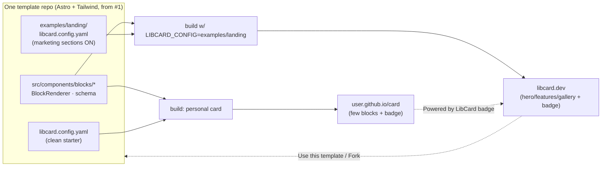
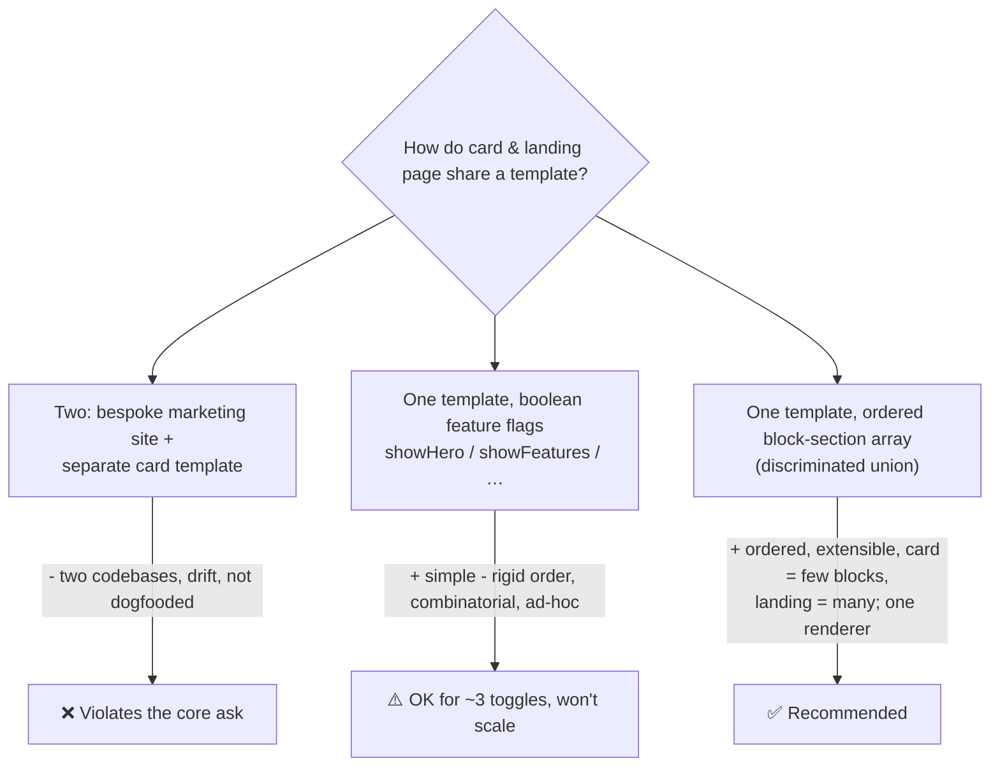
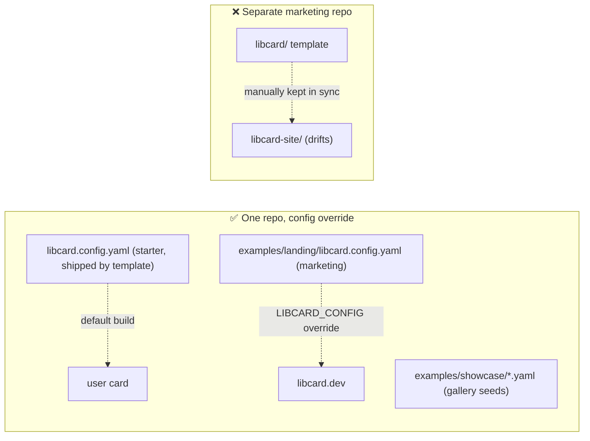
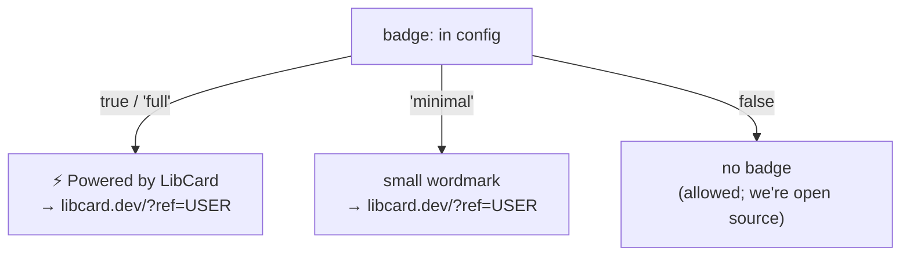
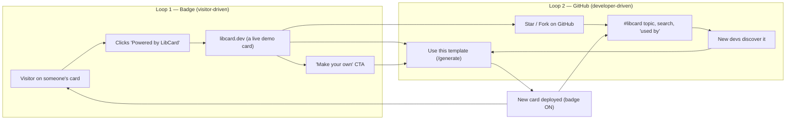
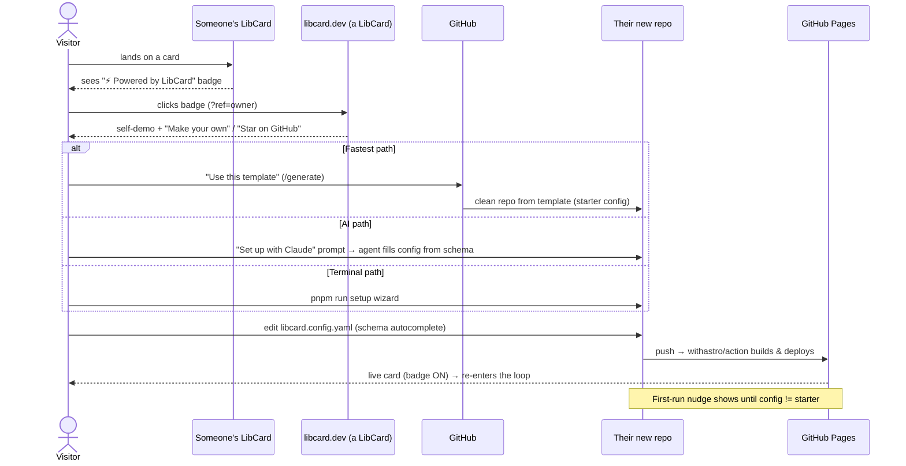

# LibCard Landing Page — Self-Demo, Block Sections & The Viral "Powered by LibCard" Loop

> **Status:** Exploration #2. Builds directly on
> [`0001_[_]_LIBCARD_ARCHITECTURE_AND_MVP.md`](./0001_[_]_LIBCARD_ARCHITECTURE_AND_MVP.md)
> and **assumes everything in that exploration is being built** (Astro static
> output, Tailwind v4, single `libcard.config.yaml` validated by Zod + JSON
> Schema, build-time vCard + QR, `withastro/action@v6` → GitHub Pages, pnpm).
> Nothing here contradicts #1; it extends the config and component model so the
> *same template* can render both a personal card **and** LibCard's own marketing
> landing page, and adds the growth/onboarding layer.

## Problem Statement

We need a landing page for LibCard. The constraint that makes this interesting:
**the landing page should *be* a LibCard.** Concretely, the owner wants:

1. **A self-demo.** The landing page should demonstrate what LibCard is by
   *being one* — a visitor sees the actual product, live, not screenshots of it.
2. **…but also a real landing page.** It still has to explain the product, sell
   it, and drive a clear call-to-action (set up your own).
3. **One artifact, not two codebases.** Ideally the landing page is *the template
   everyone uses* — so the marketing site and an ordinary user's card are the
   **same thing**, distinguished only by configuration. LibCard must therefore be
   expressive enough to render a marketing page, while staying simple enough that
   a personal card is still trivial.
4. **A viral loop.** Every LibCard deployed by anyone carries a small **"Powered
   by LibCard"** badge/footer that links back to the LibCard site. The LibCard
   site links out to the GitHub repo. A visitor on *someone's* card → discovers
   LibCard → makes their own → which carries the badge → and so on.
5. **Seamless onboarding.** The path from "I saw a cool card" to "my card is
   live" must be as close to frictionless as GitHub Pages allows.
6. **Optional, landing-only features.** Some things belong on `libcard.dev` but
   not on every card — a hero, a features grid, a "Star us on GitHub" banner, an
   FAQ. These must be *available* to the template but **off by default** so a
   personal card stays a clean personal card.
7. **Works on GitHub Pages.** No server. Everything build-time/static, same as #1.

The question this doc answers: **what is the smallest set of additions to the
exploration-#1 design that makes the landing page a LibCard, turns every card
into a growth surface, and keeps the personal-card experience dead simple?**

## Executive Summary

**Recommendation in one line:** *One template, two configs, a block-section
model, and a default-on badge.*

1. **Introduce a block-section model.** A LibCard page becomes an **ordered list
   of typed blocks** (`hero`, `profile`, `links`, `socials`, `features`,
   `gallery`, `cta`, `faq`, `github`, `save-contact`, `badge`, …), validated by a
   Zod **`z.discriminatedUnion("type", …)`** and rendered by a single
   `<BlockRenderer>`. This is the keystone idea: **a personal card is just a
   LibCard with few blocks; the landing page is a LibCard with more blocks.** Same
   code, same components — the marketing site and a user's card are literally the
   same program with different data.
2. **Keep the simple path simple (no regression from #1).** If the user provides
   no `sections:`, LibCard **auto-composes the classic card** from the existing
   `profile` / `links` / `socials` / `contact` keys
   (`profile → links → socials → save-contact → badge`). Explicit `sections:` is
   the opt-in escape hatch for landing-page-shaped pages. This honors #1's
   "resist scope creep — profile/links/socials/contact/theme" guidance while
   making richer pages *possible*.
3. **One repo, two (plus N) configs.** The template ships a clean **starter**
   config at the repo root. `libcard.dev` is the *same codebase* built with a
   **`examples/landing/libcard.config.yaml`** selected via a `LIBCARD_CONFIG`
   build override. The marketing site is therefore dogfooded and **cannot drift**
   from the template — and it doubles as an integration test in CI.
4. **The "Powered by LibCard" badge is a first-class, default-on block.** Small,
   tasteful, bottom-of-page, links to `https://libcard.dev/?ref=<github-user>`.
   Removable via `badge: false` (we're MIT/open-source — we lead with goodwill,
   not a paywall), but on by default because *default-on attribution is the
   entire growth engine* (Hotmail, Typeform, Calendly, Carrd all prove it).
5. **Two interlocking viral loops.** The **badge loop** (card visitor → badge →
   libcard.dev → deploy) compounds with the **GitHub loop** (repo → star / fork /
   "Use this template" / `libcard` topic → discovery). The landing page is the
   hub where both converge; from it you go *out* to GitHub and *in* to "make your
   own."
6. **Layered onboarding.** Hero CTA deep-links to GitHub's **`/generate`**
   ("Use this template"); a **"Set up with Claude"** button copies a ready-made
   agent prompt; `pnpm run setup` wizard for the terminal-comfortable; and a
   **first-run nudge** appears on a freshly-deployed, still-default card.

**The mental model:** LibCard is to a personal card what a CMS theme is to a
page — and `libcard.dev` is the theme's own demo site, built from the theme. The
demo *is* the documentation, the marketing, and the integration test, all at once.



## Current State In The Repository

This is still a greenfield repo; the landing page is being designed *before*
implementation, so every recommendation here is a clean-slate extension of the
#1 plan rather than a migration.

- [`docs/explorations/0001_[_]_LIBCARD_ARCHITECTURE_AND_MVP.md`](./0001_[_]_LIBCARD_ARCHITECTURE_AND_MVP.md)
  — the foundation. Key load-bearing decisions this doc inherits:
  - **Single `libcard.config.yaml`** at repo root, Zod-validated via the Astro
    `file()` loader in `src/content.config.ts`, with a generated
    `libcard.schema.json` for editor/agent autocomplete.
  - **Zero-JS-by-default** static output; the only sanctioned interactivity is a
    native `<dialog>`/`<details>` (the QR reveal). *This doc proposes the landing
    page may carry **one** optional island — see [§E](#e-the-self-demo-how-interactive).*
  - Component seam already anticipates blocks: `Profile.astro`,
    `LinkButton.astro`, `SocialRow.astro`, `QRCode.astro`, `SaveContact.astro`
    under `src/components/` (see #1's "Proposed repository structure"). The block
    model **generalizes** this — those components become *block renderers*.
  - A **footer** is already listed as part of the page ("profile header, avatar,
    tagline, link buttons, social icon row, **footer**" — #1 §Executive Summary).
    The "Powered by LibCard" badge slots into exactly that footer.
  - Distribution as a **GitHub template repo** + `pnpm run setup` wizard + an
    **AI-agent setup path** (point the agent at `libcard.schema.json`) — #1 §D.
    The landing page is where these paths get their buttons.
- [`README.md`](../../README.md) — already markets the product ("one link for
  your Instagram / X / LinkedIn / TikTok bio", "virtual business card",
  conference QR). The landing-page copy and the README should share a voice and
  stay in sync (the README literally says *"Once the template lands, setup will
  look like this…"* — the landing page is that template).
- [`AGENTS.md`](../../AGENTS.md) — Conventional Commits (`feat`, `docs`,
  `feat(vcard)` …), pnpm-only, "keep the README quick-start in sync." A new
  `feat(blocks):` / `feat(badge):` scope fits the existing table.
- No `package.json` / `src/` yet — so the block model can be the *original*
  shape of the component layer rather than a refactor.

## External Research

### Default-on attribution footers are a proven, top-tier growth loop

The "small badge on every artifact, linking home" pattern is one of the most
durable growth mechanics in software:

- **Hotmail — the canonical case.** A one-line signature, *"PS: I love you — Get
  your free email at Hotmail,"* on every outbound email, with **Hotmail**
  hyperlinked to the signup page. Result: **12M users in ~18 months**, ~60k
  signups/day, acquired for ~$400M — on an internet of tens of millions of
  people. The footer worked because it rode inside the artifact people already
  trusted, in context, at zero marginal cost.
  ([Strategy Breakdowns](https://strategybreakdowns.com/p/hotmails-viral-growth-loop),
  [The Marketing Millennials](https://themarketingmillennials.com/articles/2023-01-09/the-unknown-story-of-how-hotmail-grew-to-12-million-users-in-1-5-years/))
- **Typeform** — *"We didn't do anything else really."* Each form carried a
  **"Powered by Typeform"** button; respondents (hundreds per form) saw the
  product in its best light and some became creators. Free plans can't remove
  it, guaranteeing impressions.
  ([OpenView](https://openviewpartners.com/blog/typeforms-viral-growth-and-its-disruption/))
- **Calendly** — *"Powered by Calendly"* under every booking widget; reportedly
  ~25% of new users first encountered it on someone else's scheduling page, with
  a same-day loop. Badge removal is a paid feature.
  ([FlowJam viral-loop playbook](https://www.flowjam.com/blog/viral-loop-examples-saas-the-definitive-playbook-for-engineering-self-sustaining-growth))
- **Carrd / Linktree / Notion / Substack / Beehiiv / Vercel** — all run a
  visible "made with / powered by / deployed on" mark on free or public output.
  The recommended pattern from the playbooks: *embed a non-intrusive watermark in
  the customer-facing asset; if you monetize removal, make it a feature not a
  nag.* ([FlowJam](https://www.flowjam.com/blog/viral-loop-examples-saas-the-definitive-playbook-for-engineering-self-sustaining-growth),
  [Super Business Manager](https://www.superbusinessmanager.com/viral-loops-engineering-growth-into-the-product-dna/))

**Implication for LibCard:** we have **no paid tier**, so removal can't be a
paywall — it's purely a social norm (like *"Built with Astro"* or the classic
*"Fork me on GitHub"* ribbon). The lever we *do* control is **default-on +
tasteful + frictionless to keep**. Most people never remove a tasteful default.

### Viral coefficient (k-factor) — what to honestly expect

K = (invites per user) × (conversion per invite). **K > 1 → exponential**; for
most real products **K between 0.3 and 0.7 is "good"** and *supplements* other
acquisition rather than replacing it.
([LaunchList k-factor guide](https://getlaunchlist.com/blog/viral-coefficient-k-factor-guide),
[Insightful CFO](https://insightfulcfo.blog/2025/07/28/viral-coefficient-engineering-product-led-growth/),
[ProductLed metrics](https://www.productled.org/foundations/product-led-growth-metrics))

For LibCard the badge loop's K ≈ *(visitors per card over its life)* ×
*(badge click-through rate)* × *(visitor → new-owner conversion)*. Realistically
the visitor→owner conversion is low (deploying a repo is more work than clicking
"sign up"), so **don't bank on K>1 from the badge alone.** The badge loop's job
is to *compound* with the GitHub loop (below), and to make every card a
zero-cost, perpetual billboard. Even K≈0.2–0.4 meaningfully bends the curve.

### GitHub template repos are their own distribution channel

- **"Use this template"** creates a clean repo (no fork history) in seconds, and
  every template exposes a **`/generate`** endpoint you can deep-link to —
  e.g. `https://github.com/libcard/libcard/generate`. The landing-page hero CTA
  should point straight at it.
  ([GitHub Blog](https://github.blog/developer-skills/github/generate-new-repositories-with-repository-templates/),
  [GitHub Docs](https://docs.github.com/en/repositories/creating-and-managing-repositories/creating-a-repository-from-a-template))
- **The GitHub social graph is a second loop:** stars (social proof), forks
  (discoverable network), the **`libcard` topic** (a free, auto-aggregating
  gallery), repo search, and "used by." Dev-tool growth (shadcn/ui, Supabase,
  Astro themes) leans heavily on *"Star on GitHub"* CTAs + template galleries.
- Each deployed card is a **public repo** → a backlink to the template → SEO and
  discoverability that a closed SaaS link-in-bio never gets.

### Block / section schemas are the standard way to make one template
### render many page shapes

Page-builder systems (Sanity, Storyblok, Builder.io, Astro landing-kits)
converge on the same shape: **a page is an array of typed "blocks"/"sections"**
— hero variants, proof/feature blocks, FAQs, CTAs, forms — reordered freely, each
mapped to a component. ([Sanity page-building course](https://www.sanity.io/learn/course/page-building/create-page-builder-schema-types),
[Agnite Astro landing system](https://agnitestudio.com/blog/astro-landing-page-system/),
[Builder.io × Astro](https://docs.astro.build/en/guides/cms/builderio/)) In a
typed/Zod world this is precisely a **discriminated union on a `type` field**,
which Astro content collections support natively. This is the off-the-shelf
pattern that makes "the card and the landing page are the same template" true.

## Key Findings

1. **The block model is the unlock.** Representing a page as an ordered list of
   typed blocks collapses "card vs. landing page" into "few blocks vs. many
   blocks." No second codebase, no `if (isLandingPage)` forks — just data. This
   is the single most important decision in this doc.
2. **Simplicity is preserved by auto-composition.** 95% of users never touch
   `sections:`; they fill `profile`/`links`/`socials` and LibCard composes the
   classic card for them. The block array is an opt-in for the 5% (and for
   `libcard.dev`). #1's "keep it simple" mandate survives intact.
3. **Dogfooding via a config override beats a separate marketing repo.** Building
   `libcard.dev` from `examples/landing/libcard.config.yaml` in the *same repo*
   guarantees the marketing site exercises the real template on every commit —
   it's marketing, documentation, the canonical example, *and* an integration
   test simultaneously. A separate repo would drift.
4. **The badge must be default-on or the loop doesn't exist.** Every viral-footer
   success above is default-on. Make it tasteful and trivially removable (we're
   open source), but ship it `true`.
5. **There are two loops, and the landing page is their hub.** Badge loop
   (visitor-driven) + GitHub loop (developer-driven). Design the landing page to
   feed both: a "make your own" path *and* prominent "Star / Use this template"
   GitHub CTAs.
6. **Measurement is the hard part on static hosting** (no backend). Solve it with
   referrer params (`?ref=`) + privacy-friendly analytics on `libcard.dev`, plus
   GitHub stars/forks and an opt-in showcase as proxy KPIs. (Details in
   [§G](#g-measuring-the-loop-on-static-hosting) and Risks.)
7. **Landing-only blocks are just blocks that default off.** Hero, features,
   FAQ, the GitHub "star us" banner, the interactive demo — all available to any
   card, none in the starter config. Optionality falls out of the model for free.

## Options And Tradeoffs

### A. How is the landing page "the same thing" as a card?



| Option | Card & landing share code? | Ordering/flexibility | Simplicity for a basic card | Verdict |
|---|---|---|---|---|
| **Two codebases** (bespoke marketing site) | ❌ no | n/a | n/a | **Rejected** — directly contradicts "they should be the same thing"; guarantees drift; not a self-demo |
| **Feature-flag booleans** (`showHero`, …) | ✅ yes | ✗ fixed order, combinatorial blow-up | ★★★ | OK for a *tiny* fixed set; becomes spaghetti as sections grow |
| **Block-section array** (discriminated union) | ✅ yes | ★★★ arbitrary order & repetition | ★★★ (via auto-compose) | **✅ Recommended** |

**Recommendation: the block-section model**, with **auto-composition** so the
basic path needs no `sections:` key at all. A page is
`sections: Block[]`; each `Block` is `{ type, …typeSpecificFields }`; one
`<BlockRenderer>` switches on `type`. The existing #1 components become block
renderers under `src/components/blocks/`.

### B. Where do the personal card and the landing page configs live?



| Option | Dogfood guarantee | Drift risk | CI value | Verdict |
|---|---|---|---|---|
| **Same repo + `LIBCARD_CONFIG` override** | ✅ builds from the real template every commit | none | landing build = integration test | **✅ Recommended** |
| Separate marketing repo (own bespoke site) | ✗ | high | none | ❌ |
| Separate repo *via "Use this template"* | partial (snapshots, then frozen) | drifts as template evolves | none | ⚠️ only if org separation is required |

**Recommendation:** add a thin build-time **config selector**. Default
`./libcard.config.yaml`; allow `LIBCARD_CONFIG=examples/landing/libcard.config.yaml`
(env var, mirrored by a `--config` flag in the setup tooling). `libcard.dev`'s
deploy workflow sets that env var. The template-shipped root config stays the
clean **starter** so new users never inherit marketing copy. The `examples/`
configs also seed the showcase/gallery and serve as living documentation.

> Implementation note: Astro's `file()` loader path is set in
> `src/content.config.ts`. Read `process.env.LIBCARD_CONFIG ?? 'libcard.config.yaml'`
> there so the same `src/` builds any config. (Keep the default literal so the
> common case needs no env at all.)

### C. The "Powered by LibCard" badge — the growth surface

Decisions, each with the recommendation called out:

| Decision | Options | Recommendation |
|---|---|---|
| **Default state** | on / off | **On** (`badge: true`). The loop is the product strategy; default-off ≈ no loop. |
| **Removability** | locked / free toggle / paid | **Free toggle** (`badge: false`). We're MIT — lead with goodwill; document how to remove it. Norm, not paywall. |
| **Style variants** | full / minimal / off | `badge: 'full' | 'minimal' | false` (with `true` ⇒ `'full'`). *Full* = "⚡ Powered by LibCard"; *minimal* = small wordmark/logo only. |
| **Placement** | footer / floating / both | **Footer**, bottom-center, in the flow (not a sticky floater — respects the clean card aesthetic and #1's footer slot). |
| **Link target** | libcard.dev / GitHub | **libcard.dev** (the conversion hub), which itself links to GitHub. Append `?ref=<github-user>` for attribution. |
| **Self-reference** | does libcard.dev show its own badge? | **Yes** — `libcard.dev` carries the badge too (it *is* a LibCard). It links to GitHub. Maximal honesty + proof. |



**Anti-patterns to avoid:** sticky/floating badge that covers content; nagging
modals; making removal hard or guilt-tripping in docs; tracking pixels (privacy
violation on someone else's page). The badge is one small, static, styled
`<a>` — **zero JS, zero tracking on the visitor's card**; attribution happens
only when they *click through* to libcard.dev.

### D. The viral engine — two loops, one hub



The **landing page is the hub** where both loops converge and hand off: the
badge feeds visitors *in*; the page sends them *out* to GitHub to deploy/star;
the deployed card re-enters both loops. Every node is static and GitHub-Pages-
friendly. (This is the diagram to keep in mind when prioritizing landing-page
content: every section should serve *enter the loop* or *advance to deploy*.)

### E. The self-demo — how interactive?

The landing page should *feel* like the product. Options for the "try it"
moment, in increasing JS cost:

| Option | JS cost | Effort | Verdict |
|---|---|---|---|
| **Be the product** (the page is a real card with real blocks) | **0** | free (it's the model) | **✅ Baseline — always do this** |
| **CSS-only theme switcher** (radio inputs / `:target` swap `@theme` token sets) | **0** | low | **✅ Recommended demo** — flip themes live, zero JS, true to the ethos |
| **One Astro island** — live config→card preview / in-page config builder | small, landing-only | medium | ✅ *Opt-in*, landing config only; the single sanctioned hydration |
| Full SPA playground | large | high | ❌ Violates the zero-JS identity |

**Recommendation:** the page being a real LibCard *is* the demo; add a
**CSS-only theme switcher** (`demo` block) so visitors watch the same card
restyle instantly with no JS. Reserve a **single optional island** for a later
"config builder" (`builder` block) that emits a `libcard.config.yaml` and a
prefilled `/generate` link — powerful for onboarding, but a stretch. Crucially,
**all interactivity lives in landing-only blocks**, so ordinary cards stay
strictly zero-JS as #1 requires.

### F. GitHub-only / landing-only blocks (the "GitHub banner" & friends)

These are real block types, **available to everyone but present only in the
landing config** (and any power user who wants them):

| Block `type` | Purpose | On personal cards? |
|---|---|---|
| `hero` | Big headline + subhead + primary CTA (→ `/generate`) | off |
| `features` | Grid of value props (free, fast, yours, vCard/QR) | off |
| `steps` | "Use template → edit config → push → live" | off |
| `github` | **The GitHub banner** — "⭐ Star LibCard on GitHub" + live star count badge, and/or a classic *"Fork me on GitHub"* corner ribbon | off |
| `gallery` | Showcase of real LibCards in the wild (social proof + backlinks) | off |
| `faq` | Common questions (custom domain, base path, removing the badge) | off |
| `cta` | "Make your own LibCard" closing CTA | off |
| `demo` | CSS-only theme switcher (the self-demo) | off |
| `builder` *(stretch)* | Island: form → `libcard.config.yaml` + `/generate` link | off |
| `profile`/`links`/`socials`/`save-contact` | The card itself | **on** |
| `badge` | "Powered by LibCard" | **on by default** |

The "GitHub banner" the prompt asks for is the **`github` block** — a star CTA /
star-count shield / "Fork me" ribbon. It's exactly the kind of thing you want on
`libcard.dev` but not on a stranger's personal card, and the block model makes
that distinction a one-line config difference.

### G. Measuring the loop on static hosting

No backend ⇒ no server-side attribution. Layered, privacy-respecting approach:

1. **Referrer param** — badge links carry `?ref=<github-user>` (or a coarse
   `?via=badge`). `libcard.dev` runs **privacy-friendly analytics**
   (GoatCounter/Plausible — #1 already flags analytics as optional/opt-in) and
   counts inbound `ref`/referrer to estimate badge-driven traffic and which cards
   send it.
2. **GitHub as the scoreboard** — stars, forks, `/generate` clicks (GitHub
   traffic insights), and the **`libcard` topic** count are proxy KPIs for the
   developer loop.
3. **Opt-in showcase** — a `gallery` seeded by `examples/showcase/*.yaml` plus a
   "submit your card" PR template / `libcard` topic crawl. Doubles as social
   proof, backlinks, and a rough census of live cards.

No tracking is ever injected into *someone else's* card — attribution only fires
on click-through to libcard.dev. (Carrd-style honesty.)

## Recommendation

**Build the landing page as a LibCard by adding a block-section layer to the #1
MVP, ship a default-on badge, and dogfood `libcard.dev` from an in-repo landing
config.** Concretely:

1. **Schema:** extend `src/content.config.ts` with an optional
   `sections: Block[]` where `Block = z.discriminatedUnion("type", […])`. Keep
   `profile`/`links`/`socials`/`contact`/`theme` exactly as #1 defined them.
2. **Auto-compose:** when `sections` is absent, synthesize
   `[profile, links, socials, save-contact, badge]` from the legacy keys. Simple
   path unchanged.
3. **Renderer:** `src/components/BlockRenderer.astro` maps `type → component`;
   move #1's `Profile/LinkButton/SocialRow/SaveContact/QRCode` under
   `src/components/blocks/` and add `Hero/Features/Steps/Github/Gallery/Faq/Cta/Demo/Badge`.
4. **Badge:** `src/components/blocks/Badge.astro`, default-on, `'full' |
   'minimal' | false`, links to `libcard.dev/?ref=<derived-username>`. Add a
   top-level `badge:` shorthand in config (sugar for the trailing badge block).
5. **Config selector:** read `LIBCARD_CONFIG` (default `./libcard.config.yaml`)
   in `content.config.ts`. Add `examples/landing/libcard.config.yaml` (marketing)
   and `examples/showcase/*.yaml` (gallery seeds). Root config stays the clean
   starter.
6. **`libcard.dev` deploy:** a second workflow (or matrix leg) that builds with
   `LIBCARD_CONFIG=examples/landing/libcard.config.yaml`, custom domain via
   `CNAME`, same `withastro/action@v6`. This build runs in CI as the template's
   integration test.
7. **Onboarding surfaces on the landing page:** `hero` CTA → `/generate`;
   `github` block (star + "Fork me"); a **"Set up with Claude"** button that
   copies an agent prompt referencing `libcard.schema.json`; `steps`; `faq`
   (incl. "how to remove the badge" and the `base` footgun); CSS-only `demo`.
8. **First-run nudge:** if a deployed config still equals the shipped starter
   (detected via a `meta.default: true` marker or a content hash), render a
   subtle "👋 This is a fresh LibCard — edit `libcard.config.yaml`" banner that
   vanishes once customized.

### Proposed additions to the #1 repository structure

```
LIBCard/
├── libcard.config.yaml            # clean STARTER (shipped by "Use this template")
├── libcard.schema.json            # generated from Zod (now includes block types)
├── examples/
│   ├── landing/
│   │   └── libcard.config.yaml    # 👈 libcard.dev itself (sections ON)
│   └── showcase/
│       └── *.yaml                 # gallery seeds / real-card examples
├── src/
│   ├── content.config.ts          # + sections: discriminatedUnion; reads LIBCARD_CONFIG
│   ├── lib/
│   │   ├── compose.ts             # legacy keys → default block list (auto-compose)
│   │   └── badge.ts               # derive libcard.dev/?ref=<user> from site/base
│   ├── components/
│   │   ├── BlockRenderer.astro    # switch on block.type
│   │   └── blocks/
│   │       ├── Profile.astro  Links.astro  Socials.astro     # (were top-level in #1)
│   │       ├── SaveContact.astro  QRCode.astro
│   │       ├── Badge.astro                                    # ⚡ Powered by LibCard
│   │       ├── Hero.astro  Features.astro  Steps.astro
│   │       ├── Github.astro                                   # star CTA / "Fork me" ribbon
│   │       ├── Gallery.astro  Faq.astro  Cta.astro
│   │       └── Demo.astro                                     # CSS-only theme switcher
│   └── pages/
│       └── index.astro            # renders sections via <BlockRenderer>
└── .github/workflows/
    ├── deploy.yml                 # user/template card (root config)
    └── deploy-site.yml            # libcard.dev (LIBCARD_CONFIG=examples/landing/…)
```

### Onboarding — end to end (the seamless path)



### First-run nudge (state)

```mermaid
stateDiagram-v2
    [*] --> Default: deployed, config == shipped starter
    Default --> Customized: user edits profile/links
    Default: show "👋 fresh LibCard — edit libcard.config.yaml"
    Customized: nudge hidden
    Customized --> [*]
```

## Example Code

> Illustrative, not final — concretizes the recommendation. Builds on #1's
> `src/content.config.ts` and component conventions.

**Block schema (discriminated union)** — `src/content.config.ts` (additions):

```ts
import { defineCollection, z } from "astro:content";
import { file } from "astro/loaders";

// Reusable leaf schemas (profile/links/socials/contact) come from #1.
const linkSchema = z.object({ label: z.string(), url: z.string().url(), icon: z.string().optional() });

// Each block is { type, …fields }. Add a new block by adding a member here
// and a case in BlockRenderer — nothing else changes.
const block = z.discriminatedUnion("type", [
  z.object({ type: z.literal("profile") }),                         // pulls from top-level profile
  z.object({ type: z.literal("links"), items: z.array(linkSchema).optional() }),
  z.object({ type: z.literal("socials") }),
  z.object({ type: z.literal("save-contact") }),
  z.object({ type: z.literal("badge"),
             variant: z.enum(["full", "minimal"]).default("full") }),
  // ── landing-only blocks (off by default on personal cards) ──
  z.object({ type: z.literal("hero"), headline: z.string(),
             subhead: z.string().optional(), cta: z.object({ label: z.string(), url: z.string().url() }).optional() }),
  z.object({ type: z.literal("features"),
             items: z.array(z.object({ title: z.string(), body: z.string(), icon: z.string().optional() })) }),
  z.object({ type: z.literal("steps"), items: z.array(z.string()) }),
  z.object({ type: z.literal("github"), repo: z.string(),           // "libcard/libcard"
             showStars: z.boolean().default(true), ribbon: z.boolean().default(false) }),
  z.object({ type: z.literal("gallery"), items: z.array(z.object({ name: z.string(), url: z.string().url() })) }),
  z.object({ type: z.literal("faq"), items: z.array(z.object({ q: z.string(), a: z.string() })) }),
  z.object({ type: z.literal("cta"), headline: z.string(), button: z.object({ label: z.string(), url: z.string().url() }) }),
  z.object({ type: z.literal("demo") }),                            // CSS-only theme switcher
]);

const configSchema = z.object({
  // …all of #1's keys (profile, contact, links, socials, theme, site) unchanged…
  badge: z.union([z.boolean(), z.enum(["full", "minimal"])]).default(true),  // sugar for trailing badge block
  sections: z.array(block).optional(),                              // ← opt-in page composition
  meta: z.object({ default: z.boolean().default(false) }).default({}), // first-run nudge marker
});

const configPath = process.env.LIBCARD_CONFIG ?? "libcard.config.yaml";    // ← config selector
export const collections = {
  libcard: defineCollection({ loader: file(configPath), schema: configSchema }),
};
```

**Auto-compose** — `src/lib/compose.ts` (keeps the simple path simple):

```ts
import type { z } from "astro:content";

// If the user gave no `sections`, build the classic card from legacy keys.
export function resolveSections(cfg: Config): Block[] {
  if (cfg.sections?.length) return cfg.sections;
  const badge = cfg.badge === false ? [] : [{ type: "badge", variant: cfg.badge === true ? "full" : cfg.badge }];
  return [
    { type: "profile" },
    { type: "links" },
    { type: "socials" },
    cfg.contact ? { type: "save-contact" } : null,
    ...badge,
  ].filter(Boolean) as Block[];
}
```

**Renderer** — `src/components/BlockRenderer.astro`:

```astro
---
import Profile from "./blocks/Profile.astro";
import Links from "./blocks/Links.astro";
import Socials from "./blocks/Socials.astro";
import SaveContact from "./blocks/SaveContact.astro";
import Badge from "./blocks/Badge.astro";
import Hero from "./blocks/Hero.astro";
import Features from "./blocks/Features.astro";
import Steps from "./blocks/Steps.astro";
import Github from "./blocks/Github.astro";
import Gallery from "./blocks/Gallery.astro";
import Faq from "./blocks/Faq.astro";
import Cta from "./blocks/Cta.astro";
import Demo from "./blocks/Demo.astro";

const MAP = { profile: Profile, links: Links, socials: Socials, "save-contact": SaveContact,
  badge: Badge, hero: Hero, features: Features, steps: Steps, github: Github,
  gallery: Gallery, faq: Faq, cta: Cta, demo: Demo } as const;

const { block } = Astro.props;
const Cmp = MAP[block.type];
---
<Cmp {...block} />
```

**The badge** — `src/components/blocks/Badge.astro` (zero JS, zero tracking):

```astro
---
import { badgeHref } from "../../lib/badge";   // → https://libcard.dev/?ref=<github-user>
const { variant = "full" } = Astro.props;
---
<footer class="libcard-badge">
  <a href={badgeHref()} target="_blank" rel="noopener" class="inline-flex items-center gap-1 text-sm opacity-70 hover:opacity-100">
    <span aria-hidden="true">⚡</span>
    {variant === "full" ? <span>Powered by <strong>LibCard</strong></span> : <span class="sr-only">Powered by LibCard</span>}
  </a>
</footer>
```

**`examples/landing/libcard.config.yaml`** — `libcard.dev` is itself a LibCard:

```yaml
# yaml-language-server: $schema=../../libcard.schema.json
profile:
  name: LibCard
  tagline: Your link-in-bio + virtual business card. Free, yours, on GitHub Pages.
  avatar: /logo.svg
theme: midnight
badge: full            # libcard.dev shows the badge too — it IS a LibCard
sections:
  - type: hero
    headline: One link for everything you do.
    subhead: A fast, free link-in-bio page and tap-to-save business card you host on GitHub Pages.
    cta: { label: Use this template, url: https://github.com/libcard/libcard/generate }
  - type: demo                       # CSS-only theme switcher over a real card
  - type: profile                    # the live self-demo card
  - type: links
  - type: socials
  - type: save-contact
  - type: features
    items:
      - { title: Free hosting, body: Runs on GitHub Pages. No server, no subscription. }
      - { title: Tap to save, body: A vCard button drops you straight into Contacts. }
      - { title: Conference-ready, body: Build-time QR code, no runtime JS. }
      - { title: Yours to own, body: Your repo, your domain, your data. }
  - type: steps
    items: ["Use this template", "Edit libcard.config.yaml", "git push", "You're live"]
  - type: github
    repo: libcard/libcard
    showStars: true
    ribbon: true                     # the "Fork me on GitHub" banner
  - type: gallery                    # real LibCards in the wild
    items:
      - { name: "Chris", url: "https://chris.github.io/libcard" }
  - type: faq
    items:
      - { q: Can I remove the badge?, a: "Yes — set `badge: false`. It's MIT-licensed." }
      - { q: Custom domain?, a: "Add a CNAME file and point DNS at GitHub Pages." }
  - type: cta
    headline: Make yours in five minutes.
    button: { label: Use this template, url: https://github.com/libcard/libcard/generate }
  - type: badge
```

**`libcard.config.yaml`** (root, the clean **starter** shipped by the template):

```yaml
# yaml-language-server: $schema=./libcard.schema.json
meta: { default: true }            # drives the first-run "edit me" nudge
profile:
  name: Your Name
  tagline: What you do · where you are
links:
  - { label: My website, url: https://example.com, icon: globe }
socials:
  - { platform: github, url: https://github.com/you }
theme: midnight
# badge defaults to true → "⚡ Powered by LibCard". Set `badge: false` to remove.
# No `sections:` → LibCard auto-composes the classic card for you.
```

**`libcard.dev` deploy** — `.github/workflows/deploy-site.yml` (config override):

```yaml
name: Deploy libcard.dev
on: { push: { branches: [main] }, workflow_dispatch: {} }
permissions: { contents: read, pages: write, id-token: write }
jobs:
  build:
    runs-on: ubuntu-latest
    env:
      LIBCARD_CONFIG: examples/landing/libcard.config.yaml   # ← same template, marketing config
    steps:
      - uses: actions/checkout@v4
      - uses: withastro/action@v6
  deploy:
    needs: build
    runs-on: ubuntu-latest
    environment: { name: github-pages, url: "${{ steps.deployment.outputs.page_url }}" }
    steps: [{ id: deployment, uses: actions/deploy-pages@v4 }]
```

## Risks And Open Questions

- **Scope creep vs. #1's "keep it simple."** The block model *could* balloon into
  a page builder. **Mitigation:** auto-compose means the simple path never sees
  blocks; ship a *small, fixed* block catalog; treat new block types as
  deliberate additions (one schema member + one component), not a plugin system.
- **Badge erosion.** Open-source ⇒ anyone can delete the badge; power users and
  devs (our exact audience) are the *most* likely to. K from the badge alone may
  be modest. **Mitigation:** lean on the *GitHub loop* as the primary engine
  (stars/forks/template/topic), treat the badge as compounding bonus, keep it
  genuinely tasteful so keeping it is the path of least resistance.
- **`?ref=` deanonymization / privacy.** A `ref=<github-user>` leaks which card
  referred a visitor. **Mitigation:** keep it coarse and public (it's already a
  public username on a public page); never set cookies or pixels on the
  *visitor's* card; consider `?via=badge` (no user) as the privacy-default and
  per-user attribution opt-in.
- **Measurement is indirect** (no backend). Referrer analytics undercounts
  (privacy browsers strip referrers; `ref` can be stripped). **Mitigation:**
  triangulate badge-referrals + GitHub stars/forks + `/generate` traffic +
  showcase submissions; accept fuzziness.
- **Config selector footgun.** `LIBCARD_CONFIG` only matters for *us*; a user who
  sets it by accident breaks their build. **Mitigation:** default to the literal
  root path, document the env var as "maintainers only," and validate the path
  exists with a friendly error.
- **The starter-vs-marketing handoff.** If we ever make the *root* config the
  marketing page, new users inherit our copy. **Mitigation (chosen):** root =
  starter, marketing lives in `examples/landing/`. Revisit only if "Use this
  template" UX demands a richer default.
- **One island creep.** The optional `demo`/`builder` islands must never leak JS
  onto personal cards. **Mitigation:** islands live *only* in landing-only blocks;
  add a CI check that the **default/starter build ships 0 KB JS** (guards #1's
  promise).
- **`base` path × badge/QR/OG URLs.** #1 already flags `base` as the #1 footgun;
  the badge's `?ref` link, the `github` block, gallery links, and OG tags must all
  use absolute `site + base`. **Mitigation:** a single `absoluteUrl()` helper,
  reused everywhere; covered by the validation checklist.
- **Open naming/brand questions.** Is the home `libcard.dev`, `libcard.org`, or
  `libcard.github.io`? Badge copy ("Powered by LibCard" vs "Made with LibCard")?
  Does the `github` block show a live star count (needs a build-time fetch or a
  static shield image)? These are cheap to settle during implementation.

## Implementation Checklist

**Block model (the keystone)**
- [ ] Add `sections: z.array(block).optional()` with a
      `z.discriminatedUnion("type", …)` to `src/content.config.ts` (keep all #1
      keys unchanged).
- [ ] `src/lib/compose.ts` — `resolveSections()` synthesizes the classic card
      when `sections` is absent.
- [ ] `src/components/BlockRenderer.astro` — `type → component` map.
- [ ] Move #1's `Profile/Links/Socials/SaveContact/QRCode` into
      `src/components/blocks/`; `pages/index.astro` renders
      `resolveSections(cfg).map(b => <BlockRenderer block={b} />)`.
- [ ] Regenerate `libcard.schema.json` from the extended Zod (so editor + agent
      autocomplete know the block types).
- [ ] CI guard: the **starter build ships 0 KB client JS**.

**Badge & viral surface**
- [ ] `src/lib/badge.ts` — derive `https://libcard.dev/?ref=<github-user>` from
      `site`/`base` (absolute URL).
- [ ] `src/components/blocks/Badge.astro` — `full | minimal`, zero JS, no
      tracking; top-level `badge:` shorthand wired through `compose.ts`.
- [ ] Default `badge: true`; document `badge: false` removal in README + FAQ.

**Landing-only blocks**
- [ ] `Hero`, `Features`, `Steps`, `Github` (star CTA + "Fork me" ribbon),
      `Gallery`, `Faq`, `Cta`, `Demo` (CSS-only theme switcher) components.
- [ ] (Stretch) `Builder` island: form → `libcard.config.yaml` + prefilled
      `/generate` link (the single sanctioned hydration, landing-only).

**Dogfooded landing site**
- [ ] `examples/landing/libcard.config.yaml` (the marketing page as a LibCard).
- [ ] `examples/showcase/*.yaml` gallery seeds.
- [ ] `LIBCARD_CONFIG` selector in `content.config.ts` (default root path).
- [ ] `.github/workflows/deploy-site.yml` building libcard.dev with the override
      + `CNAME` for the custom domain.
- [ ] Keep the root `libcard.config.yaml` as a **clean starter** with
      `meta.default: true`.

**Onboarding**
- [ ] Hero CTA → `https://github.com/libcard/libcard/generate`.
- [ ] "Set up with Claude" button copies an agent prompt referencing
      `libcard.schema.json`.
- [ ] First-run nudge component (shows while `meta.default` / starter-hash holds).
- [ ] README quick-start + landing copy kept in sync (per `AGENTS.md`).

**Analytics (opt-in, privacy-friendly)**
- [ ] GoatCounter/Plausible on libcard.dev; count `ref`/referrer.
- [ ] Document `libcard` GitHub topic + a "submit your card" path for the gallery.

## Validation Checklist

- [ ] A config with **no `sections:`** renders exactly the #1 classic card
      (profile → links → socials → save-contact → badge) — no behavior change.
- [ ] `examples/landing` build (`LIBCARD_CONFIG=…`) renders the full marketing
      page from the **same `src/`** — proving "landing page == a LibCard."
- [ ] The **starter/personal build ships 0 KB client JS** (CI-asserted); any
      island appears **only** on the landing build.
- [ ] Badge renders by default, links to `libcard.dev/?ref=<user>` with an
      **absolute** URL that resolves correctly under a Pages `base` subpath.
- [ ] `badge: false` removes it cleanly; `'minimal'` shows the compact variant.
- [ ] CSS-only `demo` theme switcher swaps themes with **no JS** (works with JS
      disabled).
- [ ] `github` block shows the star CTA / "Fork me" ribbon and links to the repo
      (absolute URL).
- [ ] First-run nudge shows on a fresh deploy and disappears once `profile.name`
      (or config hash) changes from the starter.
- [ ] Hero/CTA "Use this template" opens GitHub's `/generate` for a clean repo.
- [ ] Lighthouse on libcard.dev: Performance ≥ 95, Accessibility ≥ 95 (the
      marketing page stays as fast as a card).
- [ ] `libcard.dev` itself carries the badge and links out to GitHub (self-proof).
- [ ] Adding a brand-new block type requires only (a) one schema union member and
      (b) one component + map entry — nothing else.
- [ ] Fresh "Use this template" → edit config → push → live card **with badge**
      within ~3 minutes following only the README.

## References

- [Hotmail's viral growth loop — Strategy Breakdowns](https://strategybreakdowns.com/p/hotmails-viral-growth-loop)
- [How Hotmail grew to 12M users — The Marketing Millennials](https://themarketingmillennials.com/articles/2023-01-09/the-unknown-story-of-how-hotmail-grew-to-12-million-users-in-1-5-years/)
- [Typeform's viral growth — OpenView](https://openviewpartners.com/blog/typeforms-viral-growth-and-its-disruption/)
- [Viral Loop Examples (SaaS) — FlowJam playbook](https://www.flowjam.com/blog/viral-loop-examples-saas-the-definitive-playbook-for-engineering-self-sustaining-growth)
- [Viral Loops: Engineering Growth Into Product DNA — Super Business Manager](https://www.superbusinessmanager.com/viral-loops-engineering-growth-into-the-product-dna/)
- [Viral Coefficient & K-Factor guide — LaunchList](https://getlaunchlist.com/blog/viral-coefficient-k-factor-guide)
- [Viral Coefficient: Engineering PLG — Insightful CFO](https://insightfulcfo.blog/2025/07/28/viral-coefficient-engineering-product-led-growth/)
- [Product-Led Growth metrics — ProductLed](https://www.productled.org/foundations/product-led-growth-metrics)
- [Generate new repositories with repository templates — GitHub Blog](https://github.blog/developer-skills/github/generate-new-repositories-with-repository-templates/)
- [Creating a repository from a template — GitHub Docs](https://docs.github.com/en/repositories/creating-and-managing-repositories/creating-a-repository-from-a-template)
- [Create page-builder schema types — Sanity Learn](https://www.sanity.io/learn/course/page-building/create-page-builder-schema-types)
- [Astro landing-page system (reusable sections) — Agnite](https://agnitestudio.com/blog/astro-landing-page-system/)
- [Builder.io & Astro — Astro Docs](https://docs.astro.build/en/guides/cms/builderio/)
- [Astro Content Collections — Docs](https://docs.astro.build/en/guides/content-collections/)
- Internal: [`0001_[_]_LIBCARD_ARCHITECTURE_AND_MVP.md`](./0001_[_]_LIBCARD_ARCHITECTURE_AND_MVP.md) — the foundation this extends.
