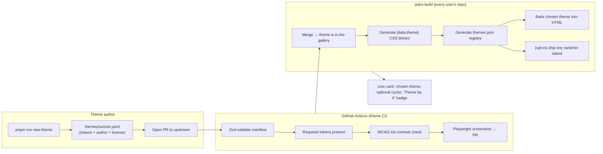
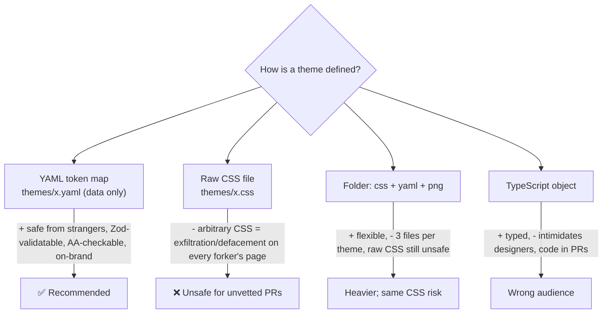
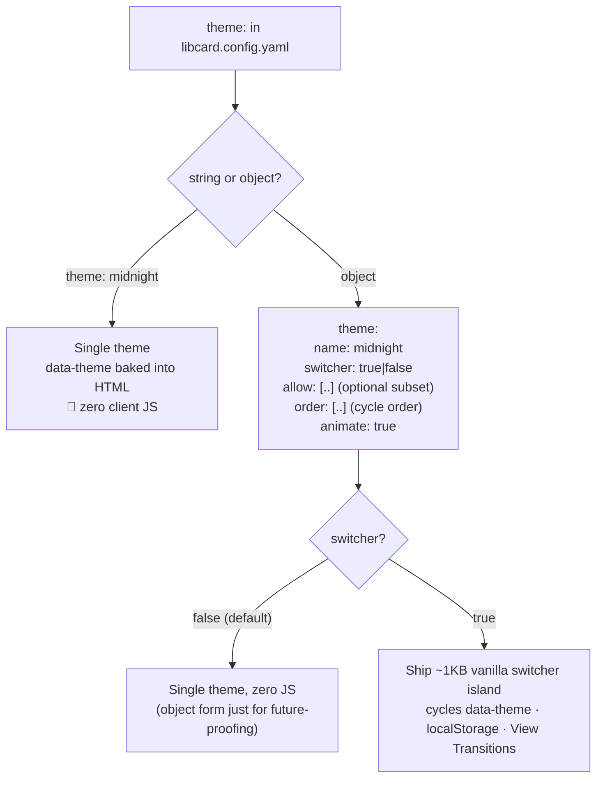
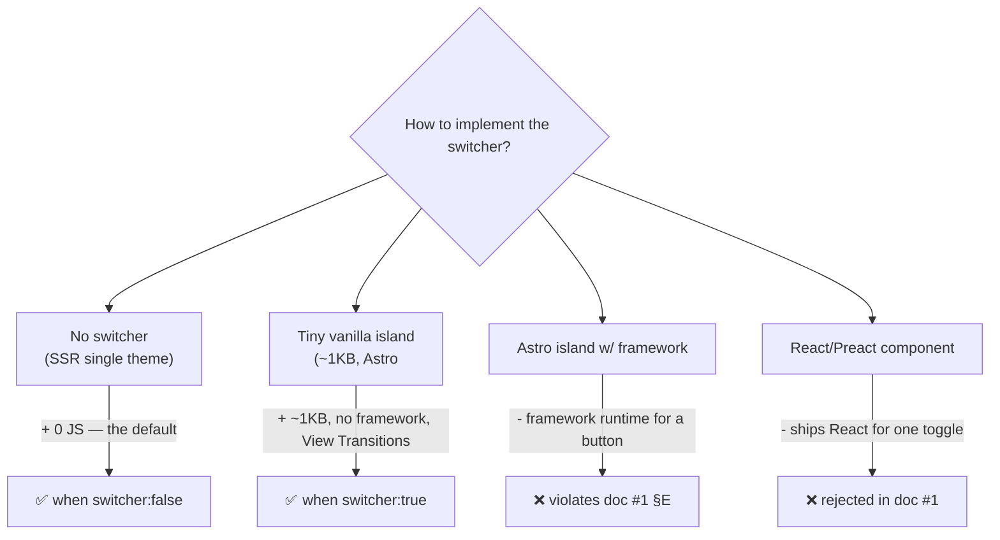
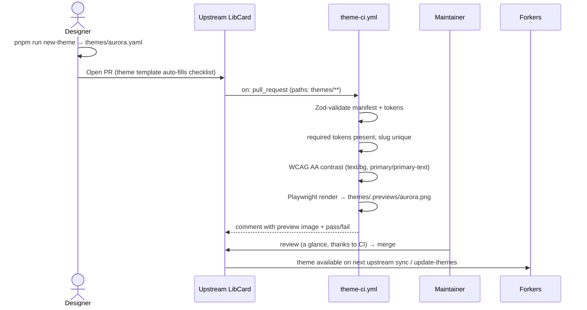
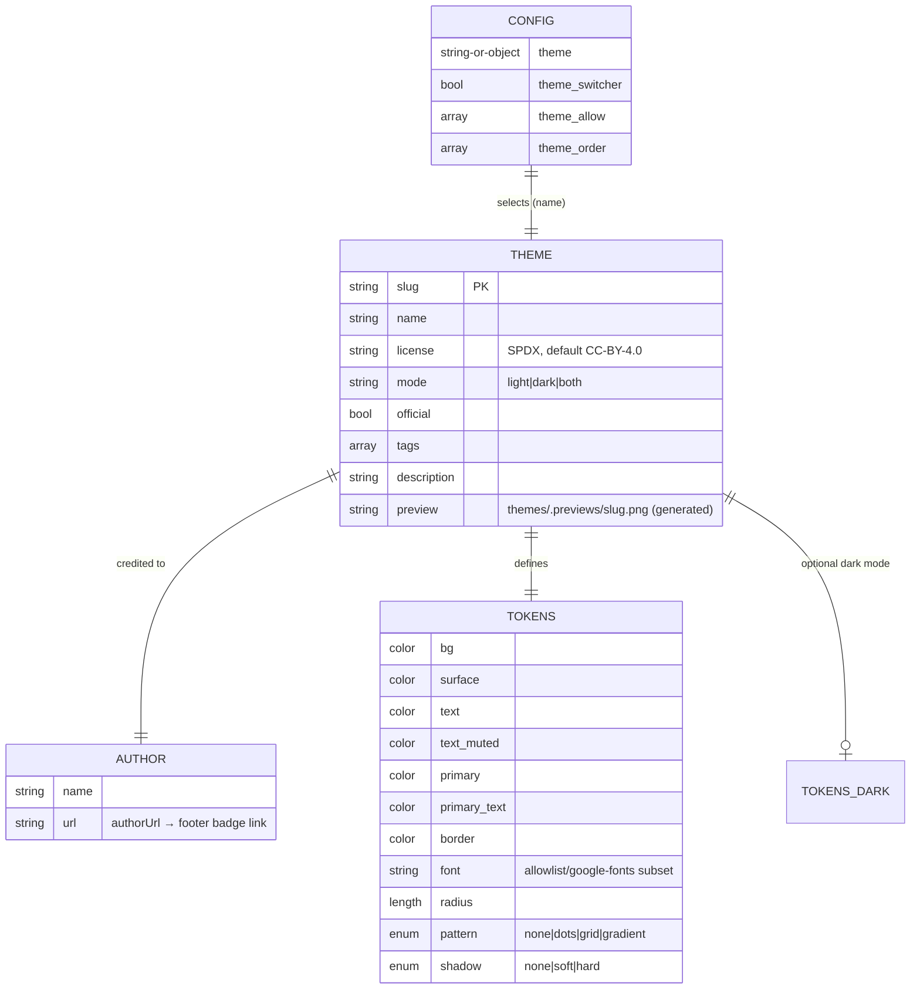
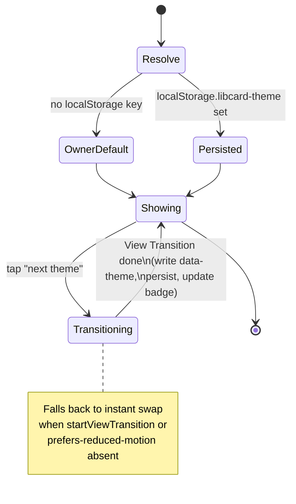

# LibCard — Theme Marketplace, Live Theme Switching & Author Attribution

> **Status:** Exploration #2. Builds directly on
> [`0001_[_]_LIBCARD_ARCHITECTURE_AND_MVP.md`](./0001_[_]_LIBCARD_ARCHITECTURE_AND_MVP.md),
> which already commits the project to **Astro (static) + Tailwind v4**, a single
> root **`libcard.config.yaml`** (Zod-validated, JSON-Schema-backed), a `theme:`
> config key, a `src/themes/` directory of per-theme token overrides, and a
> **zero-runtime-JS** default. This doc designs the **theme system** that those
> hooks were left open for: a free community theme gallery, built-in themes, an
> optional live theme switcher/cycler, and author attribution in the footer.

## Problem Statement

LibCard should let people make their card *theirs* without writing code, and let
designers contribute themes that everyone can use — for free, with credit. We
want four things, cleanly:

1. **A community theme gallery ("marketplace", but free).** Anyone can submit a
   theme by opening a **pull request** that adds it to the repo. We host the
   themes; contributors get credit; no payment, no external service.
2. **Built-in themes** that ship in the template — a handful of distinct,
   well-designed starting styles.
3. **Easy, elegant theme cycling on the card itself** — so you can *see what your
   own profile looks like* in each theme and pick a favorite, ideally with a nice
   animated transition. This must be **optional**, toggled in
   `libcard.config.yaml`: either let visitors cycle through themes live, or just
   lock in one theme.
4. **Author attribution.** Every theme records *who made it*, and the card footer
   credits them: **"Powered by LibCard · Theme by `<author>`"**, linking to the
   author. We also need **guidelines / a README** for how to add a theme to the
   gallery.

The design constraints inherited from exploration #1 are non-negotiable and
shape everything here:

- **Zero runtime JS by default.** A theme switcher implies *some* client JS; it
  must therefore be strictly opt-in, and absent entirely when a single theme is
  chosen.
- **Config edited by humans *and* AI agents.** The theme settings must extend the
  existing YAML + Zod + JSON-Schema model, not bolt on a second system.
- **Static, forkable, no backend.** The "marketplace" is just a folder of files
  in a GitHub repo, reviewed via PR. No database, no API.
- **Security.** Community PRs run on everyone's forked, GitHub-Pages-hosted page.
  A theme must not be an arbitrary-CSS/JS injection vector.

## Executive Summary

**Recommended model: themes are _data, not code_ — a small, validated set of
design tokens in a single YAML file per theme — and the "marketplace" is a flat
top-level `themes/` folder you contribute to by PR.**



The shape of the recommendation:

1. **A theme = one YAML file** in a flat top-level **`themes/`** directory (e.g.
   `themes/midnight.yaml`). It carries **metadata** (`name`, `author`,
   `authorUrl`, `license`, `description`, `tags`, `mode`) and a **token map**
   (`colors`, `radius`, `font`, a few safe effects). No raw CSS, no JS — this is
   the single most important design decision, for both **security** and
   **validatability**. This mirrors the daisyUI theme model (a small, enumerable
   token contract) expressed in the project's existing YAML+Zod idiom.
2. **Built-in vs. community is just a manifest flag** (`official: true` / an
   `author` of `LibCard`), not a separate mechanism. All themes live side by side
   in `themes/`. Ship **~6 built-in themes** covering light/dark/mono/vibrant.
3. **The build turns tokens into CSS.** A small loader reads every
   `themes/*.yaml`, validates it, and emits one `:root[data-theme="slug"]{…}`
   block per theme into a generated stylesheet, plus a `themes.json` registry
   consumed by the switcher, a `/themes` gallery page, and the README table.
4. **Theme selection & cycling are config-driven and progressively enhanced:**
   - `theme: midnight` (string) → **one theme, zero JS.** The `data-theme` is
     baked into the server-rendered `<html>`. Nothing ships to the client.
   - `theme: { name: midnight, switcher: true }` (object) → **opt-in live
     switcher**: a *tiny* (~1 KB) vanilla island that cycles `data-theme`,
     persists to `localStorage`, and animates the change with the **View
     Transitions API** (graceful fallback). Still no framework runtime.
5. **Attribution is first-class.** The footer renders **"Powered by LibCard ·
   Theme by `<author>`"** from the active theme's manifest, linking to
   `authorUrl`. When cycling, *the credit updates live* to the displayed theme's
   author. Community themes default to **CC-BY-4.0**, so the credit is honored by
   license, not just goodwill; LibCard core stays **MIT** and the "Powered by
   LibCard" half is on-by-default-but-removable.
6. **Governance is lightweight and automated:** a `themes/README.md` contribution
   guide, a theme-specific PR template, `CODEOWNERS` on `themes/`, and CI that
   schema-validates, contrast-checks, and auto-screenshots every submission.

**Why data-only themes win:** they are safe to accept from strangers (no CSS/JS
exfiltration or defacement on a page that runs on the contributor's *and every
forker's* domain), trivially machine-validatable (required tokens, color
formats, AA contrast), and they keep the "edit one well-documented file" promise
that defines LibCard — for *theme authors* too, not just card owners.

## Current State In The Repository

The repo is still greenfield — no source yet — but exploration #1 already nailed
down the seams this feature plugs into. Citing what exists:

- [`docs/explorations/0001_[_]_LIBCARD_ARCHITECTURE_AND_MVP.md`](./0001_[_]_LIBCARD_ARCHITECTURE_AND_MVP.md)
  establishes the decisions this doc extends:
  - **A `theme:` key already exists in the config** — currently a bare string
    (`theme: midnight`, line ~475) defaulting to `"default"` in the Zod schema
    (line ~515: `theme: z.string().default("default")`). This exploration evolves
    that key into a string-or-object union without breaking the simple case.
  - **A `src/themes/` directory is already planned** "per-theme `@theme` token
    overrides (CSS custom props)" (repo-structure block, line ~389). We refine
    *where the source of truth lives* (author-facing `themes/*.yaml` at the root)
    and how it's consumed.
  - **Theming is already token-based.** §E commits to **Tailwind v4 `@theme`
    tokens / CSS custom properties** with "3–4 starter themes" and explicitly
    *rejects* React UI kits to preserve zero-JS. Our token map and
    `[data-theme]` override blocks are the concrete realization of that plan.
  - **The footer is already a named surface** (`SocialRow`/footer in the
    component list, line ~382–387) — the natural home for the attribution badge.
  - **Config is YAML + Zod + generated JSON Schema** (`src/content.config.ts`,
    `libcard.schema.json`, the `# yaml-language-server: $schema=` directive). The
    **theme manifest reuses this exact toolchain** — a second Zod schema, a
    second generated JSON Schema for `themes/*.yaml`.
  - **The "one interactive moment" guidance** (§E, lines ~329–334): reach for "a
    *single tiny island*… surgically, not by adopting a whole React UI kit." The
    theme switcher is exactly that island, and it is opt-in.
- [`AGENTS.md`](../../AGENTS.md) — Conventional Commits with a `feat` type for "a
  new… **theme**" explicitly called out (line ~24), and pnpm conventions. New
  scripts here (`pnpm run new-theme`) follow the `pnpm run <script>` rule.
- [`README.md`](../../README.md) — the quick-start must gain a "pick or cycle a
  theme" line and a pointer to the gallery once this lands (AGENTS.md: "Keep the
  README quick-start in sync").
- [`.gitignore`](../../.gitignore) — already ignores `dist/`; the
  CI-generated theme screenshots need a decision (commit to `themes/.previews/`
  vs. build as artifacts — see Options §F).

There is **no `themes/` directory, no theme schema, and no switcher yet** — all
clean-slate. The only thing to *not* break is the bare-string `theme:` form.

## External Research

Full findings (with URLs) are summarized below; the closest analogs are
**daisyUI** (theme-as-token-set), **Obsidian community themes** (PR-based
registry + manifest + attribution), and **Hugo** (`theme.toml` metadata +
fixed-path screenshots).

### Theme-as-token-set (the model to copy): daisyUI

- A daisyUI theme is a **small, fully enumerable set of semantic tokens** —
  ~20 `--color-*` (base-100/200/300 + `-content`, primary/secondary/accent/
  neutral, info/success/warning/error, each with a `-content` pair) plus a few
  shape tokens (`--radius-*`, `--border`, `--depth`). Applied via a cascading
  **`data-theme`** attribute that can be nested per subtree.
  (<https://daisyui.com/docs/themes/>)
- **35 built-in themes** ship in-repo as token sets and are toggled on in config
  (`@plugin "daisyui" { themes: light --default, dark --prefersdark; }`).
  (<https://github.com/saadeghi/daisyui/tree/master/packages/daisyui/src/themes>)
- daisyUI ships a first-party **theme generator** that emits paste-ready token
  blocks — a direct model for our `pnpm run new-theme`.
  (<https://daisyui.com/theme-generator/>)

### Tailwind v4 multi-theme mechanics (how we generate CSS)

- `@theme { --color-…: … }` both defines a variable **and mints utilities**
  (`bg-*`, `text-*`). Critically, **`@theme` cannot be nested**, so alternate
  themes are *not* defined inside it. The sanctioned pattern: declare the token
  namespace **once** in `@theme` to generate utilities, then **override the same
  variables per theme in scoped selectors** — exactly
  `[data-theme="x"] { --color-…: … }`. Switching = one attribute write on
  `<html>`. (<https://tailwindcss.com/docs/theme>,
  <https://tailwindcss.com/docs/dark-mode>)
- Manual dark mode via `@custom-variant dark (&:where([data-theme=dark], [data-theme=dark] *))`.
- **No-flash pattern:** an inline `<head>` script sets
  `document.documentElement.dataset.theme` from `localStorage` *before paint*.
  Three-way: explicit light / explicit dark / remove key → follow OS.

### Live preview polish: View Transitions API

- Wrap the `data-theme` change in `document.startViewTransition()` and animate a
  `clip-path` circular reveal on `::view-transition-new(root)` (with
  `prefers-reduced-motion` + no-support fallbacks). Working reference:
  <https://akashhamirwasia.com/blog/full-page-theme-toggle-animation-with-view-transitions-api/>
  (demo <https://theme-toggle.rdsx.dev/>). Astro also has first-class
  `<ClientRouter />` view transitions if we ever go multi-page.

### PR-based community registries (the contribution model)

| Project | What a theme *is* | Submit by | Metadata | Notes for us |
|---|---|---|---|---|
| **Obsidian** | a repo with `theme.css` + `manifest.json` | (historically) **PR** appending to `community-css-themes.json`; bot-validated | `name`, `version`, `author`, `authorUrl`, `minAppVersion`; registry entry adds `repo`, `screenshot`, `modes` | **Closest PR analog.** Minimal central registry + rich per-theme manifest + screenshot by path. *Caveat: migrated off PRs to a hosted form at ~850 themes — pure-PR registries hit a moderation cliff at scale.* |
| **Hugo** | a repo with `theme.toml` + `images/screenshot.png` (1500×1000) | register as a Hugo Module / issue | `name`, `license`, `licenselink`, `description`, `tags`, `features`, `[author]`, `[original]` (port credit) | Fixed-path screenshots; SPDX license; explicit **port/derivation credit** block. |
| **Typora** | **a single CSS file** | **PR** a `.css` + thumbnail + a post with author front-matter | author in front-matter; forks filed under `/_posts/fork` linking the original | Purest "PR a file" model; explicit fork-attribution convention. |
| **VS Code** | `.vsix` w/ `contributes.themes[]` | self-service `vsce publish` (no review) | `label`, `uiTheme` (light/dark/hc), `publisher`, `license`, `repository` | Scales, but weak curation/attribution gate. |
| **shadcn/ui** | `registry-item.json`, `type: registry:theme` | registry JSON | `cssVars: { theme, light, dark }` — token sets split by mode | Best **machine-readable "theme = token set"** schema; tweakcn is the visual generator. |

**Takeaways:** keep a *minimal registry* and push rich metadata into each theme
file; reference screenshots by fixed path; a single self-contained file per
theme is the most contributor-friendly unit (Typora); and **plan CI automation
early** so PR review stays cheap (the Obsidian scale lesson). LibCard's twist:
because each user *forks* the template, the canonical `themes/` gallery lives in
the **upstream** repo, and forks vendor a snapshot (see Risks: staying current).

### Attribution & licensing norms

- **Footer "Powered by X" badge** is the established pattern — e.g. Ghost's
  Casper hard-codes `<div class="gh-powered-by">` in `default.hbs` (MIT, so
  technically removable; a *default credit*, not license-enforced).
  (<https://github.com/TryGhost/Casper/blob/main/default.hbs>)
- **License choice decides strictness.** **MIT** → the badge is goodwill
  (removable; React Flow's `hideAttribution` precedent —
  <https://github.com/xyflow/xyflow/discussions/2961>). **CC-BY-4.0** →
  attribution is a *license condition* ("You must give appropriate credit" —
  <https://creativecommons.org/licenses/by/4.0/>). **CC0** → no attribution.
  Use **SPDX identifiers** (`MIT`, `CC-BY-4.0`, `CC0-1.0`) in the manifest.
  (<https://spdx.org/licenses/>)
- **All Contributors** spec credits non-code work with a 🎨 `design` type — a
  way to surface theme authors on the repo's contributor list too.
  (<https://allcontributors.org/reference/emoji-key/>)

### CI governance for theme PRs

- **Schema-validate** manifests with `ajv-cli` / a JSON-schema action on
  `pull_request`.
- **Contrast / a11y:** token-level checks with `color-contrast-checker`
  (BBC, <https://github.com/bbc/color-contrast-checker>) at WCAG AA (4.5:1 normal,
  3:1 large — <https://www.w3.org/WAI/WCAG21/Understanding/contrast-minimum.html>),
  or full-page via `pa11y-ci` + axe (CivicActions gates merges this way).
- **Per-theme screenshots in CI:** loop Playwright `page.screenshot()` over
  `?theme=x` and commit back (`stefanzweifel/git-auto-commit-action`) or post to
  the PR (commit the PNG + link raw URL — GitHub's API rejects direct image
  uploads in comments).
- **`CODEOWNERS`** (`/themes/ @maintainer`) + **`actions/labeler`** path labels +
  a **theme PR template**.

## Key Findings

1. **The `theme:` key and `src/themes/` directory from exploration #1 are exactly
   the right hooks** — this feature is an *expansion* of an already-chosen design,
   not a new subsystem. The token-based, Tailwind-v4, zero-JS direction was
   already set in §E of doc #1.
2. **Themes should be data, not code.** A token-map-in-YAML theme is (a) safe to
   accept from anyone, (b) machine-validatable (required tokens, color formats,
   AA contrast), and (c) consistent with LibCard's "edit one documented YAML
   file" identity. Raw-CSS themes are a defacement/exfiltration vector on a page
   that runs on every forker's domain — not acceptable for unvetted PRs.
3. **The Tailwind-v4 sanctioned multi-theme pattern maps 1:1 to our model:** one
   `@theme` base to mint utilities, and each theme as a generated
   `[data-theme="slug"]{…}` override block. We generate those blocks from the
   YAML at build time — authors never touch CSS.
4. **Cycling must be opt-in to preserve the zero-JS promise.** String form →
   server-rendered single theme, no JS. Object form with `switcher: true` → a
   *single tiny vanilla island*, never a framework. This is the surgical-island
   guidance from doc #1 §E, realized.
5. **Attribution falls out of the manifest for free**, and gets *better* with
   cycling: the footer badge re-renders the active theme's author as you switch.
   Pick **CC-BY-4.0** as the community-theme default so the credit is a license
   term, not just etiquette.
6. **The marketplace is upstream; forks get a snapshot.** Because adoption is
   "Use this template," the canonical gallery is the upstream repo. New themes
   reach existing users only when they re-sync — so we need a lightweight
   `pnpm run update-themes` / documented merge path (Risks).
7. **CI automation is the moderation budget.** Obsidian's PR registry worked until
   ~850 themes. LibCard's per-user-fork model means the *upstream* gallery is the
   only PR funnel; strong CI (validate + contrast + auto-screenshot) keeps review
   to a glance and defers any scale cliff.

## Options And Tradeoffs

### A. What *is* a theme? (the core decision)



| Option | Safe from strangers? | Validatable | Author DX | Expressive range | Verdict |
|---|---|---|---|---|---|
| **YAML token map** | ✅ (no CSS/JS) | ✅ Zod + AA contrast | ★★★ one documented file | Colors, radius, font, safe effects — covers ~95% | **Recommended** |
| Raw `.css` file | ❌ `url()` exfiltration, `position:fixed` overlays, defacement | ✖ hard | ★★ (designers like CSS) | Unlimited | No for community; OK only for vetted built-ins |
| Folder (css+yaml+png) | ❌ (CSS) | partial | ★ 3 files | Unlimited | No |
| TS object | ✅-ish | ✅ types | ★ code review per PR | High | Wrong audience |

**Recommendation: YAML token map.** The escape hatch for power: a *curated*
expressive surface (gradient backgrounds from two tokens, a `pattern` enum, a
`font` from an allowlist/Google-Fonts subset) — never free-form CSS. Built-in
("official") themes *may* additionally reference a vetted CSS snippet in `src/`
if one ever needs something the token set can't express, but community themes are
**data-only, full stop**.

### B. Where do themes live, and how are they contributed?

| Option | Mechanism | Pros | Cons | Verdict |
|---|---|---|---|---|
| **In-repo `themes/` + PR** | flat `themes/*.yaml` in upstream; PR to add | Dead simple; one review surface; matches "fork the template" ethos; full git attribution | Forks must re-sync to get new themes; upstream is the only funnel | **Recommended** |
| External repos + central registry (Obsidian/Hugo) | `themes.json` points at others' repos | Decentralized; scales | Needs fetch/build-time resolution or vendoring; heavier; off-brand for a static fork | No (overkill) |
| npm packages (`libcard-theme-*`) | publish to npm | Versioned; semver | A build dependency per theme; designers must publish to npm | No |

**Recommendation: in-repo flat `themes/` folder, contributed by PR.** It is the
most legible "marketplace" for a static, forkable project — the gallery *is* a
directory listing. Built-in and community themes coexist there, distinguished by
a manifest flag, not a folder split (avoids "is mono official?" bikeshedding).

### C. Theme selection & cycling config shape

The `theme:` key accepts **string** (simple) or **object** (powerful) — a
backward-compatible union over doc #1's bare string.



| Sub-option | Choice | Why |
|---|---|---|
| Switcher default | **off** | Preserves zero-JS-by-default; cycling is a deliberate opt-in. |
| Switcher UI | **cycle button** + optional **dropdown/grid** | A single "shuffle/next theme" tap is the elegant default the user described; a grid is a power option. |
| Which themes cycle | `allow:` subset, default = **all** | Owner curates "show these 4" or lets visitors see everything. |
| Who sees it | **visitor-facing** when `switcher: true`; **owner preview** always available in `pnpm dev` | "Test what *your* profile looks like" is served both at setup time and (optionally) live. |
| Persistence | `localStorage` | Returning visitor keeps their pick; owner's `name:` is the default. |
| Animation | **View Transitions** clip reveal, reduced-motion safe | The "really nice, clean, elegant" ask. |

**Recommendation:** the union above. Note an important subtlety — **the owner's
chosen `name:` is always the server-rendered default** (so first paint and
no-JS/no-localStorage visitors see the owner's pick), and the switcher only
*re-themes on interaction*. This keeps SEO/OG/first-paint deterministic.

### D. Switcher implementation



**Recommendation: vanilla `<script>` island, loaded only when `switcher: true`.**
It (1) reads `localStorage.libcard-theme`, (2) writes `data-theme` on `<html>`,
(3) on tap advances to the next theme in `order`/`allow`, (4) wraps the change in
`document.startViewTransition?.()`, (5) updates the footer "Theme by" badge from
the embedded `themes.json`. A matching **no-flash inline head snippet** restores
the persisted choice before paint. No framework, consistent with doc #1 §E's
explicit rejection of React UI kits.

### E. Attribution & licensing

| Decision | Recommendation | Rationale |
|---|---|---|
| Core license | **MIT** | Matches OSS norm; "Powered by LibCard" is goodwill, default-on, `footer.poweredBy: false` to remove. |
| Community theme license | **CC-BY-4.0** default (manifest can override to MIT/CC0) | Makes "Theme by X" a *license condition*, not just etiquette — the strongest free way to guarantee credit. |
| Badge content | **"Powered by LibCard · Theme by `<author>`"** | The user's exact spec; `author` + `authorUrl` from the active theme manifest. |
| Cycling behavior | Badge **updates to the displayed theme's author** | Honest credit while previewing; the author whose theme you're *looking at* is the one credited. |
| Repo-level credit | Optional **All Contributors** 🎨 `design` | Surfaces theme authors on the contributor list too. |

### F. Screenshots (gallery + PR preview)

| Option | Pros | Cons | Verdict |
|---|---|---|---|
| **CI-generated, committed to `themes/.previews/<slug>.png`** | Gallery + README + PR all reuse them; deterministic | Binary churn in git; bot commits | **Recommended** (gitignore-exempt path) |
| CI artifact only (not committed) | No binary churn | Gallery page can't embed them without a build step fetch | Fallback |
| Author-supplied screenshot | No CI cost | Inconsistent framing; can misrepresent | No (auto-render is fairer + uniform) |

**Recommendation:** Playwright renders each theme against a **fixed sample
profile** at a fixed viewport in CI and commits PNGs to `themes/.previews/`. The
PR comment embeds the new theme's preview; the `/themes` gallery and README table
read the same files. Uniform framing = fair comparison.

## Recommendation

Adopt a **data-only theme system** with these concrete pieces:

1. **`themes/<slug>.yaml`** — the unit of contribution. Metadata + token map,
   validated by a dedicated Zod schema with a generated
   **`themes/theme.schema.json`** (same toolchain as `libcard.schema.json`).
2. **Build-time generation** (`src/lib/themes.ts` + a small Astro integration or
   prebuild step): scan `themes/*.yaml` → validate → emit `src/styles/themes.gen.css`
   (one `[data-theme="slug"]{…}` block each) + `src/data/themes.json` (registry
   for switcher/gallery/README).
3. **Config union** in `libcard.config.yaml`: `theme:` is `string |
   { name, switcher?, allow?, order?, animate? }`. Default switcher **off**.
4. **`ThemeSwitcher.astro`** — a vanilla island shipped only when `switcher:true`;
   **`Footer.astro`** renders the attribution badge from the active manifest.
5. **~6 built-in themes** (`default` light, `midnight` dark, `mono`,
   `sunset`/vibrant, `paper`/warm-light, `terminal`/green-on-black) authored by
   "LibCard" to seed the gallery and exercise the token contract.
6. **Governance:** `themes/README.md` (the contribution guide), a theme PR
   template, `CODEOWNERS` for `themes/`, `pnpm run new-theme` scaffolder, and a
   **theme-CI workflow** (validate → contrast → screenshot → comment).
7. **A `/themes` gallery page** on the live site (and a generated README table)
   so the marketplace is browsable.

### Proposed structure (additions to doc #1's layout)

```
LIBCard/
├── libcard.config.yaml            # theme: string | { name, switcher, allow, order, animate }
├── themes/                        # 👈 the marketplace — PR here
│   ├── README.md                  # how to add a theme (the contribution guide)
│   ├── theme.schema.json          # generated; powers editor autocomplete for themes/*.yaml
│   ├── default.yaml               # built-in (author: LibCard, official: true)
│   ├── midnight.yaml
│   ├── mono.yaml
│   ├── sunset.yaml
│   ├── community-example.yaml     # a sample community theme to copy
│   └── .previews/                 # CI-generated screenshots (one PNG per theme)
├── scripts/
│   ├── new-theme.mjs              # `pnpm run new-theme` scaffolder/generator
│   └── gen-themes.mjs             # validate + emit themes.gen.css + themes.json + README table
├── src/
│   ├── lib/themes.ts              # load/validate themes, token→CSS, active-theme resolution
│   ├── data/themes.json           # generated registry (embedded for the switcher)
│   ├── styles/themes.gen.css      # generated [data-theme] blocks
│   ├── components/
│   │   ├── ThemeSwitcher.astro    # opt-in vanilla island (~1KB)
│   │   └── Footer.astro           # "Powered by LibCard · Theme by X" badge
│   └── pages/
│       └── themes.astro           # /themes gallery (screenshots + authors + tags)
├── .github/
│   ├── workflows/theme-ci.yml     # validate + contrast + screenshot on theme PRs
│   ├── PULL_REQUEST_TEMPLATE/theme.md
│   └── CODEOWNERS                 # /themes/ @maintainer
└── docs/explorations/0002_…md
```

### Build-time theme resolution

```mermaid
sequenceDiagram
    participant FS as themes/*.yaml
    participant Gen as gen-themes (prebuild)
    participant Zod as Zod theme schema
    participant CSS as themes.gen.css
    participant Reg as themes.json
    participant Astro as astro build
    participant HTML as dist/index.html

    Gen->>FS: read every theme file
    loop each theme
        Gen->>Zod: validate metadata + tokens
        Zod-->>Gen: ok / fail build w/ message
        Gen->>CSS: emit :root[data-theme="slug"]{ --bg: …; … }
        Gen->>Reg: append { slug, name, author, authorUrl, license, mode, tags }
    end
    Astro->>Reg: read active theme (config.theme.name)
    Astro->>HTML: <html data-theme="midnight"> (baked default)
    Astro->>HTML: footer badge from active manifest
    alt switcher: true
        Astro->>HTML: inline no-flash script + ThemeSwitcher island + embed themes.json
    else single theme
        Astro->>HTML: (nothing — zero client JS)
    end
```

### Community submission flow



### Theme manifest (entity view)



### Switcher runtime states



## Example Code

> Illustrative, not final.

**A community theme — `themes/sunset.yaml`** (the one file a designer writes):

```yaml
# yaml-language-server: $schema=./theme.schema.json
name: Sunset
slug: sunset            # optional; defaults to the filename
author: Ada Lovelace
authorUrl: https://ada.example
license: CC-BY-4.0      # SPDX; community default
mode: dark              # light | dark | both
tags: [warm, vibrant, gradient]
description: Dusk-to-dawn gradients with a warm coral accent.

tokens:
  bg:           "#1a1020"
  surface:      "#2a1830"
  surface-hover:"#3a2240"
  text:         "#fdf2f8"
  text-muted:   "#d8b4cf"
  primary:      "#ff7a59"
  primary-text: "#1a1020"
  border:       "#43304d"
  font:         Inter            # from the curated allowlist
  radius:       16px
  pattern:      gradient         # none | dots | grid | gradient
  shadow:       soft             # none | soft | hard

# Optional: if mode is `both`, supply a light override map
# tokensLight: { bg: "#fff7ed", … }
```

**`src/lib/themes.ts`** — Zod schema + token→CSS (no raw CSS from authors):

```ts
import { z } from "astro:content";

const HEX = /^#(?:[0-9a-fA-F]{3}|[0-9a-fA-F]{6})$/;
const color = z.string().regex(HEX, "use a hex color like #1a1020");
const FONT_ALLOWLIST = ["Inter", "System", "Mono", "Lora", "Space Grotesk"] as const;

export const tokens = z.object({
  bg: color, surface: color, "surface-hover": color.optional(),
  text: color, "text-muted": color.optional(),
  primary: color, "primary-text": color,
  border: color.optional(),
  font: z.enum(FONT_ALLOWLIST).default("System"),
  radius: z.string().regex(/^\d+(px|rem)$/).default("12px"),
  pattern: z.enum(["none", "dots", "grid", "gradient"]).default("none"),
  shadow: z.enum(["none", "soft", "hard"]).default("soft"),
});

export const themeSchema = z.object({
  name: z.string(),
  slug: z.string().regex(/^[a-z0-9-]+$/).optional(),
  author: z.string(),
  authorUrl: z.string().url().optional(),
  license: z.string().default("CC-BY-4.0"),       // SPDX id
  official: z.boolean().default(false),
  mode: z.enum(["light", "dark", "both"]).default("light"),
  tags: z.array(z.string()).default([]),
  description: z.string().optional(),
  tokens: tokens,
  tokensLight: tokens.partial().optional(),
});

export type Theme = z.infer<typeof themeSchema>;

/** Render one validated theme to a scoped CSS block — the only place CSS is produced. */
export function themeToCss(slug: string, t: Theme): string {
  const vars = Object.entries(t.tokens)
    .map(([k, v]) => `  --${k}: ${cssValue(k, v)};`)
    .join("\n");
  return `:root[data-theme="${slug}"] {\n${vars}\n}`;
}
```

**`scripts/gen-themes.mjs`** — prebuild step (run before `astro build`):

```js
// reads themes/*.yaml → validates → writes generated CSS + registry + README table
import { readdirSync, readFileSync, writeFileSync } from "node:fs";
import { parse } from "yaml";
import { themeSchema, themeToCss } from "../src/lib/themes.ts";

const files = readdirSync("themes").filter((f) => f.endsWith(".yaml") && !f.startsWith("theme.schema"));
const registry = [];
let css = "/* GENERATED — edit themes/*.yaml, not this file */\n";

for (const file of files) {
  const slug = file.replace(/\.yaml$/, "");
  const data = themeSchema.parse(parse(readFileSync(`themes/${file}`, "utf8"))); // fails build on bad theme
  css += themeToCss(slug, data) + "\n";
  registry.push({ slug, name: data.name, author: data.author, authorUrl: data.authorUrl,
                  license: data.license, mode: data.mode, official: data.official, tags: data.tags });
}
writeFileSync("src/styles/themes.gen.css", css);
writeFileSync("src/data/themes.json", JSON.stringify(registry, null, 2));
```

**`libcard.config.yaml`** — opt-in cycling (string form still works):

```yaml
# Simple: one theme, zero client JS
# theme: midnight

# Powerful: let visitors cycle through a curated set, animated
theme:
  name: midnight          # the owner's default (server-rendered, SEO/OG-safe)
  switcher: true          # ship the tiny switcher island
  allow: [midnight, sunset, mono, paper]   # optional; default = all themes
  animate: true           # View Transitions clip-reveal

footer:
  poweredBy: true         # "Powered by LibCard" (MIT — may be turned off)
```

**`src/components/ThemeSwitcher.astro`** — the entire client surface (~1 KB):

```astro
---
import themes from "../data/themes.json";
const { allow, order } = Astro.props;          // resolved from config
const list = (allow ?? themes.map(t => t.slug));
---
<button id="lc-theme-next" aria-label="Try another theme">🎨 Theme</button>
<script is:inline define:vars={{ list, themes }}>
  const KEY = "libcard-theme";
  const el = document.documentElement;
  const badge = () => document.getElementById("lc-theme-by");
  const apply = (slug) => {
    const swap = () => {
      el.dataset.theme = slug;
      localStorage.setItem(KEY, slug);
      const t = themes.find((x) => x.slug === slug);
      if (badge() && t) badge().innerHTML =
        `Theme by <a href="${t.authorUrl ?? "#"}">${t.author}</a>`;
    };
    document.startViewTransition?.bind(document)?.(swap) ?? swap();
  };
  document.getElementById("lc-theme-next").addEventListener("click", () => {
    const cur = el.dataset.theme;
    apply(list[(list.indexOf(cur) + 1) % list.length]);
  });
</script>
```

**No-flash head snippet** (only when `switcher: true`):

```html
<script is:inline>
  const s = localStorage.getItem("libcard-theme");
  if (s) document.documentElement.dataset.theme = s;
</script>
```

**`src/styles/global.css`** — base `@theme` mints utilities; tokens resolve per theme:

```css
@import "tailwindcss";
@import "./themes.gen.css";          /* generated [data-theme] blocks */

@theme {                              /* declared once → generates bg-*/text-* utilities */
  --color-bg: var(--bg);
  --color-surface: var(--surface);
  --color-text: var(--text);
  --color-primary: var(--primary);
  --radius-card: var(--radius);
}
/* :root[data-theme="…"] blocks (generated) override --bg/--surface/… per theme */
```

**`.github/PULL_REQUEST_TEMPLATE/theme.md`** (excerpt):

```markdown
## New theme: <!-- name -->
- [ ] One file added under `themes/<slug>.yaml` (no other files)
- [ ] `author` and `authorUrl` filled in (you'll be credited in the footer)
- [ ] `license` chosen (default `CC-BY-4.0`)
- [ ] Ran `pnpm run new-theme` / validated locally (`pnpm run gen-themes`)
- [ ] I confirm this theme is my own work (or properly credited via `tags`/description)

CI will post a screenshot preview below. ✨
```

**`.github/workflows/theme-ci.yml`** (sketch):

```yaml
name: Theme CI
on: { pull_request: { paths: ["themes/**"] } }
jobs:
  validate:
    runs-on: ubuntu-latest
    steps:
      - uses: actions/checkout@v4
      - uses: pnpm/action-setup@v4
      - run: pnpm install
      - run: pnpm run gen-themes              # Zod validate → fails on bad theme
      - run: pnpm run check-contrast          # WCAG AA on text/bg + primary/primary-text
      - run: pnpm run shoot-themes --changed  # Playwright screenshot → themes/.previews
      - uses: thollander/actions-comment-pull-request@v3
        with: { message: "Preview rendered — see `themes/.previews/`." }
```

## Risks And Open Questions

- **Staying current after fork (the key UX gap).** Because users *fork the
  template*, new community themes merged upstream don't reach them automatically.
  Options: (a) document a `git pull upstream main -- themes/` flow; (b) ship
  **`pnpm run update-themes`** that fetches the latest `themes/` from upstream via
  the GitHub API and drops them in; (c) a build-time *optional* fetch of the
  upstream registry (adds a network dependency to builds — probably no). **Lean
  (b)** — explicit, offline-friendly, no build coupling.
- **Token contract scope.** Too few tokens → themes look samey; too many →
  validation surface explodes and authors get overwhelmed. Need to **freeze a v1
  token set** (the ~10 above) and version it; adding tokens later must keep old
  themes valid (all new tokens default).
- **Fonts.** A `font` allowlist keeps it safe but limits expression; allowing
  arbitrary Google Fonts means build-time font fetching + a privacy/FOUT story.
  MVP: small curated allowlist (system + 3–4 self-hosted faces); revisit.
- **Expressive ceiling vs. safety.** Designers *will* want gradients, background
  images, custom button shapes. We deliberately cap community themes at the safe
  token surface (`pattern` enum, two-color gradient from existing tokens). Is the
  ceiling high enough to attract good submissions? Open — watch early PRs.
- **Switcher + OG/SEO.** First paint and crawlers see the owner's `name:` theme
  (good). But a visitor who cycles and shares the URL shares *their* view's
  theme? No — the URL has no theme param by default. Decide whether to support
  `?theme=` deep links (nice for "look at this in sunset") vs. keeping it
  localStorage-only (simpler). MVP: localStorage-only.
- **Contrast checks can reject legitimately artsy themes.** A `terminal` green
  theme might fail AA on muted text. Need a **per-theme `a11yWaiver` with
  justification** reviewed by a human, or AA enforced only on the primary
  text/bg pair. Lean: enforce AA on `text`/`bg` and `primary-text`/`primary`
  only; warn (not block) on the rest.
- **Screenshot churn in git.** Committing PNGs to `themes/.previews/` bloats
  history over time. Mitigate with a `.previews/` path, modest dimensions, and
  possibly `git lfs` later if it grows.
- **Moderation at scale (the Obsidian cliff).** Fine at dozens of themes; if it
  takes off, the single upstream PR funnel needs more reviewers or a hosted
  intake. CI automation buys a lot of runway; note it and move on.
- **Attribution removal.** `footer.poweredBy: false` removes the LibCard half
  (MIT-legitimate). Should owners be able to remove "Theme by X"? **No** for
  CC-BY themes (license condition); for MIT/CC0 themes it's their call. The
  footer component must read the theme license to decide whether the credit is
  removable.
- **Naming collisions.** Two PRs both add `themes/sunset.yaml`. CI enforces slug
  uniqueness; the PR template asks for a distinct slug. Define a tiebreak (first
  merged wins; later one renames).
- **`mode: both` complexity.** Dual light/dark token maps double the validation
  and the switcher logic (does cycling also flip OS mode?). MVP: support
  single-mode themes well; treat `both` as a fast-follow.

## Implementation Checklist

**Schema & loader**
- [x] Add `src/lib/themes.ts` — Zod `themeSchema` + `tokens` + `themeToCss()`
      (the only CSS producer).
- [x] Generate `themes/theme.schema.json` from the Zod schema (reuse doc #1's
      `zod-to-json-schema` prebuild); wire `# yaml-language-server: $schema=` in
      theme files.
- [x] Freeze the **v1 token contract** (~10 tokens) and document each.
- [x] Add `scripts/gen-themes.mjs` → emits `src/styles/themes.gen.css` +
      `src/data/themes.json` + a README theme table; run it in `prebuild`.

**Config & rendering**
- [x] Evolve `theme:` in the config Zod schema to `string | { name, switcher?,
      allow?, order?, animate? }` (backward-compatible with `theme: midnight`).
- [x] Resolve the active theme in `src/lib/config.ts`; bake
      `<html data-theme="…">` server-side.
- [x] `src/styles/global.css`: `@theme` base mapping `--color-*` → token vars;
      `@import` the generated themes CSS.
- [x] `Footer.astro`: "Powered by LibCard · Theme by `<author>`" from the active
      manifest; honor `footer.poweredBy` and the theme license for removability.

**Switcher (opt-in)**
- [x] `ThemeSwitcher.astro` vanilla island; include only when `switcher: true`.
- [x] Inline no-flash head snippet restoring `localStorage.libcard-theme`.
- [x] View Transitions clip-reveal with `prefers-reduced-motion` + no-support
      fallback; live-update the footer badge on cycle.
- [x] Verify **zero JS** is emitted when `switcher` is absent/false.

**Built-in themes**
- [x] Author ~6 built-ins (`default`, `midnight`, `mono`, `sunset`, `paper`,
      `terminal`) as `themes/*.yaml` with `official: true`, `author: LibCard`.
- [x] Add `themes/community-example.yaml` as a copy-me starter.

**Gallery & generator**
- [x] `src/pages/themes.astro` — gallery grid (screenshot + name + author + tags).
- [x] `scripts/new-theme.mjs` (`pnpm run new-theme`) — interactive scaffolder
      (prompts name/author/colors → writes a valid `themes/<slug>.yaml`).

**Governance & CI**
- [x] `themes/README.md` — the contribution guide (token reference, license
      guidance, the PR steps, the screenshot note).
- [x] `.github/PULL_REQUEST_TEMPLATE/theme.md`.
- [x] `.github/CODEOWNERS` → `/themes/ @maintainer`.
- [x] `.github/workflows/theme-ci.yml` — `gen-themes` (validate) +
      `check-contrast` (AA on key pairs) + Playwright screenshot → comment.
- [x] `scripts/check-contrast.mjs` (use `color-contrast-checker`).
- [x] `scripts/shoot-themes.mjs` (Playwright, fixed sample profile + viewport →
      `themes/.previews/<slug>.png`).
- [x] `pnpm run update-themes` — fetch latest upstream `themes/` for forkers.

**Docs**
- [x] Update `README.md` quick-start: "pick a theme, or turn on cycling," link to
      `/themes` and `themes/README.md`.
- [x] Note community license default (CC-BY-4.0) and core license (MIT).

## Validation Checklist

- [ ] `theme: midnight` (string) ships a page with **zero client JS** and the
      correct baked `data-theme`.
- [ ] `theme: { name, switcher: true }` ships **only** the ~1 KB switcher island
      (no framework runtime); Lighthouse Performance ≥ 95 still holds.
- [ ] A malformed `themes/*.yaml` (bad hex, missing required token, bad font)
      **fails `pnpm run gen-themes`** with a readable message — and **fails the
      PR check**.
- [ ] No theme file can inject raw CSS/JS — confirm the generator only emits
      whitelisted `--token: value` declarations.
- [ ] Editor autocomplete/validation works in `themes/*.yaml` from
      `theme.schema.json`.
- [ ] Cycling on a real phone: tap "Theme" advances themes, persists across
      reload (localStorage), and the **footer "Theme by X" updates** to match.
- [ ] Animated transition runs via View Transitions where supported; falls back
      to an instant swap with `prefers-reduced-motion`.
- [ ] First paint / OG / crawler all see the **owner's** chosen theme, not a
      visitor's localStorage pick.
- [ ] AA contrast holds for `text`/`bg` and `primary-text`/`primary` on every
      shipped theme; the contrast script blocks a failing PR.
- [ ] Theme CI posts a screenshot preview on a sample theme PR; the PNG lands in
      `themes/.previews/` and the `/themes` gallery renders it.
- [ ] `pnpm run new-theme` produces a file that passes validation unedited.
- [ ] A theme with `license: CC-BY-4.0` cannot have its "Theme by" credit removed
      via config; an MIT/CC0 theme can.
- [ ] `pnpm run update-themes` pulls a newly-merged upstream theme into a fork
      without clobbering the owner's `libcard.config.yaml`.

## References

**Repo**
- [Exploration #1 — LibCard Architecture & MVP](./0001_[_]_LIBCARD_ARCHITECTURE_AND_MVP.md) (the `theme:` key, `src/themes/`, Tailwind v4 §E, zero-JS stance)
- [`AGENTS.md`](../../AGENTS.md) · [`README.md`](../../README.md)

**Theme-as-token-set & Tailwind v4**
- [daisyUI themes](https://daisyui.com/docs/themes/) · [daisyUI built-in themes (source)](https://github.com/saadeghi/daisyui/tree/master/packages/daisyui/src/themes) · [daisyUI theme generator](https://daisyui.com/theme-generator/)
- [Tailwind v4 — Theme](https://tailwindcss.com/docs/theme) · [Tailwind v4 — Dark mode / data-theme & no-flash](https://tailwindcss.com/docs/dark-mode)
- [shadcn registry-item.json (cssVars: theme/light/dark)](https://ui.shadcn.com/docs/registry/registry-item-json) · [shadcn theming](https://ui.shadcn.com/docs/theming)
- [Starlight CSS & theming (`data-theme` light/dark)](https://starlight.astro.build/guides/css-and-tailwind/)

**Live switching / View Transitions**
- [Full-page theme toggle with View Transitions (clip-path reveal)](https://akashhamirwasia.com/blog/full-page-theme-toggle-animation-with-view-transitions-api/) · [demo](https://theme-toggle.rdsx.dev/)
- [Astro view transitions (`<ClientRouter />`)](https://docs.astro.build/en/guides/view-transitions/)

**PR-based registries / manifests**
- [Obsidian — Submit your theme](https://docs.obsidian.md/Themes/App+themes/Submit+your+theme) · [Obsidian manifest reference](https://docs.obsidian.md/Reference/Manifest) · [community-css-themes.json](https://raw.githubusercontent.com/obsidianmd/obsidian-releases/master/community-css-themes.json)
- [Hugo — contribute a theme](https://gohugo.io/contribute/themes/) · [example `theme.toml` (author + `[original]` port credit)](https://github.com/janraasch/hugo-bearblog/blob/master/theme.toml)
- [Typora — submit a theme (single CSS file + fork-attribution convention)](https://theme.typora.io/doc/Submit-A-Theme/)
- [VS Code — theme contribution points](https://code.visualstudio.com/api/references/contribution-points)

**Attribution & licensing**
- [Ghost Casper — "Powered by Ghost" footer badge](https://github.com/TryGhost/Casper/blob/main/default.hbs)
- [React Flow — attribution badge / hideAttribution discussion](https://github.com/xyflow/xyflow/discussions/2961)
- [CC BY 4.0 (attribution is a license condition)](https://creativecommons.org/licenses/by/4.0/) · [SPDX license list](https://spdx.org/licenses/)
- [All Contributors — 🎨 design type](https://allcontributors.org/reference/emoji-key/)

**CI governance**
- [color-contrast-checker (BBC)](https://github.com/bbc/color-contrast-checker) · [WCAG AA contrast minimum](https://www.w3.org/WAI/WCAG21/Understanding/contrast-minimum.html)
- [Playwright screenshots](https://playwright.dev/docs/screenshots) · [Playwright CI](https://playwright.dev/docs/ci)
- [actions/labeler (path labels)](https://github.com/actions/labeler) · [GitHub CODEOWNERS](https://docs.github.com/en/repositories/managing-your-repositorys-settings-and-features/customizing-your-repository/about-code-owners)
