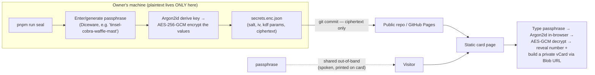
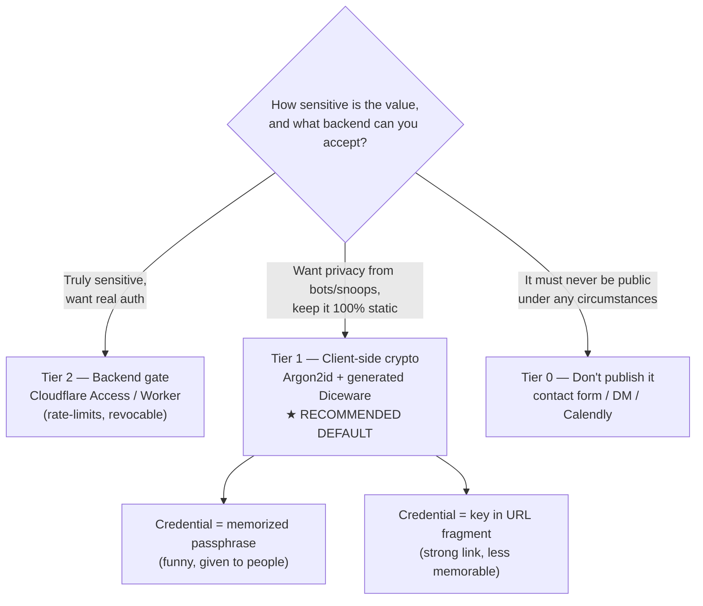
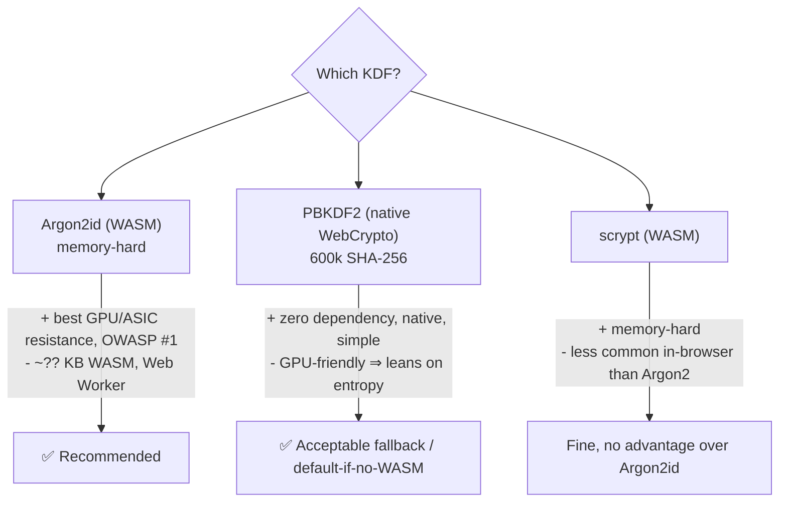
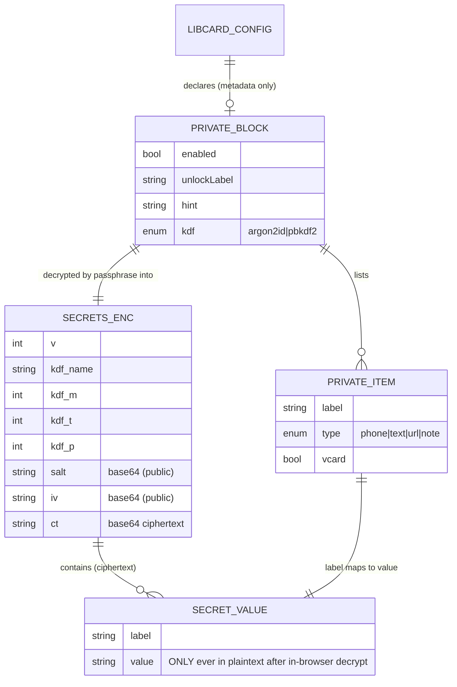
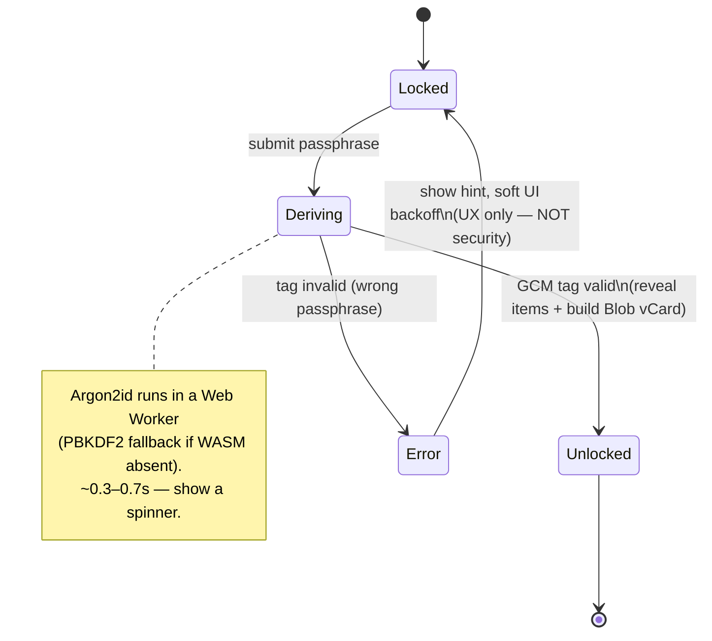

# LibCard — Password-Gated Private Content on a Static Site

> **Status:** Exploration #3. Builds on
> [`0001_[_]_LIBCARD_ARCHITECTURE_AND_MVP.md`](./0001_[_]_LIBCARD_ARCHITECTURE_AND_MVP.md)
> (Astro static + a single `libcard.config.yaml` + zero-runtime-JS-by-default) and
> reuses the **opt-in vanilla island** pattern proven in
> [`0002_[x]_THEME_MARKETPLACE_AND_LIVE_THEME_SWITCHING.md`](./0002_[x]_THEME_MARKETPLACE_AND_LIVE_THEME_SWITCHING.md).
> This doc designs an optional way to put a phone number (or any sensitive value)
> behind a memorable passphrase — and answers the hard question honestly: **can a
> static, fully-public site actually keep that secret without leaking the password
> in its own source?**

## Problem Statement

LibCard owners want to share a private value — a mobile number, a home address, a
Signal handle — with *people they choose*, without leaving it "just hanging out on
the page" for scrapers, spam bots, and the open web. The desired UX is delightful:
hand someone a **funny passphrase** ("the name of our high-school mascot"), they
type it into the card, and the phone number (and a savable contact) appears.

But LibCard's defining constraints make this genuinely hard:

- **It's a static site.** `output: "static"` in [`astro.config.mjs`](../../astro.config.mjs);
  it deploys to GitHub Pages. There is **no backend, no server runtime, no database**
  to check a password or rate-limit guesses.
- **The repo is public and open-source (MIT).** Anyone can read every file, every
  commit, and the deployed `dist/`. **Whatever ships, ships in the clear** unless it
  is encrypted before it leaves the owner's machine.
- **Today the phone number is plaintext in three public artifacts.**
  [`contact.vcf.ts`](../../src/pages/contact.vcf.ts) bakes `contact.phone` from
  [`libcard.config.yaml`](../../libcard.config.yaml) into a static `contact.vcf`;
  [`contact-qr.svg.ts`](../../src/pages/contact-qr.svg.ts) encodes the same vCard
  into a QR SVG; and the config itself is committed. So "gating the phone number"
  is not just a UI overlay — the value has to *stop being emitted in plaintext at
  all*.

The two questions that decide whether this is worth building:

1. **Can it be secure?** On a page with no server, the attacker downloads the whole
   thing. Is there *any* construction that keeps the secret from a motivated reader?
2. **Can it not leak the password in the code?** If the page can decrypt the value,
   doesn't the page contain the key?

The short answers — developed in detail below — are **"yes, conditionally"** and
**"yes, definitively."** You never ship the password; you ship only *ciphertext*.
The remaining security is a single, honest trade: **passphrase entropy × the cost
of one guess**, attacked **offline** with no rate limit. A "funny passphrase" is
exactly the wrong instinct unless it's *generated* to be both funny **and** strong.

## Executive Summary

**Recommended: client-side encryption with a memory-hard KDF (Argon2id), where the
owner seals secrets locally and only ciphertext is ever committed or deployed — and
the passphrase is a _generated_ Diceware phrase, not a human-chosen one.** Frame it
to users as three tiers, default to the middle one, and document the graduation
path to a real backend gate for anyone who needs it.



The shape of the recommendation:

1. **Encrypt, don't hide.** The page never contains the password and never contains
   the plaintext. It contains *ciphertext* plus *public* KDF parameters (salt, IV,
   iteration/memory costs). The visitor's passphrase derives the key **in their
   browser**; if they don't know it, they hold only an opaque blob. This is exactly
   how StatiCrypt, PageCrypt, and every browser-side password manager work.
2. **The whole security budget is the passphrase.** No server ⇒ no rate limiting ⇒
   the attacker brute-forces **offline** at full speed, and AES-GCM's auth tag tells
   them instantly when a guess is right. So security = `entropy(passphrase)` ×
   `cost(one KDF evaluation)`. Nothing else moves the needle.
3. **Make the passphrase carry the weight — by generating it.** A human "funny
   passphrase" is low-entropy and likely already in cracking wordlists. The elegant
   resolution: a **Diceware passphrase is funny, memorable, shareable _and_ strong**
   ("correct horse battery staple"). Ship a generator; **5+ EFF words (~65 bits)** is
   the recommended floor, 4 (~52 bits) the hard minimum, and only with Argon2id.
4. **Use a memory-hard KDF (Argon2id).** It makes each guess cost time *and* memory,
   which is what neutralizes GPU farms and lets a moderate-entropy passphrase
   survive. Native **WebCrypto PBKDF2 (600k SHA-256)** is the dependency-free
   fallback, but it's GPU-friendly, so it leans harder on passphrase strength.
5. **Plaintext must never touch git or `dist/`.** Sealing happens locally; only
   `secrets.enc.json` is committed. Gated fields are **stripped** from the public
   `contact.vcf`, `contact-qr.svg`, and `og.png`. The "private" vCard is assembled
   **in the browser after unlock** (a `Blob` download) so the number never exists as
   a static file.
6. **It's opt-in and zero-JS-by-default**, mirroring the theme switcher: a single
   small island (`PrivateSection.astro`) ships *only* when `private.enabled: true`.
7. **Be honest about the ceiling.** This raises the cost from "free scrape" to
   "expensive, probably-infeasible offline crack" — excellent against bots and
   casual snoops. It is **not** equivalent to server-side auth: you can't rate-limit,
   can't revoke per person, and a leaked/cached value is leaked forever. For anyone
   who needs real auth, document **Tier 2: Cloudflare Access** (free for ≤50 users)
   or a tiny Worker in front of the data.

**Verdict:** Yes — with Argon2id and a *generated* passphrase, password-gating on
LibCard is meaningfully secure for its real threat model (scrapers, spam
harvesters, idle curiosity) and never leaks the password in the code. Sell it as
"raise the cost," not "guarantee secrecy," and give the backend escape hatch a name.

## Current State In The Repository

LibCard is past greenfield now — the seams this feature plugs into are real files:

- **Static, no backend.** [`astro.config.mjs`](../../astro.config.mjs) sets
  `output: "static"`; the README and [`package.json`](../../package.json) describe a
  GitHub Pages deploy. There is no server to validate a password — the architectural
  fact that forces client-side crypto.
- **The phone number is currently emitted in plaintext, three ways:**
  - [`src/pages/contact.vcf.ts`](../../src/pages/contact.vcf.ts) — `prerender = true`;
    reads `cfg.contact.phone` and bakes it into a static `contact.vcf`.
  - [`src/pages/contact-qr.svg.ts`](../../src/pages/contact-qr.svg.ts) — encodes the
    same vCard (number included) into a downloadable QR SVG.
  - [`libcard.config.yaml`](../../libcard.config.yaml) — `contact.phone` is a plain
    field, committed to a public repo. (It currently ships empty — `phone: ""` — so
    the gate is a chance to make "fill this in" safe.)
- **The vCard builder is pure and reusable.** [`src/lib/vcard.ts`](../../src/lib/vcard.ts)
  `buildVCard()` is framework-agnostic and unit-tested
  ([`src/lib/vcard.test.ts`](../../src/lib/vcard.test.ts)) — it can run **in the
  browser** post-unlock to assemble a private vCard from decrypted fields, no
  rewrite needed.
- **The "Save contact" button is a plain link.**
  [`src/components/SaveContact.astro`](../../src/components/SaveContact.astro) points
  at the static `/contact.vcf`. The gated variant instead builds a `Blob` URL from
  decrypted data — same button, different href source.
- **The card surface.** [`src/pages/card.astro`](../../src/pages/card.astro) is the
  natural home for a `<PrivateSection />` block, alongside `QRCode` and `SaveContact`.
- **OG image.** [`src/pages/og.png.ts`](../../src/pages/og.png.ts) renders a preview
  image — must be audited so no gated field leaks into it.
- **Config = YAML + Zod + generated JSON Schema.**
  [`src/lib/schema.mjs`](../../src/lib/schema.mjs) is the single source of truth
  (imported by Astro's content config **and** by
  [`scripts/generate-schema.mjs`](../../scripts/generate-schema.mjs)). A `private:`
  block extends this exact toolchain — one schema, two consumers, zero drift.
  [`src/lib/config.ts`](../../src/lib/config.ts) is where the typed accessor lives.
- **Opt-in island precedent (the model to copy).**
  [`src/components/ThemeSwitcher.astro`](../../src/components/ThemeSwitcher.astro) is a
  tiny vanilla `<script is:inline>` island shipped **only** when the feature is
  enabled — exactly the shape the unlock UI should take. Exploration #2's §D
  ("vanilla `<script>` island, loaded only when…") is the governing precedent.
- **Build-script precedent.** [`scripts/gen-themes.mjs`](../../scripts/gen-themes.mjs)
  and the `prebuild` hook in [`package.json`](../../package.json) show how a
  `pnpm run seal` / `pnpm run gen:secrets` script slots into the existing flow.
- **`.gitignore`** ([`.gitignore`](../../.gitignore)) — already present; needs a line
  for the local plaintext file (`secrets.local.yaml`) so it can never be committed.

Nothing about a private/secret concept exists yet — clean slate. The one hard rule:
**no new code path may emit a gated value in plaintext into `dist/` or git.**

## External Research

### Prior art: client-side-encrypted static pages

| Tool | What it encrypts | KDF | Cipher | Notes for us |
|---|---|---|---|---|
| **StatiCrypt** | a whole HTML page | **PBKDF2, 600k SHA-256** (OWASP figure) | AES-256 (CBC + integrity check) | The canonical "password-protect a static page, decrypt in-browser, no backend" tool. Explicitly warns: *because the encrypted file is client-side, brute-force/dictionary is easy — use a long, unusual password (16+ chars).* (<https://github.com/robinmoisson/staticrypt>) |
| **PageCrypt** | a whole HTML page | PBKDF2 | **AES-GCM** (authenticated) | Same model, modern AEAD cipher. (<https://github.com/Greenheart/pagecrypt>) |
| **Hat.sh** | files | **Argon2id** | XChaCha20-Poly1305 (libsodium) | Reference for **memory-hard KDF + AEAD in the browser** — the upgrade path beyond PBKDF2. |
| **Bitwarden / MEGA / Standard Notes** | vault data | PBKDF2 / Argon2id | AES-GCM | Production proof that password-derived keys in the browser are a legitimate, audited pattern. |

**Takeaway:** the pattern is well-trodden and safe to *implement*; every serious
write-up converges on the same caveat — **the password is the whole game**, because
the ciphertext is public and the attack is offline.

### KDF parameters (OWASP Password Storage Cheat Sheet, current)

- **Argon2id (recommended):** minimum **19 MiB memory, t=2 iterations, p=1**; an
  equivalent profile is m=47 MiB, t=1, p=1 (CPU/RAM trade-off). Memory-hard ⇒ hostile
  to GPU/ASIC parallelism.
- **PBKDF2 (use only if you need zero dependencies / FIPS):** **≥600,000 iterations
  of HMAC-SHA-256.** Native to WebCrypto, but GPU-friendly, so it buys less per guess.
- **scrypt** (2^17 cost) and **bcrypt** (work factor ≥10) are the other memory/slow
  options. (<https://cheatsheetseries.owasp.org/cheatsheets/Password_Storage_Cheat_Sheet.html>)

### Argon2id in the browser

Several mature WASM builds exist: **hash-wasm** (`argon2id({...})`, tiny, fast),
**argon2-browser** (antelle), and **argon2ian** (~6.4 KB, inlined WASM + Web Worker,
async). All self-host a `.wasm` blob and run off the main thread.
(<https://github.com/antelle/argon2-browser>, <https://www.npmjs.com/package/hash-wasm>,
<https://codeberg.org/valpackett/argon2ian>) RFC 9106 recommends **Argon2id** when in
doubt or when side-channels matter. (<https://en.wikipedia.org/wiki/Argon2>)

### Passphrase entropy: why "funny" must mean "generated"

Diceware picks words uniformly at random from a known list, contributing exactly
`log2(N)` bits each. With the **EFF large list (7,776 words ≈ 12.9 bits/word):**

| Passphrase | Entropy | Verdict for an offline attack |
|---|---|---|
| 6-digit PIN | ~20 bits | **Broken** — ~1M combos, trivial even through Argon2id. |
| Human-chosen "funny phrase" | ~20–30 bits *and often in wordlists* | **Broken** by dictionary + rules; near-instant. |
| **4 EFF words** | **~51.6 bits** | Floor. Safe **only** with a memory-hard KDF. |
| **5 EFF words** | **~64.6 bits** | **Recommended.** Comfortable against GPU farms. |
| 6 EFF words | ~77.5 bits | Overkill for this use case; ~24,000 years even at 100B guesses/s on a fast unsalted hash. |

(<https://www.eff.org/deeplinks/2016/07/new-wordlists-random-passphrases>) The key
insight: **Diceware is the funny-passphrase the user wants** — memorable, speakable,
even whimsical — while being high-entropy *because a machine chose the words.*

### Why you genuinely cannot leak the password — and what *is* exposed

- The password is **never in the artifact**: only `salt`, `iv`, KDF params, and
  ciphertext are. Salt and IV are *not secrets* (they prevent precomputation/reuse;
  they don't help a guesser). This is standard and safe to publish.
- **AES-GCM's auth tag is a perfect verification oracle:** a correct key produces a
  valid tag, so the attacker needs no knowledge of the plaintext's format to confirm
  a guess. The plaintext being a low-entropy phone number therefore *doesn't* weaken
  the cipher further — **the passphrase is still the only lever.** But it does mean
  obscurity buys nothing; only KDF cost + entropy do.
- **Client-side attempt limits are theater.** With no server, a "5 tries then lock"
  UI is bypassed by hitting the blob directly. The only real knobs are KDF cost and
  passphrase entropy. (A small UI backoff is fine for *honest-user UX*, not security.)

### The backend escape hatch (Tier 2)

If real auth is wanted, **Cloudflare Access** puts an identity/PIN gate in front of a
site and is **free for up to 50 users**; you can scope it to one path and leave the
rest public. GitHub Pages has no native auth, so this means fronting Pages with
Cloudflare, or moving the gated bits to **Cloudflare Pages + a middleware Function**
(HTTP Basic / one-time-PIN), which *can* rate-limit and never serves the data until
authenticated. (<https://github.com/Charca/cloudflare-pages-auth>,
<https://developers.cloudflare.com/cloudflare-one/>)

### Capability URLs (a credential-as-link alternative)

Instead of a memorized passphrase, the decryption key can be a **strong random value
in the URL fragment** (`…/card#k=BASE64KEY`). Browsers **never send the fragment to
the server**, so the key stays off CDN/access logs; the link *is* the credential.
This sidesteps weak passphrases entirely (the key is full-entropy) at the cost of the
"memorable phrase" UX — and third-party scripts on the page *can* read the fragment,
so the page must stay script-clean. (W3C TAG, *Good Practices for Capability URLs*:
<https://w3ctag.github.io/capability-urls/>)

## Key Findings

1. **"Don't leak the password in the code" is fully solvable** and not even the hard
   part: ship ciphertext + public KDF params, derive the key in-browser. The page can
   decrypt *with the visitor's input* without ever containing the key.
2. **"Can it be secure" reduces to one inequality:** `work to brute-force the
   passphrase > what the attacker will spend`. There is no server to add rate
   limiting, and AES-GCM gives a free correctness oracle — so passphrase entropy and
   per-guess KDF cost are the *only* defenses.
3. **The user's "funny passphrase" instinct is both the risk and the solution.**
   Human-chosen funny phrases are weak; **Diceware phrases are funny *and* strong.**
   Generate one for them; never let them type their own low-entropy phrase unwarned.
4. **Argon2id is worth the WASM dependency.** Memory-hardness is what lets a ~52–65
   bit passphrase resist GPU farms. PBKDF2-600k (native, zero-dep) is an acceptable
   fallback but shifts more burden onto entropy.
5. **The repo work is bigger than a UI overlay.** Gated values must be *removed* from
   `contact.vcf`, `contact-qr.svg`, `og.png`, the committed config, and git history.
   The private vCard must be built in-browser. This "stop emitting plaintext" work is
   the part that's easy to get wrong.
6. **It fits LibCard's grain.** Opt-in, single small island, zero-JS-by-default,
   one-file-config, validated by the same Zod+JSON-Schema toolchain — a direct
   descendant of the theme-switcher design, not a new subsystem.
7. **Limitations are inherent, not bugs to fix:** no per-person revocation (shared
   secret), no attempt throttling, rotation = re-seal + redeploy, and anyone who ever
   learned the phrase (or cached the decrypted value) keeps it. Name these; offer
   Tier 2 for anyone they bother.

## Options And Tradeoffs

### A. The overall approach (the tier decision)



| Tier | Mechanism | Security ceiling | Fits GitHub Pages? | Verdict |
|---|---|---|---|---|
| **0 — Omit** | Don't put it on a public page; gate via a channel that authenticates (form→email, DM, scheduling link) | Perfect (nothing to crack) | n/a | The honest baseline; state it. |
| **1 — Client-side crypto** | Encrypt locally, ship ciphertext, decrypt in-browser from a passphrase | High vs. bots/snoops; bounded by passphrase entropy vs. offline brute force | ✅ Yes, natively | **Recommended default.** |
| **2 — Backend gate** | Cloudflare Access (≤50 users free) or a Worker checks the secret server-side | Real auth: rate-limited, revocable, data withheld until authed | ⚠️ Needs Cloudflare in front / a Function | Documented graduation path. |

**Recommendation: Tier 1 as the built-in feature, Tier 0 as the framing, Tier 2 as a
documented upgrade.** Tier 1 is the only one that honors "fork the template, push to
Pages" while genuinely defeating the real adversaries (scrapers and spam harvesters).

### B. Key-derivation function



| KDF | Bundle cost | GPU resistance | DX | Verdict |
|---|---|---|---|---|
| **Argon2id** (hash-wasm / argon2ian) | small WASM + worker | **Best** (memory-hard) | one call | **Recommended** — `m≈64 MiB, t=3, p=1` tuned to ~0.3–0.7 s/guess |
| **PBKDF2-600k** (WebCrypto) | **zero** | Weak (GPU-friendly) | native `deriveKey` | Fallback; fine if paired with **5+ Diceware words** |
| scrypt | WASM | Good | extra dep | No edge over Argon2id |

**Recommendation: Argon2id, with PBKDF2-600k as a graceful zero-dependency fallback**
(e.g. behind a config flag, or auto-fallback if the WASM fails to load). Store the
chosen params in the blob so decryption is self-describing.

### C. The credential the visitor presents

| Option | UX | Strength | Trade-off |
|---|---|---|---|
| **Generated Diceware passphrase** | Type a funny, memorable phrase | Strong (5 words ≈ 65 bits) | The owner must distribute it; it's the user's literal ask. **Recommended.** |
| Human-chosen passphrase | Type whatever they like | **Weak** unless long+random | Tempting and dangerous; only allow with a live strength meter + hard warning. |
| Key-in-URL-fragment (capability link) | Click a link | Full-entropy (the key *is* the secret) | Not memorable/speakable; link leaks if forwarded; page must stay script-clean. |
| Hybrid | Phrase **or** link both decrypt | Best of both | Slightly more to build; nice fast-follow. |

**Recommendation: generated Diceware passphrase as the default**, with the
capability-link as an optional second credential for "just send me the link"
convenience. Crucially, **the `seal` tool generates the phrase** — that's what turns
"funny passphrase" from a vulnerability into a feature.

### D. Cipher & payload shape

- **AES-256-GCM** (authenticated) via WebCrypto — native, fast, integrity built in.
  (Note the auth-tag oracle is inherent to *any* authenticated scheme and is not a
  reason to avoid GCM.)
- **One payload, one passphrase (MVP).** Encrypt all gated fields as a single JSON
  object → one salt, one IV, one decrypt. This avoids leaking item count/lengths and
  keeps the UI to a single prompt. Multiple-passphrase tiers are a fast-follow.
- **Self-describing blob:** `{ v, kdf:{name,m,t,p,salt}, cipher:"AES-GCM", iv, ct }`,
  all base64. Everything but the passphrase is public by design.

### E. Where plaintext lives during authoring

| Option | Plaintext exposure | DX | Verdict |
|---|---|---|---|
| **Interactive `pnpm run seal`** (prompts for values + passphrase, writes only ciphertext) | Never on disk | Great, guided | **Recommended** |
| Gitignored `secrets.local.yaml` the user fills, then `seal` reads it | On local disk only (gitignored) | Editor-friendly for many fields | Good for power users; offer both |
| Plaintext in `libcard.config.yaml` + encrypt at build | **Committed in clear** ❌ | n/a | **Never** — defeats the entire purpose |

**Recommendation: interactive `seal` as the primary path**, with an optional
gitignored `secrets.local.yaml` for people with many fields. Add a **pre-commit /
CI guard** that fails if a known-plaintext file or an unencrypted secret marker is
about to be committed.

## Recommendation

Build **Tier 1** as an opt-in feature with these concrete pieces, defaulting to
**Argon2id + a generated 5-word Diceware passphrase**, and ship docs that name Tier 0
and Tier 2.

1. **Config: a metadata-only `private:` block** in
   [`libcard.config.yaml`](../../libcard.config.yaml). It declares *that* gated items
   exist and how to label them — **never their values**:

   ```yaml
   private:
     enabled: true
     unlockLabel: "Unlock my private contact info"
     hint: "Passphrase = our high-school mascot, three words, all lowercase 🐊"
     kdf: argon2id          # argon2id (recommended) | pbkdf2
     items:
       - label: Mobile
         type: phone        # phone | text | url | note
         vcard: true        # include in the in-browser "Save private contact"
       - label: Home address
         type: note
   ```

2. **Ciphertext: `src/data/secrets.enc.json`** — the only secret-bearing file, and it
   bears *only ciphertext*. Generated by `seal`, committed, deployed.

3. **`pnpm run seal` (`scripts/seal.mjs`)** — interactive: optionally **generates** a
   Diceware passphrase (EFF list), collects values for each declared item, runs
   Argon2id → AES-GCM, writes `secrets.enc.json`. Refuses to write plaintext anywhere
   else and prints the passphrase once for the owner to copy. Mirrors the
   [`scripts/gen-themes.mjs`](../../scripts/gen-themes.mjs) / `prebuild` pattern.

4. **`PrivateSection.astro`** — an **opt-in island** (shipped only when
   `private.enabled`), modeled on
   [`ThemeSwitcher.astro`](../../src/components/ThemeSwitcher.astro): renders the lock
   UI + hint, embeds the blob, and on submit derives the key (Argon2id WASM in a Web
   Worker, PBKDF2 fallback), decrypts, reveals the items, and **builds a private
   vCard in-browser** by calling the existing
   [`buildVCard()`](../../src/lib/vcard.ts) and handing back a `Blob` download. Placed
   on [`card.astro`](../../src/pages/card.astro).

5. **Stop emitting plaintext.** Make
   [`contact.vcf.ts`](../../src/pages/contact.vcf.ts),
   [`contact-qr.svg.ts`](../../src/pages/contact-qr.svg.ts), and
   [`og.png.ts`](../../src/pages/og.png.ts) **skip any field marked private** (the
   public vCard/QR carry only public fields). Add a build assertion that fails if a
   private value appears in any `dist/` artifact.

6. **Schema + safety rails.** Extend [`src/lib/schema.mjs`](../../src/lib/schema.mjs)
   with the `private` block (regenerate `libcard.schema.json` via
   [`scripts/generate-schema.mjs`](../../scripts/generate-schema.mjs)); add
   `secrets.local.yaml` to [`.gitignore`](../../.gitignore); add a pre-commit/CI guard
   against committing plaintext secrets.

7. **Docs that tell the truth.** A "Private content" README section explaining the
   three tiers, the **generate-don't-choose** passphrase rule, the offline-brute-force
   ceiling, the no-revocation/rotation limits, and the Cloudflare Access graduation
   path.

### Trust boundary & the two paths through it

```mermaid
sequenceDiagram
    actor Owner
    participant Seal as pnpm run seal (local)
    participant Repo as Public repo + Pages
    actor Friend
    actor Attacker
    participant Browser as Visitor browser

    Owner->>Seal: values + generate passphrase (Diceware)
    Seal->>Seal: Argon2id(pass,salt) → key; AES-GCM encrypt
    Seal-->>Owner: passphrase (printed once)
    Seal->>Repo: commit secrets.enc.json (ciphertext only)
    Owner-->>Friend: passphrase (spoken / on a card)

    Note over Friend,Browser: Legit unlock
    Friend->>Browser: type passphrase
    Browser->>Repo: GET secrets.enc.json
    Browser->>Browser: Argon2id → AES-GCM decrypt → reveal + Blob vCard

    Note over Attacker,Browser: Offline attack (no server to stop it)
    Attacker->>Repo: GET secrets.enc.json (public)
    loop each guess (cost = one Argon2id eval)
        Attacker->>Attacker: derive key, test GCM tag
    end
    Note right of Attacker: Feasible only if passphrase entropy is low.<br/>5-word Diceware ⇒ infeasible.
```

### Config & ciphertext entities



### Unlock UI states



## Example Code

> Illustrative, not final.

**The sealed blob — `src/data/secrets.enc.json`** (the only secret-bearing file; the
phone number is *not* recoverable from it without the passphrase):

```json
{
  "v": 1,
  "kdf": { "name": "argon2id", "m": 65536, "t": 3, "p": 1,
           "salt": "k3Jq…base64…" },
  "cipher": "AES-GCM",
  "iv": "9aF2…base64…",
  "ct": "Uy7b…base64 ciphertext (JSON of {label:value} pairs)…"
}
```

**Decrypt in the browser (Argon2id via hash-wasm, AES-GCM via WebCrypto):**

```js
import { argon2id } from "hash-wasm";          // tiny WASM, runs in a Worker

const b64 = (s) => Uint8Array.from(atob(s), (c) => c.charCodeAt(0));

export async function unlock(blob, passphrase) {
  // 1) Derive the key from the passphrase — the ONLY secret input.
  const keyBytes = await argon2id({
    password: passphrase,
    salt: b64(blob.kdf.salt),
    memorySize: blob.kdf.m, iterations: blob.kdf.t, parallelism: blob.kdf.p,
    hashLength: 32, outputType: "binary",
  });
  const key = await crypto.subtle.importKey("raw", keyBytes, "AES-GCM", false, ["decrypt"]);

  // 2) AES-GCM decrypt. A wrong passphrase throws here (bad auth tag) — that IS
  //    the verification oracle an offline attacker also uses; our defense is that
  //    step 1 is deliberately expensive and the passphrase is high-entropy.
  const plain = await crypto.subtle.decrypt(
    { name: "AES-GCM", iv: b64(blob.iv) }, key, b64(blob.ct),
  );
  return JSON.parse(new TextDecoder().decode(plain));   // { Mobile: "+1…", … }
}
```

**Native zero-dependency fallback (PBKDF2-600k, no WASM):**

```js
async function deriveKeyPBKDF2(passphrase, salt) {
  const km = await crypto.subtle.importKey(
    "raw", new TextEncoder().encode(passphrase), "PBKDF2", false, ["deriveKey"]);
  return crypto.subtle.deriveKey(
    { name: "PBKDF2", salt, iterations: 600_000, hash: "SHA-256" },
    km, { name: "AES-GCM", length: 256 }, false, ["decrypt"]);
}
```

**After unlock — reuse the existing vCard builder, never touch a static file:**

```js
import { buildVCard } from "../lib/vcard.js";   // the SAME pure builder, in-browser

function privateContactBlobUrl(decrypted, publicCfg) {
  const vcf = buildVCard({ name: publicCfg.name, email: publicCfg.email,
                           phone: decrypted.Mobile, /* …public + private merged… */ });
  return URL.createObjectURL(new Blob([vcf], { type: "text/vcard" }));
}
```

**`PrivateSection.astro` — opt-in island, shipped only when enabled** (shape mirrors
[`ThemeSwitcher.astro`](../../src/components/ThemeSwitcher.astro)):

```astro
---
import secrets from "../data/secrets.enc.json";
import { getConfig } from "../lib/config";
const cfg = await getConfig();
const p = cfg.private;
if (!p?.enabled) return null;            // ← zero JS when the feature is off
---
<section class="rounded-card border border-border bg-surface p-6">
  <button id="lc-unlock">🔒 {p.unlockLabel}</button>
  <p class="text-sm text-muted">{p.hint}</p>
  <div id="lc-private" hidden></div>
  <script type="module" is:inline define:vars={{ blob: secrets, items: p.items }}>
    /* prompt for passphrase → unlock(blob, pass) → render items + Blob vCard.
       A wrong guess just re-prompts; any "lockout" here is cosmetic. */
  </script>
</section>
```

**Generate-the-passphrase, never let them pick a weak one — `scripts/seal.mjs`:**

```js
// pnpm run seal
import { webcrypto as crypto } from "node:crypto";
import { argon2id } from "hash-wasm";
import eff from "./eff-wordlist.json" assert { type: "json" }; // 7,776 words

function dicewarePassphrase(words = 5) {            // ~64.6 bits — funny AND strong
  const idx = new Uint32Array(words);
  crypto.getRandomValues(idx);
  return [...idx].map((n) => eff[n % eff.length]).join("-");
}
// → prompt for each declared item's value, encrypt the JSON payload with a key
//   derived from the passphrase, write ONLY src/data/secrets.enc.json,
//   print the passphrase once. Plaintext never persists.
```

**Build-time guard (no plaintext may escape) — assertion in the build:**

```js
// After astro build: fail loudly if any private value leaked into dist/.
for (const value of privateValues) {
  if (distContains(value)) throw new Error(`Private value leaked into dist/: ${redact(value)}`);
}
```

## Risks And Open Questions

- **Weak-passphrase footgun (the central risk).** If a user ignores the generator and
  types "pizza", the gate is worthless. Mitigation: **generate by default**, require a
  minimum estimated entropy (e.g. via `zxcvbn`) before `seal` will write, show a
  strength meter, and document the "generate, don't choose" rule prominently.
- **It's "raise the cost," not "guarantee secrecy."** Against a *targeted*,
  well-funded adversary who wants *your specific* number and will spend on an offline
  crack, a moderate passphrase may not hold. Be explicit; point them to Tier 2.
- **No revocation, shared-secret rotation.** Everyone you tell shares one passphrase.
  You can't revoke one person; rotating = re-`seal` + redeploy, and anyone who already
  decrypted (or cached the value) keeps it forever. Inherent to a static shared
  secret — name it.
- **Plaintext leak paths beyond the page.** Gated value must be scrubbed from
  `contact.vcf`, `contact-qr.svg`, `og.png`, the committed config, **and git
  history** (if it was ever committed in clear, history rewrite or rotation is
  required). The build assertion + `.gitignore` + pre-commit guard address the
  forward path; an explicit "if you already committed it, rotate" note covers the past.
- **Argon2 WASM cost & UX.** ~tens-of-KB WASM, a Web Worker, and a ~0.3–0.7 s unlock
  delay on phones (slower on old devices). Needs a spinner and a sane parameter floor
  for low-end hardware. PBKDF2 fallback avoids the WASM but is weaker per guess.
- **No client-side rate limiting is real.** Make sure the implementation and docs
  never *imply* attempt-throttling adds security; it's UX only.
- **`og.png` / link unfurls.** Confirm the OG renderer never reads private fields, or a
  Slack/iMessage unfurl could leak the number into a preview. Add to the build guard.
- **Capability-link variant caveat.** If we add `#k=` links, the page must stay free of
  third-party scripts (analytics, embeds) since those can read the fragment — and the
  link leaks if forwarded/screenshotted. Keep it opt-in and documented.
- **Multiple passphrases / per-item gating.** MVP is one passphrase for one payload.
  Per-item or per-audience passphrases (e.g. "work people" vs. "friends") are a
  fast-follow; decide whether the extra complexity is worth it after v1.
- **Accessibility & no-JS.** With JS off the private section can't unlock (acceptable —
  it's strictly additive). Ensure the locked state degrades to a clear "JS required to
  unlock" message and the public card is fully usable without it.

## Implementation Checklist

**Schema & config**
- [ ] Extend [`src/lib/schema.mjs`](../../src/lib/schema.mjs) with a `private` block
      (`enabled`, `unlockLabel`, `hint`, `kdf`, `items[]`) — **metadata only, no
      values**; keep it optional/back-compatible.
- [ ] Regenerate `libcard.schema.json` via
      [`scripts/generate-schema.mjs`](../../scripts/generate-schema.mjs); wire editor
      autocomplete for the new block.
- [ ] Add a commented `private:` example to
      [`libcard.config.yaml`](../../libcard.config.yaml) (disabled by default).

**Sealing tool**
- [ ] `scripts/seal.mjs` (`pnpm run seal`): interactive value capture + **Diceware
      passphrase generator** (bundle the EFF large wordlist) + Argon2id→AES-GCM →
      writes **only** `src/data/secrets.enc.json`; prints the passphrase once.
- [ ] Refuse to seal a passphrase below a minimum estimated entropy (e.g. `zxcvbn`);
      offer "generate one for me" as the path of least resistance.
- [ ] Optional gitignored `secrets.local.yaml` input mode for many fields.

**Rendering & decryption**
- [ ] `src/components/PrivateSection.astro` — opt-in island (only when
      `private.enabled`); embeds the blob, renders lock UI + hint.
- [ ] In-browser unlock: Argon2id (hash-wasm/argon2ian in a Web Worker) + AES-GCM
      decrypt; **PBKDF2-600k native fallback** if WASM unavailable.
- [ ] Build the **private vCard in-browser** by reusing
      [`buildVCard()`](../../src/lib/vcard.ts) → `Blob` download (no static file).
- [ ] Place `<PrivateSection />` on [`card.astro`](../../src/pages/card.astro).
- [ ] Verify **zero JS** ships when `private.enabled` is absent/false.

**Stop emitting plaintext**
- [ ] Make [`contact.vcf.ts`](../../src/pages/contact.vcf.ts) and
      [`contact-qr.svg.ts`](../../src/pages/contact-qr.svg.ts) **omit** any field
      marked private (public artifacts carry public fields only).
- [ ] Audit [`og.png.ts`](../../src/pages/og.png.ts) so no private field renders into
      the preview image.
- [ ] Add a post-build assertion that **fails the build** if any private value appears
      anywhere in `dist/`.

**Safety rails**
- [ ] Add `secrets.local.yaml` (and any plaintext scratch) to
      [`.gitignore`](../../.gitignore).
- [ ] Add a pre-commit / CI guard that fails on committing a plaintext secret marker.
- [ ] Wire `seal`/`gen:secrets` into the `prebuild`/scripts flow in
      [`package.json`](../../package.json).

**Docs**
- [ ] README "Private content" section: the **three tiers**, the
      **generate-don't-choose** passphrase rule, the **offline-brute-force ceiling**,
      no-revocation/rotation limits, and the **Cloudflare Access** (≤50 users free)
      Tier-2 path.
- [ ] AGENTS.md note: never commit a plaintext secret; `feat(private):` scope.

**Fast-follow (not v1)**
- [ ] Capability-link (`#k=`) second credential.
- [ ] Multiple/per-audience passphrases.

## Validation Checklist

- [ ] `private.enabled: false` (or absent) ⇒ the page ships **zero** crypto JS and no
      `secrets.enc.json` reference.
- [ ] `secrets.enc.json` contains **only** `{ kdf params, salt, iv, ciphertext }` —
      grepping it (and the whole repo + `dist/`) for the real phone number returns
      **nothing**.
- [ ] The public `contact.vcf`, `contact-qr.svg`, and `og.png` contain **no** gated
      field; the post-build assertion passes (and *fails* when deliberately leaked).
- [ ] Correct passphrase → items reveal and a **private vCard** downloads and imports
      correctly on iOS and Android.
- [ ] Wrong passphrase → clean failure (bad GCM tag), hint shown, no plaintext exposed
      in memory/DOM.
- [ ] Argon2id runs in a Web Worker without freezing the UI; PBKDF2 fallback works with
      WASM blocked.
- [ ] `pnpm run seal` **generates** a 5-word Diceware passphrase, encrypts, writes only
      the blob, and **never** persists plaintext; re-running rotates cleanly.
- [ ] `seal` **refuses** a low-entropy passphrase (e.g. "pizza") with a clear message.
- [ ] Decryption is reproducible purely from the blob's self-described params (no
      hidden constants in the code).
- [ ] An "attacker simulation": with the blob + full source but **without** the
      passphrase, a scripted dictionary/short-list attack does **not** recover the
      value within a generous budget; a known **weak** passphrase **is** recovered
      (proving the entropy dependency is real and documented).
- [ ] Lighthouse Performance on the card page stays ≥ 90 with the feature on.
- [ ] No third-party script can read a capability-link fragment (if/when that variant
      ships).

## References

**Repo**
- [Exploration #1 — Architecture & MVP](./0001_[_]_LIBCARD_ARCHITECTURE_AND_MVP.md) · [Exploration #2 — Theme switcher (opt-in island precedent)](./0002_[x]_THEME_MARKETPLACE_AND_LIVE_THEME_SWITCHING.md)
- [`astro.config.mjs`](../../astro.config.mjs) (static output) · [`libcard.config.yaml`](../../libcard.config.yaml) · [`src/lib/schema.mjs`](../../src/lib/schema.mjs) · [`src/lib/config.ts`](../../src/lib/config.ts)
- [`src/pages/contact.vcf.ts`](../../src/pages/contact.vcf.ts) · [`src/pages/contact-qr.svg.ts`](../../src/pages/contact-qr.svg.ts) · [`src/pages/og.png.ts`](../../src/pages/og.png.ts) · [`src/lib/vcard.ts`](../../src/lib/vcard.ts)
- [`src/components/SaveContact.astro`](../../src/components/SaveContact.astro) · [`src/components/ThemeSwitcher.astro`](../../src/components/ThemeSwitcher.astro) · [`src/pages/card.astro`](../../src/pages/card.astro) · [`scripts/gen-themes.mjs`](../../scripts/gen-themes.mjs)

**Client-side-encrypted static pages (prior art)**
- [StatiCrypt — password-protect a static HTML page (PBKDF2 600k, decrypt in-browser)](https://github.com/robinmoisson/staticrypt) · [demo](https://robinmoisson.github.io/staticrypt/)
- [PageCrypt — AES-GCM variant](https://github.com/Greenheart/pagecrypt)
- [How to password protect a static site (JAMStack overview)](https://www.alpower.com/blog/how-to-password-protect-a-static-site/)

**Key derivation & crypto primitives**
- [OWASP — Password Storage Cheat Sheet (Argon2id 19 MiB/t=2/p=1; PBKDF2 ≥600k SHA-256)](https://cheatsheetseries.owasp.org/cheatsheets/Password_Storage_Cheat_Sheet.html)
- [MDN — SubtleCrypto.deriveKey (PBKDF2 → AES-GCM)](https://developer.mozilla.org/en-US/docs/Web/API/SubtleCrypto/deriveKey) · [WebCrypto AES-GCM gist](https://gist.github.com/chrisveness/43bcda93af9f646d083fad678071b90a)
- [argon2-browser (antelle)](https://github.com/antelle/argon2-browser) · [hash-wasm](https://www.npmjs.com/package/hash-wasm) · [argon2ian (~6.4 KB)](https://codeberg.org/valpackett/argon2ian) · [Argon2 / RFC 9106 (Wikipedia)](https://en.wikipedia.org/wiki/Argon2)

**Passphrase entropy**
- [EFF — New Wordlists for Random Passphrases (12.9 bits/word)](https://www.eff.org/deeplinks/2016/07/new-wordlists-random-passphrases) · [Diceware FAQ](https://theworld.com/~reinhold/dicewarefaq.html)

**Capability URLs (link-as-credential)**
- [W3C TAG — Good Practices for Capability URLs (key in the fragment)](https://w3ctag.github.io/capability-urls/) · [The URL fragment is never sent to the server](https://zerokey.vercel.app/blog/the-url-fragment-exploit-zero-knowledge)

**Backend gate (Tier 2)**
- [Cloudflare Access / Cloudflare One (free ≤50 users)](https://developers.cloudflare.com/cloudflare-one/) · [Basic Auth for Cloudflare Pages (Function middleware)](https://github.com/Charca/cloudflare-pages-auth)
