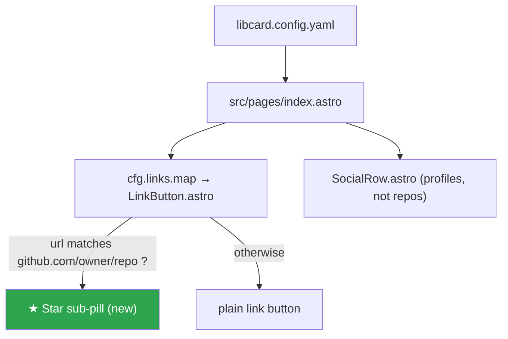
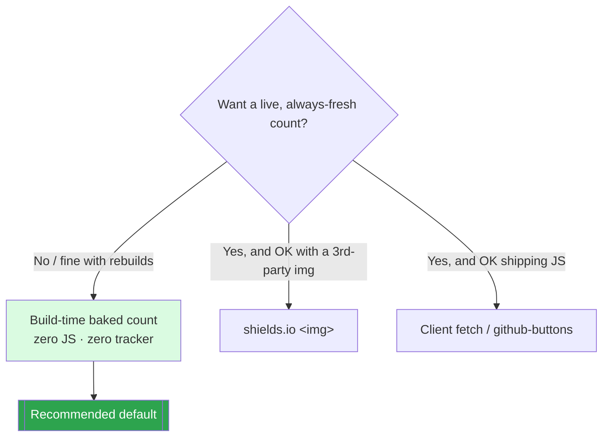
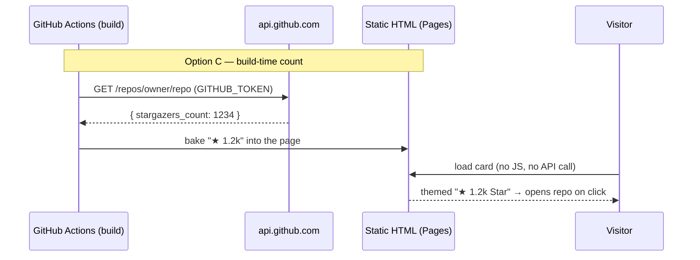

# Star-on-GitHub Button & Star Count for GitHub Links

## Problem Statement

When a LibCard link points at a GitHub repository, can we make it
trivially easy for a visitor to **star that repo** — ideally one click —
via a sub-button or nested affordance on the existing link? And, as a
stretch, can we **show the repo's current star count** on the card?

The constraints that make this interesting are LibCard's own promises
(from the [README](../../README.md)):

- **"zero client-side JavaScript by default; nothing to track you."**
- **"Fast & private"** — no third-party calls that leak the visitor's IP.
- Everything is a **static site** built by `astro build` and deployed to
  GitHub Pages via [`.github/workflows/deploy.yml`](../../.github/workflows/deploy.yml).

So the real question isn't "is there a star button widget" (there is —
several). It's "can we add this *without* breaking the no-JS, no-tracker,
build-once-serve-static character of LibCard." The user already flagged
the honest framing: *if a genuine one-click star isn't possible, it may
not be worth bothering with.*

## Executive Summary

- **A true one-click star from an external page is not possible.** Starring
  is an authenticated, CSRF-protected `POST` that only GitHub's own pages
  can issue. There is **no public GET URL** that stars a repo. The honest
  best is a button that *opens the repo*, where a logged-in visitor sees
  GitHub's own Star button immediately — effectively "one extra click."
- **The canonical embeddable star button** ([buttons.github.io](https://buttons.github.io/) /
  [ghbtns.com](https://ghbtns.com/)) is an `<a data-show-count>` that
  `buttons.js` upgrades into a **third-party iframe**. It gives a live
  count and the official look, but it ships JS *and* phones home to
  `ghbtns.com` + the GitHub API — a direct conflict with LibCard's no-JS,
  no-tracker ethos. Clicking it still only opens the repo; it doesn't star
  directly.
- **The on-ethos win is small but real:** auto/opt-in detect GitHub repo
  URLs in `links`, and render a tiny **"★ Star" sub-pill** next to the
  link that opens the repo. Zero JS, zero third-party, no staleness. It's
  the most honest "make starring easy" we can ship.
- **Star count** is the genuinely tricky part. Three viable shapes, in
  increasing ethos-cost: **(a) build-time baked** count (zero runtime JS/3p,
  but frozen until the next rebuild — pair with a scheduled rebuild);
  **(b) shields.io ``** badge (no JS, fresher, but a third-party
  request per visitor); **(c) client `<script>` fetch** (always fresh, but
  ships JS *and* hits `api.github.com` from each visitor's IP at 60 req/hr).
- **Recommendation:** ship the zero-JS **Star sub-pill** (opt-in per link),
  plus an **opt-in build-time count** baked statically with a graceful
  fallback, refreshed by a lightweight **weekly scheduled rebuild**. Treat
  the live widget and shields badge as *documented opt-ins* for owners who
  don't mind a third-party request — never the default.

## Current State In The Repository

### Where GitHub URLs appear today

GitHub URLs show up in two distinct config arrays, rendered by two
components:

| Surface | Component | Shape | Example in config |
|---|---|---|---|
| **Links** (buttons) | [`src/components/LinkButton.astro`](../../src/components/LinkButton.astro) | full-width button, label + icon | `url: https://github.com/crs48/LIBCard` |
| **Socials** (icon row) | [`src/components/SocialRow.astro`](../../src/components/SocialRow.astro) | icon-only pill | `platform: github` → `github.com/crs48` |

The user's request is about **repo links** — starring a *repository*. The
social row points at a *profile* (`github.com/<user>`), which has no star
target. So this feature lives in the **`links`** path: `LinkButton.astro`
and the `linkSchema` that backs it.



### The link button is a single `<a>` (this matters)

[`LinkButton.astro`](../../src/components/LinkButton.astro) wraps the
*entire* row in one anchor:

```astro
<a href={link.url} target={target} rel={rel} class="group flex items-center …">
  {link.icon && <Icon name={link.icon} … />}
  <span class="flex-1 text-center">{link.label}</span>
  <Icon name="external-link" … />
</a>
```

HTML **forbids a nested interactive element** (`<a>` inside `<a>`). A
"nested star button" therefore can't literally live *inside* the existing
anchor — the button must become a **sibling**. The cleanest fix is to wrap
the row in a flex container holding two sibling anchors: the main link, and
a narrow star pill. (See [Example Code](#example-code).)

### The GitHub mark icon already exists

[`src/components/Icon.astro`](../../src/components/Icon.astro) already ships
a filled `github` octocat path and a stroked `external-link` glyph. We'll
add a `star` glyph (a single `<path>` is enough) rather than pulling in a
dependency.

### Config schema is strict and codegen-backed

[`src/lib/schema.mjs`](../../src/lib/schema.mjs) defines `linkSchema` as a
**`.strict()`** Zod object (`label`, `url`, `icon?`). Any new field must be
added here, and the JSON Schema regenerated — `prebuild` runs
`generate-schema.mjs` (see [`package.json`](../../package.json) scripts),
so editor autocomplete and build-time validation stay in lockstep. This is
the same one-schema-two-consumers pattern the repo already relies on.

### There is a precedent for "the only JS we ship"

[`src/components/ThemeSwitcher.astro`](../../src/components/ThemeSwitcher.astro)
is the *single* opt-in client script in the codebase, gated behind
`theme.switcher`. Its header comment literally calls it "the only client
JavaScript LibCard ships." Any client-side star-count fetch would become
the *second* — a meaningful ethos decision, not a free addition.

### There is a precedent for build-time data generation

[`src/pages/contact-qr.svg.ts`](../../src/pages/contact-qr.svg.ts),
[`src/pages/og.png.ts`](../../src/pages/og.png.ts), and
[`src/pages/contact.vcf.ts`](../../src/pages/contact.vcf.ts) are
`prerender = true` endpoints that compute artifacts at build time. A
build-time **fetch** of the star count fits this mold — but unlike those,
it depends on the *network*, so it must fail gracefully.

### The deploy pipeline rebuilds only on push

[`.github/workflows/deploy.yml`](../../.github/workflows/deploy.yml) triggers
on `push` to `main` and manual `workflow_dispatch`. A build-time star count
would therefore be **frozen between pushes**. Adding a `schedule:` cron
(e.g. weekly) is the standard way to refresh it. The runner has
`GITHUB_TOKEN`, which lifts the GitHub API limit from 60 → 5,000 req/hr.
Node is `>=20`, so native `fetch` is available — no new dependency.

## External Research

### Can a link star a repo in one click? No.

Starring is `PUT /user/starred/{owner}/{repo}` in the API (auth required),
and on the web it's a CSRF-token-protected `POST` issued only by GitHub's
own repo page. There is **no GET URL** a third-party page can link to that
performs a star. Confirmed across the star-button projects and how-to
guides: every "star button" ultimately **navigates the user to the repo**,
where they click GitHub's own control. ([codewalnut guide](https://www.codewalnut.com/tutorials/how-to-star-a-repository-on-github),
[github:buttons](https://buttons.github.io/))

The nearest thing to "one click" is therefore: open the repo in a new tab.
A visitor already logged into GitHub lands with the **Star** button right
there, top-right. That's the ceiling, and it's what every widget does under
the hood.

### The canonical widget: github-buttons (buttons.github.io / ghbtns.com)

The de-facto standard ([`buttons/github-buttons`](https://github.com/buttons/github-buttons),
served at [ghbtns.com](https://ghbtns.com/)):

```html
<!-- Place an anchor… -->
<a class="github-button" href="https://github.com/owner/repo"
   data-icon="octicon-star" data-show-count="true"
   aria-label="Star owner/repo on GitHub">Star</a>
<!-- …then load the script, which replaces it with an <iframe> from ghbtns.com -->
<script async defer src="https://buttons.github.io/buttons.js"></script>
```

- **Requires JavaScript.** `buttons.js` upgrades the `<a>` into a sandboxed
  `<iframe src="https://ghbtns.com/…">`. With JS off you're left with a
  plain "Star" text link (a graceful but countless fallback).
- **`data-show-count="true"`** renders the live star count (fetched by
  ghbtns.com from the GitHub API and cached; the public limit is 60 req/hr).
- **Third-party everything:** a script from `buttons.github.io`, an iframe
  from `ghbtns.com`, styled outside our theme tokens. Each card visit pings
  those hosts — exactly the tracking surface LibCard advertises *not* having.
- Clicking still only **opens the repo**; it does not star directly.

Verdict: great on a normal marketing page, **wrong as a LibCard default**.
Worth offering as an explicit opt-in for owners who don't share the
zero-tracker stance.

### Star count as an image: shields.io / badgen

```html

```

- **No JavaScript** — it's just an ``. ([Shields.io GitHub stars](https://shields.io/badges/git-hub-repo-stars))
- **Fresher than a build-time bake** — shields fetches + caches server-side,
  so each load reflects recent data without a rebuild.
- **But it's a third-party request per visitor** (to `img.shields.io`), and
  the badge's visual language (SVG pill, its own colors/badge font) clashes
  with LibCard's themed surfaces. It can be recolored but never fully
  themed. Same privacy caveat as the widget, minus the JS.

### Star count at build time: the GitHub REST API

`GET https://api.github.com/repos/{owner}/{repo}` returns
`stargazers_count`. Run **once at build**, baked into static HTML:

- **Zero runtime JS, zero runtime third-party** — the count is plain text
  in the page. Fully themeable.
- **Stale between builds** — only as fresh as the last deploy. Mitigate
  with a `schedule:` cron rebuild (weekly is plenty for a vanity count).
- **Rate limit:** 60 req/hr unauthenticated, 5,000 with `GITHUB_TOKEN`
  (present in Actions). A card has a handful of repo links, so even
  unauthenticated local builds are fine; CI should pass the token.
- **Must fail soft:** offline dev builds, a 404 (renamed repo), or a rate
  limit must degrade to "no count," never a failed build.

### Comparison

| Approach | Client JS | 3rd-party request | Live count | Freshness | Themeable | Ethos fit |
|---|---|---|---|---|---|---|
| **Star sub-pill → repo** | none | none | n/a | n/a | full | ✅ best |
| **Build-time count** | none | none (at runtime) | no | per-build (+cron) | full | ✅ good |
| **shields.io ``** | none | yes (per visit) | ~live | minutes | partial | ⚠️ mixed |
| **Client fetch script** | yes | yes (per visit, GitHub API) | yes | live | full | ⚠️ mixed |
| **github-buttons widget** | yes (3p) | yes (script+iframe) | yes | live | none | ❌ off-ethos |



## Key Findings

1. **One-click star is a myth across the board.** Every button — official
   look or not — just sends the visitor to the repo. So the feature is
   really "make the repo's Star button one tap away," not "star it for them."
2. **The honest, on-ethos feature is tiny:** a themed "★ Star" sub-pill on
   repo links that opens the repo. No JS, no tracker, no staleness, no new
   dependency. This is squarely worth doing.
3. **The star *count* is where the tradeoffs live.** Showing a count at all
   forces a choice between *freshness* and *LibCard's promises*. Build-time
   baking keeps the promises at the cost of freshness; everything fresher
   spends some JS and/or a third-party request.
4. **HTML structure constraint:** the current single-`<a>` `LinkButton`
   can't nest the star button — it must become two sibling anchors in a
   flex container. Small refactor, but real.
5. **Schema + codegen are the right insertion point.** A per-link opt-in
   (`star`, `stars`) added to `linkSchema` keeps everything validated and
   autocompleted, consistent with how themes/footer options work.
6. **Auto-detection is feasible** via `^https?://github\.com/[^/?#]+/[^/?#]+/?$`
   (owner/repo, excluding bare profiles and deep paths), but **opt-in is
   safer** than surprising owners with star pills on every repo link.

## Options And Tradeoffs

### Option A — Do nothing

The user explicitly left this open. Justified *if* we only cared about a
literal one-click star (impossible) or a live count (off-ethos by default).
But the zero-JS sub-pill is cheap and genuinely useful, so "nothing" leaves
value on the table.

### Option B — Star sub-pill only (recommended core)

A small "★ Star" anchor beside the repo link, opening the repo in a new
tab. Zero JS, zero third-party, fully themed, no staleness. Honest about
what it does ("opens GitHub so you can star it"). The 80/20 win.

### Option C — Sub-pill + build-time count (recommended stretch)

Option B, plus a baked `★ 1.2k` count fetched at build. Keeps every ethos
promise. Needs: token in CI, graceful fallback, and (to avoid rot) a
scheduled rebuild. More moving parts, but all server-side.

### Option D — Sub-pill + shields.io badge

Option B with a fresher count via ``. No JS, but a per-visit request
to `img.shields.io` and a badge that never fully matches the theme. Good
escape hatch for owners who want freshness without JS.

### Option E — Client fetch / github-buttons widget

Live, official, and the richest UX — at the cost of shipping JS and pinging
third parties on every visit. Against the default ethos; offer only as a
clearly-labeled opt-in.



## Recommendation

Ship **Option B now**, with **Option C as an opt-in** in the same change:

1. **Star sub-pill (default behavior for opted-in repo links).** Add an
   opt-in `star: true` to a link; when its URL is a GitHub repo, render a
   themed "★ Star" sibling pill that opens the repo. Zero JS, zero tracker.
2. **Build-time count (opt-in).** Add `stars: "off" | "build"` (default
   `"off"`). `"build"` fetches `stargazers_count` at build, formats it
   (`1234 → 1.2k`), and bakes it into the pill. Fail soft to no-count.
3. **Refresh job.** Add a weekly `schedule:` cron to the deploy workflow so
   baked counts don't rot, and pass `GITHUB_TOKEN` to the build for the
   higher rate limit.
4. **Document the escape hatches.** In the README, note that `stars: "badge"`
   (shields ``) and a live widget are available for owners who accept a
   third-party request — but they are *not* the default, and explain why.

Rationale: this is the only path that keeps every promise on the tin
("zero client-side JS by default," "Fast & private") while still delivering
a real, themed "make it easy to star" affordance — and an optional count
for those who want it.

## Example Code

### 1. Schema (`src/lib/schema.mjs`)

```js
const linkSchema = z
  .object({
    label: z.string().min(1),
    url: z.string().url(),
    icon: z.string().optional(),
    // Show a "★ Star" sub-button when this link points at a GitHub repo.
    star: z.boolean().default(false),
    // How (if at all) to show the star count next to it.
    //   "off"   — pill only, no number (zero JS, zero third-party)
    //   "build" — bake the count at build time (zero runtime cost; refreshed on deploy)
    //   "badge" — shields.io  (no JS, but a third-party request per visit)
    stars: z.enum(["off", "build", "badge"]).default("off"),
  })
  .strict();
```

Then regenerate the JSON Schema so editors stay in sync:

```bash
pnpm run generate:schema   # also runs automatically via `prebuild`
```

### 2. Repo-URL helper (`src/lib/github.ts`, new)

```ts
const REPO_RE = /^https?:\/\/github\.com\/([^/?#]+)\/([^/?#]+?)(?:\.git)?\/?$/i;

/** Parse owner/repo from a GitHub repo URL, or null for profiles/deep paths. */
export function parseRepo(url: string): { owner: string; repo: string } | null {
  const m = url.match(REPO_RE);
  if (!m) return null;
  // Exclude reserved first segments that aren't users/orgs.
  if (["orgs", "sponsors", "marketplace", "features"].includes(m[1].toLowerCase())) return null;
  return { owner: m[1], repo: m[2] };
}

/** 1234 → "1.2k", 12345 → "12k" — compact, locale-free. */
export function formatStars(n: number): string {
  if (n < 1000) return String(n);
  if (n < 10_000) return `${(n / 1000).toFixed(1).replace(/\.0$/, "")}k`;
  return `${Math.round(n / 1000)}k`;
}

/** Build-time star count. Fails soft: returns null on any error/offline. */
export async function fetchStarCount(owner: string, repo: string): Promise<number | null> {
  try {
    const res = await fetch(`https://api.github.com/repos/${owner}/${repo}`, {
      headers: {
        Accept: "application/vnd.github+json",
        "User-Agent": "libcard",
        ...(process.env.GITHUB_TOKEN ? { Authorization: `Bearer ${process.env.GITHUB_TOKEN}` } : {}),
      },
    });
    if (!res.ok) return null;
    const data = await res.json();
    return typeof data.stargazers_count === "number" ? data.stargazers_count : null;
  } catch {
    return null; // offline dev build, rate limit, renamed repo — never break the build
  }
}
```

### 3. Restructured `LinkButton.astro` (sibling anchors, no nesting)

```astro
---
import type { LibcardLink } from "../lib/config";
import Icon from "./Icon.astro";
import { parseRepo, formatStars, fetchStarCount } from "../lib/github";

const { link } = Astro.props as { link: LibcardLink };
const external = /^https?:\/\//i.test(link.url);
const rel = external ? "noopener noreferrer" : undefined;
const target = external ? "_blank" : undefined;

const repo = link.star ? parseRepo(link.url) : null;
let count: string | null = null;
if (repo && link.stars === "build") {
  const n = await fetchStarCount(repo.owner, repo.repo);
  if (n !== null) count = formatStars(n);
}
const badgeSrc =
  repo && link.stars === "badge"
    ? `https://img.shields.io/github/stars/${repo.owner}/${repo.repo}?style=flat&label=%E2%98%85`
    : null;
---
<div class="flex w-full items-stretch gap-2">
  <a
    href={link.url}
    target={target}
    rel={rel}
    class="group flex flex-1 items-center gap-3 rounded-card bg-surface border border-border px-4 py-3.5 text-fg font-medium shadow-sm transition hover:-translate-y-0.5 hover:border-accent hover:shadow-md focus-visible:outline-2 focus-visible:outline-offset-2 focus-visible:outline-accent"
  >
    {link.icon && <Icon name={link.icon} class="size-5 shrink-0 text-muted group-hover:text-accent transition-colors" />}
    <span class="flex-1 text-center">{link.label}</span>
    <Icon name="external-link" class="size-4 shrink-0 text-muted opacity-0 group-hover:opacity-100 transition-opacity" />
  </a>

  {repo && (
    <a
      href={link.url}
      target="_blank"
      rel="noopener noreferrer"
      aria-label={`Star ${repo.owner}/${repo.repo} on GitHub`}
      class="flex shrink-0 items-center gap-1.5 rounded-card border border-border bg-surface px-3 text-sm font-medium text-muted transition hover:-translate-y-0.5 hover:border-accent hover:text-accent focus-visible:outline-2 focus-visible:outline-offset-2 focus-visible:outline-accent"
    >
      <Icon name="star" class="size-4" />
      {count && <span>{count}</span>}
      {badgeSrc && }
    </a>
  )}
</div>
```

### 4. Add a `star` glyph to `Icon.astro`

```js
// --- Generic UI (stroked) ---
star: {
  fill: false,
  d: "M12 2l3.09 6.26L22 9.27l-5 4.87 1.18 6.88L12 17.77l-6.18 3.25L7 14.14 2 9.27l6.91-1.01L12 2z",
},
```

### 5. Weekly refresh in `.github/workflows/deploy.yml`

```yaml
on:
  push:
    branches: [main]
  workflow_dispatch:
  schedule:
    - cron: "0 6 * * 1"   # Mondays 06:00 UTC — refresh baked star counts
```

The `withastro/action@v6` build step already has `GITHUB_TOKEN` in scope
via the workflow's `permissions:`; ensure `contents: read` is sufficient
for the public-repo read (it is).

## Risks And Open Questions

- **"Star" implies an action we can't perform.** The pill opens the repo;
  it doesn't star. Label/aria copy must be honest ("Star … on GitHub" that
  *opens* GitHub). Consider tooltip/sr-only text to avoid a bait-and-switch.
- **Baked counts go stale / can mislead.** A count frozen for a week is
  fine for vanity; a count frozen for months (no pushes, cron disabled by
  GitHub after 60 days of repo inactivity) looks wrong. Document the cron's
  auto-disable behavior, or omit the number for very-low-traffic repos.
- **Rate limits on local builds.** Unauthenticated local `pnpm build` with
  several repo links is well under 60/hr, but a contributor iterating could
  hit it. Fail-soft + a short in-process cache avoids a broken dev loop.
- **Layout width.** The sibling pill eats horizontal space; on narrow
  phones the main label may wrap. Needs a responsive check (maybe icon-only
  pill under a breakpoint).
- **Auto-detect vs opt-in.** Opt-in (`star: true`) is recommended, but some
  users will expect it to "just work" on any GitHub link. Decide whether a
  global `github.autoStar: true` default is worth the surprise.
- **shields/widget privacy.** Any non-build option reintroduces a
  third-party request. The README must be explicit that these are opt-ins
  that trade away the "nothing to track you" guarantee.
- **`stars: "build"` without `star: true`?** Decide whether `stars` implies
  `star`, or require both. (Recommend: `stars !== "off"` implies the pill.)

## Implementation Checklist

- [x] Add `star` (boolean) and `stars` (`"off" | "build" | "badge"`) to
      `linkSchema` in [`src/lib/schema.mjs`](../../src/lib/schema.mjs).
- [x] Run `pnpm run generate:schema` and commit the updated
      [`libcard.schema.json`](../../libcard.schema.json).
- [x] Add `src/lib/github.ts` with `parseRepo`, `formatStars`,
      `fetchStarCount` (fail-soft).
- [ ] Add a `star` glyph to [`src/components/Icon.astro`](../../src/components/Icon.astro).
- [ ] Refactor [`src/components/LinkButton.astro`](../../src/components/LinkButton.astro)
      into a flex container with sibling anchors (no nested `<a>`).
- [ ] Render the count (`build`) or shields `` (`badge`) inside the pill.
- [x] Add an in-process cache so duplicate repo links fetch once per build.
- [ ] Add the weekly `schedule:` cron to
      [`.github/workflows/deploy.yml`](../../.github/workflows/deploy.yml).
- [ ] Demo it: set `star: true` (+ `stars: "build"`) on the GitHub repo link
      in [`libcard.config.yaml`](../../libcard.config.yaml).
- [ ] Update the README "Configure it" / links section with the new fields
      and the privacy note on `badge`/widget opt-ins.
- [ ] (Optional) Document an opt-in github-buttons live widget for owners
      who want a live count and accept the third-party JS.

## Validation Checklist

- [ ] `pnpm build` succeeds **offline** (count silently omitted, no error).
- [ ] `pnpm build` with network bakes the correct `★ Nk` for the demo repo.
- [ ] With JS disabled in the browser, the pill renders and opens the repo
      (proves zero-JS).
- [ ] DevTools Network shows **no** request to `api.github.com`,
      `ghbtns.com`, or `buttons.github.io` on page load for `stars: "off"`
      and `stars: "build"`.
- [ ] `stars: "badge"` makes exactly one request to `img.shields.io` and
      nothing else.
- [ ] A non-repo GitHub link (`github.com/<user>`) shows **no** star pill.
- [ ] A bad/renamed repo URL degrades to pill-without-count, build still green.
- [ ] Pill is keyboard-focusable, has a sensible `aria-label`, and survives
      theme cycling (colors driven by tokens, not hard-coded).
- [ ] Responsive: label doesn't overflow on a 320px-wide viewport.
- [ ] `astro check` and `pnpm test` pass.

## References

- [github:buttons (buttons.github.io)](https://buttons.github.io/) — canonical embeddable star button.
- [buttons/github-buttons (source)](https://github.com/buttons/github-buttons) — `<a data-show-count>` → iframe upgrade.
- [ghbtns.com — Unofficial GitHub Buttons](https://ghbtns.com/) — iframe host + 60 req/hr note.
- [Shields.io — GitHub Repo stars badge](https://shields.io/badges/git-hub-repo-stars) — `` star count.
- [How to Star a Repository on GitHub](https://www.codewalnut.com/tutorials/how-to-star-a-repository-on-github) — confirms starring needs the GitHub UI/auth.
- [GitHub REST API — Get a repository](https://docs.github.com/en/rest/repos/repos#get-a-repository) — `stargazers_count`.
- Repo touchpoints: [`LinkButton.astro`](../../src/components/LinkButton.astro),
  [`Icon.astro`](../../src/components/Icon.astro),
  [`schema.mjs`](../../src/lib/schema.mjs),
  [`ThemeSwitcher.astro`](../../src/components/ThemeSwitcher.astro) (the only-JS precedent),
  [`deploy.yml`](../../.github/workflows/deploy.yml).
