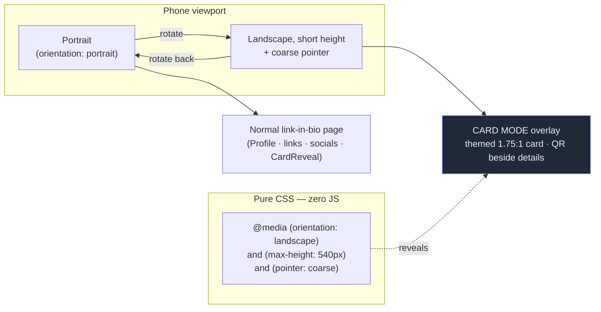
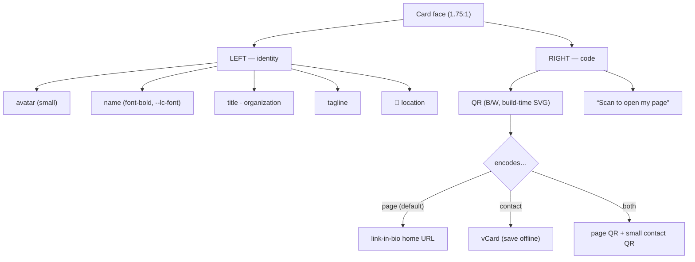
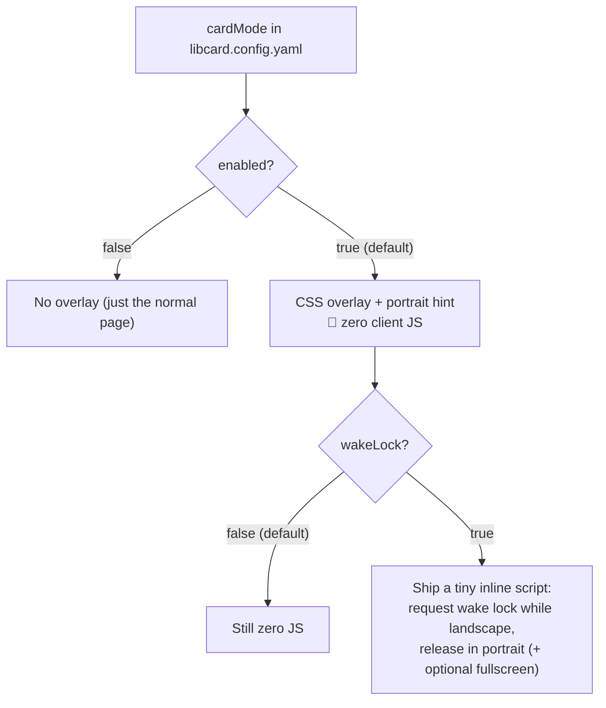
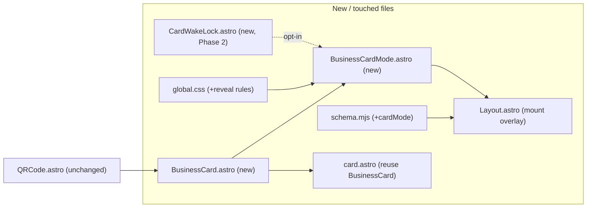
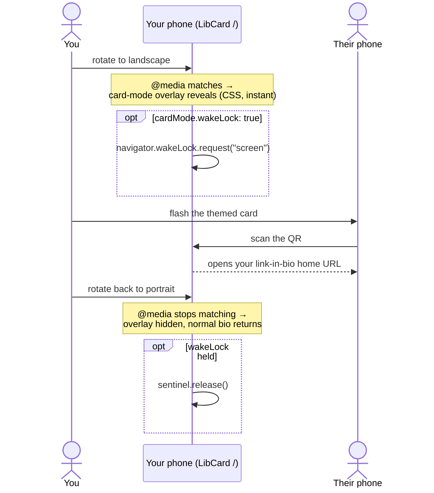
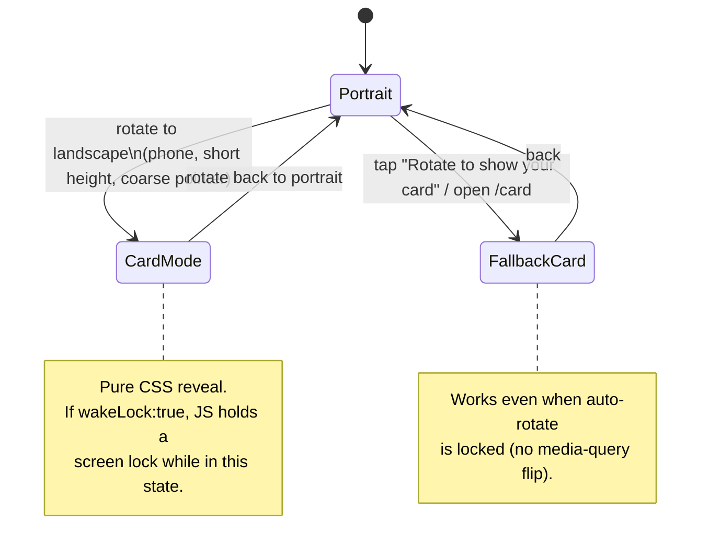

# LibCard — Landscape "Card Mode": Rotate-to-Reveal Virtual Business Card

> **Status:** Exploration #4. Builds on
> [`0001_[_]_LIBCARD_ARCHITECTURE_AND_MVP.md`](./0001_[_]_LIBCARD_ARCHITECTURE_AND_MVP.md)
> (Astro static + Tailwind v4, single `libcard.config.yaml`, **zero-runtime-JS by
> default**) and
> [`0002_[x]_THEME_MARKETPLACE_AND_LIVE_THEME_SWITCHING.md`](./0002_[x]_THEME_MARKETPLACE_AND_LIVE_THEME_SWITCHING.md)
> (data-only themes as `--lc-*` CSS variables driven by `data-theme`, with the
> *only* opt-in JS being the theme switcher). This doc designs a **landscape
> "card mode"**: turn the phone sideways and the link-in-bio page flips into a
> pretty, physical-looking virtual business card — your name and details beside a
> QR code — that you can flash at someone. Turn it back upright and you're back on
> the full link-in-bio site.

## Problem Statement

The card owner is standing in front of someone at a conference. They want to
**flash a beautiful, physical-looking business card** — name, tagline, role,
maybe a photo — with a **QR code** the other person can scan to land on the full
link-in-bio page. Today, the only "card-like" surface is the `/card` page (a
*vertical* stack: profile, then a QR, then a "Save contact" button) and the
`<details>` reveal on the home page. Neither feels like a **physical rectangular
card**, and neither responds to the most natural gesture for "show me your card":
**rotating the phone into landscape**.

The ask, distilled:

1. **Orientation as the trigger.** When the page is on a **phone in landscape**,
   switch into a dedicated **card mode**. Rotate back to portrait → the normal
   link-in-bio page returns. (No new URL to remember, no button hunt — the
   gesture *is* the interaction.)
2. **A card that looks like a card.** A real, rectangular business-card shape
   (the familiar 3.5″ × 2″ / **1.75 : 1** landscape proportion), with the
   **name, tagline, role/where**, and a small avatar — laid out **beside** the QR
   code, like a printed card with a code in the corner.
3. **On brand.** It must inherit the **current theme** — the same font, colors,
   radius, and feel as the live site — so a `terminal`-themed card looks like a
   green-on-black hacker card and a `paper`-themed one looks like warm letterpress
   stock. No bespoke styling that drifts from the active theme.
4. **The QR still works.** A scannable code (pointing to the link-in-bio home, as
   `/card` does today) so "flash → they scan → you rotate back" is the whole loop.
5. **"How easy would this be?"** — the headline question. Answer up front: **very
   easy**, because every ingredient already exists, and the orientation trigger
   can be **pure CSS** (no JavaScript), so it doesn't spend LibCard's zero-JS
   budget.

Inherited, non-negotiable constraints (from #1/#2):

- **Zero runtime JS by default.** Card mode must not ship JS unless the owner
  opts into an enhancement — exactly the bar the theme switcher had to clear.
- **Theme-token-driven.** Reuse `--lc-bg / --lc-surface / --lc-fg / --lc-muted /
  --lc-accent / --lc-accent-contrast / --lc-border / --lc-font / --lc-radius`;
  never hard-code colors or fonts.
- **Static, forkable, no backend.** The QR and card content are already produced
  at build time; nothing new to host.

## Executive Summary

**Recommendation: a single CSS-only overlay component, `BusinessCardMode.astro`,
revealed by an orientation media query — `@media (orientation: landscape) and
(max-height: 540px) and (pointer: coarse)` — that renders a themed,
business-card-shaped panel (avatar + name + tagline + role/location *beside* the
build-time QR SVG). Zero JavaScript. The existing `/card` page becomes the
manual, rotation-lock-proof fallback. A tiny opt-in JS enhancement
(`cardMode.wakeLock`) keeps the screen lit while the code is being scanned.**



The shape of the recommendation:

1. **The trigger is a media query, not JavaScript.** `@media (orientation:
   landscape) and (max-height: 540px) and (pointer: coarse)` reliably means "a
   phone held sideways": `orientation: landscape` (width > height), `max-height:
   540px` (excludes laptops/most tablets whose landscape height is far taller),
   and `pointer: coarse` (a touch device, not a small desktop window). This keeps
   card mode **zero-JS** — the single most important design fit.
2. **The card is one new presentational component** styled entirely with the
   existing **theme tokens** (`bg-surface`, `text-fg`, `text-muted`, `bg-accent`,
   `border-border`, `rounded-card`, `font-sans`→`--lc-font`). A `terminal` card is
   automatically green-on-black; a `paper` card is automatically warm serif.
3. **The QR already exists.** [`QRCode.astro`](../../src/components/QRCode.astro)
   emits an **inline SVG at build time** (no client JS), forced **black-on-white**
   so it scans on any theme. Card mode just renders it again at a larger size,
   pointing at the same absolute home URL [`card.astro`](../../src/pages/card.astro)
   already uses.
4. **Layout = card shape.** A panel with `aspect-ratio: 1.75 / 1`, sized to the
   short landscape viewport, **two columns**: identity (avatar, name, tagline,
   role, location) on the left, QR + "scan to open" on the right — the canonical
   printed-card-with-a-code arrangement.
5. **Rotation lock is the one real gotcha**, and it's handled by a **fallback,
   not a workaround**: the existing [`/card`](../../src/pages/card.astro) page
   stays as the always-works manual route, and a small **portrait-only hint**
   ("⟲ Rotate to show your card", which is also a link to `/card`) makes the
   feature discoverable without depending on the phone's auto-rotate setting.
6. **Opt-in JS, mirroring the theme switcher.** A `cardMode` config block. The
   CSS reveal and the hint are **pure CSS** (default on). The only JavaScript —
   **Screen Wake Lock** (keep the screen from dimming mid-scan) and optional
   fullscreen — ships **only** when `cardMode.wakeLock: true`, exactly the way
   `theme.switcher: true` is the sole gate for the switcher island today.

**Why this is "very easy":** the four hard parts are already solved in the repo —
a build-time QR SVG, a theme system that's pure CSS variables (so new markup is
themed for free), the profile/contact data in `libcard.config.yaml`, and a `/card`
precedent for the content. What's genuinely new is **~30 lines of CSS + one
`.astro` component + a config flag**. No new dependency, no backend, no JS in the
default path. Realistic effort: **a few hours**, most of it spent polishing the
card's proportions across phone sizes.

## Current State In The Repository

Everything card mode needs is already on disk; this feature is **composition, not
construction**.

- **The QR is build-time and zero-JS.**
  [`src/components/QRCode.astro`](../../src/components/QRCode.astro) calls
  `QRCode.toString(value, { type: "svg", … color: { dark: "#000", light:
  "#fff" } })` in frontmatter and `set:html`s the result — an **inline SVG**, no
  runtime JS, **forced black-on-white** with a quiet zone so it scans on every
  theme. Card mode renders `<QRCode value={homeUrl} size={…} />` and is done.
- **There's already a "business card" surface to mirror.**
  [`src/pages/card.astro`](../../src/pages/card.astro) composes
  `<Profile />` + `<QRCode value={homeUrl} size={240} />` + `<SaveContact />`,
  where `homeUrl = absoluteUrl(Astro.site, base, "/")`. Card mode reuses *exactly*
  this data and the same absolute URL — it just lays it out **horizontally** and
  reveals it on rotation.
- **The home page is where the gesture happens.**
  [`src/pages/index.astro`](../../src/pages/index.astro) renders `Profile`,
  `LinkButton`s, `SocialRow`, and
  [`CardReveal.astro`](../../src/components/CardReveal.astro) (a **zero-JS
  `<details>`** that already shows a QR + "Save contact" + "Open full-screen
  business card"). Card mode is the **landscape** sibling of that reveal.
- **Theming is pure CSS variables — new markup is themed for free.**
  [`src/styles/global.css`](../../src/styles/global.css) maps `--lc-*` tokens into
  Tailwind utilities (`bg-bg`, `bg-surface`, `text-fg`, `text-muted`, `bg-accent`,
  `text-accent-contrast`, `border-border`, `font-sans` → `--lc-font`,
  `rounded-card` → `--lc-radius`). The active theme is server-rendered into
  `<html data-theme>` by [`Layout.astro`](../../src/layouts/Layout.astro). A card
  built from these utilities **inherits the live theme automatically**, including
  the font (`--lc-font`: sans/serif/mono per theme in
  [`themes.gen.css`](../../src/styles/themes.gen.css)).
- **The container/layout seam.** `Layout.astro` wraps `<slot />` in
  `mx-auto … max-w-md … min-h-dvh` and conditionally renders the theme switcher
  island. It's the natural mount point for a global overlay (and proves the
  "render a thing only when a config flag is on" pattern via `{theme.switcher && …}`).
- **Reduced-motion is already respected** globally in
  [`global.css`](../../src/styles/global.css) (`@media (prefers-reduced-motion:
  reduce)` zeroes animations) — any card-reveal flourish inherits that.
- **The data is all in config.** [`libcard.config.yaml`](../../libcard.config.yaml)
  has `profile.{name,tagline,avatar,location}` and
  `contact.{organization,title,email,website}` — everything a card face needs —
  validated by the Zod schema in
  [`src/lib/schema.mjs`](../../src/lib/schema.mjs), which is also where a new
  `cardMode` block would be added (the same string-or-object pattern the `theme`
  key already uses).
- **Opt-in-JS precedent is established.** The theme switcher
  ([`ThemeSwitcher.astro`](../../src/components/ThemeSwitcher.astro) +
  [`ThemeBoot.astro`](../../src/components/ThemeBoot.astro)) is the template for
  "default zero-JS, ship a tiny inline `<script is:inline>` *only* when a config
  flag turns it on." Wake Lock follows the same gate.

**What does *not* exist yet:** any orientation handling. The page is `max-w-md`
and centered, so a phone in landscape today just shows a narrow column with big
side margins and extra scroll — i.e. the landscape experience is currently
*wasted*, which is exactly the space card mode fills.

## External Research

### Orientation detection — CSS is enough (and is the right tool)

- The **`orientation` media feature** is `landscape` when viewport **width >
  height**, `portrait` otherwise. Crucially it reflects the **viewport**, not the
  device — `width`/`height` equal `window.innerWidth/innerHeight`.
  ([MDN: orientation](https://developer.mozilla.org/en-US/docs/Web/CSS/@media/orientation))
- To mean **"phone in landscape" specifically**, combine features:
  `@media (orientation: landscape) and (max-height: 540px)` — a phone's landscape
  height is short (~360–430 CSS px on modern phones); laptops/desktops and most
  tablets are far taller even in landscape (iPad landscape height ≥ 768–820), so
  `max-height` cleanly excludes them.
  ([CSS-Tricks: media queries for standard devices](https://css-tricks.com/snippets/css/media-queries-for-standard-devices/))
- Add **`pointer: coarse`** (and/or `hover: none`) to exclude a *small desktop
  window* that happens to be short-and-wide — a real phone has a coarse pointer.
  ([MDN: Using media queries](https://developer.mozilla.org/en-US/docs/Web/CSS/Guides/Media_queries/Using))
- **No JavaScript required** for the trigger — which is the whole game for LibCard.

### The rotation-lock caveat (the one real risk)

- The media query fires on **viewport** orientation. If the user has **auto-rotate
  locked** (extremely common, the iPhone default for many people), rotating the
  phone **does not change the viewport** → the query never matches → card mode
  never appears. ([MDN: Managing screen
  orientation](https://developer.mozilla.org/en-US/docs/Web/API/CSS_Object_Model/Managing_screen_orientation))
- The **Screen Orientation `lock()` API** can't help here: it **requires
  fullscreen** and only *constrains* orientation once you're already there; it
  can't *force* a portrait-locked phone to report landscape.
  ([CSS-Tricks: orientation lock](https://css-tricks.com/snippets/css/orientation-lock/))
- **Design consequence:** never make rotation the *only* path. Pair it with a
  manual route (the existing `/card`) and a discoverable hint. This matches the
  "continuous design / add visual clues so users discover the landscape feature"
  guidance from UX literature on device-orientation patterns
  ([Smashing Magazine: designing for device
  orientation](https://www.smashingmagazine.com/2012/08/designing-device-orientation-portrait-landscape/)).

### Keeping the QR scannable — Screen Wake Lock API

- A phone showing a QR for someone to scan will **dim and sleep** on its idle
  timer — the canonical fix is the **Screen Wake Lock API**
  (`navigator.wakeLock.request("screen")`), the exact pattern airline/event apps
  use to keep a boarding-pass barcode lit until it's scanned.
  ([MDN: Screen Wake Lock
  API](https://developer.mozilla.org/en-US/docs/Web/API/Screen_Wake_Lock_API),
  [web.dev: now in all
  browsers](https://web.dev/blog/screen-wake-lock-supported-in-all-browsers))
- **Support is broad** (Chrome/Edge 84+, Safari 16.4+, Firefox 126+; ~94%+
  global) but it **requires a secure context (HTTPS)** — GitHub Pages is HTTPS, so
  it's available — and it requires **JavaScript**. Hence: **opt-in only**, to
  preserve zero-JS-by-default. ([caniuse: wake-lock](https://caniuse.com/wake-lock))

### The card itself — physical-card design norms

- A printed business card is **3.5″ × 2″**, a **1.75 : 1** aspect ratio — the
  proportion that makes a rectangle *read* as "business card." Use
  `aspect-ratio: 1.75 / 1`. ([VistaPrint QR business
  cards](https://www.vistaprint.com/business-cards/qr-code))
- **QR sizing/placement:** ~**20–30% of the card**, with a **2–3 mm quiet zone**,
  **black-on-white** for contrast, commonly **right side** with identity on the
  left — which is exactly the two-column layout proposed here, and the quiet zone
  + B/W are already baked into `QRCode.astro`.
  ([Mobilo: ideal QR size on a business
  card](https://www.mobilocard.com/post/qr-code-size-on-business-card))

### Alternatives considered (and why they lose to a CSS overlay)

- **Apple Wallet / Google Wallet pass** ("add my card to your wallet") is the
  heavyweight "real virtual business card," but it needs **signed `.pkpass`
  bundles / certificates and (ideally) a backend** to issue and update passes —
  incompatible with LibCard's static, no-backend, fork-and-go model. A nice
  *future* add-on, not this feature.
- **JS-driven orientation listener** (`screen.orientation.change` /
  `matchMedia(...).addEventListener`) buys nothing the media query doesn't, and
  spends the JS budget. Reserve JS strictly for wake lock/fullscreen.

## Key Findings

1. **The orientation trigger is free and JS-free.** A three-clause media query
   (`landscape` + `max-height: 540px` + `pointer: coarse`) is a precise "phone in
   landscape" detector. This is the finding that makes card mode *fit* LibCard
   rather than fight it.
2. **Every payload already exists.** Build-time QR SVG, theme tokens (incl.
   font), profile/contact data, and the `/card` content precedent. The feature is
   a **layout + a reveal**, not new infrastructure.
3. **Themes come along for free.** Because the card is built from the same
   `--lc-*` utilities, it's automatically on-brand in all six shipped themes (and
   any community theme) with **zero per-theme work** and no new contrast risk (the
   QR is always B/W; card text/bg reuse already-AA-gated token pairs).
4. **Rotation lock is the only real hazard, and it's a fallback problem, not a
   blocker.** Keep `/card` as the always-works route and add a portrait hint that
   *is* a link to it. Don't try to force rotation.
5. **Wake lock is the highest-value enhancement** (a dim screen mid-scan is the
   most likely real-world failure) and the natural — and only necessary — place to
   spend opt-in JS, gated exactly like `theme.switcher`.
6. **It can ship incrementally.** Phase 1 (CSS overlay + hint + `/card` fallback)
   is self-contained and zero-JS. Phase 2 (wake lock/fullscreen) is purely
   additive and opt-in. Nothing in Phase 1 needs Phase 2.

## Options And Tradeoffs

### A. How is card mode triggered? (the core decision)

```mermaid
flowchart TD
    Q{How to detect<br/>"phone in landscape"?}
    Q --> M["CSS media query<br/>landscape + max-height + coarse"]
    Q --> J["JS: screen.orientation / matchMedia listener"]
    Q --> SO["Screen Orientation lock() API"]
    Q --> R["Separate /card-landscape route"]
    M -->|"+ zero JS, instant, on-brand with #1/#2"| MP["✅ Recommended"]
    J -->|"- spends JS budget for no extra power"| JC["Only if JS already loaded"]
    SO -->|"- needs fullscreen; can't beat rotation lock"| SC["❌ Wrong tool"]
    R -->|"- navigation, not a gesture; no auto-flip"| RC["❌ Misses the ask"]
```

| Option | Zero-JS? | Instant on rotate? | Handles rotation lock? | Verdict |
|---|---|---|---|---|
| **CSS media query** | ✅ | ✅ | ✖ (needs the fallback below) | **Recommended** |
| JS orientation listener | ✖ | ✅ | ✖ | Redundant with CSS |
| Screen Orientation `lock()` | ✖ | n/a | ✖ (needs fullscreen) | Wrong tool |
| Separate route | ✅ | ✖ (manual nav) | ✅ (it's manual) | Keep as the *fallback*, not the trigger |

**Recommendation: CSS media query for the auto-flip, the `/card` route as the
manual fallback.** Best of both — the gesture works with zero JS for auto-rotate
users, and rotation-locked users still have a one-tap path.

### B. Overlay vs. transform vs. new page

| Option | Mechanism | Pros | Cons | Verdict |
|---|---|---|---|---|
| **Fixed overlay, CSS-revealed** | `position: fixed; inset: 0` panel, `display:none`→`flex` in the media query | Instant; no navigation; reuses the page's data; covers the scrolly bio | Card content rendered once more in DOM (small) | **Recommended** |
| CSS `transform: rotate(90deg)` of the page | Rotate the whole page to fake landscape | Works under rotation lock | `vw/vh` break, scroll/hit-testing get weird, a11y nightmare | ❌ |
| Dedicated `/card` landscape page | Navigate to a route | Shareable; simple | Not a *gesture*; no auto-flip; back-button friction | Use as fallback only |

**Recommendation: a fixed, CSS-revealed overlay**, mounted globally in
`Layout.astro` (so a rotate works on `/` *and* `/card`), gated by `cardMode.enabled`.

### C. What the card shows, and what the QR encodes



| Decision | Recommendation | Why |
|---|---|---|
| QR target | **page URL** (default), with `qr: page \| contact \| both` | Matches the user's loop ("they scan → land on my bio"); same `homeUrl` as `card.astro`. `contact` for "save me offline"; `both` for the maximalist card. |
| Identity fields | name, tagline, **title · org**, location, small avatar | Everything a printed card carries; all already in config (`contact.title/organization`). |
| Save-contact button | **omit** in card mode (or a tiny link) | Card mode is a *flash-and-scan* surface for the *other* person; the owner's own save flow lives on `/card`. Keeps the face clean. |
| Footer credit | **keep** "Powered by LibCard · Theme by X" small at the card's edge | Honors the #2 attribution model even in card mode (esp. CC-BY themes). |

### D. Where to mount it, and on which pages

| Option | Pros | Cons | Verdict |
|---|---|---|---|
| **In `Layout.astro`, gated by `cardMode.enabled`** | One place; rotate works on `/` and `/card`; mirrors the `{theme.switcher && …}` pattern | Renders on `/themes` too (probably fine; can exclude via a `wide`-style prop) | **Recommended** |
| Only in `index.astro` | Scoped to the bio page | Rotating on `/card` does nothing | Weaker |
| Per-page opt-in prop | Maximal control | More wiring | Overkill for v1 |

**Recommendation: mount in `Layout.astro`**, with a `cardMode` prop/flag so the
gallery (`/themes`, `wide`) can suppress it if desired.

### E. Zero-JS vs. enhanced (the JS budget)



| Sub-decision | Choice | Rationale |
|---|---|---|
| Default | `enabled: true`, **CSS-only** | The feature should "just work" on a rotate without costing the zero-JS promise. |
| Wake lock | **opt-in** `wakeLock: false` | The only JS, gated exactly like `theme.switcher`; keeps the screen lit mid-scan. |
| Fullscreen | optional, behind `wakeLock`/a `fullscreen` flag | Nice immersion, but needs a user gesture and JS; secondary. |
| Hint in portrait | **on by default**, CSS-only, links to `/card` | Discoverability + rotation-lock fallback in one. |

**Recommendation: the union above** — default-on CSS overlay + hint; wake
lock/fullscreen strictly opt-in.

## Recommendation

Ship **card mode as a CSS-only overlay** with a **config block** and a
**rotation-lock fallback**, in two phases.

**Phase 1 — zero-JS (the whole feature, really):**

1. **`src/components/BusinessCard.astro`** — a *presentational* card face
   (avatar + name + title·org + tagline + location on the left; `<QRCode>` +
   caption on the right), built from theme utilities. Reused by both the overlay
   and (optionally) a refreshed `/card`.
2. **`src/components/BusinessCardMode.astro`** — a `position: fixed` overlay that
   wraps `<BusinessCard variant="landscape" />`, plus the small portrait **rotate
   hint**. Hidden by default; revealed by the media query. Mounted in
   `Layout.astro` when `cardMode.enabled`.
3. **CSS in `global.css`** — the reveal rules (overlay shown in phone-landscape;
   hint shown in phone-portrait), respecting `prefers-reduced-motion`.
4. **`cardMode` in the config schema** (`src/lib/schema.mjs`) — string-or-object,
   defaulting to enabled, with `qr`, `hint`, and (Phase 2) `wakeLock`.
5. **Keep `/card` as the fallback**, and make the portrait hint a link to it.

**Phase 2 — opt-in JS:**

6. **`CardWakeLock.astro`** — an inline `<script is:inline>` (shipped only when
   `cardMode.wakeLock: true`) that requests a screen wake lock while the
   landscape media query matches and releases it otherwise; optional fullscreen on
   first tap.



### The "flash your card" interaction



### State model



### Config shape (additive, backward-compatible)

```yaml
# --- Landscape card mode (rotate your phone to flash a business card) ---
# Omit the whole block to accept the defaults (on, page-URL QR, zero JS).
cardMode:
  enabled: true     # default true — the CSS-only landscape card overlay
  qr: page          # page | contact | both  — what the QR encodes
  hint: true        # show the "⟲ Rotate to show your card" nudge in portrait
  wakeLock: false   # opt-in: ship a tiny script to keep the screen lit (Phase 2)
```

## Example Code

> Illustrative, not final. Uses the repo's real token utilities and components.

**`src/components/BusinessCard.astro`** — the themed card face (reused by the
overlay and `/card`):

```astro
---
import { getConfig } from "../lib/config";
import { withBase, absoluteUrl } from "../lib/site";
import QRCode from "./QRCode.astro";
import Icon from "./Icon.astro";

interface Props {
  /** "landscape" = wide card-mode face; "portrait" = today's stacked /card. */
  variant?: "landscape" | "portrait";
  /** Absolute URL the QR encodes (defaults to the link-in-bio home). */
  qrValue?: string;
}

const { variant = "landscape", qrValue } = Astro.props;
const cfg = await getConfig();
const base = import.meta.env.BASE_URL;
const home = absoluteUrl(Astro.site, base, "/");
const value = qrValue ?? home;

const p = cfg.profile;
const c = cfg.contact;
const avatar = p.avatar
  ? (p.avatar.startsWith("http") ? p.avatar : withBase(base, p.avatar))
  : withBase(base, "/avatar.svg");
const role = [c.title, c.organization].filter(Boolean).join(" · ");
const landscape = variant === "landscape";
---
<article
  class:list={[
    "flex items-center gap-6 border border-border bg-surface text-fg shadow-sm rounded-card font-sans",
    landscape ? "lc-bizcard p-6" : "flex-col p-6",
  ]}
>
  <div class:list={["flex flex-col gap-1.5", landscape ? "flex-1 min-w-0" : "items-center text-center"]}>
    
    <h2 class="text-xl font-bold tracking-tight leading-tight truncate">{p.name}</h2>
    {role && <p class="text-sm font-medium text-accent truncate">{role}</p>}
    {p.tagline && <p class="text-sm text-muted line-clamp-2">{p.tagline}</p>}
    {p.location && (
      <p class="mt-1 flex items-center gap-1 text-xs text-muted">
        <Icon name="map-pin" class="size-3.5" /><span class="truncate">{p.location}</span>
      </p>
    )}
  </div>
  <div class="flex shrink-0 flex-col items-center gap-2">
    <QRCode value={value} size={landscape ? 168 : 220} />
    <p class="text-xs text-muted">Scan to open my page</p>
  </div>
</article>
```

**`src/components/BusinessCardMode.astro`** — the CSS-revealed overlay + hint:

```astro
---
import BusinessCard from "./BusinessCard.astro";
import { withBase } from "../lib/site";
const cardPage = withBase(import.meta.env.BASE_URL, "/card");
---
{/* Revealed only on a phone held in landscape — see global.css. Zero JS. */}
<div class="lc-card-mode fixed inset-0 z-50 hidden place-items-center bg-bg p-[4vmin]">
  <BusinessCard variant="landscape" />
</div>

{/* Portrait-only nudge; also a link to /card so it works under rotation lock. */}
<a href={cardPage}
   class="lc-rotate-hint hidden items-center gap-1.5 rounded-full border border-border bg-surface px-3 py-1.5 text-xs text-muted">
  <span aria-hidden="true">⟲</span><span>Rotate to show your card</span>
</a>
```

**`src/styles/global.css`** — the reveal rules (append):

```css
/* === Landscape card mode ============================================ */
/* Default: overlay and hint are hidden; the normal page shows. */
.lc-card-mode,
.lc-rotate-hint { display: none; }

/* A phone held in landscape: short viewport, wide, touch pointer.
   max-height excludes laptops/tablets; pointer:coarse excludes a small
   desktop window. No JavaScript involved. */
@media (orientation: landscape) and (max-height: 540px) and (pointer: coarse) {
  .lc-card-mode { display: grid; }
  body { overflow: hidden; }            /* freeze the bio scrolling behind it */
}

/* The card keeps a real business-card proportion, sized to the short side. */
.lc-bizcard {
  aspect-ratio: 1.75 / 1;
  height: min(86vh, 320px);
  width: auto;
  max-width: 96vw;
}

/* A gentle fade-in where motion is allowed (global.css already neutralizes
   animations under prefers-reduced-motion: reduce). */
@media (prefers-reduced-motion: no-preference) {
  @media (orientation: landscape) and (max-height: 540px) and (pointer: coarse) {
    .lc-card-mode { animation: lc-card-in 220ms ease-out; }
  }
  @keyframes lc-card-in { from { opacity: 0; transform: scale(0.98); } to { opacity: 1; transform: none; } }
}

/* Discoverability + rotation-lock fallback: nudge in phone portrait only. */
@media (orientation: portrait) and (pointer: coarse) {
  .lc-rotate-hint { display: inline-flex; }
}
```

**`src/layouts/Layout.astro`** — mount the overlay (mirrors the switcher gate):

```astro
---
// ...existing imports...
import BusinessCardMode from "../components/BusinessCardMode.astro";
import CardWakeLock from "../components/CardWakeLock.astro";
import { getCardMode } from "../lib/config"; // resolves the cardMode block
const card = await getCardMode();
---
<!-- inside <main> or just after it -->
{card.enabled && <BusinessCardMode qr={card.qr} hint={card.hint} />}
{card.enabled && card.wakeLock && <CardWakeLock />}
```

**`src/lib/schema.mjs`** — the config block (string-or-object, like `theme`):

```js
const cardModeSchema = z
  .object({
    enabled: z.boolean().default(true),
    qr: z.enum(["page", "contact", "both"]).default("page"),
    hint: z.boolean().default(true),
    wakeLock: z.boolean().default(false),
  })
  .strict()
  .default({});
// add to libcardSchema: cardMode: cardModeSchema,
```

**`src/components/CardWakeLock.astro`** (Phase 2) — the only JS, opt-in:

```astro
<script is:inline>
  // Hold a screen wake lock while the phone is in landscape card mode so the QR
  // stays lit for scanning; release it in portrait. Secure-context + HTTPS only
  // (GitHub Pages qualifies). Silently no-ops where unsupported.
  const mq = matchMedia("(orientation: landscape) and (max-height: 540px) and (pointer: coarse)");
  let sentinel = null;
  async function sync() {
    try {
      if (mq.matches && !sentinel && "wakeLock" in navigator) {
        sentinel = await navigator.wakeLock.request("screen");
        sentinel.addEventListener("release", () => (sentinel = null));
      } else if (!mq.matches && sentinel) {
        await sentinel.release(); sentinel = null;
      }
    } catch {}
  }
  mq.addEventListener("change", sync);
  document.addEventListener("visibilitychange", () => { if (!document.hidden) sync(); });
  sync();
</script>
```

## Risks And Open Questions

- **Rotation lock (the headline risk).** If auto-rotate is off, the viewport never
  becomes landscape and the overlay never appears. *Mitigation:* the portrait hint
  links to `/card`, and `/card` remains a full manual business card — the feature
  degrades to "tap instead of rotate," never to "broken." Consider making `/card`
  itself reveal the landscape `BusinessCard` when the window is wide, so the
  fallback looks identical to the rotate experience.
- **Breakpoint tuning.** `max-height: 540px` is a heuristic. Large phones in
  landscape are ~390–430px tall (safe), but **foldables** and **small tablets**
  blur the line. *Mitigation:* `pointer: coarse` already excludes desktops; pick
  540px as a first cut and validate on a device matrix; expose nothing
  configurable until there's evidence it's needed.
- **Double-rendered QR / card content.** The home page now contains the QR in
  `CardReveal` *and* in the overlay. Two inline SVGs is a few KB — negligible, but
  note it. (Refactoring `CardReveal` and card mode to share one `BusinessCard`
  reduces duplication.)
- **Accessibility of a CSS-only overlay.** When `display:none`, the overlay is out
  of the a11y tree (good). When shown, the underlying bio is still in the DOM
  behind a `position: fixed` panel — a screen-reader user on a landscape phone
  could reach it. This is a genuine edge case (SR + deliberate landscape), but
  worth a `aria-hidden`/`inert` consideration; pure CSS can't toggle `inert`, so
  this is a *reason* someone might want the Phase-2 JS. Lean: accept for v1, note
  it.
- **Background scroll/cover.** `body { overflow: hidden }` in the media query
  freezes the page behind the overlay; verify it doesn't cause layout jump when
  rotating back. The overlay uses the theme `--lc-bg` so there's no flash of the
  page underneath.
- **Very small / very tall content.** A long `tagline` or `organization` could
  overflow the fixed card. *Mitigation:* `truncate`/`line-clamp-2` (shown) and a
  `min-w-0` flex child; test with worst-case strings.
- **Wake lock lifecycle.** Wake locks **auto-release** when the tab is hidden;
  re-acquire on `visibilitychange` (shown). Confirm release on rotate-back so we
  don't hold the screen on in portrait. HTTPS-only — fine on Pages, but localhost
  http testing needs `localhost` (which is treated as secure).
- **`qr: contact` and `both`.** Encoding the vCard inline (as
  [`contact-qr.svg.ts`](../../src/pages/contact-qr.svg.ts) does) makes a denser QR;
  at the card-mode size it must stay scannable. Validate `errorCorrectionLevel`
  and size if `contact`/`both` ship.
- **Should card mode also suppress the theme switcher / footer chrome?** In the
  overlay we likely want a *clean* card — decide whether the switcher button and
  page footer should be hidden while in card mode (CSS can hide them inside the
  media query). Keep the small "Powered by · Theme by" credit per #2.
- **Is `Layout`-global the right scope?** Mounting everywhere means a rotate on
  `/themes` also flips to card mode, which may be undesirable on the gallery. Gate
  with the existing `wide` signal or an explicit prop.

## Implementation Checklist

**Phase 1 — CSS-only card mode**
- [x] Add `cardMode` to the Zod config schema in `src/lib/schema.mjs`
      (`enabled`/`qr`/`hint`/`wakeLock`, string-or-object-free object form), and
      regenerate `libcard.schema.json` (`pnpm run generate:schema`).
- [x] Add a `getCardMode()` resolver in `src/lib/config.ts` (defaults: enabled,
      `qr: page`, `hint: true`, `wakeLock: false`).
- [x] Create `src/components/BusinessCard.astro` (presentational card face;
      `landscape`/`portrait` variants; theme-token styling; reuses `QRCode`).
- [x] Create `src/components/BusinessCardMode.astro` (fixed overlay wrapping
      `BusinessCard` + the portrait rotate hint linking to `/card`).
- [x] Append the reveal rules to `src/styles/global.css` (overlay in
      phone-landscape, hint in phone-portrait, `aspect-ratio: 1.75/1`,
      reduced-motion-safe fade).
- [x] Mount `{card.enabled && <BusinessCardMode/>}` in `src/layouts/Layout.astro`;
      decide gallery (`wide`) suppression.
- [x] Refactor `src/pages/card.astro` to reuse `<BusinessCard variant="portrait"/>`
      (DRY; keeps Save-contact + back link).
- [x] Choose the QR target per `cardMode.qr` (`page` → `homeUrl`, `contact` →
      `/contact-qr.svg` payload, `both`).
- [x] Hide page chrome (theme switcher, footer minus credit) inside the card-mode
      media query if it clutters the card.

**Phase 2 — opt-in enhancement**
- [x] Create `src/components/CardWakeLock.astro` (`<script is:inline>` wake-lock
      sync on the same media query; `visibilitychange` re-acquire); ship only when
      `cardMode.wakeLock: true`.
- [x] (Optional) Add fullscreen-on-tap behind the same flag.

**Docs**
- [x] Document `cardMode` in `libcard.config.yaml` comments and the `README.md`
      "Configure it" section ("Rotate your phone to flash a business card").
- [x] Note in `README` that wake lock is the only JS card mode can ship and it's
      opt-in (parity with the theme-switcher framing).

## Validation Checklist

- [ ] On a real phone with **auto-rotate on**, rotating `/` to landscape reveals
      the themed card overlay **instantly**; rotating back restores the bio — with
      **zero client JS** in the network panel (when `wakeLock: false`).
- [ ] The card is correctly proportioned (~1.75:1) and fully visible (no clipping)
      across small/large phones (e.g. iPhone SE, iPhone 15 Pro Max, a Pixel, a
      Galaxy) in landscape.
- [ ] The overlay **does not appear** on desktop (any window size), on a small
      *desktop* window that's short-and-wide (excluded by `pointer: coarse`), or
      on tablets in landscape (excluded by `max-height`).
- [ ] The card inherits each shipped theme correctly — font, colors, radius — for
      `default`, `midnight`, `mono`, `paper`, `sunset`, `terminal`; the QR stays
      black-on-white and **scans** on every theme.
- [ ] Scanning the QR opens the **link-in-bio home URL** (and, with `qr: contact`,
      saves the vCard; with `both`, both codes scan).
- [ ] With **auto-rotate locked**, the portrait **hint shows** and taps through to
      `/card`; the manual business card works end-to-end.
- [ ] `prefers-reduced-motion: reduce` suppresses the reveal animation; the card
      still appears.
- [ ] Long `tagline`/`organization`/`name` values truncate gracefully instead of
      overflowing the fixed card.
- [ ] `cardMode.enabled: false` removes the overlay and hint entirely (normal page
      only); a malformed `cardMode` block fails the build with a readable message.
- [ ] (Phase 2) With `wakeLock: true`, the screen **stays lit** in landscape card
      mode and the lock **releases** on rotate-back / tab hide; nothing ships when
      `wakeLock: false`.
- [ ] Lighthouse Performance on `/` stays ≥ 95 with card mode on (CSS-only path).

## References

**Repo**
- [Exploration #1 — Architecture & MVP](./0001_[_]_LIBCARD_ARCHITECTURE_AND_MVP.md) · [Exploration #2 — Theme system & zero-JS switcher](./0002_[x]_THEME_MARKETPLACE_AND_LIVE_THEME_SWITCHING.md)
- [`src/components/QRCode.astro`](../../src/components/QRCode.astro) · [`src/pages/card.astro`](../../src/pages/card.astro) · [`src/components/CardReveal.astro`](../../src/components/CardReveal.astro) · [`src/pages/index.astro`](../../src/pages/index.astro)
- [`src/layouts/Layout.astro`](../../src/layouts/Layout.astro) · [`src/components/Profile.astro`](../../src/components/Profile.astro) · [`src/styles/global.css`](../../src/styles/global.css) · [`src/styles/themes.gen.css`](../../src/styles/themes.gen.css)
- [`src/lib/schema.mjs`](../../src/lib/schema.mjs) · [`src/pages/contact-qr.svg.ts`](../../src/pages/contact-qr.svg.ts) · [`libcard.config.yaml`](../../libcard.config.yaml)

**Orientation detection (CSS)**
- [MDN — `orientation` media feature](https://developer.mozilla.org/en-US/docs/Web/CSS/@media/orientation) · [MDN — Using media queries](https://developer.mozilla.org/en-US/docs/Web/CSS/Guides/Media_queries/Using)
- [CSS-Tricks — Media queries for standard devices](https://css-tricks.com/snippets/css/media-queries-for-standard-devices/)

**Rotation lock & Screen Orientation**
- [MDN — Managing screen orientation](https://developer.mozilla.org/en-US/docs/Web/API/CSS_Object_Model/Managing_screen_orientation) · [CSS-Tricks — Orientation lock](https://css-tricks.com/snippets/css/orientation-lock/)
- [Smashing Magazine — Designing for device orientation](https://www.smashingmagazine.com/2012/08/designing-device-orientation-portrait-landscape/)

**Screen Wake Lock**
- [MDN — Screen Wake Lock API](https://developer.mozilla.org/en-US/docs/Web/API/Screen_Wake_Lock_API) · [web.dev — supported in all browsers](https://web.dev/blog/screen-wake-lock-supported-in-all-browsers) · [caniuse — wake-lock](https://caniuse.com/wake-lock)

**Business-card design norms**
- [VistaPrint — QR code business cards](https://www.vistaprint.com/business-cards/qr-code) · [Mobilo — ideal QR size on a business card](https://www.mobilocard.com/post/qr-code-size-on-business-card)
