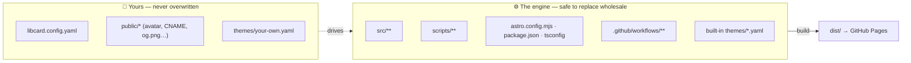
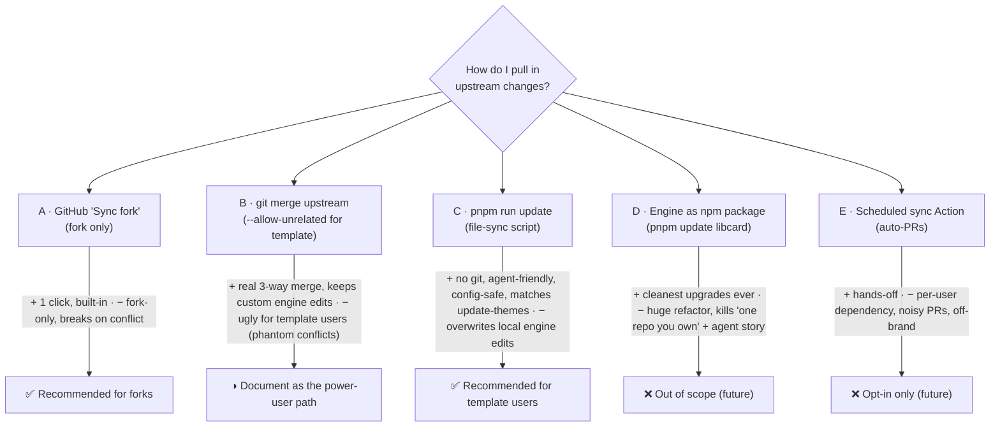
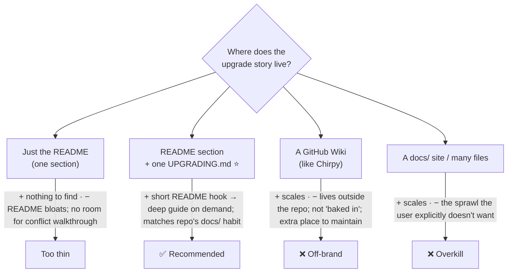
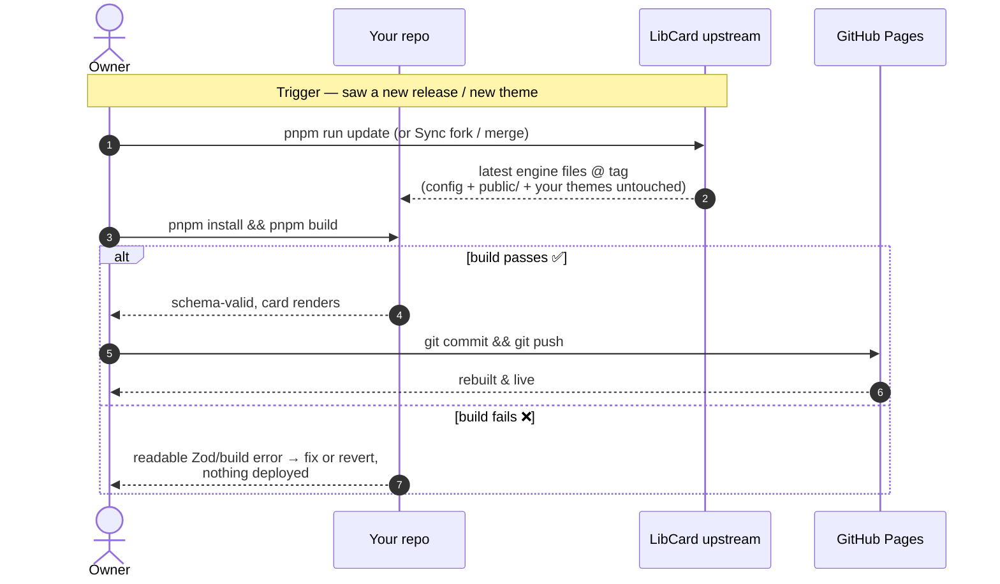

# Staying Current — The Upgrade Path & Self-Hosting Guides

> **Status:** Exploration. Recommends how a LibCard owner pulls in upstream
> improvements (new themes, features, fixes) after they've adopted the template,
> and what documentation to bake into the repo so getting up *and staying*
> running is obvious. Nothing here is implemented yet — the file stays `[_]`
> until the recommended docs + `pnpm run update` script land.

## Problem Statement

LibCard is adopted by **"Use this template"** (the headline path in the
[README](../../README.md)) or by **forking**. Either way, the new owner ends up
with their *own copy* of the whole repo and edits exactly one file —
[`libcard.config.yaml`](../../libcard.config.yaml). The site then deploys itself
on every push via [`deploy.yml`](../../.github/workflows/deploy.yml).

That answers "how do I get started." It does **not** answer the question this
exploration exists for:

> *Six months later, LibCard upstream has shipped three new themes, an
> accessibility fix, and a new config field. I forked/templated back in January
> and only ever touched `libcard.config.yaml`. **How do I pull those in without
> blowing away my content or breaking my live card?***

Today the repo has **no documented answer**. There's a narrow
[`pnpm run update-themes`](../../scripts/update-themes.mjs) that syncs *only*
`themes/*.yaml` from upstream, but nothing for the engine itself, and the README
never mentions updating at all. The user's ask, distilled:

1. **Define the upgrade route** for both adoption paths (template vs. fork).
2. **Document it clearly**, baked into the repo — guides people can actually
   follow to *keep hosting* their card, not just launch it.
3. **Don't over-document.** One clear "Updating" story, not a wiki sprawl.

## Executive Summary

The single fact that makes every upgrade strategy tractable is already true of
LibCard by design: **your content lives in a tiny, fixed set of files; the rest
is an interchangeable engine.** Updating = replace the engine, keep your files.



**Recommendation — a layered "good / better / best," not one big mechanism:**

1. **Set expectations first.** Your card keeps working forever with zero
   maintenance; updating is *opt-in*, only to pick up new themes/features/fixes.
   This defuses most of the anxiety — a static site has no security treadmill.
2. **Make the ownership boundary explicit and documented** (the diagram above) —
   it's what every route depends on.
3. **Give one recommended route per adoption path**, finishing each with
   `pnpm install && pnpm build` so the build's schema validation proves the
   upgrade is safe before it ever deploys:
   - **Forked →** GitHub's **"Sync fork"** button, or `git fetch upstream && git
     merge upstream/main`.
   - **Used the template →** a one-command **`pnpm run update`** script
     (generalizes `update-themes.mjs`): pulls the latest *engine* files from a
     tagged upstream release, leaves your files untouched. No git-history
     surgery.
4. **Keep `update-themes` as the "I only want the new themes" express lane.**
5. **Anchor updates to GitHub Releases + a short CHANGELOG** so "what changed,
   do I care?" is answerable and the updater targets a stable version, not a
   moving `main`.
6. **Documentation footprint: one README section + one `docs/UPGRADING.md`.**
   That's the whole sprawl budget.

Explicitly **not** recommended now: re-architecting the engine into a published
npm package (Chirpy-Starter model — cleanest upgrades, but guts the "one repo
you own, edit one file" simplicity and the agent story), or an always-on
scheduled sync Action in every user's repo (noisy, off-brand). Both are noted as
futures.

## Current State In The Repository

### What a new owner actually gets

Adoption is **"Use this template"** (headline) or **fork**, per the
[README quick-start](../../README.md) and the distribution section of
[exploration 0001](0001_[_]_LIBCARD_ARCHITECTURE_AND_MVP.md). Both produce a full
copy of this repo under the owner's account, wired to deploy on push.

### The ownership boundary (verified against the tree)

| Bucket | Files | Who edits | Upgrade treatment |
|---|---|---|---|
| **Yours** | `libcard.config.yaml` | the owner (the *only* file the README tells them to touch) | **never overwrite** |
| **Yours** | `public/avatar.svg`, plus anything they add: `public/CNAME` (custom domain), `public/og.png`, a custom `public/favicon.svg` | the owner | **never overwrite** |
| **Yours (optional)** | a community/personal theme they authored as `themes/<slug>.yaml` | the owner | **preserve** |
| **Engine** | `src/**`, `scripts/**`, `astro.config.mjs`, `package.json`, `pnpm-lock.yaml`, `tsconfig.json`, `.github/**` | upstream only | **replace wholesale** |
| **Engine (built-in themes)** | `themes/default.yaml`, `midnight`, `sunset`, `mono`, `paper`, `terminal`, `ocean`, `theme.schema.json` | upstream | **replace wholesale** |
| **Generated, committed** | `libcard.schema.json`, `src/data/themes.json`, `src/styles/themes.gen.css` | nobody by hand — `prebuild` regenerates from Zod + `themes/*.yaml` | **regenerate, don't hand-merge** |

The "generated, committed" row matters: those three files are produced by
[`scripts/gen-themes.mjs`](../../scripts/gen-themes.mjs) and
[`scripts/generate-schema.mjs`](../../scripts/generate-schema.mjs) and re-run on
every build via the `prebuild` hook in [`package.json`](../../package.json).
`themes.gen.css` even carries a `GENERATED … DO NOT EDIT` banner. An upgrade
should *regenerate* them (a plain `pnpm build` does), never try to merge them
line-by-line.

### What already exists for updating

[`scripts/update-themes.mjs`](../../scripts/update-themes.mjs) +
`pnpm run update-themes` is a working, on-brand precedent:

- Fetches `themes/*.yaml` (+ `theme.schema.json`) from upstream's `main` via the
  GitHub Contents API — **no git remote, no clone, no history needed**.
- **Never touches `libcard.config.yaml`** (its header comment promises this).
- Supports `owner/repo`, `--ref=branch`, and `--dry-run`.
- Tells you to run `pnpm run gen:themes` afterwards.

It's the right *shape* (file-sync from upstream, content-only, config-safe) but
scoped to themes. The general engine updater this exploration recommends is
essentially "`update-themes.mjs`, but for the whole engine, pinned to a release."

[Exploration 0002](0002_[x]_THEME_MARKETPLACE_AND_LIVE_THEME_SWITCHING.md)
already flagged this gap explicitly (its "Staying current after fork" risk) and
landed on `update-themes` as the answer *for themes* — this doc picks up the
thread for the engine.

### What's missing

- The README has **no "Updating" section** at all (AGENTS.md asks to "keep the
  README quick-start in sync with the actual setup flow" — staying-current is
  the missing half of that flow).
- **No releases or tags** on the repo, so there's no stable thing to "update
  to," and no CHANGELOG to answer "what changed."
- No guidance on the **template-vs-fork upgrade asymmetry** (below), which is the
  single biggest footgun.

## External Research

### The template-vs-fork asymmetry (the core mechanic)

A repo made with **"Use this template"** does **not inherit the template's commit
history** — the two share no common ancestor
([GitHub community #50012](https://github.com/orgs/community/discussions/50012),
[#23528](https://github.com/orgs/community/discussions/23528)). A **fork** does
share history. That one difference decides everything:

| | **Used the template** | **Forked** |
|---|---|---|
| Shared git history | ❌ none | ✅ yes |
| GitHub **"Sync fork"** button | ❌ unavailable | ✅ available (when no conflict) |
| `git merge upstream/main` | needs `--allow-unrelated-histories` | clean 3-way merge |
| Repo name freedom / clean graph | ✅ | tied to upstream, shows "forked from" |

GitHub's own guidance is blunt: *"If you care about being able to merge from the
upstream repository… creating a new repository from the template is probably the
wrong tool — start from a fork"*
([git-merge docs](https://git-scm.com/docs/git-merge);
[community #50012](https://github.com/orgs/community/discussions/50012)).

**The `--allow-unrelated-histories` gotcha (why the naïve merge is ugly for
template users):** with no common ancestor, git merges against an *empty* base.
Any file that differs between your repo and upstream — *including engine files
you never touched but upstream has since changed* — becomes an add/add
**conflict**, because git has no base to tell "you didn't change this." So a
template user's first upstream merge can conflict on dozens of engine files for
no real reason. This is exactly why the prior art reaches for `--squash` +
"just take upstream's copy of the engine," or sidesteps git entirely with a
file-sync — and it's the strongest argument for the `pnpm run update` script
over a documented `git merge` for template users.

### Prior art — how comparable projects handle "stay current"

| Project | Adoption | Upgrade story | Lesson for LibCard |
|---|---|---|---|
| **Chirpy** (Jekyll theme) | **Two paths, by design**: the gem-based [*Chirpy Starter*](https://github.com/cotes2020/chirpy-starter) (engine is a gem) **or** fork the theme | Starter: bump the version in `Gemfile`, done. Fork: `git remote add chirpy …; git fetch chirpy --tags; git merge vX.Y.Z --squash --allow-unrelated-histories`, resolve conflicts, rebuild assets ([Upgrade Guide](https://github.com/cotes2020/jekyll-theme-chirpy/wiki/Upgrade-Guide)) | **The canonical model.** Split "your content" from "the engine"; document an *easy* path and a *manual-merge* path; anchor on **tags**, not `main`. |
| **create-t3-app** | scaffold once | *"It's yours; there is no upgrade path."* Watch releases, port changes you want, by hand ([FAQ](https://create.t3.gg/en/faq), [#1353](https://github.com/t3-oss/create-t3-app/issues/1353)) | Validates the **"you don't have to update"** stance and the selective/manual fallback. Honesty beats a fake button. |
| **actions-template-sync** | template repos | A scheduled GitHub Action opens **auto-PRs** from the template, with a `.templatesyncignore` protecting your files ([repo](https://github.com/AndreasAugustin/actions-template-sync)) | Proves automation is *possible* and that an **ignore-list** is the right primitive — but it's a per-user always-on dependency. Offer as opt-in, not default. |
| **git-upstream-template** / **github-template-sync-action** | template repos | CLIs that replay upstream commits onto a template-generated repo despite the missing history ([rioam2/git-upstream-template](https://github.com/rioam2/git-upstream-template)) | Confirms the template-history problem is real enough that whole tools exist for it. A focused script beats adopting one. |

### Synthesis of the research

Everyone who's solved this converges on the same three moves: **(1) separate
content from engine, (2) anchor upgrades to releases/tags, (3) give two routes —
a trivial one and a manual-merge fallback.** LibCard already has (1) for free
(it's the whole design) and a working file-sync precedent; it's missing (2) and
the documentation for (3).

## Key Findings

1. **LibCard is upgrade-friendly by construction.** Content is confined to
   `libcard.config.yaml` + `public/` + optional custom themes. Nothing else
   needs to survive an engine swap, and the build regenerates all derived files.
2. **The build is the safety net.** One Zod schema validates the config *and*
   generates `libcard.schema.json`; a bad/incompatible config **fails
   `pnpm build`** with a readable error (per
   [exploration 0001](0001_[_]_LIBCARD_ARCHITECTURE_AND_MVP.md)). So "did the
   upgrade break me?" is answerable locally in seconds, before any deploy.
3. **The headline adoption path is the worst for upgrades.** "Use this template"
   gives clean history *but* no upstream link — the exact tradeoff GitHub warns
   about. We must either steer update-seekers to *fork*, or give template users a
   no-git route.
4. **A no-git route already has a precedent here** (`update-themes.mjs`) and is
   the friendliest for the headline path and for AI agents — no remotes, no
   merge conflicts, just "fetch upstream files, keep mine."
5. **There's nothing to "update to" yet.** No tags/releases/CHANGELOG means even
   a perfect updater is aiming at a moving target.
6. **The doc gap is small and bounded.** This needs a README section and one
   guide — not a wiki.

## Options And Tradeoffs

### Axis 1 — the upgrade *mechanism*



| Option | Works for template? | Works for fork? | New code | Keeps *your* engine edits | Verdict |
|---|---|---|---|---|---|
| **A. Sync fork button / `merge upstream/main`** | ❌ (no upstream link) | ✅ | none | ✅ (real merge) | **Recommended — forks** |
| **B. `merge … --allow-unrelated-histories`** | ◑ (works but conflict-noisy) | ✅ | none | ✅ | **Power-user / document** |
| **C. `pnpm run update` file-sync** | ✅ | ✅ | one script | ❌ (takes upstream wholesale) | **Recommended — template** |
| **D. Engine as npm package** | ✅ | ✅ | major refactor | n/a | Future / no |
| **E. Scheduled sync Action** | ✅ | ✅ | a workflow | depends | Opt-in / no |

The winner isn't a single option — it's **A for forks + C for template users +
B documented for the power user who customized the engine.** They share one
prerequisite (the ownership boundary) and one epilogue (`pnpm install && pnpm
build`).

### Axis 2 — the *documentation* shape (the user's real constraint)



The user said it twice: *clear, but don't overcomplicate.* The sweet spot is a
**short, friendly "Updating your card" README section** (mental model + the
2–3 commands per path) that **links to one `docs/UPGRADING.md`** holding the
file-ownership table, the conflict walkthrough, and the CHANGELOG pointer.
README stays scannable; the depth is one click away and *in the repo*, not a
wiki.

## Recommendation

Ship a **layered upgrade story** and the **minimum tooling** to make it
one-command, in this order:

1. **Set expectations (README, 2 sentences).** "Your card keeps working with no
   maintenance. Updating is optional — do it only to pick up new themes,
   features, or fixes." Kills the false urgency a static site doesn't have.

2. **Document the ownership boundary** (the table/diagram above) in
   `docs/UPGRADING.md`. Everything else references it.

3. **One recommended route per adoption path**, each ending in `pnpm install &&
   pnpm build` (local proof before deploy), then `git push`:

   - **Forked:** GitHub **"Sync fork"** in the web UI; or CLI
     `git fetch upstream && git merge upstream/main`. Resolve the one likely
     conflict (`libcard.config.yaml`) by keeping yours.
   - **Used the template:** `pnpm run update` (the new script). For the
     power user who *did* edit the engine and wants a real merge:
     `git merge upstream/main --allow-unrelated-histories --squash`, take
     upstream for engine files, keep yours for config — documented as the
     advanced path.
   - **Either, themes only:** `pnpm run update-themes` (already exists).

4. **Add the `pnpm run update` script** — generalize `update-themes.mjs` into an
   engine updater (sketch below): fetch a **tagged upstream release** tarball (or
   per-file via the Contents API), write engine files, **skip the user-owned
   set**, regenerate derived files, and print a `--dry-run` diff. Config-safe by
   construction, like its sibling.

5. **Start cutting GitHub Releases + a one-line-per-entry `CHANGELOG.md`**, with
   a "Breaking / action needed" callout when a config field changes. The updater
   targets the latest release tag; the CHANGELOG answers "do I care?"

6. **Wire it into the existing surfaces:**
   - README: new **"Updating your card"** section linking `docs/UPGRADING.md`.
   - `libcard.config.yaml` header comment: one line — *"To pull in new
     themes/features later: see docs/UPGRADING.md (or `pnpm run update`)."* —
     because that's the file owners actually live in.
   - AGENTS.md: extend the "keep the README quick-start in sync" note to cover
     the update flow, and record that engine files are replaceable / config is
     sacred (so agents upgrading a user's card know the boundary).



## Example Code

### `scripts/update.mjs` (sketch — generalizes `update-themes.mjs`)

```js
// Pull the latest LibCard *engine* from a tagged upstream release.
//   pnpm run update                 # latest release of crs48/LIBCard
//   pnpm run update --ref=v0.3.0    # a specific tag
//   pnpm run update owner/repo      # a different upstream
//   pnpm run update --dry-run       # show what would change, write nothing
//
// NEVER touches your content: libcard.config.yaml, public/, or themes you
// authored. After it runs, `pnpm install && pnpm build` regenerates all
// derived files (libcard.schema.json, src/data/themes.json, themes.gen.css).

// Files that are YOURS — never overwritten:
const KEEP = [
  "libcard.config.yaml",
  "public/",                 // avatar, CNAME, og.png, custom favicon…
  // plus any themes/*.yaml not present in the upstream release (= your own)
];

// Derived files we regenerate rather than copy (prebuild rebuilds them anyway):
const REGENERATED = [
  "libcard.schema.json",
  "src/data/themes.json",
  "src/styles/themes.gen.css",
];

// 1. Resolve the target tag (default: latest release via the Releases API).
// 2. Download that ref's tarball (or walk the Contents API like update-themes).
// 3. For every file: if it matches KEEP → skip; if REGENERATED → skip (rebuilt);
//    else write it (add/update). Track added/updated/removed for the summary.
// 4. Preserve themes/*.yaml that exist locally but NOT in the release (yours).
// 5. Print a dry-run-able diff; on apply, end with:
//      "Next: pnpm install && pnpm build  (validates + regenerates), then git push"
```

This mirrors the structure, flags, and config-safety promise of the existing
[`update-themes.mjs`](../../scripts/update-themes.mjs) — same idioms, wider
scope, pinned to a release instead of tracking `main`.

### README — new "Updating your card" section (draft)

```markdown
## Updating your card

Your card keeps working forever with zero upkeep — **updating is optional**, just
a way to pick up new themes, features, and fixes from upstream. The only files
that are *yours* are `libcard.config.yaml`, anything in `public/`, and any themes
you wrote; everything else is the LibCard engine and is safe to replace.

**If you used "Use this template":**
    pnpm run update            # pulls the latest engine, keeps your content
    pnpm install && pnpm build # validates + regenerates (fails loudly if off)
    git add -A && git commit -m "chore: update LibCard" && git push

**If you forked:** click **Sync fork** on your repo page, or:
    git remote add upstream https://github.com/crs48/LIBCard.git   # one time
    git fetch upstream && git merge upstream/main                  # keep your config on conflict
    pnpm install && pnpm build && git push

**Just want the new themes?**  `pnpm run update-themes && pnpm run gen:themes`

See [docs/UPGRADING.md](./docs/UPGRADING.md) for the file-by-file breakdown,
conflict resolution, and what changed in each release.
```

### `docs/UPGRADING.md` — outline (the one deep doc)

```markdown
# Upgrading LibCard
1. Do I even need to? (no — unless you want X) + how to watch releases
2. What's yours vs. the engine  ← the ownership table/diagram
3. Path A — I used the template  (pnpm run update; advanced: --allow-unrelated merge)
4. Path B — I forked             (Sync fork button / git merge upstream/main)
5. Just the themes               (pnpm run update-themes)
6. Resolving a libcard.config.yaml conflict (keep yours; reconcile new fields vs schema)
7. Verifying: pnpm build is your safety net; what a failure means
8. Rolling back (git revert / restore the pre-update commit)
9. CHANGELOG — what changed, and any "action needed" notes
```

### Optional opt-in automation (documented, not enabled by default)

```yaml
# .github/workflows/update-check.yml — DISABLED by default; rename to enable.
# Opens a PR when upstream cuts a new release, so you decide when to merge.
on:
  schedule: [{ cron: "0 9 1 * *" }]   # monthly
  workflow_dispatch:
# …uses AndreasAugustin/actions-template-sync with a .templatesyncignore that
# lists libcard.config.yaml, public/, and your themes/*.yaml.
```

## Risks And Open Questions

- **`pnpm run update` overwrites local engine edits.** Fine for the ~99% who
  only touch config; a problem for someone who hand-modified `src/`. *Mitigation:*
  the script warns + `--dry-run`s; UPGRADING.md points engine-customizers to the
  `git merge` path (B), which does a real 3-way merge. Document the choice
  honestly rather than pretending one route fits all.
- **Distinguishing "your" themes from built-ins.** The updater must not delete a
  theme the owner authored. *Mitigation:* treat any `themes/*.yaml` **not present
  in the upstream release** as the owner's and preserve it (simple set
  difference); never delete, only add/update upstream ones.
- **Config schema drift across versions.** A new required field, or a removed
  one, could fail the post-update build. *Mitigation:* this is a *feature* — the
  build catches it locally before deploy; the CHANGELOG flags "action needed";
  consider a `configVersion`/compat note if breaking changes ever become common.
- **GitHub API rate limits** for the file-sync (unauthenticated = 60 req/hr).
  *Mitigation:* prefer **one tarball download** per update over per-file Contents
  calls; `update-themes` already handles 403s gracefully — reuse that.
- **Steering toward fork vs. template.** Should the README *recommend forking*
  for people who want easy updates, despite template being cleaner to start?
  *Open.* Leaning: keep template as the headline, make `pnpm run update` good
  enough that forking isn't required, and mention the fork tradeoff in
  UPGRADING.md for those who care.
- **No releases exist yet.** The updater's "latest release" target needs the
  project to actually start tagging. *Mitigation:* until the first release, the
  script can fall back to `main` (like `update-themes` does today) with a note.
- **Custom-domain `public/CNAME`** must survive updates — it's in the "yours"
  bucket, but worth an explicit test so a botched update can't drop someone's
  domain.
- **Scope creep into a package/CLI.** Tempting to jump straight to "engine as an
  npm package." That's a real future, but it trades away LibCard's defining
  simplicity; keep it out of this round.

## Implementation Checklist

**Docs (the user's core ask)**
- [x] Add a **"Updating your card"** section to [`README.md`](../../README.md)
      (mental model + per-path commands + themes-only + link to the guide).
- [x] Write **`docs/UPGRADING.md`** following the outline above (ownership table,
      both paths, conflict walkthrough, verify/rollback, CHANGELOG pointer).
- [x] Add a one-line "how to update later" pointer to the
      [`libcard.config.yaml`](../../libcard.config.yaml) header comment.
- [x] Extend [`AGENTS.md`](../../AGENTS.md): update flow belongs in the
      README-sync note; record the engine-replaceable / config-sacred boundary.

**Tooling**
- [x] Add **`scripts/update.mjs`** + `"update"` to `package.json` scripts,
      modeled on `update-themes.mjs` (KEEP list, REGENERATED skip, `--dry-run`,
      `--ref=`, `owner/repo`, tarball download, release-tag default → `main`
      fallback).
- [x] Preserve owner-authored `themes/*.yaml` (set difference vs. the release).
- [x] End the script's success output with the exact next commands
      (`pnpm install && pnpm build`, then commit/push).
- [x] (Optional) Ship a **disabled** `.github/workflows/update-check.yml` +
      `.templatesyncignore` for owners who want auto-PRs.

**Release hygiene (so there's something to update *to*)**
- [ ] Cut the **first GitHub Release** + tag; adopt semver-ish tags going
      forward.
- [x] Start a **`CHANGELOG.md`** (one line per change; mark "action needed" when
      config changes), and reference it from UPGRADING.md.

## Validation Checklist

- [ ] **Template user, clean case:** fresh "Use this template" → edit only
      `libcard.config.yaml` → `pnpm run update` after an upstream engine change →
      `pnpm build` passes → config + `public/` + custom theme all intact.
- [ ] **`--dry-run`** lists the same add/update/skip set it would apply, and
      writes nothing.
- [ ] **Config is never touched** by `pnpm run update` (diff `libcard.config.yaml`
      before/after — byte-identical), matching the `update-themes` guarantee.
- [ ] **Owner-authored theme survives** an update that also adds a new upstream
      theme (neither is lost).
- [ ] **`public/CNAME`** (custom domain) survives an update.
- [ ] **Forked user:** "Sync fork" / `git merge upstream/main` brings engine
      changes; the only conflict is `libcard.config.yaml`, resolvable by keeping
      theirs; `pnpm build` passes; card deploys.
- [ ] **Advanced template merge** (`--allow-unrelated-histories --squash`) is
      documented with a worked example and actually produces a building card.
- [ ] **Breaking-change drill:** an upstream config-schema change makes the
      post-update `pnpm build` fail with a readable error *before* any deploy,
      and the CHANGELOG entry told the owner what to do.
- [ ] **Rollback** (`git revert` / restore the pre-update commit) returns the
      live card to its prior state.
- [ ] **README + UPGRADING.md only:** a person following just those two docs can
      update end-to-end without external help — and the docs footprint is exactly
      one README section + one guide (no sprawl).

## References

- LibCard internals: [`README.md`](../../README.md) ·
  [`AGENTS.md`](../../AGENTS.md) ·
  [`scripts/update-themes.mjs`](../../scripts/update-themes.mjs) ·
  [`scripts/gen-themes.mjs`](../../scripts/gen-themes.mjs) ·
  [`package.json`](../../package.json) ·
  [`.github/workflows/deploy.yml`](../../.github/workflows/deploy.yml) ·
  [`libcard.config.yaml`](../../libcard.config.yaml)
- Prior explorations:
  [0001 — Architecture & MVP](0001_[_]_LIBCARD_ARCHITECTURE_AND_MVP.md) ·
  [0002 — Theme Marketplace & Live Switching](0002_[x]_THEME_MARKETPLACE_AND_LIVE_THEME_SWITCHING.md)
  (its "Staying current after fork" risk + `update-themes`)
- Template vs. fork mechanics:
  [GitHub community #50012 — Template Repos and Commit History](https://github.com/orgs/community/discussions/50012) ·
  [#23528 — How to sync repository template changes?](https://github.com/orgs/community/discussions/23528) ·
  [git-merge docs (`--allow-unrelated-histories`)](https://git-scm.com/docs/git-merge) ·
  [Graphite — resolving "refusing to merge unrelated histories"](https://graphite.com/guides/how-to-resolve-git-error-refusing-to-merge-unrelated-histories)
- Prior art:
  [Chirpy Upgrade Guide](https://github.com/cotes2020/jekyll-theme-chirpy/wiki/Upgrade-Guide) ·
  [Chirpy Starter](https://github.com/cotes2020/chirpy-starter) ·
  [create-t3-app FAQ](https://create.t3.gg/en/faq) ·
  [create-t3-app #1353 — Add upgrade capabilities](https://github.com/t3-oss/create-t3-app/issues/1353) ·
  [actions-template-sync](https://github.com/AndreasAugustin/actions-template-sync) ·
  [git-upstream-template](https://github.com/rioam2/git-upstream-template)
</content>
</invoke>
