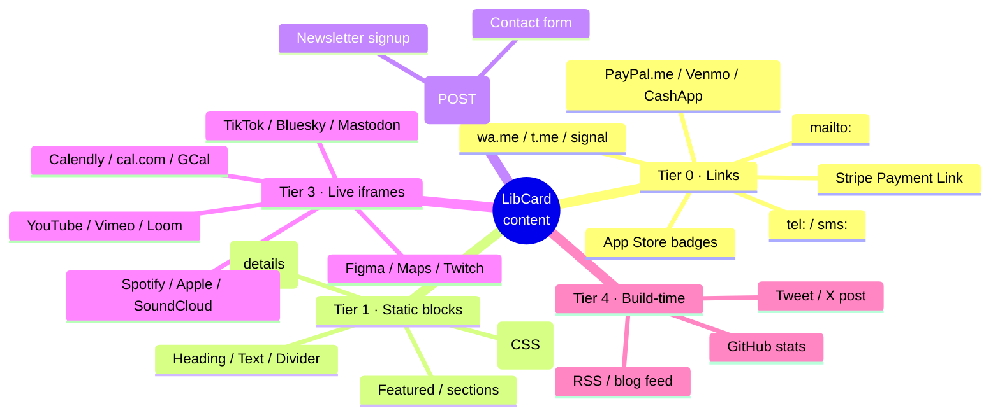
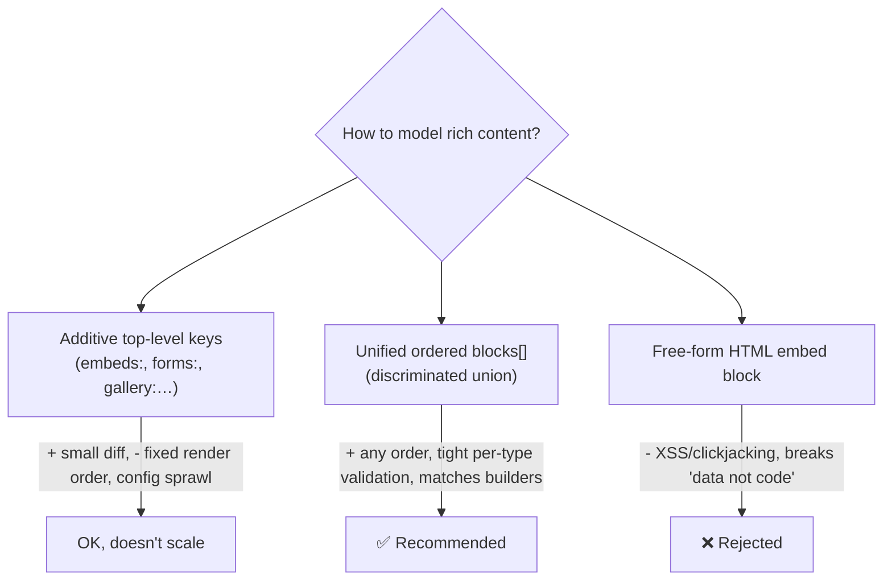
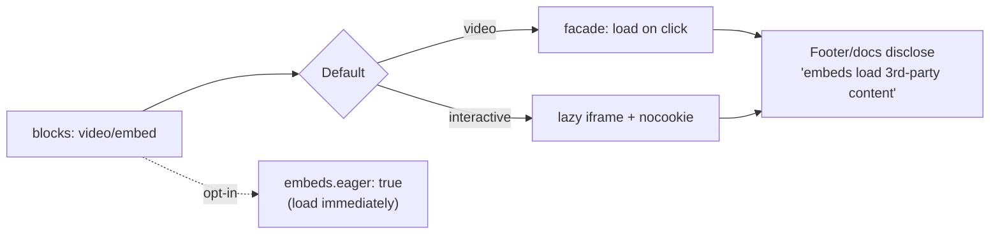
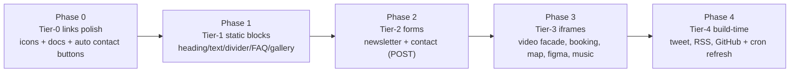
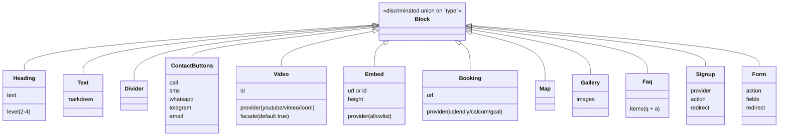

# Rich Content Blocks & Zero-JS Embeds (Phone, Booking, Video, Tweets, Figma…)

> **Status:** Exploration #6. Proposes how LibCard grows from "links + socials +
> contact" into a richer link-in-bio card — phone/WhatsApp buttons, booking
> links, video/music/social/Figma/calendar embeds, signup & contact forms,
> galleries, FAQs — **without breaking the zero-JavaScript, zero-server promise**
> that is the product's whole identity.

## Problem Statement

LibCard today renders a fixed shape from `libcard.config.yaml`: a profile
header, a flat list of `links`, a row of `socials`, and a vCard/QR business-card
reveal (see [`src/pages/index.astro`](../../src/pages/index.astro) and
[`src/lib/schema.mjs`](../../src/lib/schema.mjs)). That covers the "Linktree
basics," but mainstream link-in-bio products (Linktree, Beacons, Bento, Carrd,
Taplink, Hopp, Lnk.bio…) offer a much wider block library: tap-to-call and
WhatsApp buttons, Calendly/cal.com booking, inline YouTube/Spotify, embedded
tweets, Figma frames, Google Calendar booking pages, maps, newsletter signup,
image galleries, FAQs, and more.

The owner's question is: **which of those can we add while staying true to
LibCard's two hard constraints —**

1. **Zero client-side JavaScript** that *we* ship (the page is flat HTML + CSS;
   the only existing exception is the opt-in theme switcher, see
   [`0002_[x]_THEME_MARKETPLACE_AND_LIVE_THEME_SWITCHING.md`](./0002_[x]_THEME_MARKETPLACE_AND_LIVE_THEME_SWITCHING.md)).
2. **Zero server / backend** — it's a static site on GitHub Pages, rebuilt only
   on push (or a scheduled Action).

This doc inventories the feature surface, classifies each feature by how (and
whether) it can be done under those constraints, surfaces the **privacy tension**
that embeds introduce, and recommends a concrete config + rendering architecture.

## Executive Summary

**The short answer: almost everything the owner named is achievable with zero of
our JavaScript and zero server — but they fall into four very different
buckets, and embeds quietly reintroduce third-party tracking unless we design
against it.**

| Feature the owner mentioned | How | Our JS | Privacy note |
|---|---|---|---|
| **Phone number** (tap-to-call) | `tel:` link — *already validates today* | none | none |
| **Calendly / cal.com** | plain `<iframe>` (documented fallback) | none | loads 3rd-party in-frame |
| **Embed a tweet / X post** | **build-time** fetch → inline static HTML | none | none at runtime |
| **YouTube video** | `<iframe>` — default behind a **click-to-load facade** | none | deferred to click |
| **Figma design** | plain `<iframe>` (`embed.figma.com`) | none | loads 3rd-party in-frame |
| **Google Calendar** | plain `<iframe>` appointment page (`gv=true`) | none | loads 3rd-party in-frame |
| **"any embed"** | provider **allowlist** + safe iframe builder | none | per-provider |

The four buckets:

- **Tier 0 — Special-scheme links** (`tel:`, `sms:`, `mailto:`, `wa.me`, `t.me`,
  `geo:`, PayPal.me, Stripe Payment Links…). These are *just links*. Most already
  pass our schema today; the gap is icons, ergonomics, and docs. **Pure HTML.**
- **Tier 1 — Static content blocks** (headings, rich text, dividers, FAQ via
  `<details>`, CSS image galleries, featured links, sections). **Pure HTML/CSS.**
- **Tier 2 — Third-party form POST** (newsletter signup, contact form via
  Formspree / Web3Forms / Buttondown / Mailchimp). A native
  `<form method="POST" action="…">` needs **no JS and no backend** — CORS
  doesn't apply to form navigation.
- **Tier 3 — Live iframe embeds** (YouTube, Vimeo, Spotify, Calendly, cal.com,
  Google Calendar, Figma, Maps, Twitch, TikTok, Bluesky…). **Zero JS on our
  page**, but third-party code runs *inside the sandboxed iframe* — the privacy
  cost we must design around.
- **Tier 4 — Build-time embeds** (tweets/X, RSS/blog feed, GitHub stats).
  Fetched during `astro build`, inlined as static HTML → **zero runtime JS and no
  third-party tracking**, at the cost of needing a rebuild to refresh (a
  GitHub Actions `cron`).

**Recommended architecture:** introduce an optional, ordered **`blocks[]`**
array — a Zod **discriminated union** of typed blocks — as the rich-content area,
while keeping the simple `links`/`socials` keys for the 90% case. Embeds name a
**provider + id/url from an allowlist**; LibCard builds the correct *safe* iframe
(`youtube-nocookie`, `loading="lazy"`, `sandbox`, `referrerpolicy`) — we **never
accept raw HTML/`<iframe>`** from config. This keeps the same "config is data,
not code → safe to accept from anyone" guarantee the theme system already relies
on. Default heavy video to a **pure-HTML privacy facade** (`<details>` +
`<iframe loading="lazy">`), which — verified empirically — loads *no* third-party
request until the visitor clicks.



## Current State In The Repository

The seams this feature touches, as they exist today:

- **Config schema** — [`src/lib/schema.mjs`](../../src/lib/schema.mjs) is the
  single source of truth (Zod). `linkSchema` is
  `{ label, url: z.string().url(), icon? }.strict()`; `socialSchema` is
  `{ platform, url, label? }.strict()`. The top-level object holds `profile`,
  `contact`, `links`, `socials`, `theme`, `footer`, `seo`, `site`. It is **not**
  `.strict()` at the top level (Astro injects `id`), but nested objects are, so
  typos fail the build.
- **Schema → editor/agent** — [`scripts/generate-schema.mjs`](../../scripts/generate-schema.mjs)
  turns that Zod schema into [`libcard.schema.json`](../../libcard.schema.json),
  which powers VS Code autocomplete and tells AI agents exactly what's allowed.
  **Any new block types must generate clean JSON Schema** (discriminated unions
  do — they become `oneOf` with a `const` discriminator).
- **Config loading** — [`src/content.config.ts`](../../src/content.config.ts)
  reads the one YAML file and validates it; **no change needed** for new blocks.
- **Rendering** — [`src/pages/index.astro`](../../src/pages/index.astro) maps
  `cfg.links` to [`LinkButton.astro`](../../src/components/LinkButton.astro),
  then renders `SocialRow` and `CardReveal`. This is where an ordered
  `blocks[]` renderer slots in.
- **Link rendering** — [`LinkButton.astro`](../../src/components/LinkButton.astro)
  already treats only `^https?://` as "external" (so `tel:`/`mailto:` correctly
  open in-context). It *always* shows the `external-link` trailing glyph, though
  — a small polish item for non-http schemes.
- **Icons** — [`src/components/Icon.astro`](../../src/components/Icon.astro) is an
  inline-SVG registry (zero runtime). It has `calendar`, `mail`, `globe`,
  `map-pin`, `youtube`, `link`… but **no `phone`, `message`, `whatsapp`,
  `telegram`, `play`, `music`, `figma`** yet. New blocks need new glyphs here.
- **Build-time generation precedent** — the QR ([`QRCode.astro`](../../src/components/QRCode.astro)),
  vCard ([`contact.vcf.ts`](../../src/pages/contact.vcf.ts)), and OG image
  ([`og.png.ts`](../../src/pages/og.png.ts)) are all generated at build with zero
  client JS. **Tier-4 embeds (tweets, RSS) follow exactly this precedent.**
- **The zero-JS contract** — [`README.md`](../../README.md) advertises "zero
  client-side JavaScript by default; nothing to track you," and
  [`Layout.astro`](../../src/layouts/Layout.astro) only injects script (`ThemeBoot`)
  when the switcher is on. **Embeds must not silently break this promise.**

### What already works today (the cheapest win)

Zod's `.url()` validates via the WHATWG `URL` constructor, which accepts opaque
schemes. So these are **valid `links` entries right now**, with no schema change:

```yaml
links:
  - { label: Call me,    url: "tel:+15551234567" }
  - { label: Text me,    url: "sms:+15551234567?&body=Hi%20Chris" }
  - { label: WhatsApp,   url: "https://wa.me/15551234567?text=Hi%20Chris" }
  - { label: Book a call, url: "https://cal.com/chris/30min", icon: calendar }
```

The only things missing for Tier 0 are **matching icons** and **documentation** —
the rendering already does the right thing.

## External Research

Two research sweeps backed this doc (competitor feature audit; zero-JS embed
techniques). Highlights:

### Competitor feature surface maps ~90% onto static rendering

Across Linktree, Beacons, Bio.link, Bento, Carrd, Stan, Komi, Milkshake,
Snipfeed, Later/Linkin.bio, Taplink, Hopp (by Wix), and Lnk.bio, the *vast
majority* of blocks are achievable statically:

- **Pure-static wins competitors often paywall:** contact buttons
  (tel/sms/WhatsApp/Telegram/vCard), QR codes, app-store badges, image
  galleries/carousels, **FAQ accordions**, rich text/dividers, featured links and
  grouping, and payment **links** (PayPal.me, Venmo, Cash App, **Stripe Payment
  Links**, Gumroad). Stripe Payment Links are notable: a *fully functional
  checkout via a plain `<a href>`* — no JS, no backend.
- **iframe-able (zero of our JS):** video (YouTube/Vimeo/Loom), music
  (Spotify/Apple/SoundCloud/Bandcamp), maps (Google/OSM), booking
  (Calendly/cal.com), and several social embeds (Mastodon, Bluesky, the TikTok
  *player*, and the undocumented Instagram `/embed/` path).
- **Genuine no-JS blockers (need a graceful fallback):** the **X/Twitter rich
  embed** (official path is `widgets.js`), **auto-updating** social feeds (need
  build-time fetch + OAuth), native checkout/courses/memberships (link out to
  hosted checkout instead), and Substack/Beehiiv newsletters (iframe only, no
  form-POST endpoint).
- **Market context:** Bento (bento.me) is shutting down Feb 2026, and Linktree
  has absorbed/killed several competitors — a permanently-free, self-owned,
  won't-disappear card is a real wedge.

### The privacy facade is real — but it's `loading="lazy"` doing the work

A widely repeated blog claim is that putting an `<iframe>` inside a closed
`<details>` defers its load until the user opens it. **This was tested
empirically (Playwright + live network inspection) and is false on its own:**

| Setup | Loaded before interaction? |
|---|---|
| iframe in closed `<details>`, no `loading` attr | ❌ **loads immediately** (full cross-origin request fires) |
| iframe in `display:none` container | ❌ **loads immediately** (even fired analytics POSTs) |
| iframe in closed `<details>` **+ `loading="lazy"`** | ✅ **deferred** — zero network requests until opened |

So a **pure-HTML click-to-load facade is possible**, and the recipe is
`<details>`/`<summary>` (styled as a thumbnail/play button) wrapping an
`<iframe loading="lazy">`. Two honest caveats:

1. **MDN:** "Loading is only deferred when JavaScript is enabled" — an
   anti-tracking measure. A visitor with JS *fully disabled* will load all
   iframes eagerly. (Ironic, but it means the facade protects the ~99% with JS
   on.)
2. **`loading="lazy"` on iframes:** Chrome 77+, Edge 79+, Safari 16.4+, Firefox
   121+ (Dec 2023). Older engines load eagerly. Always set explicit
   `width`/`height`.

### `youtube-nocookie` is *less* tracking, not *no* tracking

`youtube-nocookie.com` sets no cookie at load but still writes a device id to
Local Storage; CNIL has said clicking "Play" isn't valid GDPR consent. So for a
privacy-first product the **facade (load nothing until click)** is the correct
default, with `youtube-nocookie` as the embed domain once revealed.

### Forms: native POST sidesteps CORS and backends

A `<form method="POST" action="https://…">` is a top-level navigation, **not**
`fetch`/XHR, so CORS never applies — any service exposing a real form-encoded
endpoint works from `*.github.io`. Confirmed zero-JS fits: **Formspree**
(`_next` redirect, `_gotcha` honeypot), **Web3Forms** (`botcheck` honeypot),
**Formspark**, **Getform**, and newsletters **Buttondown** / **Mailchimp**
(`/subscribe/post`, not `-json`) / **Kit** (in redirect mode). The only no-JS
tax is a full-page redirect to a thank-you page, and spam protection drops to
**honeypots** (captchas need JS).

### Provider iframe cheat-sheet (the allowlist seeds)

| Provider | Plain iframe URL | Notes |
|---|---|---|
| YouTube | `https://www.youtube-nocookie.com/embed/<ID>` | facade by default |
| Vimeo | `https://player.vimeo.com/video/<ID>?h=<HASH>` | hash for unlisted |
| Loom | `https://www.loom.com/embed/<ID>` | must be `/embed/` |
| Spotify | `https://open.spotify.com/embed/<type>/<ID>` | `allow="encrypted-media"` |
| Apple Music | `https://embed.music.apple.com/<store>/album/<name>/<id>` | |
| SoundCloud | `https://w.soundcloud.com/player/?url=<encoded>` | |
| Calendly | `https://calendly.com/<user>/<event>` | documented no-JS fallback |
| cal.com | `https://cal.com/<user>/<event>` | loses auto-resize |
| Google Calendar | `…/appointments/schedules/<id>?gv=true` | `gv=true` required |
| Google Maps | `https://www.google.com/maps/embed?pb=…` | **no API key** |
| OpenStreetMap | `https://www.openstreetmap.org/export/embed.html?bbox=…` | no key |
| Figma | `https://embed.figma.com/design/<KEY>?embed-host=<host>` | `embed-host` required |
| Twitch | `https://player.twitch.tv/?channel=<n>&parent=<domain>` | `parent` required |
| TikTok | `https://www.tiktok.com/player/v1/<ID>` | official iframe |
| Bluesky | `https://embed.bsky.app/embed/<DID>/app.bsky.feed.post/<RKEY>` | |
| Mastodon | `https://<instance>/@<user>/<id>/embed` | |
| Google Forms | `https://docs.google.com/forms/d/e/<ID>/viewform?embedded=true` | |
| **X / tweet** | *(no clean iframe)* | **build-time** instead |

## Key Findings

1. **The owner's wishlist is fully buildable under the constraints** — phone,
   Calendly/cal.com, YouTube, Figma, Google Calendar, and tweets each have a
   zero-our-JS path. They just don't all use the *same* mechanism (link vs.
   iframe vs. build-time), which is the crux of the design.
2. **"Zero JS" needs a precise definition.** Our page can ship zero JS while a
   YouTube iframe runs hundreds of KB of *YouTube's* JS sandboxed inside the
   frame. That's still "zero JS we ship," but it is **not** "nothing tracks you."
   The product's privacy claim forces a privacy-first embed default.
3. **The privacy facade is genuinely pure-HTML** (`<details>` +
   `<iframe loading="lazy">`) and loads no third-party request until click —
   empirically verified. This lets us keep both promises for video.
4. **Build-time rendering is the on-brand way to embed tweets/RSS** — same
   pattern as the existing QR/vCard/OG generation — yielding zero runtime JS *and*
   zero third-party tracking, traded against freshness (needs a rebuild).
5. **Accepting raw HTML/iframes from config would be a foot-gun.** It breaks the
   "config is data, not code, safe from anyone" property that themes rely on
   (XSS/clickjacking). A **provider allowlist + builder** is the safe analogue.
6. **An ordered, typed `blocks[]` is the right model** — competitors are all
   block builders, and a Zod discriminated union gives tight per-type validation
   plus clean JSON-Schema autocomplete for humans and agents.
7. **Forms and payments fit without a backend** via third-party POST endpoints
   and hosted-checkout links — covering two categories competitors charge for.

## Options And Tradeoffs

### A. Config model — where rich content lives



| Option | Render order | Validation | Safety | Verdict |
|---|---|---|---|---|
| Additive keys (`embeds:`, `gallery:`…) | Fixed by section | Per key | Safe | Doesn't scale; awkward interleaving |
| **Ordered `blocks[]` union** | **Author-controlled** | **Per-type (discriminated)** | **Safe (allowlist)** | **Recommended** |
| Free-form HTML/iframe block | Author-controlled | None | **Unsafe** | Rejected |

Keep `links`/`socials` exactly as they are (the simple path stays simple); add an
**optional `blocks[]`** for everything richer. Render order: profile → links →
`blocks` → socials → card reveal (or let a `blocks` entry be a `links` group so
power users can fully control order later).

### B. Embed rendering strategy (per provider)

```mermaid
flowchart TD
    E{Embed a piece of content} --> Q1{Clean static<br/>representation<br/>available at build?}
    Q1 -->|"Yes (tweet, RSS, GitHub)"| BT["Tier 4: build-time fetch → inline static HTML<br/>zero runtime JS · zero tracking · needs rebuild"]
    Q1 -->|No| Q2{Heavy media that<br/>tracks on load?<br/>(video)}
    Q2 -->|Yes| FAC["Privacy facade:<br/>&lt;details&gt; + &lt;iframe loading=lazy&gt;<br/>no 3rd-party request until click"]
    Q2 -->|"No (booking, map, figma, calendar)"| IF["Plain lazy iframe:<br/>nocookie where possible · sandbox · referrerpolicy"]
    BT --> OUT["Rendered block"]
    FAC --> OUT
    IF --> OUT
```

- **Build-time (Tier 4)** is best when a faithful static snapshot exists (tweets
  via the syndication endpoint / `react-tweet` approach; RSS via fetch+parse;
  GitHub stats via the public API). Zero runtime JS, zero tracking; refresh via a
  scheduled rebuild.
- **Facade (default for video)** when the live embed is heavy and privacy-hostile
  on load. Pure HTML; nothing loads until click.
- **Plain lazy iframe** when the content is inherently interactive and a facade
  is awkward (Calendly booking, a live map, a Figma prototype, a Google Calendar
  appointment page). Still `loading="lazy"`, `youtube-nocookie`-style privacy
  domains where they exist, `sandbox` + `referrerpolicy` always.

### C. Provider allowlist vs. free-form

A discriminated **provider allowlist** (each provider = a tiny adapter mapping
`{provider, id|url}` → a safe iframe or build-time fetch) is strongly preferred
over accepting raw `<iframe>`/HTML:

- **Safety:** no XSS/clickjacking surface; same guarantee as themes-are-data.
- **Consistency:** we apply `loading="lazy"`, `sandbox`, `referrerpolicy`,
  `youtube-nocookie`, and the facade uniformly — authors can't get it wrong.
- **Ergonomics:** `{ type: video, provider: youtube, id: dQw4… }` is far easier
  to hand-write (and for an agent to emit) than a correct iframe.
- **Cost:** we maintain adapters and an allowlist. Mitigation: a generic
  **oEmbed-at-build-time** fallback adapter can resolve many long-tail providers
  into an iframe during the build, so the allowlist needn't cover everything.

### D. Privacy posture (the one that protects the brand)



Defaults: facade for video; lazy + privacy-domain for the rest; honest
disclosure when any live embed is present. Power users can opt into eager loading.
This keeps the README's "nothing to track you" claim *true by default*.

## Recommendation

Adopt a **typed, ordered `blocks[]`** content model with a **provider allowlist**
and **privacy-first embed defaults**, shipped in tiers so each step is on-brand
and independently valuable.

1. **Schema** — add an optional `blocks: z.array(blockSchema).default([])` to
   [`src/lib/schema.mjs`](../../src/lib/schema.mjs), where `blockSchema` is a
   `z.discriminatedUnion("type", […])`. Keep `links`/`socials` untouched.
2. **Rendering** — add a `Block.astro` dispatcher and per-type components; render
   `blocks` in [`src/pages/index.astro`](../../src/pages/index.astro) between
   links and socials.
3. **Embeds** — a `src/lib/embeds.ts` registry of provider adapters producing
   *safe* iframes (or build-time HTML). Never accept raw HTML.
4. **Privacy** — facade (`<details>` + lazy iframe) is the default for video;
   `youtube-nocookie`, `loading="lazy"`, `sandbox`, `referrerpolicy="no-referrer"`
   everywhere; an honest one-line disclosure in the footer when live embeds exist.
5. **Forms** — a `signup`/`contact` form block that emits a plain
   `<form method="POST" action="…">` with a CSS honeypot and a `redirect`/`_next`
   thank-you field. Zero JS, zero backend.
6. **Freshness for Tier 4** — add a scheduled `cron` to the deploy workflow so
   build-time embeds (tweets, RSS) refresh without a push.
7. **Icons** — extend [`Icon.astro`](../../src/components/Icon.astro) with
   `phone`, `message`, `whatsapp`, `telegram`, `play`, `music`, `figma`, `rss`,
   `heart` (tip jar), etc.

### Phased delivery



- **Phase 0/1 are pure HTML/CSS** — they *strengthen* the zero-JS identity and
  ship value immediately (and beat competitors who paywall FAQs/galleries).
- **Phase 2** adds real lead-capture with no backend.
- **Phase 3** is where the privacy work matters; ship the facade first.
- **Phase 4** reuses the existing build-time generation pattern.

### Proposed `blocks[]` shape



## Example Code

> Illustrative, not final — to make the recommendation concrete.

**`libcard.config.yaml`** — new optional `blocks` area:

```yaml
blocks:
  - type: contact-buttons          # tap-to-call/text/chat, auto from contact.phone
    call: true
    whatsapp: "+1-555-123-4567"
    telegram: chrishandle

  - type: booking                  # Calendly / cal.com — plain lazy iframe
    provider: calcom
    url: https://cal.com/chris/30min

  - type: video                    # YouTube — privacy facade by default
    provider: youtube
    id: dQw4w9WgXcQ
    title: My talk at ConfX

  - type: embed                    # Figma — allowlisted iframe
    provider: figma
    url: https://www.figma.com/design/abc123/My-Design

  - type: embed                    # Google Calendar appointment page
    provider: gcal-appointments
    id: AcZssZ0…

  - type: tweet                    # build-time render → zero runtime JS
    url: https://x.com/chris/status/1750000000000000000

  - type: faq                      # native <details>, zero JS
    items:
      - { q: Where are you based?, a: San Francisco, CA }
      - { q: Open to consulting?, a: "Yes — book a call above." }

  - type: signup                   # newsletter via Buttondown, plain POST
    provider: buttondown
    username: chris
```

**`src/lib/schema.mjs`** — discriminated union (excerpt):

```js
const EMBED_PROVIDERS = [
  "youtube", "vimeo", "loom", "spotify", "applemusic", "soundcloud",
  "calendly", "calcom", "gcal-appointments", "gmaps", "osm", "figma",
  "twitch", "tiktok", "bluesky", "mastodon", "gforms",
];

const blockSchema = z.discriminatedUnion("type", [
  z.object({ type: z.literal("heading"), text: z.string().min(1),
             level: z.number().int().min(2).max(4).default(2) }).strict(),
  z.object({ type: z.literal("text"), markdown: z.string().min(1) }).strict(),
  z.object({ type: z.literal("divider"), label: z.string().optional() }).strict(),
  z.object({ type: z.literal("video"),
             provider: z.enum(["youtube", "vimeo", "loom"]),
             id: z.string().min(1), title: z.string().optional(),
             facade: z.boolean().default(true) }).strict(),
  z.object({ type: z.literal("embed"),
             provider: z.enum(EMBED_PROVIDERS),
             url: optionalUrl, id: z.string().optional(),
             height: z.number().int().positive().optional() }).strict(),
  z.object({ type: z.literal("booking"),
             provider: z.enum(["calendly", "calcom", "gcal-appointments"]),
             url: z.string().url() }).strict(),
  z.object({ type: z.literal("faq"),
             items: z.array(z.object({ q: z.string(), a: z.string() })).min(1) }).strict(),
  z.object({ type: z.literal("signup"),
             provider: z.enum(["buttondown", "mailchimp", "kit", "formspree"]),
             username: z.string().optional(), action: optionalUrl,
             redirect: optionalUrl }).strict(),
  // …gallery, contact-buttons, tweet, form
]);

// add to libcardSchema:  blocks: z.array(blockSchema).default([]),
```

**`src/lib/embeds.ts`** — safe iframe builder (excerpt):

```ts
type Frame = { src: string; allow?: string; aspect?: string };

export function buildEmbed(provider: string, opts: { id?: string; url?: string }): Frame {
  switch (provider) {
    case "youtube":
      return { src: `https://www.youtube-nocookie.com/embed/${opts.id}`,
               allow: "autoplay; encrypted-media; fullscreen; picture-in-picture",
               aspect: "16/9" };
    case "spotify":
      return { src: `https://open.spotify.com/embed/${opts.id}`,
               allow: "encrypted-media" };
    case "calcom":
      return { src: opts.url!, aspect: "auto" };
    case "figma":
      return { src: `https://embed.figma.com/...?embed-host=libcard`, aspect: "4/3" };
    // …one small case per allowlisted provider; default → oEmbed at build time
    default:
      throw new Error(`Unknown embed provider: ${provider}`);
  }
}
```

**`src/components/VideoEmbed.astro`** — the verified pure-HTML privacy facade:

```astro
---
import { buildEmbed } from "../lib/embeds";
const { provider, id, title, facade = true } = Astro.props;
const f = buildEmbed(provider, { id });
const iframe = `<iframe src="${f.src}?autoplay=1" loading="lazy"
  width="560" height="315" allow="${f.allow}" referrerpolicy="no-referrer"
  title="${title ?? "Embedded video"}" allowfullscreen></iframe>`;
---
{facade ? (
  <details class="video-facade">
    <summary aria-label={`Play: ${title ?? "video"}`}>
      
    </summary>
    <Fragment set:html={iframe} />
  </details>
) : (
  <Fragment set:html={iframe} />
)}
```

**`src/components/SignupForm.astro`** — newsletter, zero JS / zero backend:

```astro
---
const { username } = Astro.props;   // Buttondown
const action = `https://buttondown.com/api/emails/embed-subscribe/${username}`;
---
<form action={action} method="post" class="signup">
  <input type="text" name="hp-name" tabindex="-1" autocomplete="off"
         class="sr-only" aria-hidden="true" />   {/* honeypot */}
  <input type="hidden" name="embed" value="1" />
  <input type="email" name="email" placeholder="you@example.com" required />
  <button type="submit">Subscribe</button>
</form>
```

**Privacy facade — what the visitor's network does:**

```mermaid
sequenceDiagram
    actor V as Visitor
    participant P as LibCard page (static)
    participant YT as YouTube
    V->>P: Load card
    Note over P,YT: facade iframe is loading="lazy" inside closed &lt;details&gt;<br/>→ NO request to YouTube, NO cookies/trackers
    V->>P: Click the thumbnail (open &lt;details&gt;)
    P->>YT: NOW request the embed (autoplay=1)
    YT-->>V: Player loads & plays
```

## Risks And Open Questions

- **"Zero JS" wording vs. reality.** A live iframe runs the provider's JS
  in-frame. We must keep the README's claim precise: *we* ship zero JS; live
  embeds load third-party content (deferred to click for video). Decide the exact
  footer/docs wording.
- **Privacy regressions.** Adding a YouTube/Calendly iframe reintroduces
  third-party tracking — the very thing LibCard sells against. Mitigation:
  facade-by-default, `nocookie`, lazy, and honest disclosure. Open question:
  should a live-embed page surface a small "loads external content" note
  automatically?
- **Allowlist maintenance.** Provider URL patterns drift (e.g. Instagram's
  `/embed/` is undocumented; X killed clean embeds). Keep adapters small and
  centralized; lean on a build-time oEmbed fallback for the long tail; document
  which providers are "best-effort."
- **Tweet/X fragility.** The syndication endpoint is undocumented and "fails
  randomly with empty 200s." Cache aggressively at build and always render a
  fallback (styled quote + link) when it returns empty.
- **Build-time network in CI.** Tier-4 embeds add network calls to `astro build`
  — flaky networks can fail deploys. Cache fetched payloads and fail *soft*
  (render fallback, warn) rather than failing the build.
- **Freshness expectations.** RSS/tweet blocks only update on rebuild. A `cron`
  helps but isn't real-time; document the tradeoff (as exploration #1 noted for
  Linkyee-style "live data").
- **`loading="lazy"` gaps.** JS-disabled visitors and pre-2023 browsers load
  iframes eagerly, defeating the facade for them. Acceptable, but document it.
- **CSP on GitHub Pages.** We can't set response headers; only a
  `<meta http-equiv="Content-Security-Policy">` (supports `frame-src`, not
  `frame-ancestors`). Decide whether to ship a default `frame-src` allowlist.
- **Layout/CLS.** Embeds need reserved aspect-ratio boxes to avoid layout shift
  and protect the Lighthouse scores exploration #1 still has pending.
- **Schema/JSON-Schema drift for unions.** Verify `zod-to-json-schema` emits a
  clean `oneOf` + `const` discriminator so editor/agent autocomplete stays good
  ([`scripts/generate-schema.mjs`](../../scripts/generate-schema.mjs)).
- **Scope creep.** Resist native commerce/courses/feeds. Link out to hosted
  checkout (Stripe Payment Links, Gumroad) instead of building a store.
- **Accessibility.** Facade `<summary>` needs a real label and keyboard
  operability; iframes need `title`; forms need labels and visible focus.

## Implementation Checklist

**Phase 0 — Tier-0 link polish (pure HTML)**
- [x] Add icons to [`Icon.astro`](../../src/components/Icon.astro): `phone`,
      `message`, `whatsapp`, `telegram`, `signal`, `play`, `music`, `figma`,
      `rss`, `heart`.
- [x] In [`LinkButton.astro`](../../src/components/LinkButton.astro), only show
      the trailing `external-link` glyph for `http(s)` links (not `tel:`/`mailto:`).
- [x] Optionally auto-render tap-to-call / email buttons from `contact.phone` /
      `contact.email`.
- [x] Document special-scheme links (`tel:`, `sms:?&body=`, `wa.me`, `t.me`,
      `mailto:`, `geo:`, PayPal.me, Stripe Payment Links) in the README with
      copy-paste examples.

**Phase 1 — Tier-1 static blocks**
- [x] Add `blocks: z.array(blockSchema).default([])` (discriminated union) to
      [`schema.mjs`](../../src/lib/schema.mjs); regenerate `libcard.schema.json`.
- [x] `Block.astro` dispatcher + components: `Heading`, `Text` (build-time
      Markdown), `Divider`, `Faq` (`<details>`), `Gallery` (CSS scroll-snap),
      `ContactButtons`.
- [x] Render `blocks` in order in [`index.astro`](../../src/pages/index.astro).
- [x] Sanitize/limit Markdown in `text` blocks (no raw HTML) at build time.

**Phase 2 — Tier-2 forms (POST)**
- [x] `Signup` block (Buttondown/Mailchimp/Kit/Formspree) → plain
      `<form method="post">` with CSS honeypot + redirect field.
- [x] `Form` (contact) block (Formspree/Web3Forms) with `fields[]`, honeypot,
      `_next`/`redirect`.
- [x] `.sr-only` honeypot utility; document the redirect-thank-you behavior.

**Phase 3 — Tier-3 live iframes**
- [x] `src/lib/embeds.ts` provider allowlist + safe iframe builder
      (`loading="lazy"`, `sandbox`, `referrerpolicy`, `nocookie`).
- [x] `VideoEmbed.astro` privacy facade (`<details>` + lazy iframe), default on.
- [x] `Embed.astro` (figma/maps/twitch/tiktok/bluesky/gforms/…) +
      `Booking.astro` (calendly/calcom/gcal) + `Map.astro`.
- [x] Reserve aspect-ratio boxes (no CLS); footer/docs disclosure when live
      embeds are present.
- [x] (Optional) build-time **oEmbed fallback** adapter for long-tail providers.

**Phase 4 — Tier-4 build-time embeds**
- [x] `tweet` block: build-time fetch (syndication / `react-tweet`-style) →
      inline static HTML; cache; fallback to quote+link on empty.
- [x] `rss` block: fetch+parse feed → static cards.
- [x] `github` block: public API → static stats card.
- [x] Add a `schedule: cron` trigger to
      [`.github/workflows/deploy.yml`](../../.github/workflows/deploy.yml) so
      Tier-4 content refreshes without a push; fail-soft on network errors.

## Validation Checklist

- [ ] `pnpm build` with `blocks` present produces correct static HTML; **no
      runtime JS** is shipped by any Tier 0–3 block (grep `dist/` for `<script>`).
- [ ] Invalid block (bad `type`, unknown embed `provider`, missing `id`) **fails
      the build** with a readable Zod error.
- [ ] Editor/agent autocomplete works for `blocks[]` from the regenerated
      `libcard.schema.json` (clean `oneOf`/`const`).
- [ ] **Facade verification:** on first paint, a `video` block fires **zero**
      network requests to the provider (DevTools/Playwright network panel); the
      request fires only after opening the `<details>`.
- [ ] `tel:`/`sms:`/`wa.me`/`mailto:` buttons open the right native app on a real
      phone.
- [ ] Newsletter `signup` POST subscribes the address and lands on the provider's
      (or our `redirect`) thank-you page — no JS, no console errors.
- [ ] Contact `form` POST delivers and respects the honeypot (a filled honeypot
      is rejected/ignored).
- [ ] Embeds reserve space (no layout shift); Lighthouse Performance/Best
      Practices don't regress vs. a no-blocks card.
- [ ] Each iframe carries `loading="lazy"`, a `title`, `referrerpolicy`, and a
      minimal `allow`/`sandbox`.
- [ ] Tweet/RSS blocks render the fallback gracefully when the upstream fetch
      returns empty, and the scheduled `cron` rebuild updates them.
- [ ] Keyboard + screen-reader pass on facade `<summary>`, FAQ `<details>`, and
      forms.

## References

- [MDN — `HTMLIFrameElement.loading` (lazy only with JS enabled)](https://developer.mozilla.org/en-US/docs/Web/API/HTMLIFrameElement/loading)
- [web.dev — iframe lazy loading](https://web.dev/articles/iframe-lazy-loading)
- [FrontendMasters — performance-optimized video embeds with zero JS](https://frontendmasters.com/blog/performance-optimized-video-embeds-with-zero-javascript/)
- [Dustin Whisman — youtube-nocookie.com still tracks user data](https://dustinwhisman.com/writing/youtube-nocookie-com-will-still-track-user-data/)
- [Axbom — embed YouTube videos without cookies](https://axbom.com/embed-youtube-videos-without-cookies/)
- [react-tweet (Vercel) — static tweet rendering](https://react-tweet.vercel.app/)
- [Stefan Judis — prerender tweets without the official Twitter APIs](https://www.stefanjudis.com/blog/how-to-prerender-tweets-without-using-the-official-twitter-apis/)
- [oEmbed spec](https://oembed.com/) · [Noembed](https://noembed.com/)
- [TikTok embed player docs](https://developers.tiktok.com/doc/embed-player)
- [Twitch embed docs](https://dev.twitch.tv/docs/embed/)
- [Figma — embed a Figma file](https://developers.figma.com/docs/embeds/embed-figma-file/)
- [Notion — embeds & connections](https://www.notion.com/help/embed-and-connect-other-apps)
- [Calendly — embed options](https://help.calendly.com/hc/en-us/articles/223147027)
- [cal.com — embed docs](https://cal.com/docs/core-features/embed)
- [Google Calendar — appointment schedule embed](https://support.google.com/calendar/answer/190587)
- [RFC 3966 — the `tel:` URI](https://www.rfc-editor.org/rfc/rfc3966.html) · [RFC 6068 — `mailto:`](https://www.rfc-editor.org/rfc/rfc6068.html)
- [WhatsApp — click to chat](https://faq.whatsapp.com/5913398998672934/) · [Telegram — deep links](https://core.telegram.org/api/links)
- [Formspree](https://formspree.io/) · [Web3Forms](https://web3forms.com/) · [Buttondown embeddable form](https://docs.buttondown.com/embedding)
- [Mailchimp — naked/embedded form](https://mailchimp.com/help/add-a-signup-form-to-your-website/)
- [Stripe — Payment Links](https://stripe.com/payments/payment-links)
- [Zod — discriminated unions](https://zod.dev/?id=discriminated-unions)
- [Astro — content collections & build-time data](https://docs.astro.build/en/guides/content-collections/)
- Prior LibCard explorations: [#1 Architecture & MVP](./0001_[_]_LIBCARD_ARCHITECTURE_AND_MVP.md), [#2 Theme Marketplace & Live Switching](./0002_[x]_THEME_MARKETPLACE_AND_LIVE_THEME_SWITCHING.md)
