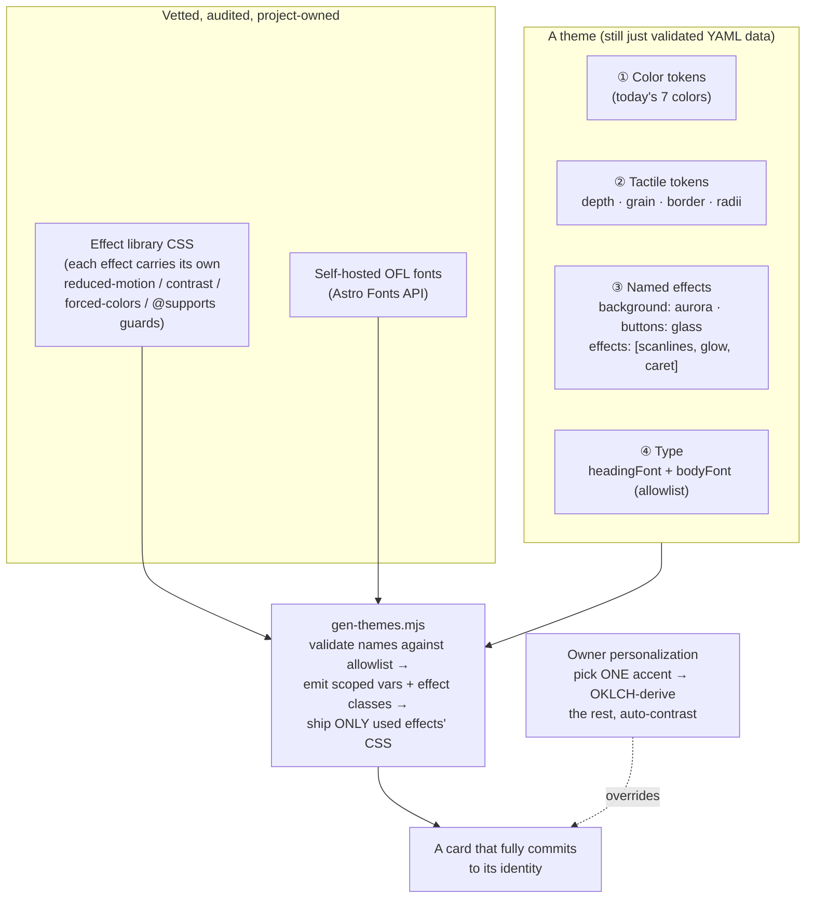
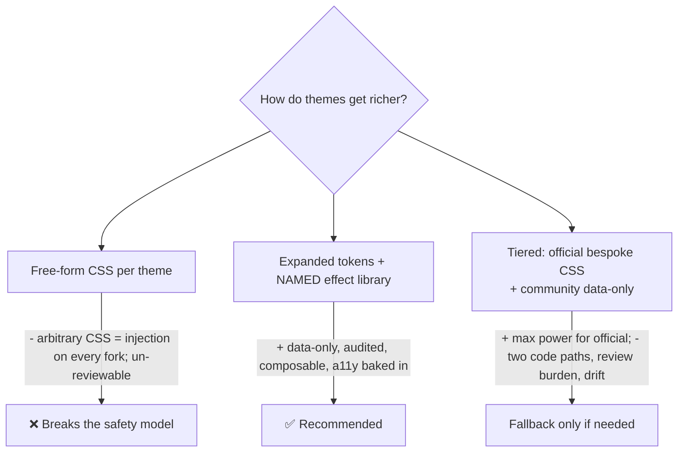
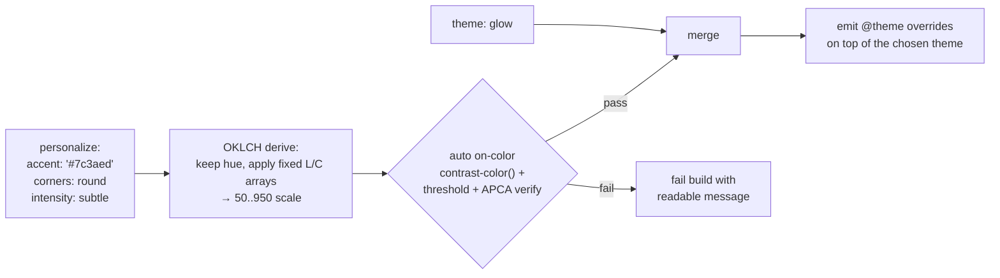
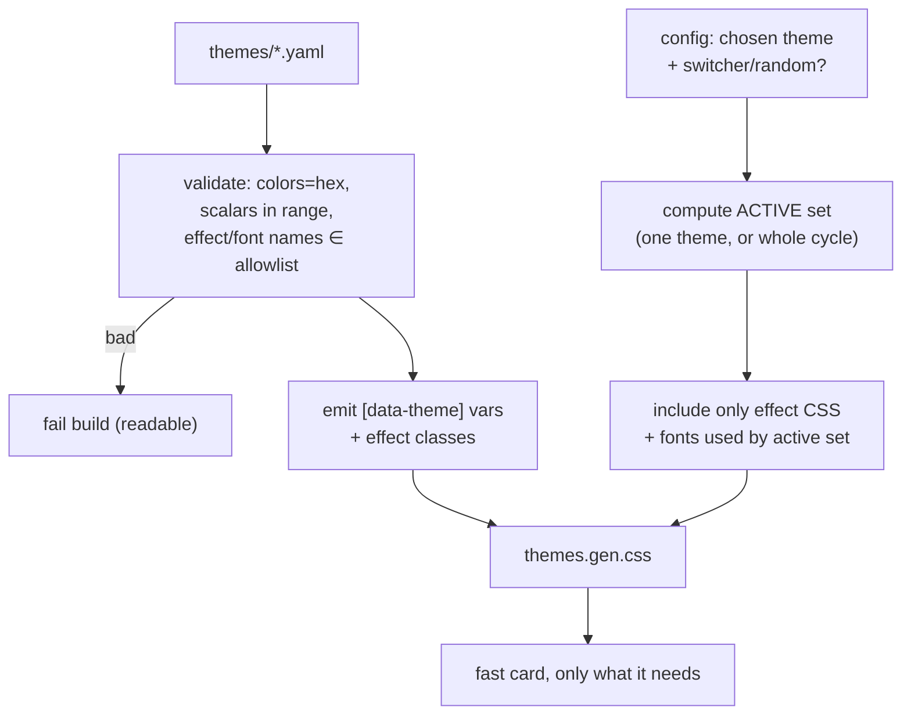

# LibCard — Expressive, Committed Themes: Flourishes, Personalization & a Dialed-In Aesthetic

> **Status:** Exploration #7. Builds on
> [`0002_[x]_THEME_MARKETPLACE_AND_LIVE_THEME_SWITCHING.md`](./0002_[x]_THEME_MARKETPLACE_AND_LIVE_THEME_SWITCHING.md),
> which shipped the data-only theme system (a flat **9-token** YAML contract,
> `gen-themes.mjs` → generated CSS, a live switcher, the footer credit). This doc
> asks the next question: **how do we make themes _commit_ to their identity** —
> a pink-sparkly theme that actually sparkles, a terminal theme that actually
> feels like a terminal — while keeping themes **data, not code** (safe to accept
> by PR), **elegant** (never garish), **fast** (zero-JS by default), and
> **accessible**. It also proposes an owner-level **personalization** layer and a
> **redesign of the dark themes**, which currently feel flat.

## Problem Statement

Today every LibCard theme is the *same card, recolored*. A theme provides 9
tokens — 7 hex colors, a `font` chosen from 4 system stacks, and a corner
`radius` ([`src/lib/theme-schema.mjs`](../../src/lib/theme-schema.mjs#L26)) — and
the components render an identical structure (centered avatar, a column of
surface-colored link buttons with a hairline border and a subtle hover lift, a
social row, a footer). The result:

1. **No theme truly commits to a vibe.** "Terminal" is green-on-black monospace
   ([`themes/terminal.yaml`](../../themes/terminal.yaml)) — but with no scanlines,
   phosphor glow, or blinking caret, it reads as *unstyled text*, not a terminal.
   A "pink sparkly" theme is impossible: there is no way to sparkle. The contract
   can express *hue*, not *identity*.
2. **The dark themes feel weak / "silly."** `midnight` (navy `#0b1120` + indigo),
   `sunset` (plum `#1c1117` + coral, `radius: 1.25rem`), `terminal`, and `ocean`
   share a failure mode: **flat surfaces barely distinguishable from the
   background, zero elevation or material, and identity that stops at the hue.**
   Big radii on flat plum read "blobby"; navy-on-navy reads "muddy."
3. **There's no elegant way to personalize.** An owner can only pick one of the
   built-in themes wholesale. There's no "make it *mine*" — pick my accent, my
   corners — that still looks intentional.

The user's framing is the north star: **"each theme should really pull off its
theme."** If it's pink and sparkly, go all out on pink and sparkly. If it's clean
and minimal, go all out on clean and minimal. If it's engineer-focused or
artist-focused, fully become that. The tension this doc resolves: *maximal
expressiveness* vs. the *data-only safety guarantee* that makes the community
marketplace possible.

## Executive Summary

**Recommended model: keep themes 100% data — but make the data far richer by
layering four things on top of the color tokens, where all the visual power lives
in a _vetted, project-owned effect library_ that themes compose from by name.**



The four layers, each strictly data-only:

1. **Tactile tokens** (the cheapest, highest-leverage win — daisyUI's lesson). Add
   pure-scalar knobs that re-skin *material*, not hue: `depth` (0–1 bevel/elevation
   multiplier), `grain` (0–1 surface noise via an inline `feTurbulence` data-URI),
   `border` (hairline → heavy), and split `radius` into card/button. Two themes
   with the *same palette* become different products. This alone fixes most of the
   "flat dark themes" problem — dark themes gain *material identity* recoloring
   can't give them.
2. **A named effect library** (the architectural centerpiece). A theme writes
   `background: aurora` or `effects: [scanlines, glow]` — a **string from an
   allowlist** — and *the project owns the CSS*. Ship a curated set: `mesh`/`aurora`
   gradients, `glass` (backdrop-blur with `@supports` fallback), `grain`,
   CRT `scanlines`/`glow`/`caret`, `dots`/`grid` patterns, `gradient-text`, and an
   opt-in `confetti`/`sparkle` layer. **Each effect bakes in its own
   reduced-motion, contrast, `forced-colors`, and `@supports` guards**, so a theme
   author can never compose an inaccessible result. Expressiveness lives in a small
   *audited* library; themes only reference it by name → the data-only guarantee
   holds.
3. **Expressive, self-hosted type.** Widen fonts from 4 system stacks to a curated
   **OFL allowlist** (JetBrains Mono, Fraunces, Space Grotesk, Caveat, Press Start
   2P, …), self-hosted via **Astro's privacy-first Fonts API**, selected *by name*
   (never by URL). Split into `headingFont` + `bodyFont`. Only the active theme's
   subsetted WOFF2 ships.
4. **An elegant owner personalization layer.** Let an owner pick **one accent
   color**; derive a full, perceptually-even scale in **OKLCH** and auto-pick
   readable on-colors (contrast guaranteed *by construction*). Plus a few safe
   toggles (corners, density, an effect intensity). One decision; ugly results
   become structurally impossible.

Then **redesign the official theme set** so each is a *reference implementation*
of a fully-committed identity (see [§Recommendation](#recommendation)): `minimal`,
`terminal`, `studio` (artist), `glow` (sparkle), `editorial`, and a genuinely
refined `midnight`. Fewer themes, each excellent.

**Why this stays safe:** a theme never ships CSS or JS. It ships color tokens
(validated hex), scalar tokens (validated numbers), and *names* that index a
library the maintainers wrote and audited. The single place data becomes CSS
remains [`gen-themes.mjs`](../../scripts/gen-themes.mjs) plus the vetted effect
stylesheet.

## Current State In The Repository

The seams this plugs into, as they exist today:

- **The token contract** — [`src/lib/theme-schema.mjs`](../../src/lib/theme-schema.mjs#L26-L64):
  `TOKEN_CONTRACT` is 9 entries; `tokensSchema` validates 7 hex colors, a `font`
  enum of `sans|serif|mono|rounded`, and a `radius` length. `themeToCss()`
  ([L154](../../src/lib/theme-schema.mjs#L154)) is the **single producer of theme
  CSS** — it maps each token to a `--lc-*` declaration and emits one
  `[data-theme="slug"]{…}` block. This is exactly where new tactile tokens and
  effect classes get emitted.
- **The CSS bridge** — [`src/styles/global.css`](../../src/styles/global.css#L12-L23):
  `@theme inline` maps `--lc-*` → Tailwind color/font/radius utilities, so
  `bg-surface`, `text-fg`, `rounded-card` already respond to `data-theme` live.
  New tactile tokens (`--lc-depth`, `--lc-noise`, `--lc-border`) slot in here; the
  effect library is a new `@import`.
- **The generator** — [`scripts/gen-themes.mjs`](../../scripts/gen-themes.mjs):
  reads `themes/*.yaml`, validates, writes `themes.gen.css` + the `themes.json`
  registry. The natural home for "emit only the effect CSS actually used by
  shipped themes."
- **The uniform components** — every card element is one fixed treatment:
  [`LinkButton.astro`](../../src/components/LinkButton.astro) (`bg-surface border
  border-border … hover:-translate-y-0.5 hover:shadow-md`),
  [`Profile.astro`](../../src/components/Profile.astro) (avatar `rounded-full
  ring-2 ring-border`), [`index.astro`](../../src/pages/index.astro). These need to
  read new tokens/effect hooks (e.g. button-fill style, avatar shape, a background
  layer slot).
- **Switcher & boot** — [`ThemeSwitcher.astro`](../../src/components/ThemeSwitcher.astro)
  and [`ThemeBoot.astro`](../../src/components/ThemeBoot.astro): because the
  switcher/random can make *any* theme active client-side, **all cyclable themes'
  effect CSS must ship** when the switcher is on (a payload consideration below).
- **The dark themes, concretely** — [`themes/midnight.yaml`](../../themes/midnight.yaml),
  [`sunset.yaml`](../../themes/sunset.yaml), [`terminal.yaml`](../../themes/terminal.yaml),
  [`ocean.yaml`](../../themes/ocean.yaml): all four set `surface` only a hair
  lighter than `bg` and have no elevation/material/identity hooks. That's the flat
  look the user is reacting to.
- **A11y/perf baseline already present** — `global.css` ships a global
  `prefers-reduced-motion` reset ([L33](../../src/styles/global.css#L33)) and the
  contrast gate ([`scripts/check-contrast.mjs`](../../scripts/check-contrast.mjs))
  enforces WCAG AA on key pairs. Both extend naturally to govern effects.

There is **no** notion of background style, elevation, texture, motion,
decorative layers, heading font, or owner overrides yet — all greenfield.

## External Research

Full findings (URL-cited) summarized; the closest analogs are **daisyUI's
non-color tokens**, **bio-link customizers** (Linktree/Beacons/Carrd/Taplink), and
**OKLCH palette derivation**.

### daisyUI proves non-color knobs create huge range

daisyUI v5 themes carry, beyond colors: `--radius-box/field/selector`,
`--size-*`, `--border`, **`--depth`**, and **`--noise`**
([themes](https://daisyui.com/docs/themes/)). The mechanism matters:

- **`--depth`** is a **0-or-1 multiplier threaded through `calc()`** in each
  component — a tinted two-layer drop shadow + a top inset highlight + a faint
  engraved text-shadow, all scaled by `calc(var(--depth) * …)`. At `0` every term
  collapses to flat ([button.css](https://github.com/saadeghi/daisyui/blob/master/packages/daisyui/src/components/button.css)).
- **`--noise`** gates a pre-baked `feTurbulence` SVG (`--fx-noise`) via
  `background-size: calc(var(--noise) * 100%)` — `0` invisible, `1` full grain
  ([svg.css](https://github.com/saadeghi/daisyui/blob/master/packages/daisyui/src/base/svg.css)).

**Lesson:** treat radius, border weight, bevel depth, and surface grain as
first-class scalar tokens. Same palette + different tactile tokens = "sharp/flat
/utilitarian" vs "soft/raised/tactile." Pure data, fully safe.

### Bio-link customizers: the "preset → tweak" model and the knob menu

Linktree, Beacons, Carrd, Taplink, bio.link all use **pick a theme → override
elements**. The consolidated knob menu:

| Category | Table stakes | Differentiators (rare) |
|---|---|---|
| Background | solid, linear gradient, image | **mesh/blob gradient (nobody exposes)**, video, animated, **glassmorphism (nobody)** |
| Buttons | fill vs outline, square vs round, presets | **independent shadow + border** (Taplink only), per-corner radius, transparency |
| Fonts | curated picker + color | upload (Taplink) |
| Structure | presets → granular | custom CSS (Carrd Pro), AI (Beacons) |

Refs: [Linktree design](https://help.linktr.ee/en/articles/8614125-customizing-your-linktree-design),
[Beacons links block](https://help.beacons.ai/en/articles/4696577),
[Carrd element styles](https://carrd.co/docs/building/using-element-styles),
[Taplink design](https://taplink.at/en/guide/design.html).
**Takeaways:** model background and button as **tagged unions** (not single
tokens); mesh gradients + glass are *unclaimed* differentiators since we own the
renderer.

### A vetted, CSS-only flourish set (all expressible as named, data-only effects)

| Effect | Motion | Technique | Guard needed |
|---|---|---|---|
| Animated gradient | yes | `@property <angle>` rotation / position pan | worst-point text contrast |
| Mesh / aurora | aurora only | layered `radial-gradient`s (+ blurred drifting blobs) | bound blur, 4–6 layers |
| Glass | no | `backdrop-filter: blur() saturate()` | `@supports` fallback + `prefers-reduced-transparency` |
| Grain / paper | no | inline `feTurbulence` data-URI on `::after` | `pointer-events:none`, opacity ≤.15 |
| CRT (scanlines/glow/caret) | caret | `repeating-linear-gradient` + `text-shadow` + `@keyframes blink` | flicker behind `no-preference` |
| Sparkle / confetti | yes | CSS star-field **or** `canvas-confetti` (~3.4 kB JS island) | JS checks reduced-motion |
| Dots / grid | no | `radial`/`linear-gradient` patterns | low contrast |
| Gradient / glow text | optional | `background-clip: text` | solid fallback; large text ≥3:1 |

The **only JS in the whole set is the opt-in confetti island**; everything else
is zero-JS and degrades safely. Refs:
[Comeau on backdrop-filter](https://www.joshwcomeau.com/css/backdrop-filter/),
[CSS-Tricks grainy gradients](https://css-tricks.com/grainy-gradients/),
[animating CSS gradients with `@property`](https://dev.to/afif/we-can-finally-animate-css-gradient-kdk),
[CRT effect](https://aleclownes.com/2017/02/01/crt-display.html),
[canvas-confetti](https://github.com/catdad/canvas-confetti),
[grid/dot backgrounds](https://ibelick.com/blog/create-grid-and-dot-backgrounds-with-css-tailwind-css).

### Expressive type without the privacy/perf tax

Self-host via **[Fontsource](https://fontsource.org/)** / **[Astro's Fonts API](https://docs.astro.build/en/guides/fonts/)**
(downloads, subsets, serves from `_astro/fonts/`). WOFF2 + `font-display: swap`
+ latin subset; load **only the chosen theme's font**. Curated OFL vibes:
JetBrains Mono / IBM Plex Mono (engineer), **Fraunces** / Newsreader / Spectral
(editorial), Space Grotesk / Bricolage (display), Caveat / Shantell Sans
(handwritten), Press Start 2P / Silkscreen (pixel). **⚠ Exclude Clash Display —
not OFL** (Fontshare ITF license forbids rehosting). Keep selection **by-name,
never by-URL** (a `font-url` field would reintroduce SSRF/privacy risk).

### Personalization that stays elegant: derive, don't expose

Every guardrailed customizer (tweakcn, daisyUI generator, Radix Colors, Material
You) follows one recipe: **shrink the surface the user touches → derive the rest
algorithmically in OKLCH/HCT → guarantee contrast by construction.** The "pick one
accent, rotate hue across fixed L/C arrays" recipe
([Evil Martians, OKLCH](https://evilmartians.com/chronicles/better-dynamic-themes-in-tailwind-with-oklch-color-magic))
emits a believable 50–950 scale from a single hue; auto on-color via
`contrast-color()` with an OKLCH lightness-threshold fallback
([Lea Verou](https://lea.verou.me/blog/2024/contrast-color/)), verified with APCA
([apcach](https://evilmartians.com/opensource/apcach)). Tailwind v4 is OKLCH-native.

### Accessibility & performance guardrails (non-negotiable)

- **`prefers-reduced-motion: reduce`** — already shipped globally; effects must
  honor it ([MDN](https://developer.mozilla.org/en-US/docs/Web/CSS/@media/prefers-reduced-motion)).
- **Contrast over gradients/glass/images** — test the **worst-case point**, not
  the average; text over imagery without it is WCAG
  [Failure F83](https://www.w3.org/TR/WCAG20-TECHS/F83.html). Gradient text →
  large display only, solid fallback always.
- **`forced-colors` (Windows HCM)** neutralizes `box-shadow`, `text-shadow`, and
  non-URL `background-image` — so glow/scanlines/grain vanish; never encode meaning
  in them, restore boundaries under `@media (forced-colors: active)`
  ([MDN](https://developer.mozilla.org/en-US/docs/Web/CSS/@media/forced-colors)).
- **Performance** — `backdrop-filter` is the priciest effect (cap blur ≤~10px,
  few panels, never animate); animate only `transform`/`opacity`
  ([web.dev animations](https://web.dev/articles/animations-guide)); keep any image
  bg tiny (AVIF/WebP) to protect LCP/CLS.

## Key Findings

1. **The contract, not the components, is the ceiling.** Nothing about Astro or
   the card structure prevents committed themes — the *9-token contract* simply
   can't describe them. Widen the contract (safely) and identity becomes possible.
2. **Tactile scalars are the cheapest 80%.** `depth` + `grain` + `border` +
   split `radius` (pure validated numbers, daisyUI-proven) give *material*
   identity and single-handedly rescue the flat dark themes — before any effect.
3. **A named effect library is the only way to "go all out" *and* stay
   data-only.** Themes reference audited effects by name; the maintainers own the
   CSS and its a11y guards. This is the architectural keystone.
4. **Backgrounds and buttons want to be tagged unions**, not single colors
   (`solid | gradient | mesh | aurora | image`; fill/outline/soft/glass × shape ×
   shadow). Mesh + glass are differentiators no competitor exposes.
5. **Owner personalization should expose ~1 decision** (accent) and derive the
   rest in OKLCH with guaranteed contrast — elegance by construction, not by
   asking the user to be a designer.
6. **External image/font URLs stay banned for submissions.** Community themes use
   gradients/patterns/bundled fonts only; *owner* config may point at a local
   `/public` asset. This preserves the no-arbitrary-URL safety property.
7. **Payload must be tree-shaken.** Effect CSS and fonts should ship only for
   themes that can actually be active (the single chosen theme, or the whole cycle
   when the switcher/random is on) — otherwise the zero-JS/fast promise erodes.
8. **Guards belong in the library, not the theme.** Each effect bakes in
   reduced-motion / forced-colors / `@supports` / contrast handling, so no
   composition a theme author writes can be inaccessible.

## Options And Tradeoffs

### A. How to add expressiveness while staying safe



| Option | Expressive ceiling | Safe for PRs | Reviewable | Verdict |
|---|---|---|---|---|
| Free-form CSS in themes | ∞ | ❌ (CSS exfiltration/defacement on forks) | ❌ | **No** |
| **Expanded tokens + named effect library** | High (composes a rich menu) | ✅ (names + validated scalars) | ✅ (review the *data*) | **Recommended** |
| Tiered (official may write CSS) | ∞ for official | ✅ community / ⚠ official | partial | Only if the library can't express a flagship idea |

**Recommendation: the named effect library.** Reach for tiering *only* if a
specific flagship theme needs something the library can't yet express — and prefer
*adding the effect to the library* over a one-off.

### B. Background model

| Option | Pros | Cons | Verdict |
|---|---|---|---|
| Single `bg` color (today) | trivial | flat, no identity | baseline |
| **Tagged union** `solid \| gradient \| mesh \| aurora \| dots \| grid` | rich, data-only, all CSS-gradient based (no assets) | more schema | **Recommended (community-safe set)** |
| + `image{src,overlay}` | photographic looks | external URL risk | **Owner-only**, local `/public` paths |

### C. Effects: CSS-only vs a JS island

Everything ships CSS-only **except** true particle confetti. Recommendation:
provide `sparkle` (CSS star-field, zero-JS) as the default, and `confetti` (a
~3.4 kB `canvas-confetti` island) as an explicit opt-in that only loads when a
theme uses it *and* motion is allowed — consistent with the switcher being the
one existing opt-in island.

### D. Personalization surface

| Option | Elegant-by-default | Power | Verdict |
|---|---|---|---|
| Full granular knobs (Taplink-style) | ✗ (easy to make ugly) | high | No (off-brand) |
| **One accent → OKLCH-derive + auto-contrast** | ✓ (can't go ugly) | medium | **Recommended** |
| + a few curated toggles (corners, density, effect intensity) | ✓ | medium-high | **Recommended add-on** |

### E. Fonts

System-only (today) is zero-cost but flat. **Recommended:** keep system stacks as
defaults; add a self-hosted OFL allowlist via Astro Fonts; ship only the active
theme's subset. Split `headingFont`/`bodyFont` so e.g. a display heading pairs
with a readable body.

### F. Structural "chrome" (optional, higher effort)

Beyond surface effects, some identities want *structure*: a terminal prompt line
(`visitor@libcard:~$`), a polaroid frame around the avatar, a paper-tape header.
Model as a small **`chrome` enum** mapping to vetted Astro partials (still
data-only — the theme names it, the project renders it). Defer past the first
phase; it's the most component-invasive piece.

## Recommendation

Ship the **four-layer data-only model** with the **effect library as the
centerpiece**, then **redesign the official themes** as reference identities.

### The expanded (still data-only) theme shape

```mermaid
erDiagram
    THEME ||--|| COLORS : has
    THEME ||--|| TACTILE : has
    THEME ||--o| BACKGROUND : "tagged union"
    THEME ||--o{ EFFECTS : "names from allowlist"
    THEME ||--|| TYPE : has
    THEME ||--|| BUTTONS : has
    COLORS { hex bg; hex surface; hex fg; hex muted; hex accent; hex accentContrast; hex border }
    TACTILE { num depth "0..1"; num grain "0..1"; enum border "none|hairline|normal|heavy"; len radiusCard; len radiusButton }
    BACKGROUND { enum kind "solid|gradient|mesh|aurora|dots|grid"; hex[] stops; num angle }
    EFFECTS { enum name "glass|grain|scanlines|glow|caret|gradient-text|sparkle|confetti"; enum intensity "subtle|medium|bold" }
    TYPE { enum headingFont; enum bodyFont }
    BUTTONS { enum fill "solid|soft|outline|ghost|glass"; enum shadow "none|soft|hard|glow" }
```

### The six fully-committed official identities

Each is a *reference implementation* — palette + tactile tokens + effects + type,
all data-only:

| Theme | Identity → "all out" on… | Key data |
|---|---|---|
| **minimal** | clean, quiet | `depth:0 grain:0`, hairline border, system sans, no bg effect, ample radius, ghost buttons |
| **terminal** | engineer | JetBrains Mono, `effects:[scanlines,glow,caret]`, `bg:grid`, sharp radius, outline buttons, prompt `chrome` (phase 2) |
| **studio** | artist | Fraunces headings + readable body, `effects:[grain]`, soft `depth`, warm off-white, polaroid avatar (phase 2) |
| **glow** | pink & sparkly | `bg:aurora` (pink/violet), `effects:[gradient-text,sparkle]`, `glass` buttons, large radius, accent `glow` |
| **editorial** | magazine | Newsreader/Spectral, high-contrast neutrals, no flourish, generous spacing |
| **midnight** *(redesigned)* | refined dark | OKLCH-derived deep neutral, subtle `grain`+`depth`, `glass` surface, restrained accent — *material*, not "darker hex" |

### Owner personalization (elegant by construction)



### Build pipeline (tree-shaken, safe)



### Rollout (phased, each shippable)

1. **Tactile tokens** (`depth`, `grain`, `border`, split `radius`) + retune the
   dark palettes in OKLCH. Highest leverage, lowest risk, no new dependencies.
2. **Effect library v1**: `mesh`/`aurora`/`dots`/`grid` backgrounds, `glass`,
   `grain`, `gradient-text` — all CSS-only, guards baked in, tree-shaken.
3. **Type**: Astro Fonts + OFL allowlist, `headingFont`/`bodyFont`.
4. **CRT set** (`scanlines`/`glow`/`caret`) + `sparkle`; **confetti** island opt-in.
5. **Owner personalization** (OKLCH accent derivation + curated toggles).
6. **Redesign official themes** into the six identities; optional `chrome` partials.

## Example Code

> Illustrative, not final.

**An "all-out" theme — `themes/glow.yaml`** (still pure data):

```yaml
# yaml-language-server: $schema=./theme.schema.json
name: Glow
author: LibCard
license: MIT
mode: dark
tags: [dark, pink, sparkly, gradient]
description: Pink-violet aurora, sparkles, and glassy buttons — fully extra.
tokens:
  bg: "#140a1f"
  surface: "#1e1030"
  fg: "#fdf4ff"
  muted: "#c9a9e9"
  accent: "#e879f9"
  accentContrast: "#1a0726"
  border: "#3b1d52"
  depth: 0.6           # raised, tactile
  grain: 0.0
  border-weight: hairline
  radius: 1.5rem
  heading-font: space-grotesk
  body-font: sans
background:
  kind: aurora         # vetted CSS-only layered radial gradients
  stops: ["#e879f9", "#7c3aed", "#22d3ee"]
buttons:
  fill: glass          # backdrop-blur + @supports fallback
  shadow: glow
effects:
  - name: gradient-text   # applied to the name heading (large → AA-safe)
    intensity: bold
  - name: sparkle         # CSS star-field, reduced-motion aware, zero JS
    intensity: medium
```

**Extended `tokensSchema` (additions)** — `src/lib/theme-schema.mjs`:

```js
const unit = (lo, hi) => z.number().min(lo).max(hi);
const EFFECTS = ["glass", "grain", "scanlines", "glow", "caret", "gradient-text", "sparkle", "confetti"];
const FONTS = ["sans", "serif", "mono", "rounded", "jetbrains-mono", "fraunces", "space-grotesk", "caveat", "press-start"];

export const tokensSchema = z.object({
  /* …existing 7 colors… */
  font: z.enum(FONTS).default("sans"),        // body, kept for back-compat
  "heading-font": z.enum(FONTS).optional(),   // defaults to body
  radius: z.string().regex(LENGTH).default("1rem"),
  depth: unit(0, 1).default(0),               // bevel/elevation multiplier
  grain: unit(0, 1).default(0),               // feTurbulence overlay strength
  "border-weight": z.enum(["none", "hairline", "normal", "heavy"]).default("normal"),
}).strict();

const background = z.discriminatedUnion("kind", [
  z.object({ kind: z.literal("solid") }).strict(),
  z.object({ kind: z.literal("gradient"), stops: z.array(color).min(2).max(5), angle: z.number().default(135) }).strict(),
  z.object({ kind: z.literal("mesh"), stops: z.array(color).min(2).max(6) }).strict(),
  z.object({ kind: z.literal("aurora"), stops: z.array(color).min(2).max(4) }).strict(),
  z.object({ kind: z.enum(["dots", "grid"]) }).strict(),
]);

const effect = z.object({
  name: z.enum(EFFECTS),
  intensity: z.enum(["subtle", "medium", "bold"]).default("medium"),
}).strict();

export const themeSchema = z.object({
  /* …existing metadata… */
  tokens: tokensSchema,
  background: background.optional(),
  buttons: z.object({
    fill: z.enum(["solid", "soft", "outline", "ghost", "glass"]).default("solid"),
    shadow: z.enum(["none", "soft", "hard", "glow"]).default("soft"),
  }).strict().default({ fill: "solid", shadow: "soft" }),
  effects: z.array(effect).default([]),
}).strict();
```

**`themeToCss()` emits scalars + an effect hook** (still only `--lc-*` + a class):

```js
// tactile scalars as plain custom properties the library reads via calc()
decls.push(`  --lc-depth: ${t.tokens.depth};`);
decls.push(`  --lc-noise: ${t.tokens.grain};`);
decls.push(`  --lc-border-w: ${BORDER_WIDTH[t.tokens["border-weight"]]};`);
// effects become data-attributes the vetted library targets — never raw CSS:
const fx = (theme.effects ?? []).map((e) => e.name).join(" ");
// → <html data-theme="glow" data-fx="aurora gradient-text sparkle" data-fx-intensity="medium">
```

**The vetted library owns the CSS** — `src/styles/effects.css` (excerpt):

```css
/* depth: tinted elevation, collapses to flat at 0 (daisyUI pattern) */
.lc-card, .lc-btn {
  box-shadow:
    0 2px 4px -2px color-mix(in oklab, var(--lc-surface) calc(var(--lc-depth) * 40%), transparent),
    0 0.5px 0 0.5px oklch(100% 0 0 / calc(var(--lc-depth) * 6%)) inset;
}
/* grain: one inline feTurbulence, gated by --lc-noise (no external asset) */
body::after {
  content: ""; position: fixed; inset: 0; pointer-events: none; z-index: 1;
  background-image: var(--lc-grain-svg); mix-blend-mode: overlay;
  opacity: calc(var(--lc-noise) * 0.12);
}
/* aurora background — CSS only, motion-guarded */
[data-fx~="aurora"] body {
  background:
    radial-gradient(at 20% 25%, var(--lc-aurora-1) 0, transparent 50%),
    radial-gradient(at 80% 20%, var(--lc-aurora-2) 0, transparent 50%),
    radial-gradient(at 60% 80%, var(--lc-aurora-3) 0, transparent 50%), var(--lc-bg);
}
/* glass buttons — fallback first, enhance only where supported */
[data-fx~="glass"] .lc-btn { background: color-mix(in oklab, var(--lc-surface) 88%, transparent); }
@supports (backdrop-filter: blur(8px)) {
  [data-fx~="glass"] .lc-btn { background: color-mix(in oklab, var(--lc-surface) 45%, transparent); backdrop-filter: blur(8px) saturate(1.3); }
}
/* every animated effect inherits the global reduced-motion reset; forced-colors restores borders */
@media (forced-colors: active) { .lc-card, .lc-btn { border: 1px solid CanvasText; } }
```

**Owner personalization (OKLCH derive)** — `scripts/derive-accent.mjs` sketch:

```js
// One accent → a perceptually-even scale; on-colors guaranteed readable.
import { formatHex, oklch, converter } from "culori";
const L = [0.978,0.936,0.881,0.827,0.742,0.648,0.573,0.469,0.394,0.32,0.238];
const C = [0.011,0.032,0.061,0.091,0.140,0.147,0.130,0.107,0.090,0.073,0.054];
export function scaleFromAccent(hex) {
  const { h } = converter("oklch")(hex);
  return L.map((l, i) => formatHex(oklch({ l, c: C[i], h })));   // 50..950
}
// on-color: contrast-color() in CSS where supported; build-time APCA verify as the gate.
```

## Risks And Open Questions

- **CSS payload growth.** A full effect library, shipped wholesale, fights the
  fast-card promise. **Mitigation:** tree-shake to the *active set* (one theme, or
  the whole cycle if switcher/random is on); measure the cycle-on case — it may
  justify lazy-loading per-theme effect CSS.
- **The data-only guarantee under "intensity" + unions.** More schema = more
  validation surface. Keep every value constrained (enums, bounded numbers, hex);
  never accept a raw string that reaches CSS. Re-audit `themeToCss` so the *only*
  interpolations are validated scalars/hex and fixed class names.
- **Accessibility of "going all out."** Aurora + gradient-text + glass can each
  break contrast. Guards must live in the library, and the **contrast gate must
  evaluate the worst-case point** over gradients (not just `fg`/`bg`). Open: how to
  automatically check contrast over a gradient background in CI.
- **`forced-colors` / reduced-motion / reduced-transparency** strip the very
  flourishes that *are* the identity. Decide the floor each theme degrades to (it
  must still be usable and on-brand-ish), and never encode meaning in an effect.
- **Fonts vs. bundle & CLS.** Each vibe font is real bytes; variable fonts +
  subsetting + `swap` + metric overrides needed. Confirm Astro Fonts' subsetting
  output and preload story. Licensing audit required (exclude non-OFL like Clash).
- **Confetti island vs zero-JS ethos.** It's opt-in and gated, but it *is* JS on a
  page that prides itself on shipping none. Worth it only for the `glow`-style
  flagship; keep `sparkle` (CSS) as the default sparkle.
- **Owner image backgrounds = the one external-asset door.** Restrict to local
  `/public` paths in *owner* config only; never allow in community submissions
  (preserves the no-arbitrary-URL property). Auto-apply a readability scrim.
- **Scope & review burden.** This is large. Phase it; each phase ships value
  alone. Don't let the schema outrun the rendered support (an unimplemented effect
  name must fail validation, not silently no-op).
- **Theme count vs quality.** "Wide variety" and "each pulls it off" pull apart at
  scale. Recommend *curating* the official set to a few flagships; let breadth come
  from the community marketplace, with the effect library raising everyone's floor.
- **Versioning the contract.** New tokens must default so old community themes
  stay valid; document a `v` or rely on additive-with-defaults (today's stance).

## Implementation Checklist

**Phase 1 — tactile tokens + dark-theme retune**
- [ ] Add `depth`, `grain`, `border-weight`, and split `radius` (card/button) to
      `tokensSchema` + `TOKEN_CONTRACT`, all bounded/enum (defaults preserve today).
- [ ] Emit `--lc-depth`, `--lc-noise`, `--lc-border-w`, `--lc-radius-*` in
      `themeToCss`; wire the daisyUI-style `calc()` elevation + `feTurbulence`
      grain into `LinkButton`/card/`Profile` via `global.css`.
- [ ] Retune `midnight`/`sunset`/`terminal`/`ocean` palettes in OKLCH; give each a
      distinct `depth`/`grain`/`border` so dark themes gain material identity.
- [ ] Extend `check-contrast.mjs`/schema docs for the new tokens; update
      `themes/README.md` token table.

**Phase 2 — effect library v1 (CSS-only) + tree-shaking**
- [ ] Author `src/styles/effects.css` with `mesh`/`aurora`/`dots`/`grid`, `glass`,
      `grain`, `gradient-text` — each with reduced-motion / `@supports` /
      `forced-colors` guards baked in.
- [ ] Add `background` (discriminated union) + `effects` (allowlist) + `buttons`
      to the schema; emit `data-fx`/`data-fx-intensity` + `--lc-aurora-*` etc.
- [ ] `gen-themes.mjs`: compute the **active set** from config (single theme vs
      full cycle) and inline only the effect CSS that set uses.
- [ ] Fail the build/CI on unknown effect/background names.

**Phase 3 — expressive type**
- [ ] Integrate Astro Fonts API; build the OFL allowlist (exclude non-OFL);
      add `heading-font`/`body-font` enums; load only the active set's subset.
- [ ] Pair heading/body in the components; verify `swap` + CLS (metric overrides).

**Phase 4 — CRT set + sparkle + confetti island**
- [ ] `scanlines`/`glow`/`caret` (CSS), `sparkle` (CSS star-field).
- [ ] `confetti` as an opt-in `canvas-confetti` island that loads only when used
      and motion is allowed.

**Phase 5 — owner personalization**
- [ ] `personalize:` config block (accent + curated toggles); `derive-accent.mjs`
      (OKLCH scale + auto on-color); APCA verification gate; emit `@theme`
      overrides layered over the chosen theme.

**Phase 6 — redesign official themes**
- [ ] Rebuild `minimal`/`terminal`/`studio`/`glow`/`editorial`/`midnight` as
      reference identities; (optional) `chrome` partials (prompt line, polaroid).
- [ ] Curate the shipped set; regenerate previews; refresh the gallery.

## Validation Checklist

- [ ] A theme with bad data (out-of-range `depth`, unknown effect/font name,
      non-hex stop) **fails the build/CI** with a readable message.
- [ ] `themeToCss` output review confirms only validated scalars/hex + fixed class
      names reach CSS — no path for raw CSS/JS from a theme.
- [ ] Single-theme config ships **only** that theme's effect CSS + font; zero-JS
      unless a `confetti` theme is chosen; Lighthouse Perf ≥ 95 holds.
- [ ] Switcher/random config ships the cycle's effect CSS and still passes perf
      budgets (measured), or lazy-loads per theme.
- [ ] Every official theme passes WCAG AA at the **worst-case point** over its
      background (gradient/glass included), and `accentContrast`/`accent`.
- [ ] `prefers-reduced-motion`: aurora/sparkle/caret/confetti stop; the card stays
      legible and on-brand.
- [ ] `forced-colors: active`: borders/boundaries restored; no information lost.
- [ ] `@supports` fallback verified for `glass` (no backdrop-filter → opaque).
- [ ] Owner sets one `accent`: derived scale renders, on-colors are AA, build
      fails loudly if a chosen accent can't meet contrast.
- [ ] Side-by-side: the redesigned dark `midnight` reads as *refined/material*,
      not flat; `terminal` reads convincingly as a terminal; `glow` is unmistakably
      sparkly — i.e. each theme "pulls it off."
- [ ] Fonts: only the active theme's subset downloads; CLS < 0.1; no external font
      requests (self-hosted only).

## References

**Repo**
- [Exploration #2 — Theme Marketplace & Switching](./0002_[x]_THEME_MARKETPLACE_AND_LIVE_THEME_SWITCHING.md)
- [`src/lib/theme-schema.mjs`](../../src/lib/theme-schema.mjs) · [`scripts/gen-themes.mjs`](../../scripts/gen-themes.mjs) · [`src/styles/global.css`](../../src/styles/global.css) · [`src/components/LinkButton.astro`](../../src/components/LinkButton.astro) · [`scripts/check-contrast.mjs`](../../scripts/check-contrast.mjs)

**Non-color tokens**
- [daisyUI themes](https://daisyui.com/docs/themes/) · [theme generator](https://daisyui.com/theme-generator/) · [`button.css` (`--depth`)](https://github.com/saadeghi/daisyui/blob/master/packages/daisyui/src/components/button.css) · [`svg.css` (`--noise`)](https://github.com/saadeghi/daisyui/blob/master/packages/daisyui/src/base/svg.css)

**Bio-link customizers**
- [Linktree design](https://help.linktr.ee/en/articles/8614125-customizing-your-linktree-design) · [Beacons links block](https://help.beacons.ai/en/articles/4696577) · [Carrd element styles](https://carrd.co/docs/building/using-element-styles) · [Taplink design](https://taplink.at/en/guide/design.html)

**Flourish techniques**
- [Comeau — backdrop-filter](https://www.joshwcomeau.com/css/backdrop-filter/) · [CSS-Tricks — grainy gradients](https://css-tricks.com/grainy-gradients/) · [Animating CSS gradients (`@property`)](https://dev.to/afif/we-can-finally-animate-css-gradient-kdk) · [CRT effect](https://aleclownes.com/2017/02/01/crt-display.html) · [canvas-confetti](https://github.com/catdad/canvas-confetti) · [Grid/dot backgrounds](https://ibelick.com/blog/create-grid-and-dot-backgrounds-with-css-tailwind-css)

**Type**
- [Astro Fonts API](https://docs.astro.build/en/guides/fonts/) · [Fontsource](https://fontsource.org/) · [web.dev — optimize web fonts](https://web.dev/learn/performance/optimize-web-fonts)

**OKLCH personalization**
- [Evil Martians — OKLCH dynamic themes](https://evilmartians.com/chronicles/better-dynamic-themes-in-tailwind-with-oklch-color-magic) · [Lea Verou — `contrast-color()`](https://lea.verou.me/blog/2024/contrast-color/) · [apcach](https://evilmartians.com/opensource/apcach) · [tweakcn](https://tweakcn.com/) · [Radix Colors scale](https://www.radix-ui.com/colors/docs/palette-composition/understanding-the-scale)

**Accessibility & performance**
- [MDN — prefers-reduced-motion](https://developer.mozilla.org/en-US/docs/Web/CSS/@media/prefers-reduced-motion) · [MDN — forced-colors](https://developer.mozilla.org/en-US/docs/Web/CSS/@media/forced-colors) · [WCAG F83 (text over background)](https://www.w3.org/TR/WCAG20-TECHS/F83.html) · [web.dev — animations guide](https://web.dev/articles/animations-guide) · [web.dev — optimize CLS](https://web.dev/articles/optimize-cls)
