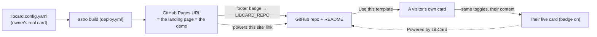
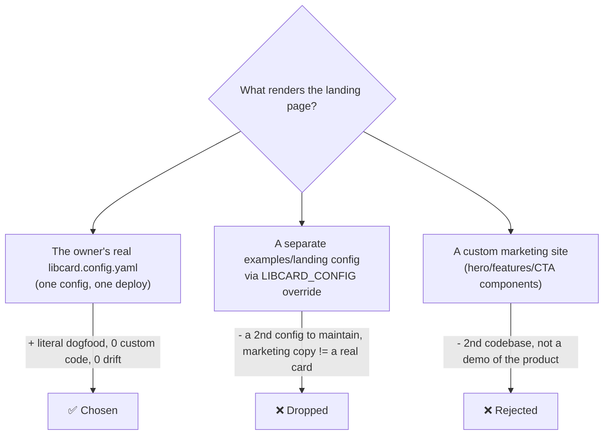
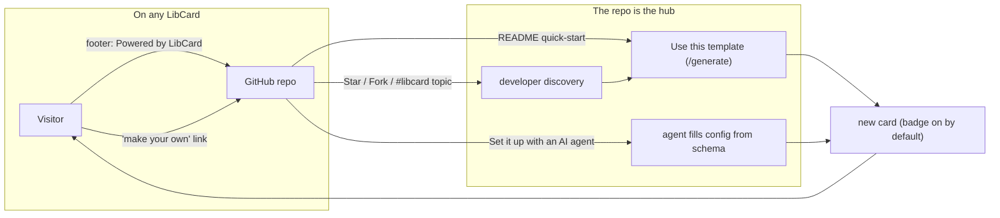
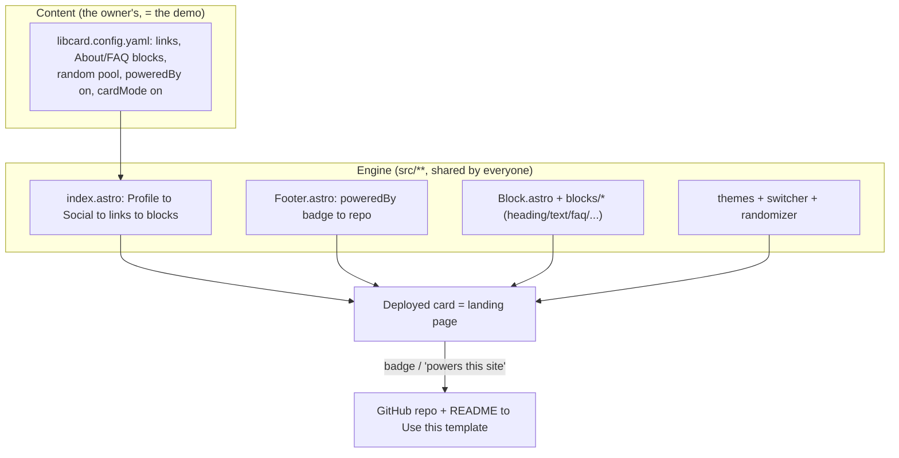

# LibCard Landing Page — The Card *Is* The Landing Page, & The Viral "Powered by LibCard" Loop

> **Status:** Exploration #8. Originally drafted at kickoff (as a provisional
> #2) alongside [`0001_…_LIBCARD_ARCHITECTURE_AND_MVP.md`](./0001_[_]_LIBCARD_ARCHITECTURE_AND_MVP.md);
> **renumbered to #8 and rewritten on 2026-06-26** now that LibCard is largely
> built and the owner has settled the central decision (below). It reads against
> the **real, shipped code** rather than a greenfield plan.

> ### ⟳ Update (2026-06-26) — direction change
>
> The owner has decided: **the default landing page is simply the owner's own
> live LibCard** — *not* a separate, custom-built marketing site. The deployed
> page at the project's GitHub Pages URL is exactly what
> [`libcard.config.yaml`](../../libcard.config.yaml) renders, the same way every
> user's card is.
>
> The things that make that page double as a good "landing page" — the
> **theme randomizer**, the **live theme switcher**, the **"Powered by LibCard"
> badge**, the **★-star buttons**, the **About/FAQ content blocks**, **card
> mode**, **save-contact** — are **not bespoke marketing features**. They are
> ordinary LibCard features that *anybody* can toggle on or off in their own
> config. The example site demonstrates them by *using* them.
>
> **What this reverses from the original draft:** the earlier recommendation of
> *"one repo, two configs"* (a clean starter config **plus** a separate
> `examples/landing/` marketing config built into a dedicated `libcard.dev` via a
> `LIBCARD_CONFIG` override and a second deploy workflow) is **dropped**. There is
> **one config, one deploy**. Likewise, the proposed bespoke marketing blocks
> (`hero`, `features`, `cta`, `builder`) are **not** needed — the existing
> `heading` / `text` / `faq` / `gallery` content blocks already do the explaining,
> and the owner has done exactly that in the real config. *"Don't go crazy making
> something super custom for the example site — the example site is just my site."*

## Problem Statement

LibCard needs a landing page, under a tight constraint that turns out to be a
*feature*: **the landing page should be a LibCard.** A visitor should see the
real product, live — not a screenshot of it — and from that same page understand
what it is and how to make their own. And every LibCard anyone deploys should
quietly advertise LibCard (a "Powered by LibCard" footer linking home), so the
product spreads through its own output.

The original draft treated "be a card" and "be a landing page" as a tension to
engineer around (two configs, a richer block model, optional marketing-only
sections). In practice the owner resolved it the simplest possible way:

- **One artifact.** The landing page *is* `libcard.config.yaml`, the owner's
  actual card — deployed once, like any user's card. There is no second codebase
  and no second config to keep in sync.
- **Demo by dogfooding.** The page sells LibCard by being a good LibCard with
  several optional features switched on. Nothing on it is unavailable to a
  regular user.
- **Marketing via ordinary blocks.** "About LibCard," the FAQ, and the
  "powers this site" link are authored with the same `heading` / `text` / `faq`
  blocks and `links` any user has.
- **The viral loop runs through GitHub.** The footer badge already links to the
  **repo** (`LIBCARD_REPO`), whose README is the onboarding surface and whose
  **"Use this template"** button is the conversion action.

So the remaining question is narrow and practical: **given that the landing page
is just the owner's card, what small, non-custom polish maximizes the
make-your-own / viral loop — while keeping every such affordance a toggle any
user can adopt?**

## Executive Summary

**Ratify the owner's decision and add only light, universally-reusable polish.**

1. **The card is the landing page. Keep it that way.** One
   [`libcard.config.yaml`](../../libcard.config.yaml), one
   [`deploy.yml`](../../.github/workflows/deploy.yml). No `examples/landing/`, no
   `LIBCARD_CONFIG` override, no separate marketing deploy. This is the strongest
   possible form of "the landing page and the card are the same thing": they are
   *literally the same file*.
2. **Every demo/onboarding affordance is a toggle, by construction.** The
   randomizer (`theme.random`), switcher (`theme.switcher`), badge
   (`footer.poweredBy`), star buttons (`links[].star/stars`), content blocks
   (`blocks:`), and card mode (`cardMode`) are all already config flags. The
   example site just turns the welcoming ones on. Treat "is this a toggle anyone
   can flip?" as the acceptance test for any future landing-page idea — if it
   isn't, it doesn't belong.
3. **The viral hub is the GitHub repo + README, not a marketing site.** The
   [`Footer.astro`](../../src/components/Footer.astro) badge links to
   `LIBCARD_REPO`; the README's **"Use this template"** + **"Set it up with an AI
   agent"** sections are the conversion funnel. This is already wired; the loop
   exists today.
4. **Small polish, all reusable:** (a) **unify the badge wording** — code renders
   *"Powered by LibCard"* while the README/TRADEMARK call it *"Made with
   LibCard"*; pick one; (b) make the **"make your own" affordance a documented
   pattern, not a feature** — it's just a `link` or a one-line `text` block, so
   anyone can add it without new code; (c) optionally append a coarse **`?ref=`**
   to the badge href so the loop is *measurable* on static hosting; (d) consider
   an optional, default-off **first-run nudge** for freshly-deployed, still-default
   cards.
5. **Resist building a marketing site.** The README is the explainer; the live
   card is the demo. If a `libcard.dev` domain is ever wanted, it should be the
   **same card on a custom domain** (a `CNAME` + `site.base: "/"`), not a new
   bespoke app.

**Mental model:** LibCard is a theme; the owner's card is that theme's demo site —
and the demo *is* the documentation, the marketing, and the integration test,
because it's built from nothing but the product's own toggles.



## Current State In The Repository

LibCard is no longer greenfield — the #1 MVP and several follow-on explorations
shipped. The landing page already exists *as the deployed card*. Relevant reality:

- **The card itself** — [`src/pages/index.astro`](../../src/pages/index.astro)
  renders a fixed flow: `Profile → SocialRow → links → blocks → CardReveal`,
  with [`Footer.astro`](../../src/components/Footer.astro) below. The "landing
  page" is this page; there is no separate template.
- **The owner's config is the demo** —
  [`libcard.config.yaml`](../../libcard.config.yaml) is Christopher Smothers's
  real card and shows the deliberate onboarding touches the owner mentioned:
  - a `links` entry **"LIBCard (powers this site)"** → the repo, with a ★-star
    sub-button (`star: true`, `stars: build`);
  - a `blocks:` sequence — `divider("More") → heading("About LibCard") →
    text(markdown blurb) → faq(["Is it really free?", "Can I use my own
    domain?"]) → contact-buttons` — i.e. the "explain it" content built from
    **ordinary** blocks;
  - `theme.switcher: true` + `theme.random: [default, paper, mono]` (the
    **randomizer**, pool-curated) so the page shows off theming live;
  - `footer.poweredBy: true` + `footer.themeCredit: true`; `cardMode.enabled:
    true`; `seo.description`.
- **The badge / viral hook already ships** —
  [`Footer.astro`](../../src/components/Footer.astro) renders *"Powered by
  LibCard"* as an `<a href={LIBCARD_REPO}>` when `footer.poweredBy` is on, plus
  *"<theme> theme by <author>"* credit. `LIBCARD_REPO` lives in
  [`src/lib/themes.ts`](../../src/lib/themes.ts).
- **The block model exists** — a Zod **discriminated union** of typed content
  blocks (`feat(schema): add the blocks discriminated union`) in
  [`src/content.config.ts`](../../src/content.config.ts), rendered by
  [`src/components/Block.astro`](../../src/components/Block.astro) over
  [`src/components/blocks/`](../../src/components/blocks/): `Heading`, `TextBlock`,
  `Divider`, `Faq`, `Gallery`, `ContactButtons`, `Booking`, `Embed`/`EmbedFrame`,
  `VideoEmbed`, `MapEmbed`, `SignupForm`, `ContactForm`, `Tweet`, `Rss`,
  `GitHubCard`. (Detailed in
  [`0006_…_RICH_CONTENT_BLOCKS_AND_ZERO_JS_EMBEDS.md`](./0006_[_]_RICH_CONTENT_BLOCKS_AND_ZERO_JS_EMBEDS.md).)
  Note this is a **content-blocks-in-the-middle** model, *not* the full-page
  `sections:` reflow the original draft imagined — the page skeleton is fixed and
  blocks slot between links and socials.
- **Themes + randomizer + switcher** — `themes/*.yaml` token files, the `/themes`
  gallery ([`src/pages/themes.astro`](../../src/pages/themes.astro)), and the live
  switcher/random mode (the only features that ship a little JS). Background:
  [`0002_…_THEME_MARKETPLACE_AND_LIVE_THEME_SWITCHING.md`](./0002_[x]_THEME_MARKETPLACE_AND_LIVE_THEME_SWITCHING.md)
  and [`0007_…_EXPRESSIVE_THEMES_AND_FLOURISHES.md`](./0007_[_]_EXPRESSIVE_THEMES_AND_FLOURISHES.md).
- **Onboarding surfaces already wired** — [`README.md`](../../README.md) has the
  **"Use this template"** quick-start, the `pnpm run setup` wizard
  ([`scripts/setup.mjs`](../../scripts/setup.mjs)), a **"Set it up with an AI
  agent"** section pointing at [`libcard.schema.json`](../../libcard.schema.json),
  and an **"Updating your card"** flow (`pnpm run update`,
  [`scripts/update.mjs`](../../scripts/update.mjs);
  [`0005_…_UPGRADE_PATH_AND_HOSTING_GUIDES.md`](./0005_[x]_UPGRADE_PATH_AND_HOSTING_GUIDES.md)).
- **Star buttons** — `links[].star/stars` with build-time counts
  ([`0004_…_GITHUB_STAR_BUTTON_AND_STAR_COUNT.md`](./0004_[x]_GITHUB_STAR_BUTTON_AND_STAR_COUNT.md)).
- **Content vs. engine boundary** — [`AGENTS.md`](../../AGENTS.md): a user's files
  (`libcard.config.yaml`, `public/`, their themes) are sacred; everything in
  `src/**` is the replaceable engine. This boundary is *why* "the landing page is
  just config" works — the example site carries zero custom engine code.
- **Naming/trademark** — [`TRADEMARK.md`](../../TRADEMARK.md) + the README's
  closing note ask forks to **"leave the 'Made with LibCard' footer link in
  place."** (Wording mismatch with the rendered *"Powered by LibCard"* — flagged
  below.)

**Bottom line:** the architecture this exploration needs already exists. The work
left is *editorial and growth-tuning*, not new subsystems.

## External Research

*(Carried forward from the original draft — still valid, and it now argues for
keeping the loop where it already is rather than building anything new.)*

### Default-on attribution footers are a proven growth loop

- **Hotmail** — the canonical case: a one-line signature (*"PS: I love you — Get
  your free email at Hotmail,"* the word **Hotmail** hyperlinked to signup) drove
  **~12M users in ~18 months** at near-zero marginal cost, because the footer
  rode inside an artifact people already trusted.
  ([Strategy Breakdowns](https://strategybreakdowns.com/p/hotmails-viral-growth-loop),
  [The Marketing Millennials](https://themarketingmillennials.com/articles/2023-01-09/the-unknown-story-of-how-hotmail-grew-to-12-million-users-in-1-5-years/))
- **Typeform** — *"We didn't do anything else really."* A *"Powered by Typeform"*
  button on every shared form was the growth engine.
  ([OpenView](https://openviewpartners.com/blog/typeforms-viral-growth-and-its-disruption/))
- **Calendly** — *"Powered by Calendly"* under every booking page; ~25% of new
  users first saw it on someone else's page. ([FlowJam playbook](https://www.flowjam.com/blog/viral-loop-examples-saas-the-definitive-playbook-for-engineering-self-sustaining-growth))
- **Carrd / Linktree / Notion / Vercel** — all carry a *made-with / powered-by /
  deployed-on* mark on free or public output. The recurring lesson: keep the mark
  **non-intrusive and default-on**.

**Implication for LibCard:** we have **no paid tier**, so the badge is pure
goodwill — a social norm like *"Built with Astro"* or the old *"Fork me on
GitHub"* ribbon (and trademark-backed; see [`TRADEMARK.md`](../../TRADEMARK.md)).
The only lever we control is **default-on + tasteful**, and both already hold:
`footer.poweredBy` defaults `true` and the badge is a single small link.

### Viral coefficient (k-factor) — be honest

K = (invites per user) × (conversion per invite). **K > 1 is exponential**;
**0.3–0.7 is "good"** and *supplements* other channels.
([LaunchList](https://getlaunchlist.com/blog/viral-coefficient-k-factor-guide),
[Insightful CFO](https://insightfulcfo.blog/2025/07/28/viral-coefficient-engineering-product-led-growth/))
For LibCard the badge → visitor → *deploy a repo* conversion is inherently
lower-friction-than-a-signup-but-higher-than-a-click, so don't bank on K>1 from
the badge alone. Its real job: make every card a free, perpetual billboard that
*compounds* with the **GitHub loop** (stars, forks, **"Use this template"** at
`/generate`, the `libcard` topic). ([GitHub Blog on template repos](https://github.blog/developer-skills/github/generate-new-repositories-with-repository-templates/))

### Block/section schemas (context for why content blocks suffice)

Page-builder systems (Sanity, Storyblok, Builder.io, Astro landing kits) all
model a page as typed blocks mapped to components. ([Sanity](https://www.sanity.io/learn/course/page-building/create-page-builder-schema-types),
[Agnite Astro landing system](https://agnitestudio.com/blog/astro-landing-page-system/))
LibCard already has this as its `blocks` discriminated union — which is precisely
why **no marketing-only block types are needed**: `heading` + `text` + `faq` +
`gallery` already compose an "explainer," as the real config demonstrates.

## Key Findings

1. **"The card is the landing page" is now a settled decision, and it's the right
   one.** It maximizes dogfooding, eliminates a second codebase, and makes the
   "same thing" promise literal. Every later finding follows from honoring it.
2. **The two-config / separate-marketing-site plan is obsolete.** Reversed. One
   config, one deploy. (See Option B for why the override approach is now strictly
   worse than the single-card reality.)
3. **Bespoke marketing blocks are unnecessary.** The shipped content blocks cover
   "explain it." The owner already built the explainer from `heading`/`text`/`faq`
   — proof the catalog is sufficient. New `hero`/`cta` block types would add
   surface area for no gain and violate "don't go custom."
4. **The viral loop already runs, through GitHub.** Badge → repo → "Use this
   template." Nothing to build; only to *sharpen* (wording, optional measurement).
5. **The product's design philosophy guarantees fairness.** Because of the
   content/engine boundary, anything the example site does is a toggle a user can
   flip. "Is it a toggle anyone can use?" is the test for future landing ideas.
6. **The only real defects are editorial:** the **"Powered by" vs "Made with"**
   wording split, and the absence of (optional) **loop measurement** and a
   **make-your-own** call-to-action pattern — none of which require new features.

## Options And Tradeoffs

### A. What *is* the landing page?



| Option | Custom code | Drift risk | Is it a real demo? | Verdict |
|---|---|---|---|---|
| **Owner's real card = landing page** | none | none | yes (it *is* the product) | **✅ Chosen** |
| Separate `examples/landing` config + override | a config + a 2nd workflow | medium | partly (marketing copy, not a lived-in card) | **❌ Dropped (was the old rec)** |
| Bespoke marketing site | a whole 2nd app | high | no | ❌ |

**Recommendation: keep the owner's card as the landing page.** It is the most
honest demo possible and costs nothing to maintain.

### B. Why the old "two configs" recommendation is reversed

The original draft proposed shipping a clean **starter** config at the root and
building `libcard.dev` from a **marketing** `examples/landing/libcard.config.yaml`
selected by a `LIBCARD_CONFIG` env override + a second `deploy-site.yml`. Now that
the project is real, that approach is **strictly worse** than what exists:

- **It adds a maintenance burden** (a second config, a second workflow, a config
  selector in [`content.config.ts`](../../src/content.config.ts)) to produce a
  page that is *less* convincing than a real, lived-in card.
- **Marketing copy is not a demo.** A hand-tuned "look how great this is" config
  doesn't prove the product the way the owner's actual links, repos, theme
  choices, and contact details do.
- **It reintroduces drift** between "the example" and "a real card" — the exact
  thing dogfooding is meant to kill.
- **The repo already ships a perfectly good starter.** `pnpm run setup` and the
  README quick-start handle "new user starts clean"; the owner's committed config
  is the *example*, and "Use this template" users immediately replace it with
  their own. No starter-vs-marketing split is needed.

> If org separation is ever desired (e.g. a neutral `libcard.dev`), do it as the
> **same card on a custom domain** (`public/CNAME` + `site.base: "/"`), not a
> forked marketing app. Same code, same toggles, one more deploy.

### C. The demo/onboarding affordances are all just toggles

Every "landing-pageish" thing on the example site maps to a config flag any user
can set. This table *is* the design philosophy:

| Affordance on the example site | Config toggle | Anyone can use it? | On in the owner's card today? |
|---|---|---|---|
| Theme **randomizer** (curated pool) | `theme.random: [...]` | ✅ | ✅ `[default, paper, mono]` |
| Live **theme switcher** | `theme.switcher: true` | ✅ | ✅ |
| **"Powered by LibCard"** badge | `footer.poweredBy: true` | ✅ (default on) | ✅ |
| **Theme credit** | `footer.themeCredit: true` | ✅ (default on) | ✅ |
| **★ Star** buttons + counts | `links[].star/stars` | ✅ | ✅ |
| **"About LibCard"** explainer | `blocks: heading + text` | ✅ | ✅ |
| **FAQ** | `blocks: faq` | ✅ | ✅ |
| **"powers this site"** repo link | a normal `links` entry | ✅ | ✅ |
| **Card mode** / QR / save-contact | `cardMode`, `contact` | ✅ | ✅ |
| **Make your own** CTA | a `link` or one-line `text` block | ✅ | *(see D)* |

**Takeaway:** there is nothing to "build for the landing page." There is only
*config the owner chooses*, and the same choices are available to everyone. Future
landing ideas must pass the same test: **expressible as a toggle, or it doesn't
ship.**

### D. The "make your own" call-to-action — a pattern, not a feature

A visitor on *anyone's* card should have an easy path to making their own. Today
that path is: the **footer badge** (→ repo) and, on the owner's card, the
**"LIBCard (powers this site)"** link (→ repo). That's already decent. To make it
crisper *without* a new block type, treat the CTA as a **documented pattern**:

```yaml
# Anyone can add a friendly "make your own" nudge — no special feature needed:
links:
  - { label: Make your own LibCard, url: https://github.com/crs48/LIBCard, icon: github }
# …or as a one-line content block:
blocks:
  - { type: text, markdown: "Like this page? **[Make your own LibCard](https://github.com/crs48/LIBCard)** — it's free." }
```

| Option for the CTA | New code? | Verdict |
|---|---|---|
| **Document the link/text pattern** (above) | none | **✅ Recommended** — zero surface area, fully reusable |
| A dedicated `cta` block type | a block + component | ❌ over-engineered; `text` already does it |
| Bake a CTA into the badge | a tweak to `Footer.astro` | ⚠️ optional; the badge already links home — keep it a single clean link |

### E. The viral loop — through the repo, as it already is



The hub is the **GitHub repo + README**, not a marketing site — and it's *already
wired*. The only enhancement worth considering is **measurement** (§F). Note the
two loops compound: the **badge loop** (visitor-driven) feeds the **GitHub loop**
(developer-driven, via stars/forks/topic), and the README is where both convert.

### F. Measuring the loop on static hosting (optional, low-effort)

No backend ⇒ attribution is indirect. Cheap, privacy-respecting options:

- **Coarse `?ref=` on the badge** — link to `…/LIBCard?ref=card` (or `?ref=<host>`
  derived from `site.url`). GitHub's repo **traffic insights** then show referrer
  volume. Keep it coarse (no per-visitor identifiers; the badge ships **zero JS
  and sets no cookies** — that promise must not change).
- **GitHub as the scoreboard** — stars, forks, `/generate` clicks, and `libcard`
  topic count are the honest KPIs for the developer loop.
- **Opt-in showcase** — a `libcard` topic crawl or a "submit your card" list
  doubles as social proof + backlinks. (Future; not required.)

Recommendation: add the **coarse `?ref=`** (one-line change in
[`Footer.astro`](../../src/components/Footer.astro) / the `LIBCARD_REPO` link) and
otherwise lean on GitHub's own metrics. Don't add analytics JS to the badge.

### G. Editorial fix — unify "Powered by" vs "Made with"

[`Footer.astro`](../../src/components/Footer.astro) renders **"Powered by
LibCard"**, while [`README.md`](../../README.md) and
[`TRADEMARK.md`](../../TRADEMARK.md) ask forks to keep the **"Made with LibCard"**
footer link. Same intent, two names — confusing for anyone reading the trademark
note while looking at their footer.

| Choice | Pros | Notes |
|---|---|---|
| **Standardize on "Powered by LibCard"** | matches shipped UI & most prior art (Calendly/Typeform) | update README + TRADEMARK wording |
| Standardize on "Made with LibCard" | matches the trademark note & "Made with Astro/Notion" idiom | update `Footer.astro` |

**Recommendation:** pick **"Powered by LibCard"** (it's what's live and what the
attribution research uses), and update the README/TRADEMARK prose to match. Either
way, make the three say the same thing.

## Recommendation

**Bless the current shape; ship a few editorial/growth tweaks; build no marketing
site and no marketing-only features.**

1. **Keep the landing page = the owner's card.** One
   [`libcard.config.yaml`](../../libcard.config.yaml), one
   [`deploy.yml`](../../.github/workflows/deploy.yml). Do **not** add
   `examples/landing/`, a `LIBCARD_CONFIG` override, or a second deploy.
2. **Adopt "every landing affordance is a toggle" as a documented principle**
   (in [`AGENTS.md`](../../AGENTS.md) and/or this doc's table in §C), so future
   ideas stay reusable instead of becoming bespoke marketing.
3. **Unify the badge wording** to **"Powered by LibCard"** across
   [`Footer.astro`](../../src/components/Footer.astro),
   [`README.md`](../../README.md), and [`TRADEMARK.md`](../../TRADEMARK.md) (§G).
4. **Document the "make your own" CTA as a link/`text` pattern** in the README's
   blocks/links section (§D) — no new block type.
5. **Optionally add a coarse `?ref=`** to the badge href so the loop is measurable
   via GitHub traffic insights, with **no JS and no cookies** (§F).
6. **Optionally add a default-off first-run nudge** for an unedited, still-default
   deployed card (e.g. keyed off a `meta.default: true` marker shipped in the
   template config, removed once the user edits) — a gentle "👋 edit
   `libcard.config.yaml` to make this yours." Keep it off for real cards.
7. **If `libcard.dev` is ever desired**, make it the **same card on a custom
   domain** (`public/CNAME` + `site.base: "/"`), not a new app.

### What to explicitly *not* do

- ❌ A separate marketing config / `examples/landing/` / `LIBCARD_CONFIG` override.
- ❌ Bespoke `hero` / `features` / `cta` / `builder` block types.
- ❌ Any landing affordance that isn't also a normal user toggle.
- ❌ Tracking JS or cookies on the badge or anyone's card.

### How the pieces fit (current reality)



## Example Code

> Concrete, minimal diffs — all reusable by any user.

**The "make your own" CTA as pure config** (no engine change):

```yaml
# In any user's libcard.config.yaml — the entire "feature" is a link:
links:
  - label: Make your own LibCard
    url: https://github.com/crs48/LIBCard
    icon: github
```

**Coarse, JS-free attribution on the badge** —
[`src/components/Footer.astro`](../../src/components/Footer.astro) (illustrative):

```diff
- href={LIBCARD_REPO}
+ href={`${LIBCARD_REPO}?ref=card`}   {/* coarse referrer tag; no JS, no cookies */}
```

**Optional first-run nudge** — shipped in the *template's* starter config, gone
the moment the user edits anything meaningful:

```yaml
# Template default only; a real card omits this.
meta:
  default: true   # engine shows a subtle "edit libcard.config.yaml" until changed
```

```astro
---
// e.g. a tiny FirstRunNudge.astro, rendered only when cfg.meta?.default is true
import { getConfig } from "../lib/config";
const cfg = await getConfig();
---
{cfg.meta?.default && (
  <p class="text-center text-xs text-muted">
    👋 This is a fresh LibCard — edit <code>libcard.config.yaml</code> to make it yours.
  </p>
)}
```

**Standardize the wording** — `Footer.astro` already says "Powered by LibCard";
update the prose to match, e.g. in [`README.md`](../../README.md):

```diff
- Just leave the "Made with LibCard" footer link in place
+ Just leave the "Powered by LibCard" footer link in place
```

## Risks And Open Questions

- **Badge wording drift** (real, minor). Code vs. docs disagree ("Powered by" vs
  "Made with"). **Fix:** §G — standardize on "Powered by LibCard."
- **Badge erosion.** Open-source ⇒ anyone can set `footer.poweredBy: false`, and
  developers (our audience) are the most likely to. **Mitigation:** the badge is a
  goodwill+trademark norm, not a wall; lean on the GitHub loop (stars/forks/
  template/topic) as the primary engine and treat the badge as compounding bonus.
- **`?ref=` privacy.** Even a coarse referrer tag is a (tiny) signal. **Mitigation:**
  keep it non-identifying (`?ref=card`), never set cookies/pixels, never add JS to
  the badge. If in doubt, skip it and rely on GitHub traffic insights alone.
- **First-run nudge plumbing.** Detecting "still default" needs a marker
  (`meta.default`) the template ships and the user's first edit removes — or a
  content hash. Small but real engine work; keep it **default-off** so it never
  shows on a real card. **Open:** is it worth it, or does the README quick-start
  already cover first-run?
- **"Same card on a custom domain" base path.** A `libcard.dev` deploy needs
  `site.base: "/"` and a `CNAME`; getting `base` wrong is still the #1 footgun
  (per #1 and the README). **Mitigation:** the setup wizard already handles base.
- **Scope discipline.** The temptation to add "just one" marketing block will
  recur. **Mitigation:** enforce the §C test — *toggle anyone can use, or it
  doesn't ship.*
- **Numbering.** This doc was renumbered #2 → #8 to resolve a collision with the
  shipped [`0002_…_THEME_MARKETPLACE…`](./0002_[x]_THEME_MARKETPLACE_AND_LIVE_THEME_SWITCHING.md).
  (The repo also has duplicate `0004_*` files; worth a cleanup pass someday.)

## Implementation Checklist

**Already shipped (ratified by this exploration — no action):**
- [x] Landing page = the owner's real [`libcard.config.yaml`](../../libcard.config.yaml), one deploy.
- [x] "Powered by LibCard" badge → repo ([`Footer.astro`](../../src/components/Footer.astro), `footer.poweredBy`).
- [x] Explainer built from ordinary blocks (`heading` + `text` + `faq`) in the real config.
- [x] Randomizer + switcher (`theme.random` / `theme.switcher`); ★-star buttons; card mode.
- [x] Onboarding via README "Use this template", `pnpm run setup`, and the AI-agent path.

**New, small, all reusable:**
- [x] **Unify wording** to "Powered by LibCard" in [`README.md`](../../README.md) and [`TRADEMARK.md`](../../TRADEMARK.md) (match `Footer.astro`).
- [ ] **Document the "make your own" CTA pattern** (a `link` / one-line `text` block) in the README's links/blocks section.
- [ ] **Add the §C "every affordance is a toggle" principle** to [`AGENTS.md`](../../AGENTS.md) as a design guardrail.
- [ ] *(Optional)* **Coarse `?ref=card`** on the badge href — no JS, no cookies.
- [ ] *(Optional)* **First-run nudge** behind a `meta.default` marker, default-off; remove on first edit.

**Explicitly out of scope (do not build):**
- [ ] ~~`examples/landing/` config + `LIBCARD_CONFIG` override + second deploy~~ — dropped.
- [ ] ~~Bespoke `hero` / `features` / `cta` / `builder` block types~~ — use existing blocks.

## Validation Checklist

- [ ] The deployed GitHub Pages URL renders exactly what `libcard.config.yaml`
      describes — i.e. the landing page and a user's card are the *same* page.
- [ ] With `footer.poweredBy: true`, the footer shows **"Powered by LibCard"**
      linking to the repo; `false` removes it cleanly.
- [ ] README and TRADEMARK say **"Powered by LibCard"** (matching the rendered UI).
- [ ] A visitor can reach "make your own" in ≤1 click from any card (badge or the
      documented CTA link).
- [ ] Every affordance the example site uses is reproducible by a new user **by
      config alone** — no engine edits (spot-check randomizer, switcher, badge,
      star buttons, About/FAQ blocks).
- [ ] *(If added)* the badge `?ref=` appears in GitHub repo **traffic insights**;
      the badge still ships **0 KB JS** and sets no cookies.
- [ ] *(If added)* the first-run nudge shows on a fresh template deploy and
      disappears after the first meaningful config edit; it never shows on a real
      card.
- [ ] Lighthouse on the deployed card stays ≥95 Performance / ≥95 Accessibility
      (the "landing page" is as fast as any card — because it is one).
- [ ] Fresh "Use this template" → edit config → push → live card **with badge**
      within ~3 minutes following only the README.

## References

- Internal — the foundation & adjacent work this builds on:
  - [`0001_…_LIBCARD_ARCHITECTURE_AND_MVP.md`](./0001_[_]_LIBCARD_ARCHITECTURE_AND_MVP.md)
  - [`0002_…_THEME_MARKETPLACE_AND_LIVE_THEME_SWITCHING.md`](./0002_[x]_THEME_MARKETPLACE_AND_LIVE_THEME_SWITCHING.md) (randomizer/switcher)
  - [`0004_…_GITHUB_STAR_BUTTON_AND_STAR_COUNT.md`](./0004_[x]_GITHUB_STAR_BUTTON_AND_STAR_COUNT.md)
  - [`0005_…_UPGRADE_PATH_AND_HOSTING_GUIDES.md`](./0005_[x]_UPGRADE_PATH_AND_HOSTING_GUIDES.md)
  - [`0006_…_RICH_CONTENT_BLOCKS_AND_ZERO_JS_EMBEDS.md`](./0006_[_]_RICH_CONTENT_BLOCKS_AND_ZERO_JS_EMBEDS.md) (the block model)
  - [`0007_…_EXPRESSIVE_THEMES_AND_FLOURISHES.md`](./0007_[_]_EXPRESSIVE_THEMES_AND_FLOURISHES.md)
- Internal code: [`libcard.config.yaml`](../../libcard.config.yaml),
  [`src/pages/index.astro`](../../src/pages/index.astro),
  [`src/components/Footer.astro`](../../src/components/Footer.astro),
  [`src/components/Block.astro`](../../src/components/Block.astro),
  [`README.md`](../../README.md), [`AGENTS.md`](../../AGENTS.md),
  [`TRADEMARK.md`](../../TRADEMARK.md)
- [Hotmail's viral growth loop — Strategy Breakdowns](https://strategybreakdowns.com/p/hotmails-viral-growth-loop)
- [Typeform's viral growth — OpenView](https://openviewpartners.com/blog/typeforms-viral-growth-and-its-disruption/)
- [Viral Loop Examples (SaaS) — FlowJam playbook](https://www.flowjam.com/blog/viral-loop-examples-saas-the-definitive-playbook-for-engineering-self-sustaining-growth)
- [Viral Coefficient & K-Factor guide — LaunchList](https://getlaunchlist.com/blog/viral-coefficient-k-factor-guide)
- [Generate new repositories with repository templates — GitHub Blog](https://github.blog/developer-skills/github/generate-new-repositories-with-repository-templates/)
- [Create page-builder schema types — Sanity Learn](https://www.sanity.io/learn/course/page-building/create-page-builder-schema-types)
