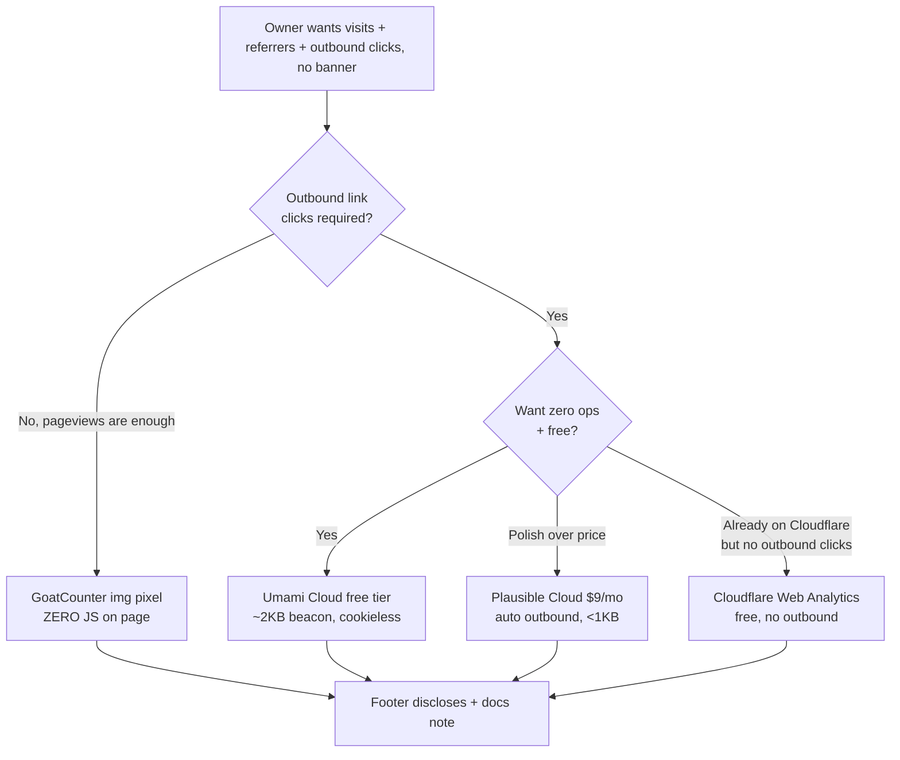

# Cookieless, Consent-Free Analytics For LibCard

## Problem Statement

LibCard's owner wants **basic, honest insight into the card** — roughly:

- How many people visit, and the rough trend over time.
- Where they come from (referrers: social posts, search, the "Powered by
  LibCard" badge).
- Which page / mode they land on (the link-in-bio vs. `/card`, `/themes`).
- Which **outbound links** people actually click (which pinned repo, which
  social, the "Save contact" button).

…**without**:

- A cookie / consent banner.
- Invasive, per-person tracking or cross-site profiling.
- Betraying LibCard's headline promise: *"Fast & private — zero client-side
  JavaScript by default; nothing to track you"*
  ([README.md:27](../../README.md)).

The hard constraint that shapes everything below: **LibCard is a static site on
GitHub Pages.** There is no server you control, no edge function, no access to
HTTP logs. Every visitor-counting option therefore reduces to *"what do we put
in the static HTML, and where does the request go?"*

## Executive Summary

**Recommended path: add an optional, off-by-default `analytics:` block to
`libcard.config.yaml`.** When absent (the default for everyone), the page ships
exactly what it ships today — zero analytics, zero of our JS. When a user opts
in, LibCard injects the chosen provider's cookieless beacon in `<head>` and adds
an honest one-line footer disclosure, mirroring the existing *"Some embedded
content loads from third parties"* pattern
([Footer.astro:79-83](../../src/components/Footer.astro)).

Offer a small, curated set of **privacy-first, cookieless, no-consent-banner**
providers behind one `provider:` enum, in two tiers that map directly onto
LibCard's existing "how much JS does this cost you" honesty:

| Tier | Provider(s) | JS on page | What you get | Ethos fit |
|------|-------------|-----------|--------------|-----------|
| **Pixel (near-zero-JS)** | GoatCounter `` pixel | **none** | pageviews, referrers, top pages, browser/country | ★ closest to "zero of our JS" |
| **Beacon (tiny JS)** | Plausible · Umami · Cloudflare Web Analytics | ~1–2 KB | all of the above **+ outbound link clicks + custom events** | opt-in, disclosed |

**Concrete recommendation for the maintainer's own demo card:** start with
**Umami Cloud (free Hobby tier: 100k events/mo, 3 sites, MIT, EU option)** if you
want outbound-link clicks, or **GoatCounter's pixel** if you want pageviews with
*literally zero JavaScript on the page*. Both are cookieless and need no banner.

The non-negotiable: **outbound link click tracking on GitHub Pages requires a
small JS beacon** — there is no zero-JS way to know a visitor clicked a link to
*someone else's* site. So the design lets each user pick their own point on the
privacy/insight curve, and keeps the default at zero.

## Current State In The Repository

LibCard already has a **deeply consistent privacy posture**, and it already has
the exact seams an analytics feature needs. The work is mostly about *honoring*
that posture, not inventing new patterns.

### The zero-JS promise is load-bearing

- **README** sells it twice: *"zero client-side JavaScript by default; nothing
  to track you"* ([README.md:27](../../README.md)) and *"keep LibCard's promise:
  zero of our JavaScript and no server"* ([README.md:105](../../README.md)).
- Every JS-shipping feature is **opt-in and gated**, and the page reverts to
  zero-JS when it's off:
  - Theme switcher / random mode: `const themeJs = theme.switcher ||
    theme.random;` then `{themeJs && <ThemeBoot … />}`
    ([Layout.astro:24,41,50](../../src/layouts/Layout.astro)).
  - Card-mode wake lock: *"Wake lock is the only JavaScript card mode can ship,
    and it's opt-in"* ([README.md:211](../../README.md)),
    `{showCardMode && card.wakeLock && <CardWakeLock />}`
    ([Layout.astro:53](../../src/layouts/Layout.astro)).
  - GitHub star counts document their tradeoff explicitly — `stars: badge` *"opts
    out of LibCard's nothing-to-track-you"* because of one third-party ``
    request ([schema.mjs:62-68](../../src/lib/schema.mjs),
    [README.md:229-239](../../README.md)).

This is the template to copy: **a new beacon is "just another gated, disclosed,
opt-in JS cost," exactly like wakeLock or `stars: badge`.**

### There is already an analytics-shaped idea in the code

The footer's "Powered by LibCard" link deliberately **drops `noreferrer`** so the
maintainer can see referring cards via GitHub's repo Insights → Traffic →
Referring sites — a comment spells this out as zero-JS, zero-cookie attribution
([Footer.astro:20-27](../../src/components/Footer.astro)):

> *"It ships no JS and sets no cookies. The real signal is the click's Referer
> header, which shows up under the repo's Insights → Traffic → Referring sites…
> nothing per-visitor is tracked."*

So the repo already embraces **referrer-header analytics** as the philosophically
pure baseline. The new feature extends that spirit to the *visitor's own* page.

### The honesty disclosure pattern already exists

The footer conditionally renders *"Some embedded content loads from third
parties"* whenever a live embed is present
([Footer.astro:31,79-83](../../src/components/Footer.astro), driven by
`hasLiveEmbeds()` in [config.ts:68-71](../../src/lib/config.ts)). An analytics
disclosure should reuse this exact mechanism.

### The injection seam: `BaseHead.astro`

[BaseHead.astro](../../src/components/BaseHead.astro) is the single `<head>`
partial, already reading `getConfig()`. A beacon `<script>` (or the pixel
`` near `<body>` end) drops in here behind a config check — no new wiring.

### The config + schema pipeline

- One user-edited file: [libcard.config.yaml](../../libcard.config.yaml).
- Validated by a **Zod schema** in [schema.mjs](../../src/lib/schema.mjs), whose
  `.strict()` objects reject typos and whose defaults are applied automatically.
  Adding `analytics:` is a ~15-line, well-precedented edit (mirror
  `cardModeSchema` at [schema.mjs:85-97](../../src/lib/schema.mjs)).
- The same schema generates `libcard.schema.json` for editor autocomplete
  ([generate-schema.mjs](../../scripts/generate-schema.mjs)) — so the new block
  gets autocomplete + validation for free.
- Typed accessors live in [config.ts](../../src/lib/config.ts).

### Deployment

[.github/workflows/deploy.yml](../../.github/workflows/deploy.yml) builds with
`withastro/action@v6` and deploys to Pages. **No secrets needed** — a Plausible
domain, Umami website-id, GoatCounter code, or Cloudflare token are all *public*
identifiers, so they live happily in the committed config. Nothing about CI
changes.

### Outbound clicks: where they happen

Every outbound link is an `<a target="_blank" rel="noopener noreferrer">` in
[LinkButton.astro](../../src/components/LinkButton.astro),
[SocialRow.astro](../../src/components/SocialRow.astro),
[SaveContact.astro](../../src/components/SaveContact.astro), and the blocks.
Beacon providers that auto-track outbound clicks (Plausible, Cloudflare) need
*nothing* added here; Umami needs a small `data-*` attribute or a one-line
auto-tagger.

## External Research

(Full sourced report with a per-tool breakdown is summarized here; URLs in
[References](#references).)

### Comparison of cookieless options

| Tool | Free tier | Paid (USD) | Cookie banner? | Self-host | Script | Outbound clicks | GH Pages |
|------|-----------|-----------|----------------|-----------|--------|-----------------|----------|
| **GoatCounter** | ✅ personal (honor system) | $15/mo commercial | No (aggregate-only) | ✅ (single Go binary) | ~3 KB **or zero (img pixel)** | ✗ | ✅ |
| **Umami Cloud** | ✅ 100k events/mo, 3 sites | $9/mo (100k) | No | ✅ (MIT) | ~2 KB | ✅ (`data-*` attr) | ✅ |
| **Plausible Cloud** | ✗ (30-day trial) | $9/mo (10k PV) | No | ✅ CE (AGPL) | <1 KB | ✅ (dashboard toggle) | ✅ |
| **Cloudflare Web Analytics** | ✅ unlimited PV | free | No | ✗ | ~1.5 KB | ✗ | ✅ |
| **Simple Analytics** | ✅ (30-day history) | $19/mo | No | ✗ | ~5 KB +3 KB | ✅ (`auto-events.js`) | ✅ |
| **Fathom** | ✗ (trial) | $15/mo | No | ✗ | ~2 KB | ✅ (small JS loop) | ✅ |
| **Pirsch** | ✗ (trial) | $6/mo | No | Enterprise only | n/a | ✅ (all tiers) | ✅ |
| **Counter.dev** | ✅ PWYW | free | Unclear (no privacy policy) | ✅ (AGPL) | 1.1 KB | ✗ | ✅ |
| **Server-log analytics** | — | — | n/a | — | none | — | ❌ impossible |

### Three facts that drive the design

1. **Server-log / truly-zero-JS pageview analytics is impossible on GitHub
   Pages.** GitHub does not expose HTTP access logs for Pages sites, and there's
   no server-side runtime. Confirmed by GitHub's own community
   ([discussion #31474](https://github.com/orgs/community/discussions/31474)).
   *Every* option must put a request in the static HTML.

2. **The closest thing to zero-JS is an `` pixel.** GoatCounter exposes a
   no-JS counting pixel: ``.
   It is pure HTML — no script, no cookie — and yields pageviews + referrers, but
   **cannot see outbound clicks** (a click to GitHub never hits your pixel).
   This is the single most ethos-aligned option and deserves first-class support.

3. **Outbound clicks require a beacon.** To know a visitor clicked a link to
   *another* site, JS must fire before the navigation. ~1–2 KB, cookieless, but
   it is non-zero JS, so it must be opt-in + disclosed.

### The consent-banner question (the nuance that matters)

"Cookieless" does **not** automatically mean "consent-free" everywhere — two
separate EU laws apply:

- **GDPR** governs *personal data*. These tools store none (daily-rotated salted
  hashes of IP+UA, discarded within 24h; only aggregates persisted), so GDPR's
  consent basis generally doesn't bite.
- **ePrivacy / PECR** governs *storing or accessing info on the device*,
  regardless of whether it's personal. A beacon that only reads what every HTTP
  request already sends (User-Agent, Referer) and writes nothing to the device
  is argued not to trigger it.

Several DPAs grant explicit **analytics exemptions** for aggregate, non-shared,
opt-out-able audience measurement (France CNIL, Italy, Netherlands, Spain; the
UK's Data Use and Access Act 2025 added a statistical-purposes exemption to
PECR). A few strict states (Germany, Austria, Ireland) technically still want
consent under tight readings. Plausible, Fathom, GoatCounter, Cloudflare, and
Umami all publicly state **no cookie banner is needed** for their default
configuration. For a **personal link-in-bio card**, this is about as low-risk as
web analytics gets — but LibCard should *say what it does* (footer disclosure +
a docs note) rather than make a blanket legal promise on users' behalf.

## Key Findings



1. **The default must stay at absolute zero.** No `analytics:` block → identical
   bytes to today. This is the whole reason LibCard can claim "nothing tracks
   you." Any design that always ships *something* fails the brand.
2. **This is a config flag, which passes the AGENTS.md acceptance test** — *"can
   a user reproduce it by config alone? If not, it doesn't ship"*
   ([AGENTS.md:80-85](../../AGENTS.md)). Analytics-as-a-toggle is squarely in
   bounds; a bespoke analytics component would not be.
3. **Two honesty tiers already have precedent**: pixel ≈ `stars: build` (a
   request, no JS), beacon ≈ `stars: badge`/`wakeLock` (opt-in JS, disclosed).
4. **No CI secrets, no server, no banner** — the cheapest possible integration
   surface. The only real cost is *documentation* (explaining the privacy
   tradeoff honestly) and a tiny schema + head edit.
5. **GoatCounter pixel is the sleeper pick** for LibCard specifically: it's the
   only option that keeps "zero of our JavaScript" *literally true* while still
   counting visits and referrers.

## Options And Tradeoffs

### Decision 1 — Which providers to support

| Option | Pros | Cons |
|--------|------|------|
| **A. Curated enum (GoatCounter, Umami, Plausible, Cloudflare)** | Validated, safe (no raw HTML), autocomplete, each tier documented; matches the `embed`/`signup` "named providers" pattern | We pick winners; adding a provider is a code change |
| **B. Generic snippet escape-hatch (`script_url` + `data` map)** | Any provider ever | Tempts raw-HTML injection; breaks the "config is data, not code" guarantee LibCard leans on ([schema.mjs:99-111](../../src/lib/schema.mjs)) |
| **C. Both: curated enum *plus* a documented `custom` provider** | Covers the long tail without raw HTML by accepting only a URL + data-attributes | Slightly more schema |

**Lean: A now, C later.** Start with a tight enum (the four that best fit the
ethos), exactly like `EMBED_PROVIDERS`. A constrained `custom` provider (script
URL + string-only `data-*` map, no inline JS) can come later if users ask. Never
accept arbitrary HTML.

### Decision 2 — Pixel vs. beacon as the *default* documented choice

| | GoatCounter pixel | Umami/Plausible beacon |
|---|---|---|
| JS on page | **none** | ~1–2 KB |
| Pageviews / referrers / top pages | ✅ | ✅ |
| **Outbound link clicks** | ✗ | ✅ |
| Cookies / consent banner | none / no | none / no |
| Ethos fit | perfect | "opt-in JS," disclosed |

LibCard should **document the pixel first** ("the zero-JS way to count visits")
and present the beacon as the upgrade you choose *when you specifically want
click data* — same framing the README already uses for `stars` modes.

### Decision 3 — Cloud vs. self-host

For a tiny personal card, **cloud SaaS wins**: zero ops, and the privacy-first
vendors host in the EU (or let you choose). Self-hosting (Umami/Plausible CE/
GoatCounter on a $5 VPS) is only worth it if you already run a server — and it
*re-introduces a server*, which cuts against LibCard's "no server" identity.
Document it as an advanced footnote, not the happy path.

### Decision 4 — Where outbound-click tagging lives (beacon only)

- **Plausible / Cloudflare**: auto-detect outbound clicks; nothing to add to
  link components. (Plausible: toggle in dashboard or the
  `script.outbound-links.js` variant.)
- **Umami**: add `data-umami-event` to anchors, *or* ship a ~10-line auto-tagger
  that decorates every `a[target=_blank]` at load. Prefer the auto-tagger so the
  link components stay provider-agnostic and clean.

## Recommendation

1. **Add an optional `analytics:` block** to the config + Zod schema, **off by
   default**. Absent block = byte-for-byte today's zero-JS page.
2. **Support a curated enum**: `goatcounter` (pixel, zero-JS),
   `umami`, `plausible`, `cloudflare` (beacons). Validate provider-specific
   fields (`code`/`domain`/`websiteId`/`token`) with discriminated unions, same
   as `blocks`.
3. **Inject in `BaseHead.astro`** behind the config check — beacon `<script>` in
   `<head>`, GoatCounter pixel as a no-JS `` (or its `count.js`).
4. **Disclose honestly in the footer**, reusing the live-embed disclosure
   mechanism: e.g. *"This page counts anonymous visits (no cookies)."* Only shown
   when analytics is on.
5. **Document the tradeoff** in README next to the `stars` table: pixel = zero
   JS, beacon = tiny JS for click data, neither sets cookies nor needs a banner —
   with the honest ePrivacy caveat for strict-EU users.
6. **Maintainer's own card**: enable **GoatCounter pixel** (keeps the demo
   literally zero-JS) *or* **Umami Cloud free tier** if you want to see which
   pinned repo gets the clicks. Either way, keep the footer disclosure on.

```mermaid
sequenceDiagram
    participant V as Visitor browser
    participant GH as GitHub Pages (static)
    participant AN as Analytics endpoint (EU, cookieless)
    V->>GH: GET / (static HTML)
    GH-->>V: HTML incl. beacon/pixel (config-gated)
    Note over V: Pageview
    V->>AN: beacon/pixel hit (UA + Referer only, daily-salted hash)
    Note over V: Clicks "xNet" repo link (beacon only)
    V->>AN: outbound-click event {url}
    V->>GH: (navigates to github.com — never touches your data)
    Note over AN: Stores AGGREGATES only; salt discarded < 24h
```

## Example Code

### 1. Schema addition ([src/lib/schema.mjs](../../src/lib/schema.mjs))

```js
// --- Privacy-first, cookieless analytics (optional, OFF by default) ----------
// Absent block => the page ships exactly zero analytics (and, if nothing else
// opts into JS, stays zero-JS). Every supported provider is cookieless and, per
// the vendor, needs no consent banner. The GoatCounter "pixel" variant ships NO
// JavaScript at all — the closest thing to LibCard's zero-JS default.
const analyticsSchema = z
  .discriminatedUnion("provider", [
    // Pixel: a single . Zero JS. Pageviews + referrers; no outbound clicks.
    z.object({
      provider: z.literal("goatcounter"),
      code: z.string().min(1),          // <code>.goatcounter.com
      mode: z.enum(["pixel", "script"]).default("pixel"),
    }).strict(),
    // Beacons: ~1–2 KB cookieless script; add outbound-click tracking.
    z.object({
      provider: z.literal("umami"),
      websiteId: z.string().min(1),
      src: z.string().url().default("https://cloud.umami.is/script.js"),
      outboundClicks: z.boolean().default(true),
    }).strict(),
    z.object({
      provider: z.literal("plausible"),
      domain: z.string().min(1),
      src: z.string().url().default("https://plausible.io/js/script.outbound-links.js"),
    }).strict(),
    z.object({
      provider: z.literal("cloudflare"),
      token: z.string().min(1),         // Web Analytics beacon token
    }).strict(),
  ])
  .optional();

// …add to libcardSchema:  analytics: analyticsSchema,
```

### 2. Typed accessor ([src/lib/config.ts](../../src/lib/config.ts))

```ts
export type LibcardAnalytics = NonNullable<LibcardConfig["analytics"]>;

/** Analytics config, or null when the owner hasn't opted in (the default). */
export async function getAnalytics(): Promise<LibcardAnalytics | null> {
  const cfg = await getConfig();
  return cfg.analytics ?? null;
}
```

### 3. Injection ([src/components/BaseHead.astro](../../src/components/BaseHead.astro))

```astro
---
import { getAnalytics } from "../lib/config";
const analytics = await getAnalytics();
---
{analytics?.provider === "plausible" && (
  <script defer data-domain={analytics.domain} src={analytics.src}></script>
)}
{analytics?.provider === "umami" && (
  <script defer src={analytics.src} data-website-id={analytics.websiteId}></script>
)}
{analytics?.provider === "cloudflare" && (
  <script defer src="https://static.cloudflareinsights.com/beacon.min.js"
          data-cf-beacon={`{"token": "${analytics.token}"}`}></script>
)}
{analytics?.provider === "goatcounter" && analytics.mode === "script" && (
  <script defer data-goatcounter={`https://${analytics.code}.goatcounter.com/count`}
          src="//gc.zgo.at/count.js"></script>
)}
```

For the **GoatCounter pixel** (zero-JS) variant, render an `` just before
`</body>` (in `Layout.astro`) so it counts without any script:

```astro
{analytics?.provider === "goatcounter" && analytics.mode === "pixel" && (
  
)}
```

### 4. Config example ([libcard.config.yaml](../../libcard.config.yaml))

```yaml
# --- Analytics (optional, OFF by default) ---
# Privacy-first and cookieless — no consent banner. Omit this whole block to
# ship ZERO analytics (and stay zero-JS). The goatcounter "pixel" mode is the
# only option that adds no JavaScript at all (pageviews + referrers, no clicks).
analytics:
  provider: goatcounter   # goatcounter | umami | plausible | cloudflare
  code: yourname          # -> yourname.goatcounter.com
  mode: pixel             # pixel (zero-JS) | script
  # provider: umami
  # websiteId: 00000000-0000-0000-0000-000000000000
  # outboundClicks: true
```

### 5. Footer disclosure ([src/components/Footer.astro](../../src/components/Footer.astro))

```astro
---
import { getAnalytics } from "../lib/config";
const analytics = await getAnalytics();
---
{analytics && (
  <p class="mt-1 text-[0.7rem] text-muted/80">
    This page counts anonymous visits — no cookies, no personal data.
  </p>
)}
```

### 6. Optional Umami outbound auto-tagger (only if `outboundClicks` && provider===umami)

```astro
{analytics?.provider === "umami" && analytics.outboundClicks && (
  <script type="module">
    for (const a of document.querySelectorAll('a[target="_blank"][href^="http"]')) {
      a.dataset.umamiEvent = "outbound";
      a.dataset.umamiEventUrl = a.href;
    }
  </script>
)}
```

## Risks And Open Questions

- **Brand integrity.** The biggest risk is *appearing* to walk back "nothing
  tracks you." Mitigation: default off, footer disclosure, and document it as a
  privacy-preserving choice with the honest ePrivacy caveat — never silently.
- **Ad-blockers** block `plausible.io`/`cloud.umami.is`/`static.cloudflareinsights.com`
  by default, undercounting (often 20–40%). GitHub Pages can't proxy a
  first-party path (no server), so self-hosting on your own domain is the only
  full fix — out of scope for the happy path. Document that counts are a
  *floor*, not exact.
- **Legal blanket promises.** Don't hard-code "no banner needed" as universal
  truth; strict-EU jurisdictions vary. State what LibCard *does* (cookieless,
  aggregate) and link the vendor's stance; leave the legal call to the user.
- **`provider: cloudflare` has no outbound clicks** — make sure docs don't imply
  it does (it's the one beacon that can't, despite being free/unlimited).
- **Pixel + prefetch/bots.** Image pixels can be hit by prefetchers and bots,
  inflating counts; GoatCounter does some bot filtering. Acceptable for a
  personal card.
- **Open question:** support a constrained `custom` provider (URL + string-only
  `data-*`, no inline JS) in v2? Decide based on demand; keep raw HTML out.
- **Open question:** should `/themes`, `/card` get distinct page identifiers, or
  is a single aggregate fine? Recommend default-on per-path (the pixel already
  uses `Astro.url.pathname`).

## Implementation Checklist

- [x] Add `analyticsSchema` (discriminated union) to
      [src/lib/schema.mjs](../../src/lib/schema.mjs) and wire `analytics:` into
      `libcardSchema`.
- [x] Regenerate `libcard.schema.json` via `pnpm run generate:schema` (and
      confirm the `prebuild` hook keeps it in sync).
- [ ] Add `getAnalytics()` + `LibcardAnalytics` type to
      [src/lib/config.ts](../../src/lib/config.ts).
- [ ] Inject beacons in [BaseHead.astro](../../src/components/BaseHead.astro) and
      the GoatCounter pixel near `</body>` in
      [Layout.astro](../../src/layouts/Layout.astro), each behind the config
      check.
- [ ] Add the conditional footer disclosure to
      [Footer.astro](../../src/components/Footer.astro).
- [ ] (Umami) Add the optional outbound auto-tagger, gated on
      `outboundClicks`.
- [ ] Add a commented `analytics:` block to
      [libcard.config.yaml](../../libcard.config.yaml) (off by default).
- [ ] Document the feature in [README.md](../../README.md) beside the `stars`
      tradeoff table: pixel = zero-JS, beacon = tiny-JS + clicks, cookieless,
      no banner, honest ePrivacy caveat.
- [ ] Decide the maintainer's own setting (GoatCounter pixel vs. Umami Cloud)
      and enable it in the deployed config.

## Validation Checklist

- [ ] **Default stays zero**: with no `analytics:` block, the built HTML contains
      no analytics script/pixel — diff `dist/` against `main` to prove no new
      bytes (grep the output for `goatcounter|umami|plausible|cloudflareinsights`
      → 0 hits).
- [ ] **Pixel ships no JS**: with `provider: goatcounter, mode: pixel`, the page
      has the `` and **no** `<script>` from us (View Source / grep).
- [ ] **Beacon loads**: with each beacon provider, the network panel shows the
      script and a pageview hit to the provider; the provider dashboard records a
      visit.
- [ ] **Outbound click recorded**: click a pinned repo link; confirm an outbound
      event appears (Plausible/Umami).
- [ ] **No cookies set**: DevTools → Application → Cookies is empty after a
      visit + a click (all providers).
- [ ] **Footer disclosure** appears only when analytics is on, and reads
      honestly.
- [ ] **Schema rejects typos**: a bad provider or missing required field fails
      `pnpm build` with a readable Zod error; autocomplete works from
      `libcard.schema.json`.
- [ ] **CI unchanged**: `deploy.yml` builds and deploys without new secrets.
- [ ] **Lighthouse/perf**: pixel mode keeps the JS weight at 0; beacon mode adds
      ≤2 KB and no layout shift.

## References

- LibCard zero-JS promise — [README.md:27](../../README.md),
  [README.md:105](../../README.md); JS-gating precedent —
  [Layout.astro:24-53](../../src/layouts/Layout.astro); `stars` tradeoff table —
  [README.md:229-239](../../README.md); referrer-header analytics comment —
  [Footer.astro:20-27](../../src/components/Footer.astro); config-flag acceptance
  test — [AGENTS.md:80-85](../../AGENTS.md).
- GoatCounter — [home](https://www.goatcounter.com/),
  [no-JS pixel/`count` docs](https://www.goatcounter.com/help/pixel),
  [GDPR](https://www.goatcounter.com/help/gdpr).
- Umami — [pricing](https://umami.is/pricing),
  [track outbound links](https://docs.umami.is/docs/track-outbound-links).
- Plausible — [outbound link tracking](https://plausible.io/docs/outbound-link-click-tracking),
  [script extensions](https://plausible.io/docs/script-extensions),
  [data policy](https://plausible.io/data-policy),
  [Community Edition](https://plausible.io/blog/community-edition).
- Cloudflare Web Analytics — [overview](https://developers.cloudflare.com/web-analytics/),
  [limits](https://developers.cloudflare.com/web-analytics/limits/),
  [FAQ](https://developers.cloudflare.com/web-analytics/faq/).
- Fathom — [external clicks](https://usefathom.com/docs/events/external-clicks),
  [privacy](https://usefathom.com/legal/privacy). Simple Analytics —
  [automated events](https://docs.simpleanalytics.com/automated-events). Pirsch —
  [pricing](https://pirsch.io/pricing). Counter.dev — [home](https://counter.dev).
- Consent/ePrivacy nuance — [EDPB cookie-scope guidelines (Hunton summary)](https://www.hunton.com/privacy-and-information-security-law/edpb-publishes-guidelines-to-clarify-scope-of-eu-cookie-notice-and-consent-requirements),
  [Matomo ePrivacy FAQ](https://matomo.org/faq/general/eprivacy-directive-national-implementations-and-website-analytics/).
- No server logs on GitHub Pages — [GitHub community #31474](https://github.com/orgs/community/discussions/31474),
  [#48900](https://github.com/orgs/community/discussions/48900).
