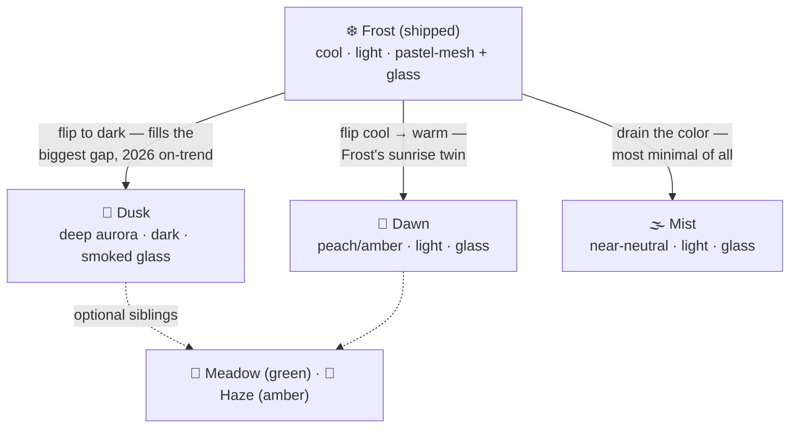
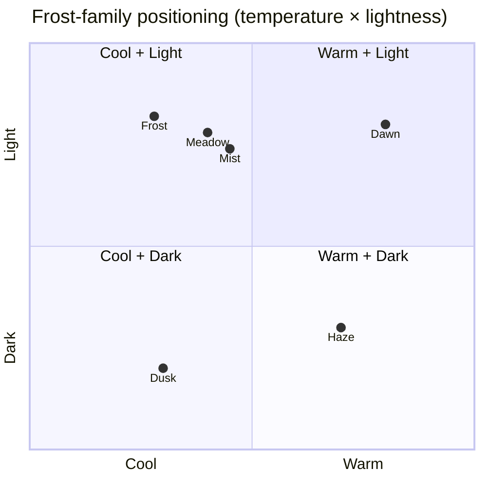
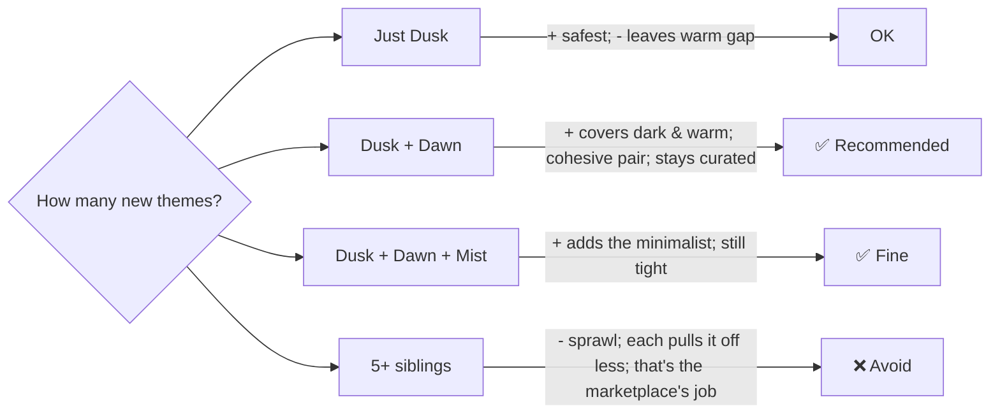
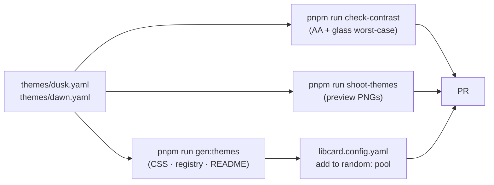

# LibCard — The Frost Family: More Clean, Committed "Atmosphere" Themes

> **Status:** Exploration #9. A focused follow-on to
> [`0007_[_]_EXPRESSIVE_THEMES_AND_FLOURISHES.md`](./0007_[_]_EXPRESSIVE_THEMES_AND_FLOURISHES.md),
> which built the data-only **effect library** (pastel-mesh backgrounds, frosted
> **glass** surfaces, a pattern catalog) and shipped **Frost** as its first — and
> so far **only** — flagship. The user likes Frost a lot and wants it kept *clean
> and minimal*, and asks the obvious next question: **what other themes live in
> Frost's vein that we could add to the default set?** This doc answers that
> concretely, with verified palettes and a zero-code rollout.

## Problem Statement

Frost ([`themes/frost.yaml`](../../themes/frost.yaml)) was the payoff of
exploration #7: a soft, slowly-drifting pastel-mesh wash with frosted-glass panels
that "commits" to a calm, dreamy identity while staying quiet and tasteful. It's
the one theme in the gallery that actually *uses* the expressive layers the
effect library added. The other seven themes
([`default`](../../themes/default.yaml), [`midnight`](../../themes/midnight.yaml),
[`mono`](../../themes/mono.yaml), [`ocean`](../../themes/ocean.yaml),
[`paper`](../../themes/paper.yaml), [`sunset`](../../themes/sunset.yaml),
[`terminal`](../../themes/terminal.yaml)) are still the *same card, recolored* —
flat surfaces, no background, no material.

So the gallery has a lonely standout. Frost proved the recipe; nothing else uses
it. Three gaps follow directly:

1. **Frost is light-only.** There is no *dark* frosted theme — and the dark themes
   we do have (`midnight`/`ocean`/`sunset`) are exactly the flat ones #7 flagged.
   A visitor who wants "Frost, but dark" has nowhere to go.
2. **Frost is cool-only.** Its mesh is violet/mint/sky/pink — a cool palette. There
   is no warm counterpart (peach/amber/rose) for someone who wants the same soft
   wash with warmth.
3. **The effect library is under-used.** One theme exercises `pastel-mesh` + `glass`;
   **zero** themes use the six-entry `pattern` catalog
   ([`PATTERN_KINDS`](../../src/lib/theme-schema.mjs#L56)). We built a kit and shipped
   one thing with it.

The constraint the user set is the design brief: **stay clean and minimal.** The
answer is *not* "add ten loud themes." It's a small, cohesive **family** of
Frost-siblings — each as restrained as Frost, each committing to one distinct,
quiet identity, each filling one of the gaps above.

## Executive Summary

**Recommendation: ship a tight "atmosphere" family around Frost — two new themes
now (`Dusk`, `Dawn`), an optional third (`Mist`) — all built from the *existing*
effect library with no code changes, just new validated YAML.**



The headline insight that makes this cheap: **Frost already shipped the whole
machine.** The `pastel-mesh` background, the `glass` surface treatment, the
worst-case contrast gate, the mesh-stage markup, the preview screenshotter, the
README generator — all of it landed in #7 and is live today. A new sibling theme
is **one `themes/*.yaml` file**. No schema change, no CSS, no component, no build
wiring. The marginal cost of "Frost, but dark" is a palette and a screenshot.

I designed and **verified four candidate palettes against the actual contrast
gate** ([`check-contrast.mjs`](../../scripts/check-contrast.mjs)), including the
hard part — the glass label's *worst-case* contrast over every mesh stop. `Dusk`,
`Dawn`, and `Mist` all pass WCAG AA cleanly (numbers in
[§Recommendation](#recommendation)).

## Current State In The Repository

The seams a new theme plugs into — all already built:

- **The contract & generator** —
  [`src/lib/theme-schema.mjs`](../../src/lib/theme-schema.mjs). The schema already
  supports everything Frost-siblings need:
  - `backgroundSchema` ([L98](../../src/lib/theme-schema.mjs#L98)) — the
    `pastel-mesh` variant with `stops` (2–4 colors), `blur` (0–120px), `animate`.
  - `buttonsSchema` ([L124](../../src/lib/theme-schema.mjs#L124)) — `fill: glass`
    with a `glassFillOpacity` floor of **0.15** (the readability scrim).
  - `patternSchema` ([L113](../../src/lib/theme-schema.mjs#L113)) +
    `PATTERN_KINDS` ([L56](../../src/lib/theme-schema.mjs#L56)) — `scales`, `dots`,
    `grid`, `stripes`, `checker`, `zigzag` — **used by no theme yet.**
  - `themeToCss()` ([L247](../../src/lib/theme-schema.mjs#L247)) emits the
    `--lc-mesh-*`, `--lc-bg-blur`, `--lc-glass-pct`, `--lc-cta-*`, `--lc-ink` vars.
    For a glass theme it even re-skins the accent CTA into a frosted pill
    ([L268–L278](../../src/lib/theme-schema.mjs#L268)) — no per-theme work needed.
- **The effect CSS** — [`src/styles/effects.css`](../../src/styles/effects.css),
  `@import`ed globally from [`global.css`](../../src/styles/global.css#L11). The
  `.lc-bg-stage` mesh layer, the `.bg-surface:not(.lc-solid)` glass treatment, and
  the `@supports` / `prefers-reduced-transparency` / `forced-colors` /
  `prefers-reduced-motion` guards are **all already shipped and theme-agnostic** —
  they read the active theme's vars. A new theme inherits every guard for free.
- **The build** — [`scripts/gen-themes.mjs`](../../scripts/gen-themes.mjs)
  regenerates `themes.gen.css`, the `themes.json` registry, the JSON schema, and
  the [`themes/README.md`](../../themes/README.md) gallery table from the YAML on
  every `pnpm run gen:themes` / prebuild. Drop in a file and it's wired.
- **The contrast gate** —
  [`check-contrast.mjs`](../../scripts/check-contrast.mjs) already special-cases
  glass-over-mesh: it composites `surface` over each stop at `glassFillOpacity` and
  checks the label against the **worst-case point**, plus the frosted CTA's accent
  text over the lightest backdrop ([L96–L120](../../scripts/check-contrast.mjs#L96)).
  Any new glass theme is validated automatically; CI fails a bad palette.
- **The mounting** — [`Layout.astro`](../../src/layouts/Layout.astro#L44) mounts
  `.lc-bg-stage` / `.lc-pattern` when **any** theme in the active set needs them,
  via `getThemeEffects()` ([`config.ts`](../../src/lib/config.ts#L38)), which
  unions over the switcher `cycle`. Because Frost is already in the ring, the mesh
  stage is *already mounted* whenever the switcher is on — new mesh themes light up
  with zero extra wiring.
- **Previews** — [`scripts/shoot-themes.mjs`](../../scripts/shoot-themes.mjs)
  renders the per-theme PNG the gallery and registry reference
  (`themes/.previews/<slug>.png`).
- **Config & curation** — [`libcard.config.yaml`](../../libcard.config.yaml#L129)
  picks the active `theme`, toggles the `switcher`, and curates the `random` pool
  (today `[default, paper, mono, frost]`). New siblings slot into these lists.

**Net:** there is no missing infrastructure. The gap is *content* — themes — not
*capability*.

## External Research

The direction is squarely on top of the dominant 2025–26 interface trend, which
matters for a profile-card product people pick to look current.

- **Dark glassmorphism is "the" 2026 aesthetic.** Industry trend write-ups
  describe 2026 glassmorphism as *subtle translucent layers that create depth
  without noise, especially effective on dark interfaces* — and explicitly
  prescribe the recipe LibCard already has: **ambient gradient orbs (deep purples,
  neon blues, hot pinks) floating behind translucent UI**
  ([Dark Glassmorphism, 2026](https://medium.com/@developer_89726/dark-glassmorphism-the-aesthetic-that-will-define-ui-in-2026-93aa4153088f),
  [Midrocket UI trends 2026](https://midrocket.com/en/guides/ui-design-trends-2026/)).
  That is exactly a dark `pastel-mesh` + `glass` theme — i.e. **Dusk**.
- **Apple's Liquid Glass (WWDC June 2025)** made frosted, translucent material a
  system-wide default across iOS/macOS 26, *adapting between light and dark* and
  taking its color from the content behind it
  ([Apple Newsroom](https://www.apple.com/newsroom/2025/06/apple-introduces-a-delightful-and-elegant-new-software-design/),
  [Liquid Glass overview](https://en.wikipedia.org/wiki/Liquid_Glass)). Frost is
  LibCard's light Liquid-Glass; a dark sibling completes the pair the way Apple's
  material spans both schemes.
- **Warm "sunrise/haze" pastels are a recognized, distinct family.** Palette
  guides describe sunrise schemes as *peach, coral, soft amber, blush* read as "a
  quiet morning haze," recommend **2–3 adjacent warm hues + one deeper accent**,
  and pair them with soft typography — a textbook spec for **Dawn**
  ([sunrise palettes](https://www.media.io/color-palette/sunrise-color-palette.html),
  [pastel palette guide](https://icons8.com/blog/articles/pastel-color-palette/)).
- **Restraint is the through-line.** Every source stresses *subtle, purposeful*
  gradients and *not overwhelming content* — which aligns with the user's "keep it
  clean and minimal" brief and with the library's built-in subtlety floors
  (pale stops, opacity floor, edge-fade masks).

The competitive note from #7 still holds: mesh + glass are differentiators **no
bio-link competitor** (Linktree/Beacons/Carrd/Taplink) exposes. Frost is rare;
a small *family* of it is rarer.

## Key Findings

1. **The cheapest possible feature.** A Frost-sibling is one validated YAML file.
   Everything else — CSS, guards, contrast gate, previews, registry, README — is
   built and theme-agnostic. This is the highest leverage-to-effort ratio on the
   board.
2. **The dark gap is the single best addition.** "Frost but dark" is the most
   requested-shaped hole (Frost is light-only; the dark themes are flat) *and* the
   most on-trend (dark glassmorphism / Liquid Glass). **Dusk** should lead.
3. **Temperature is the cleanest second axis.** Frost is cool; a warm twin
   (**Dawn**) doubles the family's range with one move and reads as an obvious pair.
4. **A neutral "Mist" is the minimalist's Frost.** Drain the mesh to near-grey and
   it's the most restrained theme in the gallery — directly serving "clean and
   minimal."
5. **Curate, don't sprawl.** #7's own risk register warns "wide variety" and "each
   pulls it off" pull apart at scale. Two-to-three excellent siblings beat six
   so-so ones; breadth is the community marketplace's job.
6. **Contrast over glass is solved but real.** Light glass themes want a *strong
   dark ink* `fg`; dark glass themes a *strong light* `fg`; the CTA accent must
   beat the *lightest* backdrop. The gate enforces it — but the palette must be
   designed for it (see the verified numbers below; a too-light accent fails).
7. **A second, smaller opportunity exists: patterns.** The unused `pattern`
   catalog could power a clean "stationery" theme (faint `dots`/`grid` + solid
   buttons) — arguably *more* minimal than Frost. Secondary to the glass family,
   but it's the other half of the kit sitting idle. See
   [Option E](#e-secondary-direction--a-pattern-led-stationery-theme).

## Options And Tradeoffs

### The design space (one quadrant, where the family sits)



Frost owns "cool + light." The empty cells are "cool/warm + **dark**" (Dusk, and a
warm-dark Haze) and "warm + light" (Dawn). Mist sits near the neutral center.

### A. Dusk — deep aurora, dark, frosted *(top pick)*

| | |
|---|---|
| **Identity** | Twilight. Deep indigo/violet/teal orbs glowing behind smoked glass. |
| **Fills** | The dark gap **and** the on-trend slot (dark glassmorphism / Liquid Glass). |
| **Data** | `mode: dark`, dark `bg`, deep saturated mesh `stops`, `glass` buttons. |
| **Risk** | Glass legibility on dark needs a strong light `fg`; verified below. |
| **Verdict** | **Ship first.** Biggest gap, best trend fit, cohesive with Frost. |

### B. Dawn — warm sunrise, light, frosted *(top pick)*

| | |
|---|---|
| **Identity** | Morning haze. Peach/amber/blush wash, soft and warm. |
| **Fills** | The warm gap; reads as Frost's obvious twin (same recipe, flipped temp). |
| **Data** | `mode: light`, warm off-white `bg`, peach/amber mesh, `glass`, `rounded` font. |
| **Risk** | The accent must be a *deep* rose/raspberry to clear AA over light glass. |
| **Verdict** | **Ship.** One move doubles the family's temperature range. |

### C. Mist — near-neutral, light, frosted *(optional third)*

| | |
|---|---|
| **Identity** | Fog. Barely-there cool-grey wash; the quietest theme we'd ship. |
| **Fills** | The "even more minimal than Frost" request, literally. |
| **Data** | `mode: light`, grey-blue mesh at very low chroma, `glass`. |
| **Risk** | Can read as "Frost with the color turned down" — feature, not bug, but keep it distinct (cooler, greyer, a slate accent). |
| **Verdict** | **Optional.** Add if we want a third; skip to stay tightest. |

### D. Further siblings (hold in reserve)

`Meadow` (sage/mint green, light) and `Haze` (amber, *dark* — the warm-dark cell)
round out the quadrant. Both work with the same recipe. **Recommendation: don't
ship these now** — they're the marketplace's job and dilute a curated set. Keep
them documented as easy adds.

### E. Secondary direction — a pattern-led "stationery" theme

Orthogonal to glass: a *solid* background + a faint `dots` or `grid` pattern +
solid buttons. No mesh, no glass — extremely clean, "engineer's notebook" or
"letterpress" calm. It exercises the idle `pattern` catalog and is genuinely
minimal. **Tradeoff:** it's a different vibe from Frost (texture, not glass), so it
broadens *past* "the Frost vein" the user asked about. Worth a single tasteful
entry eventually; **not** part of the core Frost-family recommendation.

### F. How many to ship



## Recommendation

**Ship `Dusk` and `Dawn` now; offer `Mist` as an easy third.** Name the family by
*atmosphere* so it reads as a deliberate set alongside Frost: **Frost · Dusk · Dawn
· Mist** (and later Haze/Meadow). Each is `pastel-mesh` + `glass`, each stays
quiet, each fills a real gap.

### Verified palettes (ran through the actual contrast gate's math)

I checked each candidate with the **exact** functions from
[`check-contrast.mjs`](../../scripts/check-contrast.mjs) — the three enforced pairs
**and** the glass label's worst-case contrast over every mesh stop, **and** the
frosted CTA accent over the lightest backdrop. Results:

| Theme | fg/bg | fg/surface | accentC/accent | glass label (worst of mesh) | CTA accent/glass | Verdict |
|---|---|---|---|---|---|---|
| **Dusk** | 16.73 | 15.07 | 8.45 | **10.70** (over `#1f4b6b`) | **5.40** | ✅ pass |
| **Dawn** | 12.47 | 13.54 | 5.26 | **11.62** (over `#ffd9e3`) | **5.00** | ✅ pass |
| **Mist** | 12.99 | 14.19 | 5.80 | **12.87** (over `#e6ebf2`) | **5.54** | ✅ pass |
| _Frost (shipped, for reference)_ | 13.22 | 14.27 | 5.70 | 12.17 | 5.46 | ✅ pass |

All clear the 4.5:1 AA floor with margin. (Two early drafts — a too-light rose
accent for Dawn and a mid-green for Meadow — *failed* the CTA-over-glass check at
~4.0:1, which is exactly the gate doing its job; the palettes below are the
corrected, passing versions.)

### The positioning, at a glance

```mermaid
flowchart TB
    subgraph Light["☀️ Light · frosted glass"]
        Frost["❄️ Frost — cool violet/mint"]
        Dawn["🌅 Dawn — warm peach/amber"]
        Mist["🌫️ Mist — neutral grey-blue"]
    end
    subgraph Dark["🌙 Dark · smoked glass"]
        Dusk["🌆 Dusk — deep indigo/teal aurora"]
    end
    Frost -. "same recipe, different atmosphere" .- Dawn
    Frost -. .- Mist
    Frost === Dusk
```

## Example Code

All three are **pure data** — drop-in `themes/<slug>.yaml`, no other change. The
hex values are the verified-passing ones from the table above.

**`themes/dusk.yaml`** — the dark flagship (Frost, at night):

```yaml
# yaml-language-server: $schema=./theme.schema.json
name: Dusk
author: "@crs48"
authorUrl: https://github.com/crs48
license: MIT
official: true
mode: dark
tags: [dark, aurora, gradient, glass, calm]
description: Deep twilight aurora behind smoked-glass panels.
tokens:
  bg: "#0c1024" # near-black navy the aurora glows on
  surface: "#161b33" # the smoked-glass tint (and opaque fallback)
  fg: "#eef1ff" # near-white ink → reads over the dark glass
  muted: "#a7b0d0"
  accent: "#9aa8ff" # soft periwinkle glow
  accentContrast: "#0c1024"
  border: "#2a3358" # a cool hairline that catches the glass edge
  font: sans
  radius: 1.25rem
# Deep, saturated orbs (not pale) — the dark-glassmorphism "ambient gradient".
background:
  kind: pastel-mesh
  stops: ["#3b2a6b", "#1f4b6b", "#4a2a5e", "#23485e"] # violet / teal / plum / blue
  blur: 60
  animate: true
buttons:
  fill: glass
  glassFillOpacity: 0.4
```

**`themes/dawn.yaml`** — the warm twin:

```yaml
# yaml-language-server: $schema=./theme.schema.json
name: Dawn
author: "@crs48"
authorUrl: https://github.com/crs48
license: MIT
official: true
mode: light
tags: [light, warm, sunrise, glass, soft]
description: A soft sunrise haze of peach and amber behind frosted glass.
tokens:
  bg: "#fdf4ee" # warm near-white
  surface: "#ffffff"
  fg: "#3c2a26" # warm dark ink → easily readable on pale glass
  muted: "#7e5e54"
  accent: "#c4316a" # deep rose (must be dark enough to clear AA on glass)
  accentContrast: "#ffffff"
  border: "#ffffff"
  font: rounded
  radius: 1.25rem
background:
  kind: pastel-mesh
  stops: ["#ffe1d0", "#ffe9c9", "#ffd9e3", "#fce3c5"] # peach / amber / blush / cream
  blur: 60
  animate: true
buttons:
  fill: glass
  glassFillOpacity: 0.4
```

**`themes/mist.yaml`** — the minimalist's Frost (optional third):

```yaml
# yaml-language-server: $schema=./theme.schema.json
name: Mist
author: "@crs48"
authorUrl: https://github.com/crs48
license: MIT
official: true
mode: light
tags: [light, neutral, minimal, glass, calm]
description: A barely-there grey-blue fog behind clean frosted glass.
tokens:
  bg: "#f3f5f8"
  surface: "#ffffff"
  fg: "#272b33"
  muted: "#6b7280"
  accent: "#2f6d80" # muted slate-teal — quiet, not loud
  accentContrast: "#ffffff"
  border: "#ffffff"
  font: sans
  radius: 1rem
background:
  kind: pastel-mesh
  stops: ["#e6ebf2", "#e9eef0", "#eaeef5", "#edf0f3"] # almost neutral, faintly cool
  blur: 60
  animate: true
buttons:
  fill: glass
  glassFillOpacity: 0.45
```

### Wire-up (the entire diff, beyond the YAML)



Optionally widen the curated random pool in
[`libcard.config.yaml`](../../libcard.config.yaml#L135) from
`[default, paper, mono, frost]` to include `dusk` and `dawn` so the demo card
shows them off.

## Risks And Open Questions

- **Set sprawl.** The whole point is *curation*. Resist shipping Meadow/Haze/etc.
  in the same PR; two-plus-optional is the sweet spot. Breadth belongs to the
  community gallery, where the effect library raises everyone's floor.
- **Dark-glass legibility on real photos behind it.** The gate checks the label
  over the *mesh*, which is the only thing behind a card's buttons here (no user
  imagery), so the worst-case math is exact for our case. If owner image
  backgrounds ever land (#7's deferred idea), re-derive the floor.
- **Family resemblance vs. distinctness.** Mist must not read as "Frost with a
  broken color picker." Keep it cooler/greyer with a slate accent, or drop it. The
  quadrant chart is the guardrail — don't ship two themes in the same cell.
- **Animated mesh cost.** Each mesh theme adds a blurred, drifting fixed layer.
  It's GPU-cheap (one layer, `transform`/`opacity` only, motion-gated) and Frost
  already pays it, but adding several to the *switcher cycle* means all their mesh
  stops ship. Negligible (a handful of hex vars + one shared stage), but worth a
  glance at the cycle-on payload.
- **`accentContrast` is unused by glass CTAs but still gated.** In a glass theme
  the CTA shows *accent-colored text* on the glass fill, not `accentContrast` on a
  solid accent — yet the gate still enforces `accentContrast/accent`. Keep both
  valid (cheap) rather than special-casing the gate.
- **Naming.** "Atmosphere" names (Frost/Dusk/Dawn/Mist) are evocative but the set
  must stay legible in the picker. Confirm none clash with existing slugs (they
  don't) and that the family reads as intentional.

## Implementation Checklist

- [x] Add **`themes/dusk.yaml`** with the verified dark-aurora palette above.
- [x] Add **`themes/dawn.yaml`** with the verified warm palette above.
- [x] (Optional) Add **`themes/mist.yaml`** for the neutral minimalist slot.
- [x] Run `pnpm run gen:themes` — regenerates `themes.gen.css`, `themes.json`, the
      JSON schema, and the `themes/README.md` gallery table.
- [x] Run `pnpm run check-contrast` — confirm each new theme passes AA on the
      enforced pairs **and** the glass-over-mesh worst-case.
- [x] Run `pnpm run shoot-themes` (or the per-slug equivalent) to generate
      `themes/.previews/<slug>.png` for the gallery/registry.
- [x] (Optional) Add `dusk`/`dawn` to the `random:` pool in
      [`libcard.config.yaml`](../../libcard.config.yaml#L135) so the demo rotates them.
- [x] Eyeball each in `pnpm dev` (set `theme: dusk`, etc.) on the live card —
      light *and* dark OS appearance, and with the switcher on.
- [x] Confirm **no** code changed outside `themes/`, config, and generated files —
      proving the "themes are data" guarantee held.

## Validation Checklist

- [x] `check-contrast` is green for `dusk`, `dawn`, (`mist`) — enforced pairs and
      every glass worst-case point ≥ 4.5:1.
- [x] In the browser, the **Dusk** smoked glass reads clearly over its darkest and
      lightest aurora orbs; the periwinkle accent CTA is legible.
- [x] **Dawn**'s deep-rose accent is readable as frosted-CTA text over the palest
      peach (the worst case the gate flagged in drafts).
- [x] `prefers-reduced-motion: reduce` → all three meshes stop drifting; the card
      stays calm and legible.
- [x] `prefers-reduced-transparency` / `@supports not backdrop-filter` /
      `forced-colors: active` → panels fall back to opaque `surface` (inherited
      from `effects.css`, but verify each theme actually degrades cleanly).
- [x] With the switcher on, cycling **into** each new theme paints its mesh
      correctly (the shared `.lc-bg-stage` is already mounted because Frost is in
      the ring).
- [x] Each new theme is visually **distinct** from Frost and from each other (no
      two in the same quadrant cell).
- [x] The `themes/README.md` table and the `/themes` gallery list the new themes
      with previews; the registry `themes.json` has their entries.
- [x] Diff review: the only non-generated, non-config changes are the new
      `themes/*.yaml` files.

## References

**Repo**
- [Exploration #7 — Expressive Themes & Flourishes](./0007_[_]_EXPRESSIVE_THEMES_AND_FLOURISHES.md) (the effect library this builds on) · [Exploration #2 — Theme Marketplace & Switching](./0002_[x]_THEME_MARKETPLACE_AND_LIVE_THEME_SWITCHING.md)
- [`themes/frost.yaml`](../../themes/frost.yaml) · [`src/lib/theme-schema.mjs`](../../src/lib/theme-schema.mjs) · [`src/styles/effects.css`](../../src/styles/effects.css) · [`scripts/gen-themes.mjs`](../../scripts/gen-themes.mjs) · [`scripts/check-contrast.mjs`](../../scripts/check-contrast.mjs) · [`scripts/shoot-themes.mjs`](../../scripts/shoot-themes.mjs) · [`src/layouts/Layout.astro`](../../src/layouts/Layout.astro) · [`src/lib/config.ts`](../../src/lib/config.ts) · [`libcard.config.yaml`](../../libcard.config.yaml) · [`themes/README.md`](../../themes/README.md)

**Trend & palette research**
- [Dark Glassmorphism — the aesthetic that will define UI in 2026](https://medium.com/@developer_89726/dark-glassmorphism-the-aesthetic-that-will-define-ui-in-2026-93aa4153088f) · [Midrocket — UI Design Trends 2026](https://midrocket.com/en/guides/ui-design-trends-2026/) · [WeAreTenet — 2026 UI/UX trends](https://www.wearetenet.com/blog/ui-ux-design-trends)
- [Apple introduces Liquid Glass (WWDC 2025)](https://www.apple.com/newsroom/2025/06/apple-introduces-a-delightful-and-elegant-new-software-design/) · [Liquid Glass — overview](https://en.wikipedia.org/wiki/Liquid_Glass) · [Glassmorphism in 2025 — everydayUX](https://www.everydayux.net/glassmorphism-apple-liquid-glass-interface-design/)
- [Sunrise color palettes + hex](https://www.media.io/color-palette/sunrise-color-palette.html) · [Peach-coral palettes](https://www.media.io/color-palette/peach-coral-color-palette.html) · [Pastel palette guide (30+ combos)](https://icons8.com/blog/articles/pastel-color-palette/)
