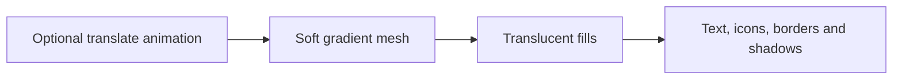

# Reducing blank content while scrolling

Date: 2026-10-09. Follow-up to exploration 0010.

## Evidence and limits

The user still sees intermittent blank content in Dia at crs.land: the header
and text disappear, while pale rectangular panel fills remain for a second or
two before the rounded controls and text return. The screenshots show Mist.
This is consistent with a painting/compositing failure, but screenshots alone
do not prove a browser bug or GPU memory exhaustion.

The page renders content as static HTML. There is no scroll-triggered reveal,
content visibility deferral, or loading skeleton. Theme transitions run on an
explicit switcher click, not scrolling. The previous fix removed the large
background blur but left backdrop filters on every glass surface, including
nested status chips, plus blanket backface hints on all themes.

Chrome's CDP `LayerTree` at 1440 × 1000 CSS pixels and device scale factor 2
reported the following on the local production build:

| Theme | Layers before | Layers after | Content layers before → after |
| --- | ---: | ---: | ---: |
| Mist | 83 | 8 | 80 → 5 |
| Frost | 83 | 8 | 80 → 5 |
| Dawn | 83 | 8 | 80 → 5 |
| Dusk | 84 | 7 | 81 → 5 |
| Default | 63 | 8 | 60 → 5 |

Layer counts vary with scrollbar, hover, and transition state. All four glass
themes had 78 elements with a non-none computed backdrop filter; 75 content
layers reported a backdrop filter as a compositing reason. After this change,
the page has no backdrop-filtered elements and none of those filter reasons.
These measurements establish reduced rendering complexity, not a reproduction
or proof of elimination of the intermittent Dia failure.

## Change

Keep the glass aesthetic through translucent theme-colored fills, borders,
shadows, and the already-soft mesh. Remove per-surface backdrop filtering and
the backface hints left by the earlier fixes. Remove background promotion hints
and select an animation name only for themes requesting drift; a solid theme
does not need a paused transform animation.

This uses existing theme configuration and applies to every user's card.
The solid primary Feedme button remains solid. Reduced motion removes drift;
reduced transparency and forced colors still make surfaces opaque. The old
backdrop-filter support gate is unnecessary because glass no longer needs that
feature. No JavaScript, scroll handlers, or redraw timers are added.

The visual tradeoff is that detailed backgrounds and patterns show through a
translucent fill without being blurred or saturated. The built-in glass themes
use smooth meshes, so their appearance remains close to the previous version.

## Validation

- [x] Generate CSS from `theme-schema.mjs`; do not hand-edit generated files.
- [x] Compare actual Chrome screenshots before/after and audit compositor layers.
- [x] Exercise all 11 themes at desktop and phone viewport sizes; rapidly scroll
      all four glass themes, inspect captures, and check hover/focus and tip CTA.
- [x] Verify reduced-motion, reduced-transparency, and forced-colors settings.
- [x] `pnpm build`, `pnpm run typecheck`, and `pnpm run check-contrast` pass.
      Contrast retains existing advisory warnings for muted Default/Mist text.
- [x] Tests pass after removing stale personal-copy assertions from the schema
      validity test; Feedme behavior remains covered by dedicated fixture tests.

At 1440px and 390px viewport widths (DPR 2), the scrolling pass sent 224 wheel
events across the four glass themes and captured 32 viewport screenshots at
four scroll positions. The inspected captures show the content and rounded
controls painted; no blank-content frame was observed in those samples. All
11 themes switched successfully without horizontal overflow or page errors.

Actual-browser screenshots and scripts are local artifacts in
`output/playwright/scroll-*`, `measure-scroll-*.js`, and `stress-scroll.js`.
The SVG theme-preview script is not a rendering regression test.

To repeat the important checks, serve `pnpm build` with `pnpm preview`, select
each glass theme, scroll repeatedly from top to bottom and back, hover controls,
and switch to solid themes. Use Chrome DevTools Layers to check that buttons and
chips no longer have backdrop-filter compositing reasons. Repeat with reduced
motion/transparency and at a narrow viewport.

The exact Dia failure has not been reproduced in the automated Chrome session.
Phone viewport checks are desktop Chrome emulation, not tests on physical iOS
or Android devices. No Safari or Dia soak-test result is claimed here.
